

2.罗朗级数展开定理

&nbsp;&nbsp;&nbsp;
如果函数在环形区域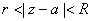（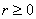，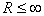）内解析，那末在环形区域内可展开为罗朗级数

<pre>&nbsp;&nbsp;&nbsp;&nbsp;&nbsp;&nbsp;&nbsp;&nbsp;&nbsp;&nbsp;&nbsp;&nbsp;&nbsp;&nbsp;&nbsp;&nbsp;&nbsp;&nbsp;&nbsp;&nbsp;&nbsp;&nbsp; 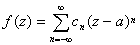</pre><pre>式中</pre><pre>&nbsp; &nbsp;&nbsp;&nbsp;&nbsp;&nbsp;&nbsp;&nbsp;&nbsp;&nbsp;&nbsp;&nbsp;&nbsp;&nbsp;&nbsp;&nbsp;&nbsp;&nbsp;&nbsp;&nbsp;&nbsp;&nbsp;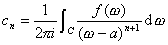，&nbsp;&nbsp;&nbsp;&nbsp;&nbsp;&nbsp;&nbsp; 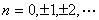</pre>

是任一圆周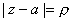（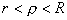），函数的罗朗级数在环形区域内的任意一个闭区域上一致收敛.

&nbsp;&nbsp;&nbsp; 级数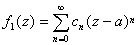称为罗朗展开的正则部分，

&nbsp;&nbsp;&nbsp; 级数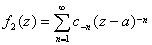称为罗朗展开的主要部分.

&nbsp;&nbsp;&nbsp; 如果级数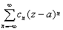在环形区域内收敛，那末级数的和在这个区域内解析，并且这个级数就是的罗朗级数.因此圆环上解析函数的罗朗展开式是唯一的.

