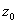
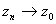
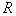

3.解析函数的局部性质

&nbsp;&nbsp;&nbsp;
[解析函数的零点]设在解析，并且，则称为的零点.若而，则称为的阶零点.

&nbsp;&nbsp;&nbsp;
解析函数的零点是孤立的，也就是说，如果是的零点，并且不是，那末一定有一正数，使得在圆内除外无其他零点.

&nbsp;&nbsp;
[解析函数的唯一性定理] 设函数和在区域内解析，的内点列（）有一极限点属于，如果

<pre>&nbsp;&nbsp;&nbsp;&nbsp;&nbsp;&nbsp;&nbsp;&nbsp;&nbsp;&nbsp;&nbsp;&nbsp;&nbsp;&nbsp;&nbsp;&nbsp;&nbsp;&nbsp;&nbsp; ，&nbsp;&nbsp;&nbsp;&nbsp;&nbsp;&nbsp; </pre>

那末在区域内

<pre>&nbsp;&nbsp;&nbsp;&nbsp;&nbsp;&nbsp;&nbsp;&nbsp;&nbsp;&nbsp;&nbsp;&nbsp;&nbsp;&nbsp;&nbsp;&nbsp;&nbsp;&nbsp;&nbsp; </pre>

这个性质表明区域内的解析函数由内任一收敛于的内点的点列上的数值完全决定.

&nbsp;&nbsp; [孤立奇点（可去奇点·极点·本性奇点）]&nbsp; 如果函数在的一个邻域内除外解析，称是函数的一个孤立奇点.孤立奇点分三类：

&nbsp;&nbsp; 1o&nbsp; 当（为有限数），称为的可去奇点.是的可去奇点的充分必要条件是：在的邻域里<a href="#None"
name="_ftnref1" title="">*</a>的罗朗级数不含主要部分，或者是在的邻域里有界.

&nbsp;&nbsp; 2o&nbsp; 当，称为的极点.是的极点的充分必要条件是：在的邻域里的罗朗级数的主要部分只含有限多项，即

<pre>&nbsp;&nbsp;&nbsp;&nbsp;&nbsp;&nbsp;&nbsp;&nbsp;&nbsp;&nbsp;&nbsp;&nbsp;&nbsp;&nbsp;&nbsp;&nbsp;&nbsp;&nbsp;&nbsp;&nbsp; </pre>

如果主要部分中的负次幂最高的是，那末称为的阶极点.

&nbsp;&nbsp; 3o&nbsp; 当不存在，称为的本性奇点.是函数的本性奇点的充分必要条件是：在的邻域里的罗朗级数中主要部分有无限多项.

如果是函数<i>f</i>(<i>z</i>)的本性奇点，那末对任意复数<i>A</i>,都存在一点列，,使得

<pre>&nbsp;&nbsp;&nbsp;&nbsp;&nbsp;&nbsp;&nbsp;&nbsp;&nbsp;&nbsp;&nbsp;&nbsp;&nbsp;&nbsp;&nbsp;&nbsp;&nbsp;&nbsp;&nbsp;&nbsp;&nbsp;&nbsp;&nbsp;&nbsp;&nbsp;&nbsp;&nbsp;&nbsp;&nbsp;&nbsp; </pre>

[泰勒定理] 如果函数在区域内解析，那末对于内一点，有

<pre></pre>

其中余项的形式是

<pre>&nbsp;&nbsp;&nbsp;&nbsp;&nbsp;&nbsp;&nbsp;&nbsp;&nbsp;&nbsp;&nbsp;&nbsp;&nbsp;&nbsp;&nbsp;&nbsp;&nbsp; &nbsp;&nbsp;&nbsp;&nbsp;</pre>

<i>C</i>是以为圆心的圆周（的内部在内）.

泰勒定理是讲解析函数的有限展开式，而泰勒级数展开定理（§4，一，1）是无穷级数形式.对于研究解析函数的局部性质来说，有用的还是这里的有限展开式.

&nbsp;&nbsp;&nbsp;
[解析函数在无穷远点的性质]

&nbsp;&nbsp;&nbsp;
1o&nbsp; 无穷远点的邻域以原点为中心，为半径的圆的外部所有的点是无穷远点的一个邻域.

&nbsp;&nbsp;&nbsp;
2o&nbsp; 无穷远点是的孤立奇点&nbsp; 设.若是的可去奇点，则称为的可去奇点；若是的阶极点，则称为的阶极点；若是的本性奇点，则称为的本性奇点.

&nbsp;&nbsp;&nbsp;
3o&nbsp; 函数在无穷远点的罗朗级数
设在的邻域内的罗朗级数是

<pre>&nbsp;&nbsp;&nbsp;&nbsp;&nbsp;&nbsp;&nbsp;&nbsp;&nbsp;&nbsp;&nbsp;&nbsp;&nbsp;&nbsp;&nbsp;&nbsp;&nbsp;&nbsp; </pre>

令，得到在的邻域内的罗朗级数

<pre>&nbsp;&nbsp;&nbsp;&nbsp;&nbsp;&nbsp;&nbsp;&nbsp;&nbsp;&nbsp;&nbsp;&nbsp;&nbsp;&nbsp;&nbsp;&nbsp;&nbsp;&nbsp; ，&nbsp; &nbsp;&nbsp;&nbsp;&nbsp;&nbsp;&nbsp;&nbsp;）</pre>

&nbsp;&nbsp;&nbsp;
所以，当是的可去奇点时，的罗朗级数中不含的正次幂；当是的阶极点时，的罗朗级数中，只有有限项的正次幂，并且（）是最后一个不等于零的系数；当是的本性奇点时，的罗朗级数中，有无限多项的正次幂.

&nbsp;&nbsp;&nbsp;
4o&nbsp; 函数在无穷远点是孤立奇点的性质&nbsp; 当是的可去奇点时，函数的模在无穷远点的某一邻域里有界；当是的阶极点时，函数的模在无穷远点的任一邻域里无界；当是的本性奇点时，对任意复数，都存在点列，，使得.

&nbsp;&nbsp;&nbsp;
5o&nbsp; 无穷远点是的零点
的罗朗级数中不含的正次幂，而且。若，而（），则称无穷远点是的阶零点.

 

 

<a href="#None" name="_ftn1" title="">*</a> 凡是在一点的邻域里谈到罗朗级数，这个邻域就是指，为某个正数.

