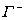
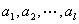
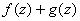
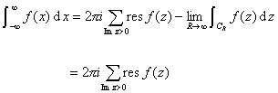

二、留数定理及其应用

&nbsp;&nbsp;&nbsp;
[留数的定义] 设点是函数的孤立奇点，是圆周，称积分

&nbsp;&nbsp;&nbsp;&nbsp;&nbsp;&nbsp;&nbsp;&nbsp;&nbsp;&nbsp;&nbsp;&nbsp;&nbsp;
&nbsp;&nbsp;&nbsp;&nbsp;&nbsp;&nbsp;&nbsp;&nbsp;&nbsp;&nbsp;&nbsp;&nbsp;&nbsp;

的数值为函数在孤立奇点处的留数（残数），记作，这里为适当小的正数（使圆内无的其它奇点），留数值与的取值无关.

&nbsp;&nbsp;&nbsp;
函数在一个孤立奇点处的留数等于在点的邻域内的罗朗展开式中负一次幂的系数，即

&nbsp;&nbsp;&nbsp;&nbsp;&nbsp;&nbsp;&nbsp;&nbsp;&nbsp;&nbsp;&nbsp;&nbsp;&nbsp;&nbsp;&nbsp;&nbsp;&nbsp;&nbsp;&nbsp;&nbsp;&nbsp;&nbsp;&nbsp;&nbsp;&nbsp;&nbsp;

&nbsp;&nbsp;&nbsp;
[孤立奇点的留数计算法则]

&nbsp;&nbsp; &nbsp;1o&nbsp; 函数在可去奇点的留数等于零.

&nbsp;&nbsp;&nbsp;
2o&nbsp; 设是的一阶极点，则

&nbsp;&nbsp;&nbsp;&nbsp;&nbsp;&nbsp;&nbsp;&nbsp;&nbsp;&nbsp;&nbsp;&nbsp;&nbsp;&nbsp;&nbsp;&nbsp;&nbsp;&nbsp;&nbsp;&nbsp;

&nbsp;&nbsp;&nbsp;
3o&nbsp; 设是的阶极点，则

&nbsp;&nbsp;&nbsp;&nbsp;&nbsp;&nbsp;&nbsp;&nbsp;&nbsp;&nbsp;
&nbsp;&nbsp;&nbsp;&nbsp;&nbsp;&nbsp;&nbsp;&nbsp;

&nbsp;&nbsp;&nbsp; 4o&nbsp; 设分式函数，和在点解析，是的一阶零点，而，则

&nbsp;&nbsp;&nbsp;&nbsp;&nbsp;&nbsp;
&nbsp;&nbsp;&nbsp;&nbsp;&nbsp;（为在的导数）

&nbsp;&nbsp;&nbsp;
5o&nbsp; 设是的孤立奇点，表示半径足够大的圆周（使圆周外部无的其他奇点），称积分

&nbsp;&nbsp;&nbsp;&nbsp;&nbsp;&nbsp;&nbsp;&nbsp;&nbsp;&nbsp;&nbsp;&nbsp;&nbsp;&nbsp;&nbsp;

的数值为在的留数（其中是取顺时针方向），记作，所以

&nbsp;&nbsp;&nbsp;&nbsp;&nbsp;&nbsp;&nbsp;&nbsp;&nbsp;&nbsp;&nbsp;&nbsp;&nbsp;&nbsp;&nbsp;

[留数定理] 如果函数在简单闭曲线的内部内除了有限个奇点外解析，并且在上除了外连续，那末

&nbsp;&nbsp;&nbsp;&nbsp;&nbsp;&nbsp;&nbsp;&nbsp;&nbsp;&nbsp;&nbsp;&nbsp;&nbsp;&nbsp;&nbsp;&nbsp;&nbsp;&nbsp;&nbsp;&nbsp;&nbsp;&nbsp;&nbsp;&nbsp;

[辐角原理] 如果函数在简单闭曲线的内部内除了有限个阶数分别是的极点外解析，在上除了点外连续，在上没有零点与极点，而在内有阶数分别是的零点，那末

&nbsp;&nbsp;&nbsp;&nbsp;&nbsp;&nbsp;&nbsp;&nbsp;&nbsp;&nbsp;&nbsp;&nbsp;&nbsp;&nbsp;&nbsp;

其中表示点沿曲线移动一圈后的辐角改变量.设是曲线在映射下的象，则称为曲线的回转次数.

&nbsp;&nbsp;&nbsp;
[儒歇定理] 如果函数与在简单闭曲线及的内部解析，且在上

&nbsp;&nbsp;&nbsp;&nbsp;&nbsp;&nbsp;&nbsp;&nbsp;&nbsp;&nbsp;&nbsp;&nbsp;&nbsp;&nbsp;&nbsp;&nbsp;&nbsp;&nbsp;&nbsp;&nbsp;
，&nbsp;&nbsp;&nbsp;&nbsp;&nbsp; 

那末在的内部，和有相同的零点个数，即

&nbsp;&nbsp;&nbsp;&nbsp;&nbsp;&nbsp;&nbsp;&nbsp;&nbsp;&nbsp;&nbsp;&nbsp;&nbsp;&nbsp;&nbsp;&nbsp;&nbsp;&nbsp;

&nbsp;&nbsp;&nbsp;
[利用留数定理计算定积分]

&nbsp;&nbsp;&nbsp;
1o&nbsp; 计算积分

&nbsp;&nbsp;&nbsp; 如果除在实轴的上侧有有限多个孤立奇点外，在包括实轴在内的上半平面上处处是解析的，同时假设是的至少二阶的零点，或者

&nbsp;&nbsp;&nbsp;&nbsp;&nbsp;&nbsp;&nbsp;&nbsp;&nbsp;&nbsp;&nbsp;
&nbsp;&nbsp;&nbsp;&nbsp;（，为常数）

那末可按照下列步骤计算积分（图10.12）：

（1）&nbsp;&nbsp;&nbsp;&nbsp;&nbsp;&nbsp;&nbsp;
（1）作辅助函数，在实轴上

&nbsp;&nbsp;&nbsp;
&nbsp;&nbsp;&nbsp;&nbsp;&nbsp;&nbsp;&nbsp;&nbsp;&nbsp;&nbsp;&nbsp;&nbsp;&nbsp;

（2）&nbsp;&nbsp;&nbsp;&nbsp;&nbsp;&nbsp;&nbsp;
（2）作附加积分路线，使它和合起来变成一条包含的所有奇点的闭曲线，则

&nbsp;&nbsp;&nbsp;&nbsp;&nbsp;&nbsp;&nbsp;&nbsp;&nbsp;&nbsp;&nbsp;&nbsp;&nbsp;&nbsp;&nbsp;&nbsp;&nbsp;&nbsp;&nbsp;&nbsp;

（3）&nbsp;&nbsp;&nbsp;&nbsp;&nbsp;&nbsp;&nbsp;
（3）求出在上半平面的各奇点的留数总和，应用留数定理，有

&nbsp;&nbsp;&nbsp;&nbsp;&nbsp;&nbsp;&nbsp;&nbsp;&nbsp;&nbsp;&nbsp;
&nbsp;&nbsp;&nbsp;&nbsp;&nbsp;&nbsp;&nbsp;&nbsp;&nbsp;

（4）&nbsp;&nbsp;&nbsp;&nbsp;&nbsp;&nbsp;&nbsp;
（4）令，根据假设，，那末

&nbsp;&nbsp;&nbsp;&nbsp;&nbsp;&nbsp;&nbsp;&nbsp;&nbsp;&nbsp;&nbsp;&nbsp;&nbsp;&nbsp;&nbsp;

例1&nbsp;&nbsp;&nbsp;&nbsp;&nbsp;&nbsp;&nbsp;
例1&nbsp;&nbsp;&nbsp;&nbsp;&nbsp;&nbsp;&nbsp;&nbsp;&nbsp;&nbsp;&nbsp;
&nbsp;计算

&nbsp;&nbsp;&nbsp;&nbsp;
解&nbsp;&nbsp; 

（1）&nbsp;&nbsp;&nbsp; （1）&nbsp;&nbsp;&nbsp; 作辅助函数.

（2）&nbsp;&nbsp;&nbsp; （2）&nbsp;&nbsp;&nbsp; 作附加积分线路：以原点为中心，半径充分大的上半圆周（图10.13）.

（3）&nbsp;&nbsp;&nbsp; （3）&nbsp;&nbsp;&nbsp; 在上半平面只有一个极点，其留数为

&nbsp;&nbsp;&nbsp;&nbsp;&nbsp;&nbsp;&nbsp;&nbsp;&nbsp;&nbsp;&nbsp;&nbsp;&nbsp;&nbsp;&nbsp;&nbsp;&nbsp;&nbsp;&nbsp;

（4）&nbsp;&nbsp;&nbsp;&nbsp;&nbsp;&nbsp;&nbsp;&nbsp;&nbsp;

所以

&nbsp;&nbsp;&nbsp;&nbsp;&nbsp;&nbsp;&nbsp;&nbsp;&nbsp;&nbsp;&nbsp;&nbsp;&nbsp;&nbsp;&nbsp;&nbsp;&nbsp;

&nbsp;&nbsp;&nbsp;&nbsp;
2o&nbsp; 计算积分 &nbsp;&nbsp;&nbsp;&nbsp;&nbsp;&nbsp;（）

&nbsp;&nbsp;&nbsp;
设是有理函数，并且分母的次数分子的次数（）.

&nbsp;&nbsp;&nbsp;
计算的基本步骤和上面一样，它的辅助函数是，附加积分路线和积分闭曲线分下面两种情况：

（a）&nbsp;&nbsp;&nbsp;&nbsp;&nbsp;&nbsp;&nbsp;&nbsp;&nbsp;&nbsp;&nbsp;&nbsp;&nbsp;&nbsp;&nbsp;&nbsp;
（a）如果在实轴上有有限多个一阶极点，积分闭曲线（在极点处，以各极点为圆心，为半径在下半平面作半圆，为正向）见图10.14（<i>a</i>）<a
href="bword://None" name="_ftnref1" title="">*</a>，那末 

这里的广义积分是柯西主值，其定义见第六章§1，五.

（b）&nbsp;&nbsp;&nbsp;&nbsp;&nbsp;&nbsp;&nbsp;&nbsp;&nbsp;&nbsp;&nbsp;&nbsp;&nbsp;&nbsp;&nbsp;
（b）如果在实轴上没有奇

点，积分闭曲线见图10.14（<i>b</i>）.

&nbsp;&nbsp;&nbsp;&nbsp;&nbsp;&nbsp;&nbsp;&nbsp;&nbsp;&nbsp;&nbsp;&nbsp;&nbsp;&nbsp;

例2&nbsp;&nbsp;&nbsp;&nbsp;&nbsp;&nbsp;&nbsp;
例2&nbsp;&nbsp;&nbsp;&nbsp;&nbsp; 计算积分（）

&nbsp;&nbsp;&nbsp;&nbsp;&nbsp;
解&nbsp;&nbsp; 作辅助函数，它只有实轴上的两个奇点，，所以由（a）

&nbsp;&nbsp;&nbsp;&nbsp;&nbsp;&nbsp;&nbsp;&nbsp;&nbsp;&nbsp;&nbsp;

例3&nbsp;&nbsp;&nbsp;&nbsp;&nbsp;&nbsp;&nbsp;
例3&nbsp;&nbsp;&nbsp;&nbsp;&nbsp; 计算积分

&nbsp;&nbsp;&nbsp;&nbsp;&nbsp;
解 （1）作辅助函数.

（2）作附加积分线路和与，合起来变成一条包含奇点的闭曲线（图10.15），则

&nbsp;&nbsp;&nbsp;&nbsp;&nbsp;&nbsp;

&nbsp;&nbsp;&nbsp;&nbsp;
（3）在曲线内函数 只有一个二阶极点，根据孤立奇点的留数计算法则3o，得到处的留数，则

&nbsp;&nbsp;&nbsp;&nbsp;&nbsp;&nbsp;&nbsp;&nbsp;&nbsp;&nbsp;&nbsp;&nbsp;&nbsp;

&nbsp;&nbsp;&nbsp;&nbsp;&nbsp;
（4）可以证明当，时，积分，，于是得

&nbsp;&nbsp;&nbsp;&nbsp;&nbsp;&nbsp;&nbsp;&nbsp;&nbsp;&nbsp;&nbsp;&nbsp;&nbsp;
&nbsp;&nbsp;&nbsp;&nbsp;&nbsp;&nbsp;

上式两边实部相等，所以

&nbsp;&nbsp;&nbsp;&nbsp;&nbsp;&nbsp;&nbsp;&nbsp;&nbsp;&nbsp;&nbsp;&nbsp;&nbsp;
&nbsp;&nbsp;&nbsp;

 

 

<a href="#None" name="_ftn1" title="">*</a> 实轴上的这些半径为的半圆也可取在上半平面（为负向）.这是因为，容易验证，在这里所述条件下，以负向沿半圆求积，当时，其积分趋于该极点的留数与的乘积.

