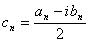

<b>第十一章</b><b> </b><b>傅立叶级数与积分变换</b>

&nbsp;&nbsp;&nbsp; 在理论和应用上，常常要考察一个函数与一正交函数系之间的关系.傅立叶级数理论就是研究在有限区间上的这个关系，对于区间是无限的情况，傅立叶变换理论(包括傅立叶变换，拉普拉斯变换等积分变换)，就是这一理论的推广.本章重点介绍在有限区间上函数用傅立叶三角级数表示，在无限区间上函数用某种特殊的积分形式表示，如傅立叶变换，拉普拉斯变换，梅林变换，汉克尔变换等，这些都是傅立叶分析的重要内容.

&nbsp;&nbsp;&nbsp; 傅立叶分析在研究振动和波动现象及解数学物理方程时是个重要的工具.它在物理上还说明：任意波形总能进行谱分解，即表为不同频率，不同振幅的简谐波的线性叠加.在六十年代发展了快速傅立叶变换，为傅立叶分析在实际中的广泛应用创造了条件，本章收集了关于这方面的部分内容.

<b>§</b><b>1 </b><b>傅立叶级数</b>

一、&nbsp; 一、&nbsp;&nbsp;&nbsp;&nbsp;&nbsp;&nbsp;&nbsp;&nbsp;
三角级数与傅立叶级数

&nbsp;&nbsp;&nbsp; [正交函数系] 一个函数系

<pre style='text-align:right' align=right>&nbsp;&nbsp;&nbsp;&nbsp;&nbsp;&nbsp;&nbsp;&nbsp;&nbsp;&nbsp; &nbsp;&nbsp;&nbsp;&nbsp;&nbsp;&nbsp;&nbsp;&nbsp;&nbsp;&nbsp;&nbsp;&nbsp;&nbsp;&nbsp;&nbsp;&nbsp;&nbsp;&nbsp;&nbsp;&nbsp;&nbsp;&nbsp;&nbsp;&nbsp;&nbsp;&nbsp;&nbsp;&nbsp;&nbsp;(1)</pre>

其中每个函数都是定义在区间上的实函数或实变量的复值函数，如果满足

<pre>&nbsp;&nbsp;&nbsp;&nbsp;&nbsp;&nbsp;&nbsp;&nbsp;&nbsp;&nbsp;&nbsp;&nbsp; &nbsp;&nbsp;&nbsp;&nbsp;&nbsp;&nbsp;&nbsp;&nbsp;&nbsp;(<i>m</i> <i>n</i> )</pre>

就称函数系(1)为区间上的正交函数系，式中是的共轭函数.如果再满足

<pre style='text-align:center' align=center></pre>

就称函数系(1)为上的标准(规范)正交函数系.例如

<pre style='text-align:center' align=center></pre>

是区间上的正交函数系，式中，函数系

是区间上的标准正交函数系.

&nbsp;&nbsp;&nbsp; 设给定函数系

<pre style='text-align:right' align=right>&nbsp;&nbsp;&nbsp;&nbsp;&nbsp;&nbsp;&nbsp;&nbsp;&nbsp;&nbsp;&nbsp;&nbsp;&nbsp;&nbsp;&nbsp;&nbsp;&nbsp;&nbsp;&nbsp;&nbsp;&nbsp;&nbsp;&nbsp;&nbsp;&nbsp;&nbsp;&nbsp;&nbsp;&nbsp;&nbsp; (2)</pre>

其中自变量<i>x</i>取有限个离散值

<pre style='text-align:center' align=center></pre>

满足

<pre style='text-align:center' align=center></pre>

就称函数系(2)为标准正交函数系，式中

<pre style='text-align:center' align=center></pre>

例如取&nbsp;&nbsp; 

<pre style='text-align:center' align=center></pre>

就是一个标准正交函数系.

[三角级数的几种类型]

<table class=MsoNormalTable border=1 cellspacing=0 cellpadding=0
 style='border-collapse:collapse;border:none'>
 <tr style='height:34.95pt'>
  <td width=201 valign=top style='width:150.5pt;border:solid windowtext 1.0pt;
  border-left:solid white 1.0pt;padding:0mm 5.4pt 0mm 5.4pt;height:34.95pt'>
  
&nbsp;&nbsp;&nbsp;&nbsp;&nbsp; 类&nbsp; 型

  </td>
  <td width=444 colspan=2 valign=top style='width:333.25pt;border-top:solid windowtext 1.0pt;
  border-left:none;border-bottom:solid windowtext 1.0pt;border-right:solid white 1.0pt;
  padding:0mm 5.4pt 0mm 5.4pt;height:34.95pt'>
  
表&nbsp;&nbsp;&nbsp;&nbsp;&nbsp;&nbsp;&nbsp;&nbsp;
  达&nbsp;&nbsp;&nbsp;&nbsp;&nbsp;&nbsp;&nbsp;&nbsp; 式

  </td>
 </tr>
 <tr style='height:139.55pt'>
  <td width=201 valign=top style='width:150.5pt;border-top:none;border-left:
  solid white 1.0pt;border-bottom:solid windowtext 1.0pt;border-right:solid windowtext 1.0pt;
  padding:0mm 5.4pt 0mm 5.4pt;height:139.55pt'>
  
&nbsp;&nbsp;&nbsp; 实&nbsp; 数&nbsp; 型

  
&nbsp;&nbsp; 余 弦 级 数 

  
&nbsp;&nbsp; 正 弦 级 数

  </td>
  <td width=444 colspan=2 valign=top style='width:333.25pt;border-top:none;
  border-left:none;border-bottom:solid windowtext 1.0pt;border-right:solid white 1.0pt;
  padding:0mm 5.4pt 0mm 5.4pt;height:139.55pt'>
  
&nbsp;
  

  
式中&nbsp; 是实常数

  
&nbsp; 

  
&nbsp;
  

  </td>
 </tr>
 <tr style='height:70.25pt'>
  <td width=201 valign=top style='width:150.5pt;border-top:none;border-left:
  solid white 1.0pt;border-bottom:solid windowtext 1.0pt;border-right:solid windowtext 1.0pt;
  padding:0mm 5.4pt 0mm 5.4pt;height:70.25pt'>
  
&nbsp;&nbsp;&nbsp; 复&nbsp; 数&nbsp; 型

  </td>
  <td width=429 valign=top style='width:321.45pt;border-top:none;border-left:
  none;border-bottom:solid windowtext 1.0pt;border-right:solid white 1.0pt;
  padding:0mm 5.4pt 0mm 5.4pt;height:70.25pt'>
  
&nbsp; &nbsp;&nbsp;

  
式中 

  
&nbsp; ,,,

  </td>
  <td width=16 valign=top style='width:11.8pt;border:none;border-bottom:solid windowtext 1.0pt;
  padding:0mm 5.4pt 0mm 5.4pt;height:70.25pt'>
  
&nbsp; 

  </td>
 </tr>
</table>

&nbsp;[傅立叶级数]&nbsp; 设函数在区间上绝对可积，且令

<pre style='text-align:center' align=center></pre>

以为系数作三角级数

<pre style='text-align:center' align=center></pre>

它称为的傅立叶级数，称为的傅立叶系数.不管级数(1)是否收敛，或者收敛而不管它是否等于，都记作

<pre style='text-align:center' align=center>～</pre>

如果的傅立叶级数点点收敛，而且它的和等于(除去有限个点外)，那末级数(1)称为的傅立叶展开，记作

<pre style='text-align:center' align=center></pre>

&nbsp;&nbsp;&nbsp; 注意：1o&nbsp; 如果在区间上绝对可积，那末一定有它的傅立叶级数，但是，不一定有它的傅立叶展开(可以展开的条件参看本节，四).

&nbsp;2o&nbsp; 如果在区间上有一个三角级数一致收敛(或囿收敛，即部分和点点收敛且一致有界)于函数，那末这个级数就是函数的傅立叶展开.

&nbsp;3o&nbsp; 区间上两个绝对可积函数，，如果除去有限个点外处处相等(可以推广到几乎处处相等*，那末和的所有对应的傅立叶系数都一致.

&nbsp;4o&nbsp;
定义，那末函数的定义域可推广到整个数轴，求傅立叶系数的积分区间可以换成长度为的任意区间，例如等.

 

* 如果除掉一个测度等于零的点集外与<i>g</i>
( <i>x</i> )都相等，那末称与<i>g </i>(
<i>x</i> )几乎处处相等。关于测度的定义，见第九章§7，一。

