

三、傅立叶系数的性质

&nbsp;&nbsp;&nbsp; 1o&nbsp; 绝对可积函数的傅立叶系数收敛于零，即

&nbsp;&nbsp;&nbsp;&nbsp;&nbsp;&nbsp;&nbsp;&nbsp;&nbsp;&nbsp;&nbsp;&nbsp;&nbsp;&nbsp;&nbsp;&nbsp;
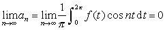

&nbsp;&nbsp;&nbsp;&nbsp;&nbsp;&nbsp;&nbsp;&nbsp;&nbsp;&nbsp;&nbsp;&nbsp;&nbsp;&nbsp;&nbsp;&nbsp;
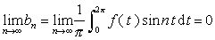&nbsp;

特别，如果在区间上有有界变差*，或者单调上升有界，或在上分段单调，那末都有

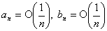

&nbsp;&nbsp;&nbsp; 如果及它们一直到阶的导数在区间上都是有界变差函数，或者都单调上升有界，或在上分段单调，那末

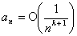,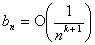

&nbsp;&nbsp;&nbsp; 2o&nbsp; 如果函数在上平方可积**，那末

&nbsp;&nbsp;&nbsp;&nbsp;&nbsp;&nbsp;&nbsp;&nbsp;&nbsp;&nbsp;&nbsp;&nbsp;&nbsp;&nbsp;&nbsp;&nbsp;&nbsp;
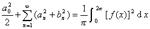&nbsp;

这个公式称为帕塞法耳等式或封闭性方程.&nbsp;&nbsp;&nbsp; 

&nbsp;&nbsp;&nbsp; 3o&nbsp; 如果函数，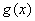在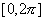上平方可积，它们的傅立叶级数是

&nbsp;&nbsp;&nbsp;&nbsp;&nbsp;&nbsp;&nbsp;&nbsp;&nbsp;&nbsp;&nbsp;&nbsp;&nbsp;&nbsp;&nbsp;&nbsp;&nbsp;
～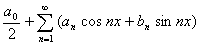

&nbsp;&nbsp;&nbsp;&nbsp;&nbsp;&nbsp;&nbsp;&nbsp;&nbsp;&nbsp;&nbsp;&nbsp;&nbsp;&nbsp;&nbsp;&nbsp;&nbsp;
～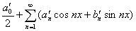

那末有下面的广义封闭性方程

&nbsp;&nbsp;&nbsp;&nbsp;&nbsp;&nbsp;&nbsp;&nbsp;&nbsp;&nbsp;&nbsp;&nbsp;&nbsp;&nbsp;&nbsp;&nbsp;&nbsp;
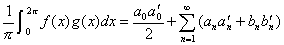

&nbsp;&nbsp;&nbsp; 4o&nbsp; 如果函数在区间上绝对可积，<i>bn</i>是它的傅立叶级数的正

弦项系数，那末级数

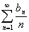

收敛.

 

*有界变差定义见第五章 §1.

**平方可积函数的定义见第九章 §7， 一.

