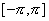
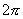
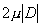
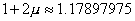
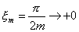

四、傅立叶级数的收敛性及在第一类间断点的性质

[傅立叶级数收敛性的判别]

1o&nbsp; 假设的傅立叶级数的部分和为

如果当,<i>sm</i>(<i>x</i>)趋于(在某一点<i>x</i>趋于，或在某一区间内一致地趋于)函数，那末函数的傅立叶级数收敛于函数.

2o&nbsp; 如果函数在开区间内分段单调，并在该区间内有有限个第一类间断点，那末(i)
<i>sm</i>(<i>x</i>)在连续点<i>x</i>收敛于 
；(ii)在第一类间断点<i>x</i>0收敛于；(iii)在区间的端点，即 与上，等于 
.(狄利克莱定理)

3o&nbsp; 如果函数在区间上分段可微，在连续点上有导数，在第一类间断点<i>x</i>0处极限

和

存在，那末<i>sm</i>(<i>x</i>)在连续点<i>x</i>上收敛于，在间断点<i>x</i>0上收敛于

[吉布斯现象]&nbsp; 以为周期的函数具有第一类间断点，令，在点函数的跳跃为 
，假定函数在点的某邻域内没有其他间断点，且有有界变差.令函数 
的傅立叶级数部分和为<i>sm</i>(<i>x</i>).那末函数的傅立叶级数在点处是收敛的，但在该邻域内不一致收敛.这时 
有一种奇怪的现象(称为吉布斯现象)出现：

存在点列，和，使得

&nbsp;&nbsp;&nbsp;&nbsp;&nbsp;&nbsp;&nbsp;&nbsp;&nbsp;&nbsp;&nbsp;&nbsp;&nbsp;&nbsp;&nbsp;&nbsp;&nbsp;&nbsp;&nbsp;

&nbsp;&nbsp;&nbsp;&nbsp;&nbsp;&nbsp;&nbsp;&nbsp;&nbsp;&nbsp;&nbsp;&nbsp;&nbsp;&nbsp;&nbsp;&nbsp;&nbsp;&nbsp;&nbsp;

&nbsp;&nbsp;&nbsp;&nbsp;&nbsp;&nbsp;&nbsp;&nbsp;&nbsp;&nbsp;&nbsp;&nbsp;&nbsp;&nbsp;&nbsp;

因此，<i>sm</i>(<i>x</i>)在间断点的邻域内的振幅的极限为&nbsp;&nbsp; 

&nbsp;&nbsp;&nbsp;&nbsp;&nbsp;&nbsp;&nbsp;&nbsp;&nbsp;

它比函数在点的跳跃量大(约18%)，或者是的 
倍(图11.1).

&nbsp;&nbsp;&nbsp; 例&nbsp; 函数 

的傅立叶级数为

～

点<i>x=</i>0为的第一类间断点,其跳跃<i>D<b>=</b></i><i>π</i>

 

<i>y </i>=<i>sm</i>(<i>x</i>)
(<i>m</i>=1,2,3,4,5,6)的曲线如图11.2.

存在点列 , &nbsp;,使得

当时，<i>sm</i>(<i>x</i>)的极限图形如图11.3(注意在点<i>x</i>=0的形状).

