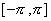
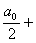
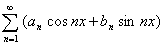
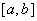
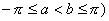
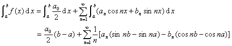
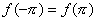
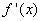
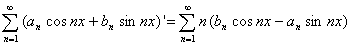

五、 傅立叶级数的逐项积分与微分

&nbsp;&nbsp;&nbsp; [逐项积分]&nbsp; 假定在区间上绝对可积函数的傅立叶级数是

～

那末不管它是否收敛于<i>f</i> ( <i>x </i>)，都可逐项积分. 即对任意区间 (其中，下列关系成立： 

&nbsp;&nbsp;&nbsp; [逐项微分]&nbsp; 假定函数在区间上连续，,并有绝对可积的导数(可能有有限个点没有导数) ，那末函数的傅立叶级数可由逐项微分的傅立叶级数得到，即

～

这里没有指出右边级数是否收敛于 , 对具体问题还应作具体判断.

