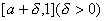
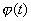

二、傅立叶-贝塞耳级数

&nbsp;&nbsp;&nbsp; [傅立叶-贝塞耳级数]

1o&nbsp; 设是贝塞耳函数（见第十二章）的正根，那末函数系

在[0, 1]上按权<i>x</i>正交，即

&nbsp;&nbsp;&nbsp; 2o&nbsp; 对于一切在[0, 1]上绝对可积的函数，可作它的傅立叶-贝塞耳级数

～

式中&nbsp;&nbsp;&nbsp;&nbsp;&nbsp;&nbsp;&nbsp; 

称为函数的傅立叶-贝塞耳系数.

&nbsp;&nbsp;&nbsp; 3o&nbsp; 如果在[0, 1]上除有有限个第一类间断点外处处连续并且逐段可微，那末当 时，它的傅立叶–贝塞耳级数收敛，在连续点处，级数和等于，在间断点处，级数和等于；

如果在[0，1]上绝对可积，在区间上连续并且有绝对可积的导数，那末它的傅立叶—贝塞耳级数在每一区间上一致收敛；

如果在[0，1]上绝对可积，在区间上连续并且有绝对可积的导数，同时，那末它的傅立叶-贝塞耳级数在每一区间上一致收敛.

[第二类傅立叶-贝塞耳级数]

1o&nbsp; 设是

&nbsp;&nbsp;&nbsp;&nbsp;&nbsp;&nbsp;&nbsp;&nbsp;&nbsp;&nbsp;&nbsp;&nbsp;&nbsp;&nbsp;&nbsp;&nbsp;&nbsp;&nbsp;&nbsp;&nbsp;&nbsp;
&nbsp;&nbsp;&nbsp;&nbsp;&nbsp;&nbsp;&nbsp;&nbsp;&nbsp;&nbsp;&nbsp;（<i>H</i>是常数）

的正根，那末，当时，函数系

&nbsp;&nbsp;&nbsp;&nbsp;&nbsp;&nbsp;&nbsp;&nbsp;&nbsp;&nbsp;&nbsp;&nbsp;&nbsp;&nbsp;&nbsp;&nbsp;&nbsp;&nbsp;

在[0, 1]上按权<i>x</i>正交.

&nbsp;&nbsp;&nbsp; 如果在[0，1]上绝对可积，那末它关于上面正交系的广义傅立叶级数称为的第二类傅立叶-贝塞耳级数，即

<pre align=center>&nbsp;&nbsp;&nbsp;&nbsp;&nbsp;&nbsp;&nbsp;&nbsp;&nbsp;&nbsp;&nbsp;&nbsp;&nbsp;&nbsp;&nbsp;&nbsp;&nbsp;&nbsp;&nbsp;&nbsp;&nbsp;&nbsp;&nbsp;&nbsp;&nbsp;&nbsp; ～</pre><pre>式中&nbsp;&nbsp;&nbsp;&nbsp;&nbsp;&nbsp; &nbsp;</pre><pre>&nbsp;&nbsp;&nbsp;&nbsp;&nbsp;&nbsp;&nbsp;&nbsp;&nbsp;&nbsp;&nbsp;&nbsp;&nbsp;&nbsp;&nbsp;&nbsp;&nbsp;&nbsp;</pre>

&nbsp;&nbsp;&nbsp; 2o&nbsp; 如果函数在[0, 1]上逐段可微（至多有有限个第一类间断点），那末它的第二类傅立叶-贝塞耳级数在0&lt;<i>x</i>&lt;1上收敛，并在连续点处等于,在间断点处等于；

如果函数在[0，1]上连续，两次可微（除有限个点外），且=0, ,有界，那末它的第二类傅立叶-贝塞耳级数当时，在每个区间[,1] (0&lt;&lt;1)上绝对且一致收敛；又当时，在整个区间[0，1]上绝对且一致收敛.

&nbsp;&nbsp;&nbsp; [区间[0,<i>l</i>]上的傅立叶-贝塞耳级数]

&nbsp;&nbsp;&nbsp;
设在[0,<i>l</i>]上绝对可积，那末它的傅立叶-贝塞耳级数是

&nbsp;&nbsp;&nbsp;&nbsp;&nbsp;&nbsp;&nbsp;&nbsp;&nbsp;&nbsp;&nbsp;&nbsp;&nbsp;&nbsp;&nbsp;&nbsp;&nbsp;&nbsp;&nbsp;&nbsp;&nbsp;&nbsp;&nbsp;&nbsp;&nbsp;&nbsp;&nbsp;&nbsp;&nbsp;&nbsp;&nbsp;&nbsp;&nbsp;&nbsp;&nbsp;&nbsp;&nbsp;&nbsp;
<i>f</i> (<i>x</i>)～ 

式中&nbsp;&nbsp;&nbsp;&nbsp;&nbsp;&nbsp;&nbsp;&nbsp; &nbsp;&nbsp;&nbsp;&nbsp;&nbsp;&nbsp;&nbsp;&nbsp;&nbsp;&nbsp;&nbsp;&nbsp;&nbsp;&nbsp;&nbsp;

对于第二类傅立叶-贝塞耳级数，

<pre>&nbsp;&nbsp;&nbsp;&nbsp;&nbsp; &nbsp;&nbsp;&nbsp;&nbsp;</pre>

关于级数的收敛性，可通过作变换, ,只讨论在[0，1]上相应的傅立叶-贝塞耳级数的收敛性就可以了.

