

<b>§3</b><b>&nbsp; </b><b>拉普拉斯变换</b>

&nbsp;&nbsp;&nbsp; [拉普拉斯变换及其反演公式]&nbsp;
的拉普拉斯变换

&nbsp;&nbsp;&nbsp;&nbsp;&nbsp;&nbsp;&nbsp;&nbsp;&nbsp;&nbsp;
&nbsp;&nbsp;&nbsp;&nbsp;(<i>s</i>是复数，<i>s</i>=)

&nbsp;&nbsp;&nbsp; 拉普拉斯变换的反演公式

&nbsp;&nbsp;&nbsp;&nbsp;&nbsp;&nbsp;&nbsp;&nbsp;&nbsp;
&nbsp;&nbsp;&nbsp;&nbsp;&nbsp;&nbsp;&nbsp;

积分沿着任一直线Res=来取，是的增长指数，同时，积分理解为在主值意义下的.

&nbsp;&nbsp;&nbsp; [拉普拉斯变换的存在条件]&nbsp;
如果满足下面三个条件，那末它的拉普拉斯变换存在.

(i)&nbsp;&nbsp;&nbsp;&nbsp;&nbsp;&nbsp;&nbsp;&nbsp;&nbsp;&nbsp;&nbsp;&nbsp;
(i)&nbsp;&nbsp;&nbsp;&nbsp;&nbsp;&nbsp;&nbsp;&nbsp;&nbsp;&nbsp;&nbsp;&nbsp;
实变量的复值函数和在上除掉有第一类间断点（在任一有限区间上至多有有限多个）外连续；

(ii)&nbsp;&nbsp;&nbsp;&nbsp;&nbsp;&nbsp;&nbsp;&nbsp;&nbsp;&nbsp;
(ii)&nbsp;&nbsp;&nbsp;&nbsp;&nbsp;&nbsp;&nbsp;&nbsp;&nbsp;&nbsp; 当<i>t</i>&lt;0时，=0;

(iii)&nbsp;&nbsp;&nbsp;&nbsp;&nbsp;&nbsp;&nbsp;&nbsp;&nbsp;
(iii)&nbsp;&nbsp;&nbsp;&nbsp;&nbsp;&nbsp;&nbsp;&nbsp;&nbsp; 是有限阶的，也就是说可以找到常数和<i>A</i>&gt;0,使得

&nbsp;&nbsp;&nbsp;&nbsp;&nbsp; &nbsp;&nbsp;&nbsp;&nbsp;&nbsp;&nbsp;&nbsp;&nbsp;&nbsp;&nbsp;&nbsp;&nbsp;&nbsp;&nbsp;&nbsp;&nbsp;&nbsp;&nbsp;&nbsp;&nbsp;&nbsp;&nbsp;

这里数称为的增长指数，是有界函数时，可取=0.

&nbsp;&nbsp;&nbsp;
如果满足上面三个条件，那末<i>L </i>( s )是半平面Res&gt;上的解析函数.而反演公式在 的连续点处成立.

[拉普拉斯变换的性质]

&nbsp;&nbsp;&nbsp;&nbsp;&nbsp; &nbsp;&nbsp;&nbsp;&nbsp;&nbsp;&nbsp;(<i>a</i>是常数)

&nbsp;&nbsp;&nbsp;&nbsp;&nbsp;&nbsp;&nbsp;&nbsp;
&nbsp;&nbsp;&nbsp;&nbsp;&nbsp;&nbsp;(<i>a</i>,<i>b</i>是常数)

&nbsp;&nbsp;&nbsp;&nbsp;&nbsp;&nbsp;&nbsp;&nbsp;

式中

&nbsp;&nbsp;&nbsp;&nbsp;&nbsp;&nbsp;&nbsp;&nbsp;&nbsp;
&nbsp;&nbsp;&nbsp;&nbsp;

称为函数和<i>g</i> ( <i>t</i> )的褶积（或卷积）.

[拉普拉斯变换的主要公式表］

<table class=MsoNormalTable border=1 cellspacing=0 cellpadding=0
 style='border-collapse:collapse;border:none'>
 <tr style='height:12.3pt'>
  <td width=272 style='width:204.25pt;border-top:windowtext;border-left:white;
  border-bottom:windowtext;border-right:black;border-style:solid;border-width:
  1.0pt;padding:0mm 5.4pt 0mm 5.4pt;height:12.3pt'>
  
&nbsp;&nbsp;&nbsp;&nbsp;&nbsp;&nbsp;&nbsp;
  原&nbsp; 来&nbsp; 函&nbsp; 数

  </td>
  <td width=373 style='width:279.5pt;border-top:solid windowtext 1.0pt;
  border-left:none;border-bottom:solid windowtext 1.0pt;border-right:solid white 1.0pt;
  padding:0mm 5.4pt 0mm 5.4pt;height:12.3pt'>
  
&nbsp; 拉普拉斯变换后的函数

  </td>
 </tr>
 <tr style='height:25.5pt'>
  <td width=272 style='width:204.25pt;border-top:none;border-left:solid white 1.0pt;
  border-bottom:solid white 1.0pt;border-right:solid black 1.0pt;padding:0mm 5.4pt 0mm 5.4pt;
  height:25.5pt'>
  
&nbsp; &nbsp;&nbsp;&nbsp;&nbsp;&nbsp;&nbsp;&nbsp;&nbsp;&nbsp;

  </td>
  <td width=373 style='width:279.5pt;border-top:none;border-left:none;
  border-bottom:solid white 1.0pt;border-right:solid white 1.0pt;padding:0mm 5.4pt 0mm 5.4pt;
  height:25.5pt'>
  
&nbsp; &nbsp;

  </td>
 </tr>
 <tr style='height:29.25pt'>
  <td width=272 style='width:204.25pt;border-top:none;border-left:solid white 1.0pt;
  border-bottom:solid white 1.0pt;border-right:solid black 1.0pt;padding:0mm 5.4pt 0mm 5.4pt;
  height:29.25pt'>
  
&nbsp; 

  </td>
  <td width=373 style='width:279.5pt;border-top:none;border-left:none;
  border-bottom:solid white 1.0pt;border-right:solid white 1.0pt;padding:0mm 5.4pt 0mm 5.4pt;
  height:29.25pt'>
  
&nbsp; &nbsp;&nbsp;&nbsp;&nbsp;&nbsp;&nbsp;&nbsp;（<i>n</i>阶导数）

  </td>
 </tr>
 <tr style='height:37.5pt'>
  <td width=272 style='width:204.25pt;border-top:none;border-left:solid white 1.0pt;
  border-bottom:solid white 1.0pt;border-right:solid black 1.0pt;padding:0mm 5.4pt 0mm 5.4pt;
  height:37.5pt'>
  
&nbsp; 

  </td>
  <td width=373 style='width:279.5pt;border-top:none;border-left:none;
  border-bottom:solid white 1.0pt;border-right:solid white 1.0pt;padding:0mm 5.4pt 0mm 5.4pt;
  height:37.5pt'>
  
&nbsp; &nbsp;&nbsp;&nbsp;（<i>n</i>重积分）

  </td>
 </tr>
 <tr style='height:3.5pt'>
  <td width=272 style='width:204.25pt;border-top:none;border-left:solid white 1.0pt;
  border-bottom:solid white 1.0pt;border-right:solid black 1.0pt;background:
  white;padding:0mm 5.4pt 0mm 5.4pt;height:3.5pt'>
  
&nbsp; 

  </td>
  <td width=373 style='width:279.5pt;border-top:none;border-left:none;
  border-bottom:solid white 1.0pt;border-right:solid white 1.0pt;padding:0mm 5.4pt 0mm 5.4pt;
  height:3.5pt'>
  
&nbsp; 

  </td>
 </tr>
 <tr style='height:18.0pt'>
  <td width=272 style='width:204.25pt;border-top:none;border-left:solid white 1.0pt;
  border-bottom:solid white 1.0pt;border-right:solid windowtext 1.0pt;
  padding:0mm 5.4pt 0mm 5.4pt;height:18.0pt'>
  
&nbsp; 

  </td>
  <td width=373 style='width:279.5pt;border-top:none;border-left:none;
  border-bottom:solid white 1.0pt;border-right:solid white 1.0pt;padding:0mm 5.4pt 0mm 5.4pt;
  height:18.0pt'>
  
&nbsp; 

  </td>
 </tr>
 <tr style='height:27.75pt'>
  <td width=272 style='width:204.25pt;border-top:none;border-left:solid white 1.0pt;
  border-bottom:solid white 1.0pt;border-right:solid black 1.0pt;padding:0mm 5.4pt 0mm 5.4pt;
  height:27.75pt'>
  
&nbsp; <i>f</i> ( <i>n</i> )( <i>t</i>
  )&nbsp;&nbsp;&nbsp;&nbsp;&nbsp;&nbsp;&nbsp;&nbsp;&nbsp; 

  </td>
  <td width=373 style='width:279.5pt;border-top:none;border-left:none;
  border-bottom:solid white 1.0pt;border-right:solid white 1.0pt;padding:0mm 5.4pt 0mm 5.4pt;
  height:27.75pt'>
  
&nbsp; &nbsp;

  </td>
 </tr>
 <tr style='height:37.5pt'>
  <td width=272 valign=top style='width:204.25pt;border-top:none;border-left:
  solid white 1.0pt;border-bottom:solid white 1.0pt;border-right:solid black 1.0pt;
  padding:0mm 5.4pt 0mm 5.4pt;height:37.5pt'>
  
&nbsp; 

  </td>
  <td width=373 valign=top style='width:279.5pt;border-top:none;border-left:
  none;border-bottom:solid white 1.0pt;border-right:solid white 1.0pt;
  padding:0mm 5.4pt 0mm 5.4pt;height:37.5pt'>
  
&nbsp; 

  </td>
 </tr>
 <tr style='height:33.75pt'>
  <td width=272 valign=top style='width:204.25pt;border-top:none;border-left:
  solid white 1.0pt;border-bottom:solid white 1.0pt;border-right:solid black 1.0pt;
  padding:0mm 5.4pt 0mm 5.4pt;height:33.75pt'>
  
&nbsp; 

  </td>
  <td width=373 valign=top style='width:279.5pt;border-top:none;border-left:
  none;border-bottom:solid white 1.0pt;border-right:solid white 1.0pt;
  padding:0mm 5.4pt 0mm 5.4pt;height:33.75pt'>
  
&nbsp; 

  </td>
 </tr>
 <tr style='height:15.9pt'>
  <td width=272 style='width:204.25pt;border-top:none;border-left:solid white 1.0pt;
  border-bottom:solid black 1.0pt;border-right:solid black 1.0pt;background:
  white;padding:0mm 5.4pt 0mm 5.4pt;height:15.9pt'>
  
&nbsp;&nbsp;&nbsp;&nbsp;&nbsp;&nbsp;&nbsp;
  原&nbsp; 来&nbsp; 函&nbsp; 数

  </td>
  <td width=373 style='width:279.5pt;border-top:none;border-left:none;
  border-bottom:solid black 1.0pt;border-right:solid white 1.0pt;padding:0mm 5.4pt 0mm 5.4pt;
  height:15.9pt'>
  
&nbsp; 拉普拉斯变换后的函数

  </td>
 </tr>
 <tr style='height:31.5pt'>
  <td width=272 style='width:204.25pt;border-top:none;border-left:solid white 1.0pt;
  border-bottom:solid white 1.0pt;border-right:solid black 1.0pt;padding:0mm 5.4pt 0mm 5.4pt;
  height:31.5pt'>
  
&nbsp; &nbsp;&nbsp;&nbsp;&nbsp;&nbsp;&nbsp;&nbsp;&nbsp;&nbsp;

  </td>
  <td width=373 style='width:279.5pt;border-top:none;border-left:none;
  border-bottom:solid white 1.0pt;border-right:solid white 1.0pt;padding:0mm 5.4pt 0mm 5.4pt;
  height:31.5pt'>
  
&nbsp; 

  </td>
 </tr>
 <tr style='height:35.25pt'>
  <td width=272 style='width:204.25pt;border-top:none;border-left:solid white 1.0pt;
  border-bottom:solid white 1.0pt;border-right:solid windowtext 1.0pt;
  padding:0mm 5.4pt 0mm 5.4pt;height:35.25pt'>
  
&nbsp; &nbsp;&nbsp;&nbsp;&nbsp;&nbsp;&nbsp;&nbsp;

  </td>
  <td width=373 style='width:279.5pt;border-top:none;border-left:none;
  border-bottom:solid white 1.0pt;border-right:solid white 1.0pt;padding:0mm 5.4pt 0mm 5.4pt;
  height:35.25pt'>
  
&nbsp; ()<i>msnL</i>(<i>m</i>)(<i>s</i>)

  </td>
 </tr>
 <tr style='height:28.0pt'>
  <td width=272 style='width:204.25pt;border-top:none;border-left:solid white 1.0pt;
  border-bottom:solid white 1.0pt;border-right:solid windowtext 1.0pt;
  padding:0mm 5.4pt 0mm 5.4pt;height:28.0pt'>
  
&nbsp; 

  </td>
  <td width=373 style='width:279.5pt;border-top:none;border-left:none;
  border-bottom:solid white 1.0pt;border-right:solid white 1.0pt;padding:0mm 5.4pt 0mm 5.4pt;
  height:28.0pt'>
  
&nbsp; 

  </td>
 </tr>
 <tr style='height:49.55pt'>
  <td width=272 style='width:204.25pt;border-top:none;border-left:solid white 1.0pt;
  border-bottom:solid white 1.0pt;border-right:solid windowtext 1.0pt;
  padding:0mm 5.4pt 0mm 5.4pt;height:49.55pt'>
  
&nbsp; &nbsp;&nbsp;（<i>n</i>重积分）

  </td>
  <td width=373 style='width:279.5pt;border-top:none;border-left:none;
  border-bottom:solid white 1.0pt;border-right:solid white 1.0pt;padding:0mm 5.4pt 0mm 5.4pt;
  height:49.55pt'>
  
&nbsp; 

  </td>
 </tr>
 <tr style='height:39.9pt'>
  <td width=272 style='width:204.25pt;border-top:none;border-left:solid white 1.0pt;
  border-bottom:solid white 1.0pt;border-right:solid windowtext 1.0pt;
  padding:0mm 5.4pt 0mm 5.4pt;height:39.9pt'>
  
&nbsp; 

  </td>
  <td width=373 style='width:279.5pt;border-top:none;border-left:none;
  border-bottom:solid white 1.0pt;border-right:solid white 1.0pt;padding:0mm 5.4pt 0mm 5.4pt;
  height:39.9pt'>
  
&nbsp; 

  </td>
 </tr>
 <tr style='height:38.6pt'>
  <td width=272 style='width:204.25pt;border-top:none;border-left:solid white 1.0pt;
  border-bottom:solid white 1.0pt;border-right:solid windowtext 1.0pt;
  padding:0mm 5.4pt 0mm 5.4pt;height:38.6pt'>
  
&nbsp; 

  </td>
  <td width=373 style='width:279.5pt;border-top:none;border-left:none;
  border-bottom:solid white 1.0pt;border-right:solid white 1.0pt;padding:0mm 5.4pt 0mm 5.4pt;
  height:38.6pt'>
  
&nbsp; 

  </td>
 </tr>
 <tr style='height:38.25pt'>
  <td width=272 style='width:204.25pt;border-top:none;border-left:solid white 1.0pt;
  border-bottom:solid white 1.0pt;border-right:solid windowtext 1.0pt;
  padding:0mm 5.4pt 0mm 5.4pt;height:38.25pt'>
  
&nbsp; <i>f</i> ( <i>t</i>2 )

  </td>
  <td width=373 style='width:279.5pt;border-top:none;border-left:none;
  border-bottom:solid white 1.0pt;border-right:solid white 1.0pt;padding:0mm 5.4pt 0mm 5.4pt;
  height:38.25pt'>
  
&nbsp; 

  </td>
 </tr>
 <tr style='height:25.5pt'>
  <td width=272 style='width:204.25pt;border-top:none;border-left:solid white 1.0pt;
  border-bottom:solid white 1.0pt;border-right:solid windowtext 1.0pt;
  padding:0mm 5.4pt 0mm 5.4pt;height:25.5pt'>
  
&nbsp; <i>t v-</i>1<i>f</i>(<i>t</i>)&nbsp;&nbsp;&nbsp;&nbsp;&nbsp;&nbsp;&nbsp;&nbsp;&nbsp;&nbsp;&nbsp;
  (Re<i>v</i> &gt;)

  </td>
  <td width=373 style='width:279.5pt;border-top:none;border-left:none;
  border-bottom:solid white 1.0pt;border-right:solid white 1.0pt;padding:0mm 5.4pt 0mm 5.4pt;
  height:25.5pt'>
  
&nbsp; 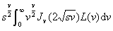

  </td>
 </tr>
 <tr style='height:50.95pt'>
  <td width=272 style='width:204.25pt;border-top:none;border-left:solid white 1.0pt;
  border-bottom:solid white 1.0pt;border-right:solid windowtext 1.0pt;
  padding:0mm 5.4pt 0mm 5.4pt;height:50.95pt'>
  
&nbsp; 

  </td>
  <td width=373 style='width:279.5pt;border-top:none;border-left:none;
  border-bottom:solid white 1.0pt;border-right:solid white 1.0pt;padding:0mm 5.4pt 0mm 5.4pt;
  height:50.95pt'>
  
&nbsp; 

  </td>
 </tr>
 <tr style='height:19.5pt'>
  <td width=272 style='width:204.25pt;border-top:none;border-left:solid white 1.0pt;
  border-bottom:solid white 1.0pt;border-right:solid windowtext 1.0pt;
  padding:0mm 5.4pt 0mm 5.4pt;height:19.5pt'>
  
&nbsp; 

  </td>
  <td width=373 style='width:279.5pt;border-top:none;border-left:none;
  border-bottom:solid white 1.0pt;border-right:solid white 1.0pt;padding:0mm 5.4pt 0mm 5.4pt;
  height:19.5pt'>
  
&nbsp;&nbsp; <i>L</i> (ln <i>s</i>)

  </td>
 </tr>
 <tr style='height:24.0pt'>
  <td width=272 valign=top style='width:204.25pt;border-top:none;border-left:
  solid white 1.0pt;border-bottom:solid white 1.0pt;border-right:solid windowtext 1.0pt;
  padding:0mm 5.4pt 0mm 5.4pt;height:24.0pt'>
  
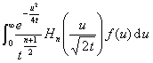

  
&nbsp;&nbsp;&nbsp;&nbsp;&nbsp;&nbsp;&nbsp;&nbsp;
  <b></b>

  </td>
  <td width=373 style='width:279.5pt;border-top:none;border-left:none;
  border-bottom:solid white 1.0pt;border-right:solid white 1.0pt;padding:0mm 5.4pt 0mm 5.4pt;
  height:24.0pt'>
  
&nbsp; 

  </td>
 </tr>
 <tr style='height:39.5pt'>
  <td width=272 style='width:204.25pt;border-top:none;border-left:solid white 1.0pt;
  border-bottom:solid white 1.0pt;border-right:solid windowtext 1.0pt;
  padding:0mm 5.4pt 0mm 5.4pt;height:39.5pt'>
  

  </td>
  <td width=373 style='width:279.5pt;border-top:none;border-left:none;
  border-bottom:solid white 1.0pt;border-right:solid white 1.0pt;padding:0mm 5.4pt 0mm 5.4pt;
  height:39.5pt'>
  
&nbsp; 

  </td>
 </tr>
 <tr style='height:27.0pt'>
  <td width=272 style='width:204.25pt;border-top:none;border-left:solid white 1.0pt;
  border-bottom:solid white 1.0pt;border-right:solid windowtext 1.0pt;
  padding:0mm 5.4pt 0mm 5.4pt;height:27.0pt'>
  

  </td>
  <td width=373 style='width:279.5pt;border-top:none;border-left:none;
  border-bottom:solid white 1.0pt;border-right:solid white 1.0pt;padding:0mm 5.4pt 0mm 5.4pt;
  height:27.0pt'>
  
&nbsp; 

  </td>
 </tr>
 <tr style='height:38.45pt'>
  <td width=272 valign=top style='width:204.25pt;border-top:none;border-left:
  solid white 1.0pt;border-bottom:solid windowtext 1.0pt;border-right:solid windowtext 1.0pt;
  padding:0mm 5.4pt 0mm 5.4pt;height:38.45pt'>
  

  </td>
  <td width=373 style='width:279.5pt;border-top:none;border-left:none;
  border-bottom:solid windowtext 1.0pt;border-right:solid white 1.0pt;
  padding:0mm 5.4pt 0mm 5.4pt;height:38.45pt'>
  
&nbsp; 

  </td>
 </tr>
</table>

［拉普拉斯变换表］

&nbsp;&nbsp;&nbsp; &nbsp;&nbsp;&nbsp;&nbsp;&nbsp;&nbsp;&nbsp;&nbsp;&nbsp;&nbsp;

&nbsp;&nbsp;&nbsp; &nbsp;&nbsp;&nbsp;&nbsp;&nbsp;&nbsp;

拉普拉斯变换表I

（已知函数查其拉普拉斯变换用此表方便）

<table class=MsoNormalTable border=1 cellspacing=0 cellpadding=0
 style='border-collapse:collapse;border:none'>
 <thead>
  <tr style='height:30.35pt'>
   <td width=272 style='width:204.25pt;border:solid windowtext 1.0pt;
   border-left:solid white 1.0pt;padding:0mm 5.4pt 0mm 5.4pt;height:30.35pt'>
   
<i>f</i> ( <i>t</i> )

   </td>
   <td width=373 style='width:279.5pt;border-top:solid windowtext 1.0pt;
   border-left:none;border-bottom:solid windowtext 1.0pt;border-right:solid white 1.0pt;
   padding:0mm 5.4pt 0mm 5.4pt;height:30.35pt'>
   
<i>L</i> ( <i>s</i> )

   </td>
  </tr>
 </thead>
 <tr style='height:1.2pt'>
  <td width=272 style='width:204.25pt;border-top:none;border-left:solid white 1.0pt;
  border-bottom:solid white 1.0pt;border-right:solid windowtext 1.0pt;
  padding:0mm 5.4pt 0mm 5.4pt;height:1.2pt'>
  

  </td>
  <td width=373 style='width:279.5pt;border-top:none;border-left:none;
  border-bottom:solid white 1.0pt;border-right:solid white 1.0pt;padding:0mm 5.4pt 0mm 5.4pt;
  height:1.2pt'>
  
1

  </td>
 </tr>
 <tr style='height:1.2pt'>
  <td width=272 style='width:204.25pt;border-top:none;border-left:solid white 1.0pt;
  border-bottom:solid white 1.0pt;border-right:solid windowtext 1.0pt;
  padding:0mm 5.4pt 0mm 5.4pt;height:1.2pt'>
  
&nbsp;&nbsp;&nbsp;&nbsp;&nbsp; &nbsp;&nbsp;&nbsp;&nbsp;&nbsp;&nbsp;&nbsp;&nbsp;&nbsp;(
  <i>c</i>&gt;0 )

  </td>
  <td width=373 style='width:279.5pt;border-top:none;border-left:none;
  border-bottom:solid white 1.0pt;border-right:solid white 1.0pt;padding:0mm 5.4pt 0mm 5.4pt;
  height:1.2pt'>
  
<i>e</i> – <i>c
  s</i> 

  </td>
 </tr>
 <tr style='height:1.2pt'>
  <td width=272 style='width:204.25pt;border-top:none;border-left:solid white 1.0pt;
  border-bottom:solid white 1.0pt;border-right:solid windowtext 1.0pt;
  padding:0mm 5.4pt 0mm 5.4pt;height:1.2pt'>
  
1

  </td>
  <td width=373 style='width:279.5pt;border-top:none;border-left:none;
  border-bottom:solid white 1.0pt;border-right:solid white 1.0pt;padding:0mm 5.4pt 0mm 5.4pt;
  height:1.2pt'>
  

  </td>
 </tr>
 <tr style='height:1.2pt'>
  <td width=272 style='width:204.25pt;border-top:none;border-left:solid white 1.0pt;
  border-bottom:solid white 1.0pt;border-right:solid windowtext 1.0pt;
  padding:0mm 5.4pt 0mm 5.4pt;height:1.2pt'>
  
<i>t</i>

  </td>
  <td width=373 style='width:279.5pt;border-top:none;border-left:none;
  border-bottom:solid white 1.0pt;border-right:solid white 1.0pt;padding:0mm 5.4pt 0mm 5.4pt;
  height:1.2pt'>
  

  </td>
 </tr>
 <tr style='height:1.2pt'>
  <td width=272 style='width:204.25pt;border-top:none;border-left:solid white 1.0pt;
  border-bottom:solid white 1.0pt;border-right:solid windowtext 1.0pt;
  padding:0mm 5.4pt 0mm 5.4pt;height:1.2pt'>
  
<i>t n</i>&nbsp;&nbsp;&nbsp;&nbsp;&nbsp;&nbsp;&nbsp;&nbsp;&nbsp;&nbsp;&nbsp;&nbsp;&nbsp;
  

  </td>
  <td width=373 style='width:279.5pt;border-top:none;border-left:none;
  border-bottom:solid white 1.0pt;border-right:solid white 1.0pt;padding:0mm 5.4pt 0mm 5.4pt;
  height:1.2pt'>
  

  </td>
 </tr>
 <tr style='height:1.2pt'>
  <td width=272 style='width:204.25pt;border-top:none;border-left:solid white 1.0pt;
  border-bottom:solid white 1.0pt;border-right:solid windowtext 1.0pt;
  padding:0mm 5.4pt 0mm 5.4pt;height:1.2pt'>
  
&nbsp;&nbsp;&nbsp;&nbsp;&nbsp;&nbsp;&nbsp;&nbsp;&nbsp;&nbsp;&nbsp;&nbsp;
  

  </td>
  <td width=373 style='width:279.5pt;border-top:none;border-left:none;
  border-bottom:solid white 1.0pt;border-right:solid white 1.0pt;padding:0mm 5.4pt 0mm 5.4pt;
  height:1.2pt'>
  

  </td>
 </tr>
 <tr style='height:1.2pt'>
  <td width=272 style='width:204.25pt;border-top:none;border-left:solid white 1.0pt;
  border-bottom:solid white 1.0pt;border-right:solid windowtext 1.0pt;
  padding:0mm 5.4pt 0mm 5.4pt;height:1.2pt'>
  
<i>t v</i>&nbsp;&nbsp;&nbsp;&nbsp;&nbsp;&nbsp;&nbsp;&nbsp;&nbsp;&nbsp;&nbsp;&nbsp;&nbsp;&nbsp;&nbsp;
  ( Re <i>v</i> &gt;)

  </td>
  <td width=373 style='width:279.5pt;border-top:none;border-left:none;
  border-bottom:solid white 1.0pt;border-right:solid white 1.0pt;padding:0mm 5.4pt 0mm 5.4pt;
  height:1.2pt'>
  

  </td>
 </tr>
 <tr style='height:1.2pt'>
  <td width=272 style='width:204.25pt;border-top:none;border-left:solid white 1.0pt;
  border-bottom:solid white 1.0pt;border-right:solid windowtext 1.0pt;
  padding:0mm 5.4pt 0mm 5.4pt;height:1.2pt'>
  

  </td>
  <td width=373 style='width:279.5pt;border-top:none;border-left:none;
  border-bottom:solid white 1.0pt;border-right:solid white 1.0pt;padding:0mm 5.4pt 0mm 5.4pt;
  height:1.2pt'>
  

  </td>
 </tr>
 <tr style='height:1.2pt'>
  <td width=272 style='width:204.25pt;border-top:none;border-left:solid white 1.0pt;
  border-bottom:solid white 1.0pt;border-right:solid windowtext 1.0pt;
  padding:0mm 5.4pt 0mm 5.4pt;height:1.2pt'>
  

  </td>
  <td width=373 style='width:279.5pt;border-top:none;border-left:none;
  border-bottom:solid white 1.0pt;border-right:solid white 1.0pt;padding:0mm 5.4pt 0mm 5.4pt;
  height:1.2pt'>
  

  </td>
 </tr>
 <tr style='height:1.2pt'>
  <td width=272 style='width:204.25pt;border-top:none;border-left:solid white 1.0pt;
  border-bottom:solid white 1.0pt;border-right:solid windowtext 1.0pt;
  padding:0mm 5.4pt 0mm 5.4pt;height:1.2pt'>
  
&nbsp;&nbsp;&nbsp;&nbsp;&nbsp;&nbsp;&nbsp; (<i>a</i>&gt; 0 )

  </td>
  <td width=373 style='width:279.5pt;border-top:none;border-left:none;
  border-bottom:solid white 1.0pt;border-right:solid white 1.0pt;padding:0mm 5.4pt 0mm 5.4pt;
  height:1.2pt'>
  

  </td>
 </tr>
 <tr style='height:1.2pt'>
  <td width=272 style='width:204.25pt;border-top:none;border-left:solid white 1.0pt;
  border-bottom:solid white 1.0pt;border-right:solid windowtext 1.0pt;
  padding:0mm 5.4pt 0mm 5.4pt;height:1.2pt'>
  
&nbsp;&nbsp;&nbsp; 

  </td>
  <td width=373 style='width:279.5pt;border-top:none;border-left:none;
  border-bottom:solid white 1.0pt;border-right:solid white 1.0pt;padding:0mm 5.4pt 0mm 5.4pt;
  height:1.2pt'>
  
&nbsp;&nbsp;&nbsp;&nbsp;&nbsp; 

  </td>
 </tr>
 <tr style='height:1.2pt'>
  <td width=272 style='width:204.25pt;border-top:none;border-left:solid white 1.0pt;
  border-bottom:solid white 1.0pt;border-right:solid windowtext 1.0pt;
  padding:0mm 5.4pt 0mm 5.4pt;height:1.2pt'>
  

  </td>
  <td width=373 style='width:279.5pt;border-top:none;border-left:none;
  border-bottom:solid white 1.0pt;border-right:solid white 1.0pt;padding:0mm 5.4pt 0mm 5.4pt;
  height:1.2pt'>
  

  </td>
 </tr>
 <tr style='height:1.2pt'>
  <td width=272 style='width:204.25pt;border-top:none;border-left:solid white 1.0pt;
  border-bottom:solid white 1.0pt;border-right:solid windowtext 1.0pt;
  padding:0mm 5.4pt 0mm 5.4pt;height:1.2pt'>
  

  </td>
  <td width=373 style='width:279.5pt;border-top:none;border-left:none;
  border-bottom:solid white 1.0pt;border-right:solid white 1.0pt;padding:0mm 5.4pt 0mm 5.4pt;
  height:1.2pt'>
  

  </td>
 </tr>
 <tr style='height:26.1pt'>
  <td width=272 style='width:204.25pt;border-top:none;border-left:solid white 1.0pt;
  border-bottom:solid white 1.0pt;border-right:solid windowtext 1.0pt;
  padding:0mm 5.4pt 0mm 5.4pt;height:26.1pt'>
  
&nbsp;&nbsp;&nbsp;&nbsp;&nbsp;&nbsp;&nbsp;&nbsp;&nbsp;&nbsp;&nbsp;&nbsp;&nbsp;&nbsp;
  (<i>a</i>&gt; 0 )

  </td>
  <td width=373 style='width:279.5pt;border-top:none;border-left:none;
  border-bottom:solid white 1.0pt;border-right:solid white 1.0pt;padding:0mm 5.4pt 0mm 5.4pt;
  height:26.1pt'>
  

  </td>
 </tr>
 <tr style='height:1.2pt'>
  <td width=272 style='width:204.25pt;border-top:none;border-left:solid white 1.0pt;
  border-bottom:solid white 1.0pt;border-right:solid windowtext 1.0pt;
  padding:0mm 5.4pt 0mm 5.4pt;height:1.2pt'>
  
&nbsp;&nbsp;&nbsp;&nbsp;&nbsp;&nbsp;&nbsp;&nbsp;&nbsp;&nbsp; (<i>a</i>&gt;
  0 )

  </td>
  <td width=373 style='width:279.5pt;border-top:none;border-left:none;
  border-bottom:solid white 1.0pt;border-right:solid white 1.0pt;padding:0mm 5.4pt 0mm 5.4pt;
  height:1.2pt'>
  

  </td>
 </tr>
 <tr style='height:1.2pt'>
  <td width=272 style='width:204.25pt;border-top:none;border-left:solid white 1.0pt;
  border-bottom:solid white 1.0pt;border-right:solid windowtext 1.0pt;
  padding:0mm 5.4pt 0mm 5.4pt;height:1.2pt'>
  
&nbsp;&nbsp;&nbsp;&nbsp;&nbsp;&nbsp;&nbsp;&nbsp;&nbsp;&nbsp;&nbsp;
  (<i>a</i>&gt; 0 )

  </td>
  <td width=373 style='width:279.5pt;border-top:none;border-left:none;
  border-bottom:solid white 1.0pt;border-right:solid white 1.0pt;padding:0mm 5.4pt 0mm 5.4pt;
  height:1.2pt'>
  

  </td>
 </tr>
 <tr style='height:1.2pt'>
  <td width=272 style='width:204.25pt;border-top:none;border-left:solid white 1.0pt;
  border-bottom:solid white 1.0pt;border-right:solid windowtext 1.0pt;
  padding:0mm 5.4pt 0mm 5.4pt;height:1.2pt'>
  
&nbsp;&nbsp;&nbsp;&nbsp;&nbsp;&nbsp;&nbsp;&nbsp;&nbsp;&nbsp;&nbsp;
  ( &gt; 0 )

  </td>
  <td width=373 style='width:279.5pt;border-top:none;border-left:none;
  border-bottom:solid white 1.0pt;border-right:solid white 1.0pt;padding:0mm 5.4pt 0mm 5.4pt;
  height:1.2pt'>
  

  </td>
 </tr>
 <tr style='height:1.2pt'>
  <td width=272 style='width:204.25pt;border-top:none;border-left:solid white 1.0pt;
  border-bottom:solid white 1.0pt;border-right:solid windowtext 1.0pt;
  padding:0mm 5.4pt 0mm 5.4pt;height:1.2pt'>
  
(<i>a</i>&gt;0)

  </td>
  <td width=373 style='width:279.5pt;border-top:none;border-left:none;
  border-bottom:solid white 1.0pt;border-right:solid white 1.0pt;padding:0mm 5.4pt 0mm 5.4pt;
  height:1.2pt'>
  

  </td>
 </tr>
 <tr style='height:1.2pt'>
  <td width=272 style='width:204.25pt;border-top:none;border-left:solid white 1.0pt;
  border-bottom:solid white 1.0pt;border-right:solid windowtext 1.0pt;
  padding:0mm 5.4pt 0mm 5.4pt;height:1.2pt'>
  

  </td>
  <td width=373 style='width:279.5pt;border-top:none;border-left:none;
  border-bottom:solid white 1.0pt;border-right:solid white 1.0pt;padding:0mm 5.4pt 0mm 5.4pt;
  height:1.2pt'>
  

  </td>
 </tr>
 <tr style='height:1.2pt'>
  <td width=272 style='width:204.25pt;border-top:none;border-left:solid white 1.0pt;
  border-bottom:solid white 1.0pt;border-right:solid windowtext 1.0pt;
  padding:0mm 5.4pt 0mm 5.4pt;height:1.2pt'>
  
( 2<i>t</i>
  + <i>t</i>2 ) <i>v</i>&nbsp;&nbsp;&nbsp;&nbsp; ( <i>a</i>&gt;0,
  Re<i> v</i>&gt;)

  </td>
  <td width=373 style='width:279.5pt;border-top:none;border-left:none;
  border-bottom:solid white 1.0pt;border-right:solid white 1.0pt;padding:0mm 5.4pt 0mm 5.4pt;
  height:1.2pt'>
  

  </td>
 </tr>
 <tr style='height:1.2pt'>
  <td width=272 style='width:204.25pt;border-top:none;border-left:solid white 1.0pt;
  border-bottom:solid white 1.0pt;border-right:solid windowtext 1.0pt;
  padding:0mm 5.4pt 0mm 5.4pt;height:1.2pt'>
  

  </td>
  <td width=373 style='width:279.5pt;border-top:none;border-left:none;
  border-bottom:solid white 1.0pt;border-right:solid white 1.0pt;padding:0mm 5.4pt 0mm 5.4pt;
  height:1.2pt'>
  

  </td>
 </tr>
 <tr style='height:1.8pt'>
  <td width=272 style='width:204.25pt;border-top:none;border-left:solid white 1.0pt;
  border-bottom:solid white 1.0pt;border-right:solid windowtext 1.0pt;
  padding:0mm 5.4pt 0mm 5.4pt;height:1.8pt'>
  

  </td>
  <td width=373 style='width:279.5pt;border-top:none;border-left:none;
  border-bottom:solid white 1.0pt;border-right:solid white 1.0pt;padding:0mm 5.4pt 0mm 5.4pt;
  height:1.8pt'>
  

  
&nbsp;&nbsp;&nbsp;&nbsp;&nbsp;&nbsp;&nbsp;&nbsp;&nbsp;&nbsp;&nbsp;&nbsp;&nbsp;&nbsp;
  &nbsp;&nbsp;&nbsp;&nbsp;&nbsp;&nbsp;&nbsp;&nbsp;&nbsp;

  </td>
 </tr>
 <tr style='height:1.2pt'>
  <td width=272 style='width:204.25pt;border-top:none;border-left:solid white 1.0pt;
  border-bottom:solid white 1.0pt;border-right:solid windowtext 1.0pt;
  padding:0mm 5.4pt 0mm 5.4pt;height:1.2pt'>
  

  </td>
  <td width=373 style='width:279.5pt;border-top:none;border-left:none;
  border-bottom:solid white 1.0pt;border-right:solid white 1.0pt;padding:0mm 5.4pt 0mm 5.4pt;
  height:1.2pt'>
  

  </td>
 </tr>
 <tr style='height:1.2pt'>
  <td width=272 style='width:204.25pt;border-top:none;border-left:solid white 1.0pt;
  border-bottom:solid white 1.0pt;border-right:solid windowtext 1.0pt;
  padding:0mm 5.4pt 0mm 5.4pt;height:1.2pt'>
  
&nbsp;&nbsp;&nbsp;&nbsp;&nbsp;&nbsp;&nbsp;&nbsp;&nbsp;&nbsp;&nbsp;&nbsp;
  ( <i>a</i> &gt; 0 )

  </td>
  <td width=373 style='width:279.5pt;border-top:none;border-left:none;
  border-bottom:solid white 1.0pt;border-right:solid white 1.0pt;padding:0mm 5.4pt 0mm 5.4pt;
  height:1.2pt'>
  

  </td>
 </tr>
 <tr style='height:1.2pt'>
  <td width=272 style='width:204.25pt;border-top:none;border-left:solid white 1.0pt;
  border-bottom:solid white 1.0pt;border-right:solid windowtext 1.0pt;
  padding:0mm 5.4pt 0mm 5.4pt;height:1.2pt'>
  
&nbsp;&nbsp;&nbsp;&nbsp;&nbsp;&nbsp;&nbsp;&nbsp;&nbsp;&nbsp; ( <i>a</i>
  &gt; 0 )

  </td>
  <td width=373 style='width:279.5pt;border-top:none;border-left:none;
  border-bottom:solid white 1.0pt;border-right:solid white 1.0pt;padding:0mm 5.4pt 0mm 5.4pt;
  height:1.2pt'>
  

  </td>
 </tr>
 <tr style='height:1.2pt'>
  <td width=272 style='width:204.25pt;border-top:none;border-left:solid white 1.0pt;
  border-bottom:solid white 1.0pt;border-right:solid windowtext 1.0pt;
  padding:0mm 5.4pt 0mm 5.4pt;height:1.2pt'>
  
&nbsp;&nbsp;&nbsp;&nbsp;&nbsp;&nbsp;&nbsp;&nbsp;&nbsp;&nbsp;&nbsp;&nbsp;
  ( <i>a</i> &gt; 0 )

  </td>
  <td width=373 style='width:279.5pt;border-top:none;border-left:none;
  border-bottom:solid white 1.0pt;border-right:solid white 1.0pt;padding:0mm 5.4pt 0mm 5.4pt;
  height:1.2pt'>
  

  </td>
 </tr>
 <tr style='height:1.2pt'>
  <td width=272 style='width:204.25pt;border-top:none;border-left:solid white 1.0pt;
  border-bottom:solid white 1.0pt;border-right:solid windowtext 1.0pt;
  padding:0mm 5.4pt 0mm 5.4pt;height:1.2pt'>
  
&nbsp;&nbsp;&nbsp;&nbsp;&nbsp;&nbsp;&nbsp;&nbsp;&nbsp;&nbsp;&nbsp;
  ( <i>a</i> &gt; 0 )

  </td>
  <td width=373 style='width:279.5pt;border-top:none;border-left:none;
  border-bottom:solid white 1.0pt;border-right:solid white 1.0pt;padding:0mm 5.4pt 0mm 5.4pt;
  height:1.2pt'>
  

  </td>
 </tr>
 <tr style='height:1.2pt'>
  <td width=272 style='width:204.25pt;border-top:none;border-left:solid white 1.0pt;
  border-bottom:solid white 1.0pt;border-right:solid windowtext 1.0pt;
  padding:0mm 5.4pt 0mm 5.4pt;height:1.2pt'>
  
&nbsp;&nbsp;&nbsp;&nbsp;&nbsp;&nbsp;&nbsp;&nbsp;&nbsp; ( <i>a</i>
  &gt; 0 )

  </td>
  <td width=373 style='width:279.5pt;border-top:none;border-left:none;
  border-bottom:solid white 1.0pt;border-right:solid white 1.0pt;padding:0mm 5.4pt 0mm 5.4pt;
  height:1.2pt'>
  

  </td>
 </tr>
 <tr style='height:1.2pt'>
  <td width=272 style='width:204.25pt;border-top:none;border-left:solid white 1.0pt;
  border-bottom:solid white 1.0pt;border-right:solid windowtext 1.0pt;
  padding:0mm 5.4pt 0mm 5.4pt;height:1.2pt'>
  
&nbsp;&nbsp;&nbsp;&nbsp;&nbsp;&nbsp;&nbsp;&nbsp;&nbsp;&nbsp; ( <i>a</i>
  &gt; 0 )

  </td>
  <td width=373 style='width:279.5pt;border-top:none;border-left:none;
  border-bottom:solid white 1.0pt;border-right:solid white 1.0pt;padding:0mm 5.4pt 0mm 5.4pt;
  height:1.2pt'>
  

  </td>
 </tr>
 <tr style='height:3.6pt'>
  <td width=272 style='width:204.25pt;border-top:none;border-left:solid white 1.0pt;
  border-bottom:solid white 1.0pt;border-right:solid black 1.0pt;padding:0mm 5.4pt 0mm 5.4pt;
  height:3.6pt'>
  
&nbsp;&nbsp;&nbsp;&nbsp;&nbsp;&nbsp;&nbsp;&nbsp;&nbsp;&nbsp; ( <i>a</i>
  &gt; 0 )

  </td>
  <td width=373 style='width:279.5pt;border-top:none;border-left:none;
  border-bottom:solid white 1.0pt;border-right:solid white 1.0pt;padding:0mm 5.4pt 0mm 5.4pt;
  height:3.6pt'>
  
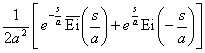

  </td>
 </tr>
 <tr style='height:2.65pt'>
  <td width=272 style='width:204.25pt;border-top:none;border-left:solid white 1.0pt;
  border-bottom:solid white 1.0pt;border-right:solid black 1.0pt;padding:0mm 5.4pt 0mm 5.4pt;
  height:2.65pt'>
  
&nbsp; &nbsp;&nbsp;&nbsp;&nbsp;&nbsp;&nbsp;&nbsp;&nbsp;&nbsp;&nbsp;&nbsp;(
  <i>a</i> &gt; 0 )

  </td>
  <td width=373 style='width:279.5pt;border-top:none;border-left:none;
  border-bottom:solid white 1.0pt;border-right:solid white 1.0pt;padding:0mm 5.4pt 0mm 5.4pt;
  height:2.65pt'>
  

  </td>
 </tr>
 <tr style='height:2.65pt'>
  <td width=272 style='width:204.25pt;border-top:none;border-left:solid white 1.0pt;
  border-bottom:solid white 1.0pt;border-right:solid black 1.0pt;padding:0mm 5.4pt 0mm 5.4pt;
  height:2.65pt'>
  
&nbsp; 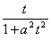&nbsp;&nbsp;&nbsp;&nbsp;&nbsp;&nbsp;&nbsp;&nbsp;&nbsp;&nbsp;&nbsp;(
  <i>a</i> &gt; 0 )

  </td>
  <td width=373 style='width:279.5pt;border-top:none;border-left:none;
  border-bottom:solid white 1.0pt;border-right:solid white 1.0pt;padding:0mm 5.4pt 0mm 5.4pt;
  height:2.65pt'>
  

  </td>
 </tr>
 <tr style='height:2.65pt'>
  <td width=272 style='width:204.25pt;border-top:none;border-left:solid white 1.0pt;
  border-bottom:solid white 1.0pt;border-right:solid black 1.0pt;padding:0mm 5.4pt 0mm 5.4pt;
  height:2.65pt'>
  
<i>ea t</i>

  </td>
  <td width=373 style='width:279.5pt;border-top:none;border-left:none;
  border-bottom:solid white 1.0pt;border-right:solid white 1.0pt;padding:0mm 5.4pt 0mm 5.4pt;
  height:2.65pt'>
  
&nbsp;&nbsp;&nbsp;&nbsp;&nbsp;&nbsp;&nbsp;&nbsp; 

  </td>
 </tr>
 <tr style='height:2.65pt'>
  <td width=272 style='width:204.25pt;border-top:none;border-left:solid white 1.0pt;
  border-bottom:solid white 1.0pt;border-right:solid black 1.0pt;padding:0mm 5.4pt 0mm 5.4pt;
  height:2.65pt'>
  
<i>tea t</i>

  </td>
  <td width=373 style='width:279.5pt;border-top:none;border-left:none;
  border-bottom:solid white 1.0pt;border-right:solid white 1.0pt;padding:0mm 5.4pt 0mm 5.4pt;
  height:2.65pt'>
  
&nbsp;&nbsp;&nbsp;&nbsp;&nbsp;&nbsp; 

  </td>
 </tr>
 <tr style='height:2.65pt'>
  <td width=272 style='width:204.25pt;border-top:none;border-left:solid white 1.0pt;
  border-bottom:solid white 1.0pt;border-right:solid black 1.0pt;padding:0mm 5.4pt 0mm 5.4pt;
  height:2.65pt'>
  
<i>t nea t&nbsp;&nbsp;&nbsp;&nbsp;&nbsp;&nbsp;&nbsp;&nbsp;&nbsp;
  </i>

  </td>
  <td width=373 style='width:279.5pt;border-top:none;border-left:none;
  border-bottom:solid white 1.0pt;border-right:solid white 1.0pt;padding:0mm 5.4pt 0mm 5.4pt;
  height:2.65pt'>
  
&nbsp;&nbsp;&nbsp;&nbsp;&nbsp; 

  </td>
 </tr>
 <tr style='height:2.65pt'>
  <td width=272 style='width:204.25pt;border-top:none;border-left:solid white 1.0pt;
  border-bottom:solid white 1.0pt;border-right:solid black 1.0pt;padding:0mm 5.4pt 0mm 5.4pt;
  height:2.65pt'>
  
<i>t vea t&nbsp;&nbsp;&nbsp;&nbsp;&nbsp;&nbsp;&nbsp;&nbsp;&nbsp;&nbsp;&nbsp;
  ( </i>Re<i> v &gt;</i><i>
  )</i>

  </td>
  <td width=373 style='width:279.5pt;border-top:none;border-left:none;
  border-bottom:solid white 1.0pt;border-right:solid white 1.0pt;padding:0mm 5.4pt 0mm 5.4pt;
  height:2.65pt'>
  
&nbsp;&nbsp;&nbsp;&nbsp;&nbsp; 

  </td>
 </tr>
 <tr style='height:2.65pt'>
  <td width=272 style='width:204.25pt;border-top:none;border-left:solid white 1.0pt;
  border-bottom:solid white 1.0pt;border-right:solid black 1.0pt;padding:0mm 5.4pt 0mm 5.4pt;
  height:2.65pt'>
  

  </td>
  <td width=373 style='width:279.5pt;border-top:none;border-left:none;
  border-bottom:solid white 1.0pt;border-right:solid white 1.0pt;padding:0mm 5.4pt 0mm 5.4pt;
  height:2.65pt'>
  
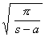&nbsp;&nbsp;&nbsp;&nbsp;&nbsp;&nbsp; 

  </td>
 </tr>
 <tr style='height:2.65pt'>
  <td width=272 style='width:204.25pt;border-top:none;border-left:solid white 1.0pt;
  border-bottom:solid white 1.0pt;border-right:solid black 1.0pt;padding:0mm 5.4pt 0mm 5.4pt;
  height:2.65pt'>
  
&nbsp;&nbsp;&nbsp;&nbsp;&nbsp;&nbsp;&nbsp;&nbsp;&nbsp;&nbsp;&nbsp;
  ( <i>a</i> &gt; 0 )

  </td>
  <td width=373 style='width:279.5pt;border-top:none;border-left:none;
  border-bottom:solid white 1.0pt;border-right:solid white 1.0pt;padding:0mm 5.4pt 0mm 5.4pt;
  height:2.65pt'>
  

  </td>
 </tr>
 <tr style='height:2.65pt'>
  <td width=272 style='width:204.25pt;border-top:none;border-left:solid white 1.0pt;
  border-bottom:solid white 1.0pt;border-right:solid black 1.0pt;padding:0mm 5.4pt 0mm 5.4pt;
  height:2.65pt'>
  
&nbsp;&nbsp;&nbsp;&nbsp;&nbsp;&nbsp;&nbsp;&nbsp;&nbsp;&nbsp;&nbsp;&nbsp;&nbsp;&nbsp;
  ( <i>a</i> &gt; 0 )

  </td>
  <td width=373 style='width:279.5pt;border-top:none;border-left:none;
  border-bottom:solid white 1.0pt;border-right:solid white 1.0pt;padding:0mm 5.4pt 0mm 5.4pt;
  height:2.65pt'>
  
&nbsp; 

  </td>
 </tr>
 <tr style='height:2.65pt'>
  <td width=272 style='width:204.25pt;border-top:none;border-left:solid white 1.0pt;
  border-bottom:solid white 1.0pt;border-right:solid black 1.0pt;padding:0mm 5.4pt 0mm 5.4pt;
  height:2.65pt'>
  
&nbsp;&nbsp;&nbsp;&nbsp;&nbsp;&nbsp;&nbsp;&nbsp;&nbsp;&nbsp;&nbsp;&nbsp;&nbsp;
  ( <i>a</i> &gt; 0 )

  </td>
  <td width=373 style='width:279.5pt;border-top:none;border-left:none;
  border-bottom:solid white 1.0pt;border-right:solid white 1.0pt;padding:0mm 5.4pt 0mm 5.4pt;
  height:2.65pt'>
  
&nbsp;&nbsp; 

  </td>
 </tr>
 <tr style='height:2.65pt'>
  <td width=272 style='width:204.25pt;border-top:none;border-left:solid white 1.0pt;
  border-bottom:solid white 1.0pt;border-right:solid black 1.0pt;padding:0mm 5.4pt 0mm 5.4pt;
  height:2.65pt'>
  
&nbsp;&nbsp;&nbsp;&nbsp;&nbsp;&nbsp;&nbsp;&nbsp;&nbsp;&nbsp;&nbsp;&nbsp;
  ( <i>a</i> &gt; 0 )

  </td>
  <td width=373 style='width:279.5pt;border-top:none;border-left:none;
  border-bottom:solid white 1.0pt;border-right:solid white 1.0pt;padding:0mm 5.4pt 0mm 5.4pt;
  height:2.65pt'>
  

  </td>
 </tr>
 <tr style='height:2.65pt'>
  <td width=272 style='width:204.25pt;border-top:none;border-left:solid white 1.0pt;
  border-bottom:solid white 1.0pt;border-right:solid black 1.0pt;padding:0mm 5.4pt 0mm 5.4pt;
  height:2.65pt'>
  
&nbsp;&nbsp;&nbsp;&nbsp;&nbsp;&nbsp;&nbsp;&nbsp;&nbsp;&nbsp;&nbsp;&nbsp;&nbsp;&nbsp;
  

  </td>
  <td width=373 style='width:279.5pt;border-top:none;border-left:none;
  border-bottom:solid white 1.0pt;border-right:solid white 1.0pt;padding:0mm 5.4pt 0mm 5.4pt;
  height:2.65pt'>
  

  </td>
 </tr>
 <tr style='height:2.65pt'>
  <td width=272 style='width:204.25pt;border-top:none;border-left:solid white 1.0pt;
  border-bottom:solid white 1.0pt;border-right:solid black 1.0pt;padding:0mm 5.4pt 0mm 5.4pt;
  height:2.65pt'>
  
&nbsp;&nbsp;&nbsp;&nbsp;&nbsp;&nbsp;&nbsp;&nbsp;&nbsp;&nbsp;&nbsp;&nbsp;&nbsp;&nbsp;
  ( <i>a</i> &gt; 0 )

  </td>
  <td width=373 style='width:279.5pt;border-top:none;border-left:none;
  border-bottom:solid white 1.0pt;border-right:solid white 1.0pt;padding:0mm 5.4pt 0mm 5.4pt;
  height:2.65pt'>
  

  </td>
 </tr>
 <tr style='height:2.65pt'>
  <td width=272 style='width:204.25pt;border-top:none;border-left:solid white 1.0pt;
  border-bottom:solid white 1.0pt;border-right:solid black 1.0pt;padding:0mm 5.4pt 0mm 5.4pt;
  height:2.65pt'>
  
&nbsp;&nbsp;&nbsp;&nbsp;&nbsp;&nbsp;&nbsp;&nbsp;&nbsp;&nbsp;&nbsp;&nbsp;&nbsp;&nbsp;
  ( <i>a</i> &gt; 0 )

  </td>
  <td width=373 style='width:279.5pt;border-top:none;border-left:none;
  border-bottom:solid white 1.0pt;border-right:solid white 1.0pt;padding:0mm 5.4pt 0mm 5.4pt;
  height:2.65pt'>
  

  </td>
 </tr>
 <tr style='height:20.55pt'>
  <td width=272 style='width:204.25pt;border-top:none;border-left:solid white 1.0pt;
  border-bottom:solid white 1.0pt;border-right:solid black 1.0pt;padding:0mm 5.4pt 0mm 5.4pt;
  height:20.55pt'>
  

  </td>
  <td width=373 style='width:279.5pt;border-top:none;border-left:none;
  border-bottom:solid white 1.0pt;border-right:solid white 1.0pt;padding:0mm 5.4pt 0mm 5.4pt;
  height:20.55pt'>
  
&nbsp;&nbsp;&nbsp;&nbsp;&nbsp;&nbsp;&nbsp;&nbsp;&nbsp; 

  </td>
 </tr>
 <tr style='height:2.65pt'>
  <td width=272 style='width:204.25pt;border-top:none;border-left:solid white 1.0pt;
  border-bottom:solid white 1.0pt;border-right:solid black 1.0pt;padding:0mm 5.4pt 0mm 5.4pt;
  height:2.65pt'>
  

  </td>
  <td width=373 style='width:279.5pt;border-top:none;border-left:none;
  border-bottom:solid white 1.0pt;border-right:solid white 1.0pt;padding:0mm 5.4pt 0mm 5.4pt;
  height:2.65pt'>
  
&nbsp;&nbsp;&nbsp;&nbsp;&nbsp;&nbsp;&nbsp;&nbsp;&nbsp; 

  </td>
 </tr>
 <tr style='height:2.65pt'>
  <td width=272 style='width:204.25pt;border-top:none;border-left:solid white 1.0pt;
  border-bottom:solid white 1.0pt;border-right:solid black 1.0pt;padding:0mm 5.4pt 0mm 5.4pt;
  height:2.65pt'>
  

  </td>
  <td width=373 style='width:279.5pt;border-top:none;border-left:none;
  border-bottom:solid white 1.0pt;border-right:solid white 1.0pt;padding:0mm 5.4pt 0mm 5.4pt;
  height:2.65pt'>
  

  </td>
 </tr>
 <tr style='height:2.65pt'>
  <td width=272 style='width:204.25pt;border-top:none;border-left:solid white 1.0pt;
  border-bottom:solid white 1.0pt;border-right:solid black 1.0pt;padding:0mm 5.4pt 0mm 5.4pt;
  height:2.65pt'>
  
&nbsp;&nbsp;&nbsp;&nbsp;&nbsp;&nbsp;&nbsp;&nbsp;&nbsp;&nbsp;&nbsp;&nbsp;&nbsp;&nbsp;
  ( <i>a</i> &gt; 0 )

  </td>
  <td width=373 style='width:279.5pt;border-top:none;border-left:none;
  border-bottom:solid white 1.0pt;border-right:solid white 1.0pt;padding:0mm 5.4pt 0mm 5.4pt;
  height:2.65pt'>
  

  </td>
 </tr>
 <tr style='height:2.65pt'>
  <td width=272 style='width:204.25pt;border-top:none;border-left:solid white 1.0pt;
  border-bottom:solid white 1.0pt;border-right:solid black 1.0pt;padding:0mm 5.4pt 0mm 5.4pt;
  height:2.65pt'>
  
&nbsp;&nbsp;&nbsp;&nbsp;&nbsp;&nbsp;&nbsp;&nbsp;&nbsp;&nbsp;&nbsp;&nbsp;&nbsp;&nbsp;
  ( <i>a</i> &gt; 0 )

  </td>
  <td width=373 style='width:279.5pt;border-top:none;border-left:none;
  border-bottom:solid white 1.0pt;border-right:solid white 1.0pt;padding:0mm 5.4pt 0mm 5.4pt;
  height:2.65pt'>
  

  </td>
 </tr>
 <tr style='height:2.65pt'>
  <td width=272 style='width:204.25pt;border-top:none;border-left:solid white 1.0pt;
  border-bottom:solid white 1.0pt;border-right:solid black 1.0pt;padding:0mm 5.4pt 0mm 5.4pt;
  height:2.65pt'>
  

  </td>
  <td width=373 style='width:279.5pt;border-top:none;border-left:none;
  border-bottom:solid white 1.0pt;border-right:solid white 1.0pt;padding:0mm 5.4pt 0mm 5.4pt;
  height:2.65pt'>
  
&nbsp; 

  
&nbsp;&nbsp;&nbsp;&nbsp;&nbsp;&nbsp;&nbsp;&nbsp;&nbsp;&nbsp;&nbsp;&nbsp;&nbsp;&nbsp;&nbsp;&nbsp;&nbsp;&nbsp;&nbsp;&nbsp;&nbsp;&nbsp;&nbsp;&nbsp;&nbsp;&nbsp;&nbsp;
  

  </td>
 </tr>
 <tr style='height:2.65pt'>
  <td width=272 style='width:204.25pt;border-top:none;border-left:solid white 1.0pt;
  border-bottom:solid white 1.0pt;border-right:solid black 1.0pt;padding:0mm 5.4pt 0mm 5.4pt;
  height:2.65pt'>
  
&nbsp;&nbsp;&nbsp;&nbsp;&nbsp;&nbsp;&nbsp;&nbsp; 

  </td>
  <td width=373 style='width:279.5pt;border-top:none;border-left:none;
  border-bottom:solid white 1.0pt;border-right:solid white 1.0pt;padding:0mm 5.4pt 0mm 5.4pt;
  height:2.65pt'>
  
&nbsp;&nbsp; 

  
&nbsp;&nbsp;&nbsp;&nbsp;&nbsp;&nbsp;&nbsp;&nbsp;&nbsp;&nbsp;&nbsp;&nbsp;&nbsp;&nbsp;&nbsp;&nbsp;&nbsp;&nbsp;&nbsp;&nbsp;&nbsp;&nbsp;&nbsp;&nbsp;&nbsp;&nbsp;&nbsp;
  

  </td>
 </tr>
 <tr style='height:2.1pt'>
  <td width=272 style='width:204.25pt;border-top:none;border-left:solid white 1.0pt;
  border-bottom:solid white 1.0pt;border-right:solid black 1.0pt;padding:0mm 5.4pt 0mm 5.4pt;
  height:2.1pt'>
  
&nbsp;&nbsp;&nbsp;&nbsp;&nbsp;&nbsp;&nbsp;&nbsp;&nbsp;
  ( Re <i>v</i> &gt; -1 )

  </td>
  <td width=373 style='width:279.5pt;border-top:none;border-left:none;
  border-bottom:solid white 1.0pt;border-right:solid white 1.0pt;padding:0mm 5.4pt 0mm 5.4pt;
  height:2.1pt'>
  

  </td>
 </tr>
 <tr style='height:1.15pt'>
  <td width=272 style='width:204.25pt;border-top:none;border-left:solid white 1.0pt;
  border-bottom:solid white 1.0pt;border-right:solid black 1.0pt;padding:0mm 5.4pt 0mm 5.4pt;
  height:1.15pt'>
  
&nbsp;&nbsp;&nbsp;&nbsp;&nbsp;&nbsp;&nbsp;&nbsp;&nbsp;
  ( Re <i>v</i> &gt; )

  </td>
  <td width=373 style='width:279.5pt;border-top:none;border-left:none;
  border-bottom:solid white 1.0pt;border-right:solid white 1.0pt;padding:0mm 5.4pt 0mm 5.4pt;
  height:1.15pt'>
  

  </td>
 </tr>
 <tr style='height:1.15pt'>
  <td width=272 style='width:204.25pt;border-top:none;border-left:solid white 1.0pt;
  border-bottom:solid white 1.0pt;border-right:solid black 1.0pt;padding:0mm 5.4pt 0mm 5.4pt;
  height:1.15pt'>
  

  </td>
  <td width=373 style='width:279.5pt;border-top:none;border-left:none;
  border-bottom:solid white 1.0pt;border-right:solid white 1.0pt;padding:0mm 5.4pt 0mm 5.4pt;
  height:1.15pt'>
  
&nbsp;&nbsp;&nbsp;&nbsp;&nbsp;&nbsp;&nbsp;&nbsp;&nbsp;&nbsp;&nbsp;&nbsp;&nbsp;&nbsp;&nbsp;&nbsp;&nbsp;&nbsp;
  

  </td>
 </tr>
 <tr style='height:1.15pt'>
  <td width=272 style='width:204.25pt;border-top:none;border-left:solid white 1.0pt;
  border-bottom:solid white 1.0pt;border-right:solid black 1.0pt;padding:0mm 5.4pt 0mm 5.4pt;
  height:1.15pt'>
  

  </td>
  <td width=373 style='width:279.5pt;border-top:none;border-left:none;
  border-bottom:solid white 1.0pt;border-right:solid white 1.0pt;padding:0mm 5.4pt 0mm 5.4pt;
  height:1.15pt'>
  
&nbsp;&nbsp;&nbsp;&nbsp;&nbsp;&nbsp;&nbsp;&nbsp;&nbsp;&nbsp;&nbsp;&nbsp;&nbsp;&nbsp;
  

  </td>
 </tr>
 <tr style='height:1.15pt'>
  <td width=272 style='width:204.25pt;border-top:none;border-left:solid white 1.0pt;
  border-bottom:solid white 1.0pt;border-right:solid black 1.0pt;padding:0mm 5.4pt 0mm 5.4pt;
  height:1.15pt'>
  

  </td>
  <td width=373 style='width:279.5pt;border-top:none;border-left:none;
  border-bottom:solid white 1.0pt;border-right:solid white 1.0pt;padding:0mm 5.4pt 0mm 5.4pt;
  height:1.15pt'>
  
&nbsp;&nbsp;&nbsp;&nbsp;&nbsp;&nbsp;&nbsp;&nbsp;&nbsp;
  

  </td>
 </tr>
 <tr style='height:1.15pt'>
  <td width=272 style='width:204.25pt;border-top:none;border-left:solid white 1.0pt;
  border-bottom:solid white 1.0pt;border-right:solid black 1.0pt;padding:0mm 5.4pt 0mm 5.4pt;
  height:1.15pt'>
  

  </td>
  <td width=373 style='width:279.5pt;border-top:none;border-left:none;
  border-bottom:solid white 1.0pt;border-right:solid white 1.0pt;padding:0mm 5.4pt 0mm 5.4pt;
  height:1.15pt'>
  
&nbsp;&nbsp;&nbsp;&nbsp;&nbsp;&nbsp;&nbsp;&nbsp;&nbsp;
  

  </td>
 </tr>
 <tr style='height:1.15pt'>
  <td width=272 style='width:204.25pt;border-top:none;border-left:solid white 1.0pt;
  border-bottom:solid white 1.0pt;border-right:solid black 1.0pt;padding:0mm 5.4pt 0mm 5.4pt;
  height:1.15pt'>
  

  </td>
  <td width=373 style='width:279.5pt;border-top:none;border-left:none;
  border-bottom:solid white 1.0pt;border-right:solid white 1.0pt;padding:0mm 5.4pt 0mm 5.4pt;
  height:1.15pt'>
  
&nbsp;&nbsp; 

  </td>
 </tr>
 <tr style='height:58.7pt'>
  <td width=272 style='width:204.25pt;border-top:none;border-left:solid white 1.0pt;
  border-bottom:none;border-right:solid black 1.0pt;padding:0mm 5.4pt 0mm 5.4pt;
  height:58.7pt'>
  

  </td>
  <td width=373 style='width:279.5pt;border:none;border-right:solid white 1.0pt;
  padding:0mm 5.4pt 0mm 5.4pt;height:58.7pt'>
  
&nbsp;&nbsp; 

  </td>
 </tr>
 <tr style='height:1.15pt'>
  <td width=272 style='width:204.25pt;border-top:none;border-left:solid white 1.0pt;
  border-bottom:solid white 1.0pt;border-right:solid black 1.0pt;background:
  white;padding:0mm 5.4pt 0mm 5.4pt;height:1.15pt'>
  

  </td>
  <td width=373 style='width:279.5pt;border-top:none;border-left:none;
  border-bottom:solid white 1.0pt;border-right:solid white 1.0pt;background:
  white;padding:0mm 5.4pt 0mm 5.4pt;height:1.15pt'>
  
&nbsp;

  
&nbsp;&nbsp;&nbsp;&nbsp;&nbsp;&nbsp;&nbsp;&nbsp;&nbsp;&nbsp;&nbsp;
  

  </td>
 </tr>
 <tr style='height:1.15pt'>
  <td width=272 style='width:204.25pt;border-top:none;border-left:solid white 1.0pt;
  border-bottom:solid white 1.0pt;border-right:solid black 1.0pt;padding:0mm 5.4pt 0mm 5.4pt;
  height:1.15pt'>
  

  </td>
  <td width=373 style='width:279.5pt;border-top:none;border-left:none;
  border-bottom:solid white 1.0pt;border-right:solid white 1.0pt;background:
  white;padding:0mm 5.4pt 0mm 5.4pt;height:1.15pt'>
  
&nbsp;&nbsp;&nbsp;&nbsp;&nbsp;&nbsp;&nbsp;&nbsp;&nbsp;
  

  </td>
 </tr>
 <tr style='height:1.15pt'>
  <td width=272 style='width:204.25pt;border-top:none;border-left:solid white 1.0pt;
  border-bottom:solid white 1.0pt;border-right:solid black 1.0pt;padding:0mm 5.4pt 0mm 5.4pt;
  height:1.15pt'>
  

  </td>
  <td width=373 style='width:279.5pt;border-top:none;border-left:none;
  border-bottom:solid white 1.0pt;border-right:solid white 1.0pt;padding:0mm 5.4pt 0mm 5.4pt;
  height:1.15pt'>
  

  </td>
 </tr>
 <tr style='height:1.15pt'>
  <td width=272 style='width:204.25pt;border-top:none;border-left:solid white 1.0pt;
  border-bottom:solid white 1.0pt;border-right:solid black 1.0pt;padding:0mm 5.4pt 0mm 5.4pt;
  height:1.15pt'>
  

  </td>
  <td width=373 style='width:279.5pt;border-top:none;border-left:none;
  border-bottom:solid white 1.0pt;border-right:solid white 1.0pt;padding:0mm 5.4pt 0mm 5.4pt;
  height:1.15pt'>
  

  </td>
 </tr>
 <tr style='height:1.15pt'>
  <td width=272 style='width:204.25pt;border-top:none;border-left:solid white 1.0pt;
  border-bottom:solid white 1.0pt;border-right:solid black 1.0pt;padding:0mm 5.4pt 0mm 5.4pt;
  height:1.15pt'>
  

  </td>
  <td width=373 style='width:279.5pt;border-top:none;border-left:none;
  border-bottom:solid white 1.0pt;border-right:solid white 1.0pt;padding:0mm 5.4pt 0mm 5.4pt;
  height:1.15pt'>
  

  </td>
 </tr>
 <tr style='height:1.15pt'>
  <td width=272 style='width:204.25pt;border-top:none;border-left:solid white 1.0pt;
  border-bottom:solid white 1.0pt;border-right:solid black 1.0pt;padding:0mm 5.4pt 0mm 5.4pt;
  height:1.15pt'>
  

  </td>
  <td width=373 style='width:279.5pt;border-top:none;border-left:none;
  border-bottom:solid white 1.0pt;border-right:solid white 1.0pt;padding:0mm 5.4pt 0mm 5.4pt;
  height:1.15pt'>
  

  </td>
 </tr>
 <tr style='height:1.15pt'>
  <td width=272 style='width:204.25pt;border-top:none;border-left:solid white 1.0pt;
  border-bottom:solid white 1.0pt;border-right:solid black 1.0pt;padding:0mm 5.4pt 0mm 5.4pt;
  height:1.15pt'>
  
&nbsp;&nbsp;&nbsp;&nbsp;&nbsp;&nbsp;
  ( <i>a</i> &gt; 0 )

  </td>
  <td width=373 style='width:279.5pt;border-top:none;border-left:none;
  border-bottom:solid white 1.0pt;border-right:solid white 1.0pt;padding:0mm 5.4pt 0mm 5.4pt;
  height:1.15pt'>
  

  </td>
 </tr>
 <tr style='height:1.15pt'>
  <td width=272 style='width:204.25pt;border-top:none;border-left:solid white 1.0pt;
  border-bottom:solid white 1.0pt;border-right:solid black 1.0pt;padding:0mm 5.4pt 0mm 5.4pt;
  height:1.15pt'>
  
&nbsp;&nbsp;&nbsp;&nbsp;&nbsp;&nbsp;
  ( <i>a</i> &gt; 0 )

  </td>
  <td width=373 style='width:279.5pt;border-top:none;border-left:none;
  border-bottom:solid white 1.0pt;border-right:solid white 1.0pt;padding:0mm 5.4pt 0mm 5.4pt;
  height:1.15pt'>
  

  </td>
 </tr>
 <tr style='height:1.15pt'>
  <td width=272 style='width:204.25pt;border-top:none;border-left:solid white 1.0pt;
  border-bottom:solid white 1.0pt;border-right:solid black 1.0pt;padding:0mm 5.4pt 0mm 5.4pt;
  height:1.15pt'>
  
&nbsp;&nbsp; 

  </td>
  <td width=373 style='width:279.5pt;border-top:none;border-left:none;
  border-bottom:solid white 1.0pt;border-right:solid white 1.0pt;padding:0mm 5.4pt 0mm 5.4pt;
  height:1.15pt'>
  

  </td>
 </tr>
 <tr style='height:1.15pt'>
  <td width=272 style='width:204.25pt;border-top:none;border-left:solid white 1.0pt;
  border-bottom:solid white 1.0pt;border-right:solid black 1.0pt;padding:0mm 5.4pt 0mm 5.4pt;
  height:1.15pt'>
  
&nbsp;&nbsp;&nbsp;&nbsp;&nbsp;&nbsp;
  ( <i>a</i> &gt; 0 )

  </td>
  <td width=373 style='width:279.5pt;border-top:none;border-left:none;
  border-bottom:solid white 1.0pt;border-right:solid white 1.0pt;padding:0mm 5.4pt 0mm 5.4pt;
  height:1.15pt'>
  

  </td>
 </tr>
 <tr style='height:1.15pt'>
  <td width=272 style='width:204.25pt;border-top:none;border-left:solid white 1.0pt;
  border-bottom:solid white 1.0pt;border-right:solid black 1.0pt;padding:0mm 5.4pt 0mm 5.4pt;
  height:1.15pt'>
  
&nbsp;&nbsp;&nbsp;&nbsp;&nbsp;&nbsp;
  ( <i>a</i> &gt; 0 )

  </td>
  <td width=373 style='width:279.5pt;border-top:none;border-left:none;
  border-bottom:solid white 1.0pt;border-right:solid white 1.0pt;padding:0mm 5.4pt 0mm 5.4pt;
  height:1.15pt'>
  

  </td>
 </tr>
 <tr style='height:1.15pt'>
  <td width=272 style='width:204.25pt;border-top:none;border-left:solid white 1.0pt;
  border-bottom:solid white 1.0pt;border-right:solid black 1.0pt;padding:0mm 5.4pt 0mm 5.4pt;
  height:1.15pt'>
  
&nbsp; 

  </td>
  <td width=373 style='width:279.5pt;border-top:none;border-left:none;
  border-bottom:solid white 1.0pt;border-right:solid white 1.0pt;padding:0mm 5.4pt 0mm 5.4pt;
  height:1.15pt'>
  
&nbsp; 

  </td>
 </tr>
 <tr style='height:1.15pt'>
  <td width=272 style='width:204.25pt;border-top:none;border-left:solid white 1.0pt;
  border-bottom:solid white 1.0pt;border-right:solid black 1.0pt;padding:0mm 5.4pt 0mm 5.4pt;
  height:1.15pt'>
  

  </td>
  <td width=373 style='width:279.5pt;border-top:none;border-left:none;
  border-bottom:solid white 1.0pt;border-right:solid white 1.0pt;padding:0mm 5.4pt 0mm 5.4pt;
  height:1.15pt'>
  
&nbsp;&nbsp;&nbsp;&nbsp;&nbsp;&nbsp;&nbsp;&nbsp;&nbsp;&nbsp;&nbsp;&nbsp;
  

  </td>
 </tr>
 <tr style='height:1.15pt'>
  <td width=272 style='width:204.25pt;border-top:none;border-left:solid white 1.0pt;
  border-bottom:solid white 1.0pt;border-right:solid black 1.0pt;padding:0mm 5.4pt 0mm 5.4pt;
  height:1.15pt'>
  

  </td>
  <td width=373 style='width:279.5pt;border-top:none;border-left:none;
  border-bottom:solid white 1.0pt;border-right:solid white 1.0pt;padding:0mm 5.4pt 0mm 5.4pt;
  height:1.15pt'>
  
&nbsp;&nbsp;&nbsp;&nbsp;&nbsp;&nbsp;&nbsp;&nbsp;&nbsp;&nbsp;&nbsp;&nbsp;
  

  </td>
 </tr>
 <tr style='height:1.7pt'>
  <td width=272 style='width:204.25pt;border-top:none;border-left:solid white 1.0pt;
  border-bottom:solid white 1.0pt;border-right:solid black 1.0pt;padding:0mm 5.4pt 0mm 5.4pt;
  height:1.7pt'>
  

  </td>
  <td width=373 style='width:279.5pt;border-top:none;border-left:none;
  border-bottom:solid white 1.0pt;border-right:solid white 1.0pt;padding:0mm 5.4pt 0mm 5.4pt;
  height:1.7pt'>
  

  </td>
 </tr>
 <tr style='height:1.7pt'>
  <td width=272 style='width:204.25pt;border-top:none;border-left:solid white 1.0pt;
  border-bottom:solid white 1.0pt;border-right:solid black 1.0pt;padding:0mm 5.4pt 0mm 5.4pt;
  height:1.7pt'>
  

  </td>
  <td width=373 style='width:279.5pt;border-top:none;border-left:none;
  border-bottom:solid white 1.0pt;border-right:solid white 1.0pt;padding:0mm 5.4pt 0mm 5.4pt;
  height:1.7pt'>
  

  </td>
 </tr>
 <tr style='height:1.7pt'>
  <td width=272 style='width:204.25pt;border-top:none;border-left:solid white 1.0pt;
  border-bottom:solid white 1.0pt;border-right:solid black 1.0pt;padding:0mm 5.4pt 0mm 5.4pt;
  height:1.7pt'>
  

  </td>
  <td width=373 style='width:279.5pt;border-top:none;border-left:none;
  border-bottom:solid white 1.0pt;border-right:solid white 1.0pt;padding:0mm 5.4pt 0mm 5.4pt;
  height:1.7pt'>
  

  </td>
 </tr>
 <tr style='height:1.7pt'>
  <td width=272 style='width:204.25pt;border-top:none;border-left:solid white 1.0pt;
  border-bottom:solid white 1.0pt;border-right:solid black 1.0pt;padding:0mm 5.4pt 0mm 5.4pt;
  height:1.7pt'>
  

  </td>
  <td width=373 style='width:279.5pt;border-top:none;border-left:none;
  border-bottom:solid white 1.0pt;border-right:solid white 1.0pt;padding:0mm 5.4pt 0mm 5.4pt;
  height:1.7pt'>
  

  </td>
 </tr>
 <tr style='height:1.7pt'>
  <td width=272 style='width:204.25pt;border-top:none;border-left:solid white 1.0pt;
  border-bottom:solid white 1.0pt;border-right:solid black 1.0pt;padding:0mm 5.4pt 0mm 5.4pt;
  height:1.7pt'>
  

  </td>
  <td width=373 style='width:279.5pt;border-top:none;border-left:none;
  border-bottom:solid white 1.0pt;border-right:solid white 1.0pt;padding:0mm 5.4pt 0mm 5.4pt;
  height:1.7pt'>
  

  </td>
 </tr>
 <tr style='height:1.7pt'>
  <td width=272 style='width:204.25pt;border-top:none;border-left:solid white 1.0pt;
  border-bottom:solid white 1.0pt;border-right:solid black 1.0pt;padding:0mm 5.4pt 0mm 5.4pt;
  height:1.7pt'>
  

  </td>
  <td width=373 style='width:279.5pt;border-top:none;border-left:none;
  border-bottom:solid white 1.0pt;border-right:solid white 1.0pt;padding:0mm 5.4pt 0mm 5.4pt;
  height:1.7pt'>
  
&nbsp;&nbsp;&nbsp;&nbsp;&nbsp;&nbsp;&nbsp;&nbsp;&nbsp;&nbsp;&nbsp;
  

  </td>
 </tr>
 <tr style='height:1.7pt'>
  <td width=272 style='width:204.25pt;border-top:none;border-left:solid white 1.0pt;
  border-bottom:solid white 1.0pt;border-right:solid black 1.0pt;padding:0mm 5.4pt 0mm 5.4pt;
  height:1.7pt'>
  

  </td>
  <td width=373 style='width:279.5pt;border-top:none;border-left:none;
  border-bottom:solid white 1.0pt;border-right:solid white 1.0pt;padding:0mm 5.4pt 0mm 5.4pt;
  height:1.7pt'>
  

  </td>
 </tr>
 <tr style='height:1.7pt'>
  <td width=272 style='width:204.25pt;border-top:none;border-left:solid white 1.0pt;
  border-bottom:solid white 1.0pt;border-right:solid black 1.0pt;padding:0mm 5.4pt 0mm 5.4pt;
  height:1.7pt'>
  

  </td>
  <td width=373 style='width:279.5pt;border-top:none;border-left:none;
  border-bottom:solid white 1.0pt;border-right:solid white 1.0pt;padding:0mm 5.4pt 0mm 5.4pt;
  height:1.7pt'>
  

  </td>
 </tr>
 <tr style='height:1.7pt'>
  <td width=272 style='width:204.25pt;border-top:none;border-left:solid white 1.0pt;
  border-bottom:solid white 1.0pt;border-right:solid black 1.0pt;padding:0mm 5.4pt 0mm 5.4pt;
  height:1.7pt'>
  
&nbsp;
  

  </td>
  <td width=373 style='width:279.5pt;border-top:none;border-left:none;
  border-bottom:solid white 1.0pt;border-right:solid white 1.0pt;padding:0mm 5.4pt 0mm 5.4pt;
  height:1.7pt'>
  
&nbsp; 

  </td>
 </tr>
 <tr style='height:1.7pt'>
  <td width=272 style='width:204.25pt;border-top:none;border-left:solid white 1.0pt;
  border-bottom:solid white 1.0pt;border-right:solid black 1.0pt;padding:0mm 5.4pt 0mm 5.4pt;
  height:1.7pt'>
  
&nbsp;
  

  </td>
  <td width=373 style='width:279.5pt;border-top:none;border-left:none;
  border-bottom:solid white 1.0pt;border-right:solid white 1.0pt;padding:0mm 5.4pt 0mm 5.4pt;
  height:1.7pt'>
  
&nbsp; 

  </td>
 </tr>
 <tr style='height:1.7pt'>
  <td width=272 style='width:204.25pt;border-top:none;border-left:solid white 1.0pt;
  border-bottom:solid white 1.0pt;border-right:solid black 1.0pt;padding:0mm 5.4pt 0mm 5.4pt;
  height:1.7pt'>
  
&nbsp;
  

  </td>
  <td width=373 style='width:279.5pt;border-top:none;border-left:none;
  border-bottom:solid white 1.0pt;border-right:solid white 1.0pt;padding:0mm 5.4pt 0mm 5.4pt;
  height:1.7pt'>
  
&nbsp; 

  </td>
 </tr>
 <tr style='height:1.7pt'>
  <td width=272 style='width:204.25pt;border-top:none;border-left:solid white 1.0pt;
  border-bottom:solid white 1.0pt;border-right:solid black 1.0pt;padding:0mm 5.4pt 0mm 5.4pt;
  height:1.7pt'>
  
&nbsp;
  

  </td>
  <td width=373 style='width:279.5pt;border-top:none;border-left:none;
  border-bottom:solid white 1.0pt;border-right:solid white 1.0pt;padding:0mm 5.4pt 0mm 5.4pt;
  height:1.7pt'>
  
&nbsp; 

  </td>
 </tr>
 <tr style='height:38.4pt'>
  <td width=272 style='width:204.25pt;border-top:none;border-left:solid white 1.0pt;
  border-bottom:solid white 1.0pt;border-right:solid black 1.0pt;padding:0mm 5.4pt 0mm 5.4pt;
  height:38.4pt'>
  
ln
  <i>t</i>

  </td>
  <td width=373 style='width:279.5pt;border-top:none;border-left:none;
  border-bottom:solid white 1.0pt;border-right:solid white 1.0pt;padding:0mm 5.4pt 0mm 5.4pt;
  height:38.4pt'>
  
&nbsp;&nbsp;&nbsp;&nbsp;&nbsp;&nbsp;&nbsp;&nbsp;
  (为欧拉常数）

  </td>
 </tr>
 <tr style='height:1.7pt'>
  <td width=272 style='width:204.25pt;border-top:none;border-left:solid white 1.0pt;
  border-bottom:solid white 1.0pt;border-right:solid black 1.0pt;padding:0mm 5.4pt 0mm 5.4pt;
  height:1.7pt'>
  
&nbsp;&nbsp;&nbsp;&nbsp;
  

  </td>
  <td width=373 style='width:279.5pt;border-top:none;border-left:none;
  border-bottom:solid white 1.0pt;border-right:solid white 1.0pt;padding:0mm 5.4pt 0mm 5.4pt;
  height:1.7pt'>
  

  </td>
 </tr>
 <tr style='height:1.7pt'>
  <td width=272 style='width:204.25pt;border-top:none;border-left:solid white 1.0pt;
  border-bottom:solid white 1.0pt;border-right:solid black 1.0pt;padding:0mm 5.4pt 0mm 5.4pt;
  height:1.7pt'>
  

  </td>
  <td width=373 style='width:279.5pt;border-top:none;border-left:none;
  border-bottom:solid white 1.0pt;border-right:solid white 1.0pt;padding:0mm 5.4pt 0mm 5.4pt;
  height:1.7pt'>
  

  </td>
 </tr>
 <tr style='height:1.7pt'>
  <td width=272 style='width:204.25pt;border-top:none;border-left:solid white 1.0pt;
  border-bottom:solid white 1.0pt;border-right:solid black 1.0pt;padding:0mm 5.4pt 0mm 5.4pt;
  height:1.7pt'>
  

  </td>
  <td width=373 style='width:279.5pt;border-top:none;border-left:none;
  border-bottom:solid white 1.0pt;border-right:solid white 1.0pt;padding:0mm 5.4pt 0mm 5.4pt;
  height:1.7pt'>
  

  </td>
 </tr>
 <tr style='height:1.7pt'>
  <td width=272 style='width:204.25pt;border-top:none;border-left:solid white 1.0pt;
  border-bottom:solid white 1.0pt;border-right:solid black 1.0pt;padding:0mm 5.4pt 0mm 5.4pt;
  height:1.7pt'>
  

  </td>
  <td width=373 style='width:279.5pt;border-top:none;border-left:none;
  border-bottom:solid white 1.0pt;border-right:solid white 1.0pt;padding:0mm 5.4pt 0mm 5.4pt;
  height:1.7pt'>
  

  </td>
 </tr>
 <tr style='height:1.7pt'>
  <td width=272 style='width:204.25pt;border-top:none;border-left:solid white 1.0pt;
  border-bottom:solid white 1.0pt;border-right:solid black 1.0pt;padding:0mm 5.4pt 0mm 5.4pt;
  height:1.7pt'>
  

  </td>
  <td width=373 style='width:279.5pt;border-top:none;border-left:none;
  border-bottom:solid white 1.0pt;border-right:solid white 1.0pt;padding:0mm 5.4pt 0mm 5.4pt;
  height:1.7pt'>
  
&nbsp;&nbsp;&nbsp;&nbsp;&nbsp;&nbsp;
  

  </td>
 </tr>
 <tr style='height:1.7pt'>
  <td width=272 style='width:204.25pt;border-top:none;border-left:solid white 1.0pt;
  border-bottom:solid white 1.0pt;border-right:solid black 1.0pt;padding:0mm 5.4pt 0mm 5.4pt;
  height:1.7pt'>
  
erf (<i>a</i>t)&nbsp;&nbsp;&nbsp;&nbsp;&nbsp;
  ( <i>a</i>&gt;0 )

  </td>
  <td width=373 style='width:279.5pt;border-top:none;border-left:none;
  border-bottom:solid white 1.0pt;border-right:solid white 1.0pt;padding:0mm 5.4pt 0mm 5.4pt;
  height:1.7pt'>
  

  </td>
 </tr>
 <tr style='height:1.7pt'>
  <td width=272 style='width:204.25pt;border-top:none;border-left:solid white 1.0pt;
  border-bottom:solid white 1.0pt;border-right:solid black 1.0pt;padding:0mm 5.4pt 0mm 5.4pt;
  height:1.7pt'>
  
&nbsp;&nbsp;&nbsp;&nbsp;&nbsp;
  ( <i>a</i>&gt; 0 )

  </td>
  <td width=373 style='width:279.5pt;border-top:none;border-left:none;
  border-bottom:solid white 1.0pt;border-right:solid white 1.0pt;padding:0mm 5.4pt 0mm 5.4pt;
  height:1.7pt'>
  
&nbsp;
  

  </td>
 </tr>
 <tr style='height:1.7pt'>
  <td width=272 style='width:204.25pt;border-top:none;border-left:solid white 1.0pt;
  border-bottom:solid white 1.0pt;border-right:solid black 1.0pt;padding:0mm 5.4pt 0mm 5.4pt;
  height:1.7pt'>
  
&nbsp;&nbsp;&nbsp;&nbsp;
  ( <i>a</i>&gt; 0 )

  </td>
  <td width=373 style='width:279.5pt;border-top:none;border-left:none;
  border-bottom:solid white 1.0pt;border-right:solid white 1.0pt;padding:0mm 5.4pt 0mm 5.4pt;
  height:1.7pt'>
  

  </td>
 </tr>
 <tr style='height:2.1pt'>
  <td width=272 style='width:204.25pt;border-top:none;border-left:solid white 1.0pt;
  border-bottom:solid white 1.0pt;border-right:solid windowtext 1.0pt;
  padding:0mm 5.4pt 0mm 5.4pt;height:2.1pt'>
  
&nbsp;&nbsp;&nbsp;&nbsp;&nbsp;
  ( <i>a</i>&gt; 0 )

  </td>
  <td width=373 style='width:279.5pt;border-top:none;border-left:none;
  border-bottom:solid white 1.0pt;border-right:solid white 1.0pt;padding:0mm 5.4pt 0mm 5.4pt;
  height:2.1pt'>
  

  </td>
 </tr>
 <tr style='height:2.1pt'>
  <td width=272 style='width:204.25pt;border-top:none;border-left:solid white 1.0pt;
  border-bottom:solid white 1.0pt;border-right:solid windowtext 1.0pt;
  padding:0mm 5.4pt 0mm 5.4pt;height:2.1pt'>
  
&nbsp;&nbsp;&nbsp;&nbsp;
  ( <i>a</i>&gt; 0 )

  </td>
  <td width=373 style='width:279.5pt;border-top:none;border-left:none;
  border-bottom:solid white 1.0pt;border-right:solid white 1.0pt;padding:0mm 5.4pt 0mm 5.4pt;
  height:2.1pt'>
  

  </td>
 </tr>
 <tr style='height:1.65pt'>
  <td width=272 style='width:204.25pt;border-top:none;border-left:solid white 1.0pt;
  border-bottom:solid white 1.0pt;border-right:solid windowtext 1.0pt;
  padding:0mm 5.4pt 0mm 5.4pt;height:1.65pt'>
  

  </td>
  <td width=373 style='width:279.5pt;border-top:none;border-left:none;
  border-bottom:solid white 1.0pt;border-right:solid white 1.0pt;padding:0mm 5.4pt 0mm 5.4pt;
  height:1.65pt'>
  

  </td>
 </tr>
 <tr style='height:1.65pt'>
  <td width=272 style='width:204.25pt;border-top:none;border-left:solid white 1.0pt;
  border-bottom:solid white 1.0pt;border-right:solid windowtext 1.0pt;
  padding:0mm 5.4pt 0mm 5.4pt;height:1.65pt'>
  
&nbsp;&nbsp;&nbsp;&nbsp;&nbsp;
  ( Re <i>v</i> &gt;-1 )

  </td>
  <td width=373 style='width:279.5pt;border-top:none;border-left:none;
  border-bottom:solid white 1.0pt;border-right:solid white 1.0pt;padding:0mm 5.4pt 0mm 5.4pt;
  height:1.65pt'>
  
&nbsp;&nbsp;&nbsp;&nbsp;&nbsp;&nbsp;&nbsp;&nbsp;
  

  </td>
 </tr>
 <tr style='height:1.65pt'>
  <td width=272 style='width:204.25pt;border-top:none;border-left:solid white 1.0pt;
  border-bottom:solid white 1.0pt;border-right:solid windowtext 1.0pt;
  padding:0mm 5.4pt 0mm 5.4pt;height:1.65pt'>
  
&nbsp;&nbsp;&nbsp;&nbsp;&nbsp;
  ( Re <i>v</i> &gt; 0 )

  </td>
  <td width=373 style='width:279.5pt;border-top:none;border-left:none;
  border-bottom:solid white 1.0pt;border-right:solid white 1.0pt;padding:0mm 5.4pt 0mm 5.4pt;
  height:1.65pt'>
  
&nbsp;&nbsp;&nbsp;&nbsp;&nbsp;&nbsp;&nbsp;&nbsp;
  

  </td>
 </tr>
 <tr style='height:1.65pt'>
  <td width=272 style='width:204.25pt;border-top:none;border-left:solid white 1.0pt;
  border-bottom:solid white 1.0pt;border-right:solid windowtext 1.0pt;
  padding:0mm 5.4pt 0mm 5.4pt;height:1.65pt'>
  
&nbsp;&nbsp;&nbsp; (
  Re <i>v</i> &gt; -2 )

  </td>
  <td width=373 style='width:279.5pt;border-top:none;border-left:none;
  border-bottom:solid white 1.0pt;border-right:solid white 1.0pt;padding:0mm 5.4pt 0mm 5.4pt;
  height:1.65pt'>
  
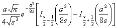

  </td>
 </tr>
 <tr style='height:1.65pt'>
  <td width=272 style='width:204.25pt;border-top:none;border-left:solid white 1.0pt;
  border-bottom:solid white 1.0pt;border-right:solid windowtext 1.0pt;
  padding:0mm 5.4pt 0mm 5.4pt;height:1.65pt'>
  
&nbsp;&nbsp; ( Re
  <i>v</i> &gt; -1 )

  </td>
  <td width=373 style='width:279.5pt;border-top:none;border-left:none;
  border-bottom:solid white 1.0pt;border-right:solid white 1.0pt;padding:0mm 5.4pt 0mm 5.4pt;
  height:1.65pt'>
  

  </td>
 </tr>
 <tr style='height:1.65pt'>
  <td width=272 style='width:204.25pt;border-top:none;border-left:solid white 1.0pt;
  border-bottom:solid white 1.0pt;border-right:solid windowtext 1.0pt;
  padding:0mm 5.4pt 0mm 5.4pt;height:1.65pt'>
  
&nbsp;&nbsp;&nbsp;&nbsp;&nbsp;&nbsp;
  ( Re <i>v</i> &gt; -1 )

  </td>
  <td width=373 style='width:279.5pt;border-top:none;border-left:none;
  border-bottom:solid white 1.0pt;border-right:solid white 1.0pt;padding:0mm 5.4pt 0mm 5.4pt;
  height:1.65pt'>
  
&nbsp;&nbsp;&nbsp;&nbsp;&nbsp;&nbsp;&nbsp;&nbsp;&nbsp;&nbsp;&nbsp;&nbsp;&nbsp;&nbsp;
  

  </td>
 </tr>
 <tr style='height:1.65pt'>
  <td width=272 style='width:204.25pt;border-top:none;border-left:solid white 1.0pt;
  border-bottom:solid white 1.0pt;border-right:solid windowtext 1.0pt;
  padding:0mm 5.4pt 0mm 5.4pt;height:1.65pt'>
  
&nbsp;( Re <i>v</i>
  &gt; -1 )

  </td>
  <td width=373 style='width:279.5pt;border-top:none;border-left:none;
  border-bottom:solid white 1.0pt;border-right:solid white 1.0pt;padding:0mm 5.4pt 0mm 5.4pt;
  height:1.65pt'>
  

  </td>
 </tr>
 <tr style='height:1.65pt'>
  <td width=272 style='width:204.25pt;border-top:none;border-left:solid white 1.0pt;
  border-bottom:solid white 1.0pt;border-right:solid windowtext 1.0pt;
  padding:0mm 5.4pt 0mm 5.4pt;height:1.65pt'>
  
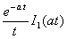

  </td>
  <td width=373 style='width:279.5pt;border-top:none;border-left:none;
  border-bottom:solid white 1.0pt;border-right:solid white 1.0pt;padding:0mm 5.4pt 0mm 5.4pt;
  height:1.65pt'>
  

  </td>
 </tr>
 <tr style='height:1.65pt'>
  <td width=272 style='width:204.25pt;border-top:none;border-left:solid white 1.0pt;
  border-bottom:solid white 1.0pt;border-right:solid windowtext 1.0pt;
  padding:0mm 5.4pt 0mm 5.4pt;height:1.65pt'>
  

  </td>
  <td width=373 style='width:279.5pt;border:none;border-right:solid white 1.0pt;
  padding:0mm 5.4pt 0mm 5.4pt;height:1.65pt'>
  

  </td>
 </tr>
 <tr style='height:1.65pt'>
  <td width=272 style='width:204.25pt;border-top:none;border-left:solid white 1.0pt;
  border-bottom:solid white 1.0pt;border-right:solid windowtext 1.0pt;
  padding:0mm 5.4pt 0mm 5.4pt;height:1.65pt'>
  

  </td>
  <td width=373 style='width:279.5pt;border-top:none;border-left:none;
  border-bottom:solid white 1.0pt;border-right:solid white 1.0pt;padding:0mm 5.4pt 0mm 5.4pt;
  height:1.65pt'>
  

  </td>
 </tr>
 <tr style='height:1.65pt'>
  <td width=272 style='width:204.25pt;border-top:none;border-left:solid white 1.0pt;
  border-bottom:solid windowtext 1.0pt;border-right:solid windowtext 1.0pt;
  padding:0mm 5.4pt 0mm 5.4pt;height:1.65pt'>
  
&nbsp;&nbsp;&nbsp; 

  </td>
  <td width=373 style='width:279.5pt;border-top:none;border-left:none;
  border-bottom:solid windowtext 1.0pt;border-right:solid white 1.0pt;
  padding:0mm 5.4pt 0mm 5.4pt;height:1.65pt'>
  

  </td>
 </tr>
</table>

拉普拉斯变换表 II

（已知函数的拉普拉斯变换查其原来函数用此表方便）

<table class=MsoNormalTable border=1 cellspacing=0 cellpadding=0
 style='border-collapse:collapse;border:none'>
 <thead>
  <tr style='height:30.75pt'>
   <td width=273 style='width:205.0pt;border:solid black 1.0pt;border-left:
   solid white 1.0pt;padding:0mm 5.4pt 0mm 5.4pt;height:30.75pt'>
   
<i>L</i> ( <i>s</i> )

   </td>
   <td width=373 style='width:279.5pt;border-top:solid black 1.0pt;border-left:
   none;border-bottom:solid black 1.0pt;border-right:solid white 1.0pt;
   padding:0mm 5.4pt 0mm 5.4pt;height:30.75pt'>
   
<i>f</i> ( <i>t</i> )

   </td>
  </tr>
 </thead>
 <tr style='height:1.2pt'>
  <td width=273 style='width:205.0pt;border-top:none;border-left:solid white 1.0pt;
  border-bottom:solid white 1.0pt;border-right:solid black 1.0pt;padding:0mm 5.4pt 0mm 5.4pt;
  height:1.2pt'>
  
&nbsp;&nbsp;&nbsp; 

  </td>
  <td width=373 style='width:279.5pt;border-top:none;border-left:none;
  border-bottom:solid white 1.0pt;border-right:solid white 1.0pt;padding:0mm 5.4pt 0mm 5.4pt;
  height:1.2pt'>
  

  </td>
 </tr>
 <tr style='height:1.2pt'>
  <td width=273 style='width:205.0pt;border-top:none;border-left:solid white 1.0pt;
  border-bottom:solid white 1.0pt;border-right:solid black 1.0pt;padding:0mm 5.4pt 0mm 5.4pt;
  height:1.2pt'>
  
&nbsp;&nbsp;&nbsp; 

  </td>
  <td width=373 style='width:279.5pt;border-top:none;border-left:none;
  border-bottom:solid white 1.0pt;border-right:solid white 1.0pt;padding:0mm 5.4pt 0mm 5.4pt;
  height:1.2pt'>
  

  </td>
 </tr>
 <tr style='height:1.2pt'>
  <td width=273 style='width:205.0pt;border-top:none;border-left:solid white 1.0pt;
  border-bottom:solid white 1.0pt;border-right:solid black 1.0pt;padding:0mm 5.4pt 0mm 5.4pt;
  height:1.2pt'>
  

  
&nbsp;&nbsp;&nbsp;&nbsp;&nbsp; （不等）

  </td>
  <td width=373 style='width:279.5pt;border-top:none;border-left:none;
  border-bottom:solid white 1.0pt;border-right:solid white 1.0pt;padding:0mm 5.4pt 0mm 5.4pt;
  height:1.2pt'>
  
&nbsp; 

  </td>
 </tr>
 <tr style='height:1.2pt'>
  <td width=273 style='width:205.0pt;border-top:none;border-left:solid white 1.0pt;
  border-bottom:solid white 1.0pt;border-right:solid black 1.0pt;padding:0mm 5.4pt 0mm 5.4pt;
  height:1.2pt'>
  
&nbsp;&nbsp;&nbsp;&nbsp;&nbsp; 

  </td>
  <td width=373 style='width:279.5pt;border-top:none;border-left:none;
  border-bottom:solid white 1.0pt;border-right:solid white 1.0pt;padding:0mm 5.4pt 0mm 5.4pt;
  height:1.2pt'>
  

  </td>
 </tr>
 <tr style='height:1.2pt'>
  <td width=273 style='width:205.0pt;border-top:none;border-left:solid white 1.0pt;
  border-bottom:solid white 1.0pt;border-right:solid black 1.0pt;padding:0mm 5.4pt 0mm 5.4pt;
  height:1.2pt'>
  
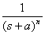&nbsp; 

  </td>
  <td width=373 style='width:279.5pt;border-top:none;border-left:none;
  border-bottom:solid white 1.0pt;border-right:solid white 1.0pt;padding:0mm 5.4pt 0mm 5.4pt;
  height:1.2pt'>
  

  </td>
 </tr>
 <tr style='height:1.2pt'>
  <td width=273 style='width:205.0pt;border-top:none;border-left:solid white 1.0pt;
  border-bottom:solid white 1.0pt;border-right:solid black 1.0pt;padding:0mm 5.4pt 0mm 5.4pt;
  height:1.2pt'>
  

  </td>
  <td width=373 style='width:279.5pt;border-top:none;border-left:none;
  border-bottom:solid white 1.0pt;border-right:solid white 1.0pt;padding:0mm 5.4pt 0mm 5.4pt;
  height:1.2pt'>
  

  </td>
 </tr>
 <tr style='height:1.2pt'>
  <td width=273 style='width:205.0pt;border-top:none;border-left:solid white 1.0pt;
  border-bottom:solid white 1.0pt;border-right:solid black 1.0pt;padding:0mm 5.4pt 0mm 5.4pt;
  height:1.2pt'>
  

  </td>
  <td width=373 style='width:279.5pt;border-top:none;border-left:none;
  border-bottom:solid white 1.0pt;border-right:solid white 1.0pt;padding:0mm 5.4pt 0mm 5.4pt;
  height:1.2pt'>
  

  </td>
 </tr>
 <tr style='height:1.2pt'>
  <td width=273 style='width:205.0pt;border-top:none;border-left:solid white 1.0pt;
  border-bottom:solid white 1.0pt;border-right:solid black 1.0pt;padding:0mm 5.4pt 0mm 5.4pt;
  height:1.2pt'>
  
&nbsp; 

  </td>
  <td width=373 style='width:279.5pt;border-top:none;border-left:none;
  border-bottom:solid white 1.0pt;border-right:solid white 1.0pt;padding:0mm 5.4pt 0mm 5.4pt;
  height:1.2pt'>
  

  </td>
 </tr>
 <tr style='height:1.2pt'>
  <td width=273 style='width:205.0pt;border-top:none;border-left:solid white 1.0pt;
  border-bottom:solid white 1.0pt;border-right:solid black 1.0pt;padding:0mm 5.4pt 0mm 5.4pt;
  height:1.2pt'>
  

  </td>
  <td width=373 style='width:279.5pt;border-top:none;border-left:none;
  border-bottom:solid white 1.0pt;border-right:solid white 1.0pt;padding:0mm 5.4pt 0mm 5.4pt;
  height:1.2pt'>
  

  </td>
 </tr>
 <tr style='height:1.2pt'>
  <td width=273 style='width:205.0pt;border-top:none;border-left:solid white 1.0pt;
  border-bottom:solid white 1.0pt;border-right:solid black 1.0pt;padding:0mm 5.4pt 0mm 5.4pt;
  height:1.2pt'>
  

  </td>
  <td width=373 style='width:279.5pt;border-top:none;border-left:none;
  border-bottom:solid white 1.0pt;border-right:solid white 1.0pt;padding:0mm 5.4pt 0mm 5.4pt;
  height:1.2pt'>
  

  </td>
 </tr>
 <tr style='height:1.2pt'>
  <td width=273 style='width:205.0pt;border-top:none;border-left:solid white 1.0pt;
  border-bottom:solid white 1.0pt;border-right:solid black 1.0pt;padding:0mm 5.4pt 0mm 5.4pt;
  height:1.2pt'>
  

  </td>
  <td width=373 style='width:279.5pt;border-top:none;border-left:none;
  border-bottom:solid white 1.0pt;border-right:solid white 1.0pt;padding:0mm 5.4pt 0mm 5.4pt;
  height:1.2pt'>
  

  </td>
 </tr>
 <tr style='height:1.2pt'>
  <td width=273 style='width:205.0pt;border-top:none;border-left:solid white 1.0pt;
  border-bottom:solid white 1.0pt;border-right:solid black 1.0pt;padding:0mm 5.4pt 0mm 5.4pt;
  height:1.2pt'>
  

  </td>
  <td width=373 style='width:279.5pt;border-top:none;border-left:none;
  border-bottom:solid white 1.0pt;border-right:solid white 1.0pt;padding:0mm 5.4pt 0mm 5.4pt;
  height:1.2pt'>
  

  </td>
 </tr>
 <tr style='height:1.2pt'>
  <td width=273 style='width:205.0pt;border-top:none;border-left:solid white 1.0pt;
  border-bottom:solid white 1.0pt;border-right:solid black 1.0pt;padding:0mm 5.4pt 0mm 5.4pt;
  height:1.2pt'>
  

  </td>
  <td width=373 style='width:279.5pt;border-top:none;border-left:none;
  border-bottom:solid white 1.0pt;border-right:solid white 1.0pt;padding:0mm 5.4pt 0mm 5.4pt;
  height:1.2pt'>
  

  </td>
 </tr>
 <tr style='height:1.2pt'>
  <td width=273 style='width:205.0pt;border-top:none;border-left:solid white 1.0pt;
  border-bottom:solid white 1.0pt;border-right:solid black 1.0pt;padding:0mm 5.4pt 0mm 5.4pt;
  height:1.2pt'>
  

  </td>
  <td width=373 style='width:279.5pt;border-top:none;border-left:none;
  border-bottom:solid white 1.0pt;border-right:solid white 1.0pt;padding:0mm 5.4pt 0mm 5.4pt;
  height:1.2pt'>
  

  </td>
 </tr>
 <tr style='height:1.2pt'>
  <td width=273 style='width:205.0pt;border-top:none;border-left:solid white 1.0pt;
  border-bottom:solid white 1.0pt;border-right:solid black 1.0pt;padding:0mm 5.4pt 0mm 5.4pt;
  height:1.2pt'>
  
&nbsp;

  </td>
  <td width=373 style='width:279.5pt;border-top:none;border-left:none;
  border-bottom:solid white 1.0pt;border-right:solid white 1.0pt;padding:0mm 5.4pt 0mm 5.4pt;
  height:1.2pt'>
  

  </td>
 </tr>
 <tr style='height:1.2pt'>
  <td width=273 style='width:205.0pt;border-top:none;border-left:solid white 1.0pt;
  border-bottom:solid white 1.0pt;border-right:solid black 1.0pt;padding:0mm 5.4pt 0mm 5.4pt;
  height:1.2pt'>
  

  </td>
  <td width=373 style='width:279.5pt;border-top:none;border-left:none;
  border-bottom:solid white 1.0pt;border-right:solid white 1.0pt;padding:0mm 5.4pt 0mm 5.4pt;
  height:1.2pt'>
  
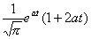

  </td>
 </tr>
 <tr style='height:1.2pt'>
  <td width=273 style='width:205.0pt;border-top:none;border-left:solid white 1.0pt;
  border-bottom:solid white 1.0pt;border-right:solid black 1.0pt;padding:0mm 5.4pt 0mm 5.4pt;
  height:1.2pt'>
  

  </td>
  <td width=373 style='width:279.5pt;border-top:none;border-left:none;
  border-bottom:solid white 1.0pt;border-right:solid white 1.0pt;padding:0mm 5.4pt 0mm 5.4pt;
  height:1.2pt'>
  

  </td>
 </tr>
 <tr style='height:1.2pt'>
  <td width=273 style='width:205.0pt;border-top:none;border-left:solid white 1.0pt;
  border-bottom:solid white 1.0pt;border-right:solid black 1.0pt;padding:0mm 5.4pt 0mm 5.4pt;
  height:1.2pt'>
  

  </td>
  <td width=373 style='width:279.5pt;border-top:none;border-left:none;
  border-bottom:solid white 1.0pt;border-right:solid white 1.0pt;padding:0mm 5.4pt 0mm 5.4pt;
  height:1.2pt'>
  
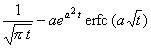

  </td>
 </tr>
 <tr style='height:1.2pt'>
  <td width=273 style='width:205.0pt;border-top:none;border-left:solid white 1.0pt;
  border-bottom:solid white 1.0pt;border-right:solid black 1.0pt;padding:0mm 5.4pt 0mm 5.4pt;
  height:1.2pt'>
  
&nbsp;&nbsp; 

  </td>
  <td width=373 style='width:279.5pt;border-top:none;border-left:none;
  border-bottom:solid white 1.0pt;border-right:solid white 1.0pt;padding:0mm 5.4pt 0mm 5.4pt;
  height:1.2pt'>
  

  </td>
 </tr>
 <tr style='height:1.2pt'>
  <td width=273 style='width:205.0pt;border-top:none;border-left:solid white 1.0pt;
  border-bottom:solid white 1.0pt;border-right:solid black 1.0pt;padding:0mm 5.4pt 0mm 5.4pt;
  height:1.2pt'>
  
&nbsp;

  </td>
  <td width=373 style='width:279.5pt;border-top:none;border-left:none;
  border-bottom:solid white 1.0pt;border-right:solid white 1.0pt;padding:0mm 5.4pt 0mm 5.4pt;
  height:1.2pt'>
  

  </td>
 </tr>
 <tr style='height:1.2pt'>
  <td width=273 style='width:205.0pt;border-top:none;border-left:solid white 1.0pt;
  border-bottom:solid white 1.0pt;border-right:solid black 1.0pt;padding:0mm 5.4pt 0mm 5.4pt;
  height:1.2pt'>
  
&nbsp;&nbsp;&nbsp;&nbsp; 

  </td>
  <td width=373 style='width:279.5pt;border-top:none;border-left:none;
  border-bottom:solid white 1.0pt;border-right:solid white 1.0pt;padding:0mm 5.4pt 0mm 5.4pt;
  height:1.2pt'>
  

  </td>
 </tr>
 <tr style='height:1.2pt'>
  <td width=273 style='width:205.0pt;border-top:none;border-left:solid white 1.0pt;
  border-bottom:solid white 1.0pt;border-right:solid black 1.0pt;padding:0mm 5.4pt 0mm 5.4pt;
  height:1.2pt'>
  
&nbsp;&nbsp;&nbsp;&nbsp; 

  </td>
  <td width=373 style='width:279.5pt;border-top:none;border-left:none;
  border-bottom:solid white 1.0pt;border-right:solid white 1.0pt;padding:0mm 5.4pt 0mm 5.4pt;
  height:1.2pt'>
  

  </td>
 </tr>
 <tr style='height:1.2pt'>
  <td width=273 style='width:205.0pt;border-top:none;border-left:solid white 1.0pt;
  border-bottom:solid white 1.0pt;border-right:solid black 1.0pt;padding:0mm 5.4pt 0mm 5.4pt;
  height:1.2pt'>
  
&nbsp;&nbsp;&nbsp; 

  </td>
  <td width=373 style='width:279.5pt;border-top:none;border-left:none;
  border-bottom:solid white 1.0pt;border-right:solid white 1.0pt;padding:0mm 5.4pt 0mm 5.4pt;
  height:1.2pt'>
  
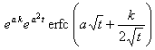&nbsp;&nbsp;&nbsp;&nbsp; 

  </td>
 </tr>
 <tr style='height:1.2pt'>
  <td width=273 style='width:205.0pt;border-top:none;border-left:solid white 1.0pt;
  border-bottom:solid white 1.0pt;border-right:solid black 1.0pt;padding:0mm 5.4pt 0mm 5.4pt;
  height:1.2pt'>
  

  </td>
  <td width=373 style='width:279.5pt;border-top:none;border-left:none;
  border-bottom:solid white 1.0pt;border-right:solid white 1.0pt;padding:0mm 5.4pt 0mm 5.4pt;
  height:1.2pt'>
  

  </td>
 </tr>
 <tr style='height:1.2pt'>
  <td width=273 style='width:205.0pt;border-top:none;border-left:solid white 1.0pt;
  border-bottom:solid white 1.0pt;border-right:solid black 1.0pt;padding:0mm 5.4pt 0mm 5.4pt;
  height:1.2pt'>
  
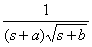

  </td>
  <td width=373 style='width:279.5pt;border-top:none;border-left:none;
  border-bottom:solid white 1.0pt;border-right:solid white 1.0pt;padding:0mm 5.4pt 0mm 5.4pt;
  height:1.2pt'>
  

  </td>
 </tr>
 <tr style='height:1.2pt'>
  <td width=273 style='width:205.0pt;border-top:none;border-left:solid white 1.0pt;
  border-bottom:solid white 1.0pt;border-right:solid black 1.0pt;padding:0mm 5.4pt 0mm 5.4pt;
  height:1.2pt'>
  

  </td>
  <td width=373 style='width:279.5pt;border-top:none;border-left:none;
  border-bottom:solid white 1.0pt;border-right:solid white 1.0pt;padding:0mm 5.4pt 0mm 5.4pt;
  height:1.2pt'>
  

  </td>
 </tr>
 <tr style='height:1.2pt'>
  <td width=273 style='width:205.0pt;border-top:none;border-left:solid white 1.0pt;
  border-bottom:solid white 1.0pt;border-right:solid black 1.0pt;padding:0mm 5.4pt 0mm 5.4pt;
  height:1.2pt'>
  

  </td>
  <td width=373 style='width:279.5pt;border-top:none;border-left:none;
  border-bottom:solid white 1.0pt;border-right:solid white 1.0pt;padding:0mm 5.4pt 0mm 5.4pt;
  height:1.2pt'>
  

  </td>
 </tr>
 <tr style='height:1.2pt'>
  <td width=273 style='width:205.0pt;border-top:none;border-left:solid white 1.0pt;
  border-bottom:solid white 1.0pt;border-right:solid black 1.0pt;padding:0mm 5.4pt 0mm 5.4pt;
  height:1.2pt'>
  
&nbsp;&nbsp; 

  </td>
  <td width=373 style='width:279.5pt;border-top:none;border-left:none;
  border-bottom:solid white 1.0pt;border-right:solid white 1.0pt;padding:0mm 5.4pt 0mm 5.4pt;
  height:1.2pt'>
  

  </td>
 </tr>
 <tr style='height:1.2pt'>
  <td width=273 style='width:205.0pt;border-top:none;border-left:solid white 1.0pt;
  border-bottom:solid white 1.0pt;border-right:solid black 1.0pt;padding:0mm 5.4pt 0mm 5.4pt;
  height:1.2pt'>
  
&nbsp;&nbsp; 

  </td>
  <td width=373 style='width:279.5pt;border-top:none;border-left:none;
  border-bottom:solid white 1.0pt;border-right:solid white 1.0pt;padding:0mm 5.4pt 0mm 5.4pt;
  height:1.2pt'>
  
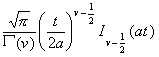

  </td>
 </tr>
 <tr style='height:31.55pt'>
  <td width=273 style='width:205.0pt;border-top:none;border-left:solid white 1.0pt;
  border-bottom:solid white 1.0pt;border-right:solid black 1.0pt;padding:0mm 5.4pt 0mm 5.4pt;
  height:31.55pt'>
  
&nbsp;&nbsp;&nbsp;&nbsp;&nbsp;&nbsp; 

  </td>
  <td width=373 style='width:279.5pt;border-top:none;border-left:none;
  border-bottom:solid white 1.0pt;border-right:solid white 1.0pt;padding:0mm 5.4pt 0mm 5.4pt;
  height:31.55pt'>
  

  </td>
 </tr>
 <tr style='height:44.8pt'>
  <td width=273 style='width:205.0pt;border-top:none;border-left:solid white 1.0pt;
  border-bottom:solid white 1.0pt;border-right:solid black 1.0pt;padding:0mm 5.4pt 0mm 5.4pt;
  height:44.8pt'>
  
&nbsp;&nbsp;&nbsp;&nbsp;&nbsp; 

  </td>
  <td width=373 style='width:279.5pt;border-top:none;border-left:none;
  border-bottom:solid white 1.0pt;border-right:solid white 1.0pt;padding:0mm 5.4pt 0mm 5.4pt;
  height:44.8pt'>
  

  </td>
 </tr>
 <tr style='height:31.25pt'>
  <td width=273 style='width:205.0pt;border-top:none;border-left:solid white 1.0pt;
  border-bottom:solid white 1.0pt;border-right:solid black 1.0pt;padding:0mm 5.4pt 0mm 5.4pt;
  height:31.25pt'>
  
&nbsp;&nbsp;&nbsp;&nbsp;&nbsp;&nbsp;&nbsp;&nbsp; 

  </td>
  <td width=373 style='width:279.5pt;border-top:none;border-left:none;
  border-bottom:solid white 1.0pt;border-right:solid white 1.0pt;padding:0mm 5.4pt 0mm 5.4pt;
  height:31.25pt'>
  
&nbsp;&nbsp;&nbsp;&nbsp;&nbsp;&nbsp; 

  </td>
 </tr>
 <tr style='height:29.35pt'>
  <td width=273 style='width:205.0pt;border-top:none;border-left:solid white 1.0pt;
  border-bottom:solid white 1.0pt;border-right:solid black 1.0pt;padding:0mm 5.4pt 0mm 5.4pt;
  height:29.35pt'>
  
&nbsp;&nbsp;&nbsp;&nbsp;&nbsp;&nbsp; 

  </td>
  <td width=373 style='width:279.5pt;border-top:none;border-left:none;
  border-bottom:solid white 1.0pt;border-right:solid white 1.0pt;padding:0mm 5.4pt 0mm 5.4pt;
  height:29.35pt'>
  

  </td>
 </tr>
 <tr style='height:1.2pt'>
  <td width=273 style='width:205.0pt;border-top:none;border-left:solid white 1.0pt;
  border-bottom:solid white 1.0pt;border-right:solid black 1.0pt;padding:0mm 5.4pt 0mm 5.4pt;
  height:1.2pt'>
  

  </td>
  <td width=373 style='width:279.5pt;border-top:none;border-left:none;
  border-bottom:solid white 1.0pt;border-right:solid white 1.0pt;padding:0mm 5.4pt 0mm 5.4pt;
  height:1.2pt'>
  

  </td>
 </tr>
 <tr style='height:1.2pt'>
  <td width=273 style='width:205.0pt;border-top:none;border-left:solid white 1.0pt;
  border-bottom:solid white 1.0pt;border-right:solid black 1.0pt;padding:0mm 5.4pt 0mm 5.4pt;
  height:1.2pt'>
  

  </td>
  <td width=373 style='width:279.5pt;border-top:none;border-left:none;
  border-bottom:solid white 1.0pt;border-right:solid white 1.0pt;padding:0mm 5.4pt 0mm 5.4pt;
  height:1.2pt'>
  

  </td>
 </tr>
 <tr style='height:1.2pt'>
  <td width=273 style='width:205.0pt;border-top:none;border-left:solid white 1.0pt;
  border-bottom:solid white 1.0pt;border-right:solid black 1.0pt;padding:0mm 5.4pt 0mm 5.4pt;
  height:1.2pt'>
  
&nbsp;&nbsp; 

  </td>
  <td width=373 style='width:279.5pt;border-top:none;border-left:none;
  border-bottom:solid white 1.0pt;border-right:solid white 1.0pt;padding:0mm 5.4pt 0mm 5.4pt;
  height:1.2pt'>
  

  </td>
 </tr>
 <tr style='height:1.2pt'>
  <td width=273 style='width:205.0pt;border-top:none;border-left:solid white 1.0pt;
  border-bottom:solid white 1.0pt;border-right:solid black 1.0pt;padding:0mm 5.4pt 0mm 5.4pt;
  height:1.2pt'>
  
&nbsp; 

  </td>
  <td width=373 style='width:279.5pt;border-top:none;border-left:none;
  border-bottom:solid white 1.0pt;border-right:solid white 1.0pt;padding:0mm 5.4pt 0mm 5.4pt;
  height:1.2pt'>
  

  </td>
 </tr>
 <tr style='height:1.2pt'>
  <td width=273 style='width:205.0pt;border-top:none;border-left:solid white 1.0pt;
  border-bottom:solid white 1.0pt;border-right:solid black 1.0pt;padding:0mm 5.4pt 0mm 5.4pt;
  height:1.2pt'>
  

  </td>
  <td width=373 style='width:279.5pt;border-top:none;border-left:none;
  border-bottom:solid white 1.0pt;border-right:solid white 1.0pt;padding:0mm 5.4pt 0mm 5.4pt;
  height:1.2pt'>
  
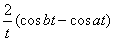

  </td>
 </tr>
 <tr style='height:1.2pt'>
  <td width=273 style='width:205.0pt;border-top:none;border-left:solid white 1.0pt;
  border-bottom:solid white 1.0pt;border-right:solid black 1.0pt;padding:0mm 5.4pt 0mm 5.4pt;
  height:1.2pt'>
  

  </td>
  <td width=373 style='width:279.5pt;border-top:none;border-left:none;
  border-bottom:solid white 1.0pt;border-right:solid white 1.0pt;padding:0mm 5.4pt 0mm 5.4pt;
  height:1.2pt'>
  

  </td>
 </tr>
 <tr style='height:15.75pt'>
  <td width=273 style='width:205.0pt;border-top:none;border-left:solid white 1.0pt;
  border-bottom:solid white 1.0pt;border-right:solid windowtext 1.0pt;
  padding:0mm 5.4pt 0mm 5.4pt;height:15.75pt'>
  
&nbsp;
  

  </td>
  <td width=373 style='width:279.5pt;border-top:none;border-left:none;
  border-bottom:solid white 1.0pt;border-right:solid white 1.0pt;padding:0mm 5.4pt 0mm 5.4pt;
  height:15.75pt'>
  

  
&nbsp; ()

  </td>
 </tr>
 <tr style='height:15.75pt'>
  <td width=273 style='width:205.0pt;border-top:none;border-left:solid white 1.0pt;
  border-bottom:solid white 1.0pt;border-right:solid windowtext 1.0pt;
  padding:0mm 5.4pt 0mm 5.4pt;height:15.75pt'>
  

  </td>
  <td width=373 style='width:279.5pt;border-top:none;border-left:none;
  border-bottom:solid white 1.0pt;border-right:solid white 1.0pt;padding:0mm 5.4pt 0mm 5.4pt;
  height:15.75pt'>
  

  </td>
 </tr>
 <tr style='height:15.75pt'>
  <td width=273 style='width:205.0pt;border-top:none;border-left:solid white 1.0pt;
  border-bottom:solid windowtext 1.0pt;border-right:solid windowtext 1.0pt;
  padding:0mm 5.4pt 0mm 5.4pt;height:15.75pt'>
  

  </td>
  <td width=373 style='width:279.5pt;border-top:none;border-left:none;
  border-bottom:solid windowtext 1.0pt;border-right:solid white 1.0pt;
  padding:0mm 5.4pt 0mm 5.4pt;height:15.75pt'>
  

  </td>
 </tr>
</table>

&nbsp;&nbsp;
&nbsp;[二重拉普拉斯变换及其反演公式]

&nbsp;&nbsp;&nbsp; 函数<i>f </i>(<i>x ,y</i>)的二重拉普拉斯变换为

&nbsp;&nbsp;&nbsp;
二重拉普拉斯变换的反演公式为

其中.

