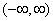
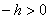

<b>§4&nbsp; </b><b>傅立叶变换</b>

一、&nbsp;&nbsp; 一、&nbsp;&nbsp;&nbsp;&nbsp;&nbsp;&nbsp;&nbsp; &nbsp;傅立叶积分

&nbsp;&nbsp;&nbsp;
[傅立叶积分]&nbsp; 在任一有限区间[-<i>l</i>, <i>l</i>]上绝对可积的函数，可以求出它的傅立叶级数(本章§1，二)

<pre>&nbsp;&nbsp;&nbsp;&nbsp;&nbsp;&nbsp;&nbsp;&nbsp;&nbsp;&nbsp;&nbsp;&nbsp;&nbsp;&nbsp;&nbsp;&nbsp;&nbsp;&nbsp; &nbsp;&nbsp;&nbsp;&nbsp;&nbsp;&nbsp;&nbsp;&nbsp;&nbsp;&nbsp;&nbsp;&nbsp;&nbsp;&nbsp;&nbsp;&nbsp;&nbsp;&nbsp;&nbsp;&nbsp;&nbsp;&nbsp;&nbsp;&nbsp;&nbsp;(1)</pre>

&nbsp;&nbsp;
&nbsp;设函数在无穷区间(- )上绝对可积，在(1)式中，令<i>l</i><i>，</i>得出<i>f</i> ( <i>x</i>
)的傅立叶积分

&nbsp;&nbsp;&nbsp; [傅立叶积分的几种形式]

&nbsp;&nbsp;&nbsp; 设的傅立叶积分满足收敛的条件，那末

&nbsp;&nbsp;&nbsp; 1o&nbsp; =

&nbsp;&nbsp;&nbsp; 2o&nbsp; =&nbsp; (外层积分理解为主值意义下的积分)

&nbsp;&nbsp;&nbsp; 3o&nbsp; 是偶函数：

= 

&nbsp;&nbsp;&nbsp; 4o&nbsp; 是奇函数：

= 

&nbsp;&nbsp;&nbsp; [傅立叶积分的收敛判别法]&nbsp;
设函数在上绝对可积，记积分(1)的假想值为<i>S</i>0.假设在点<i>x</i>0连续，或者<i>x</i>0是它的第一类间断点，并且在连续点<i>x</i>0处<i>S</i>0=，而在第一类间断点<i>x</i>0处，

<i>S</i>0=

&nbsp;&nbsp;&nbsp; 1o&nbsp; 狄尼判别法 令，如果对于某,积分

收敛，那末的傅立叶积分在点<i>x</i>0处收敛，并且等于<i>S</i>0.

&nbsp;&nbsp;&nbsp; 2o&nbsp; 狄利克莱-若当判别法&nbsp; 如果在以<i>x</i>0为中点的某一区间[<i>x</i>0-<i>h</i>,<i>x</i>0+<i>h</i>]上有有界变差，那末它的傅立叶积分在点<i>x</i>0处收敛，并且等于<i>S</i>0.

&nbsp;&nbsp;&nbsp; 3o&nbsp; 如果函数在上有有界变差，同时

那末的傅立叶积分在任一点<i>x</i>0处收敛，并且等于<i>S</i>0.

