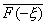
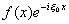
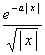
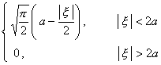
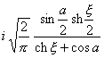
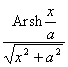

二、 傅立叶变换

&nbsp;&nbsp;&nbsp;
[傅立叶变换及其反演公式]&nbsp; 的傅立叶变换为

&nbsp;&nbsp;&nbsp; 傅立叶变换的反演公式为

&nbsp;&nbsp;&nbsp; [傅立叶变换的存在条件]&nbsp;
的傅立叶变换及反演公式在满足下面两个条件下有意义(只是在的间断点<i>x</i>0处，反演公式的左端应等于):

&nbsp;&nbsp;&nbsp; 1o&nbsp; 存在；

&nbsp;&nbsp;&nbsp;
2o&nbsp; 在上满足狄利克莱条件：只有有限个极值点，只有有限个第一类间断点.

&nbsp;&nbsp;&nbsp; [傅立叶变换的性质]&nbsp;
设,<i>g</i> ( <i>x</i> )的傅立叶变换分别是<i>F</i>(),<i>G</i>(),那末

&nbsp;&nbsp;&nbsp; 1o&nbsp; 线性&nbsp;&nbsp;&nbsp;&nbsp;&nbsp;&nbsp;&nbsp;&nbsp;&nbsp;&nbsp;
<i>a</i>+<i>b g</i> ( x )的傅立叶变换是<i>a F</i>()+<i>b G</i>()&nbsp; (<i>a</i>,<i>b</i>是常数)

&nbsp;&nbsp;&nbsp; 2o&nbsp; 褶积(或卷积)&nbsp;&nbsp;&nbsp;
<i>f</i> ( <i>x</i> )*g ( <i>x</i> )= 的傅立叶变换是

<i>F</i>()<i>G</i>()

&nbsp;&nbsp;&nbsp; 3o&nbsp; 帕塞法耳等式&nbsp;&nbsp;

&nbsp;&nbsp;&nbsp; 4o&nbsp; 翻转&nbsp;&nbsp;&nbsp;&nbsp;&nbsp;&nbsp;&nbsp;&nbsp;&nbsp;&nbsp;
<i>f</i> ( -<i>x</i> )的傅立叶变换是<i>F</i>( - ).

&nbsp;&nbsp;&nbsp; 5 o&nbsp; 共轭&nbsp;&nbsp;&nbsp;&nbsp;&nbsp;&nbsp;&nbsp;
&nbsp;&nbsp;&nbsp;&nbsp;的傅立叶变换是.

&nbsp;&nbsp;&nbsp; 6o&nbsp; 时移(延迟)&nbsp;&nbsp;
&nbsp;&nbsp;&nbsp;<i>f</i> ( <i>x</i>-<i>x</i>0 )的傅立叶变换是.

7o&nbsp; 频移(调频)&nbsp;&nbsp;
&nbsp;&nbsp;&nbsp;是的傅立叶变换 (是常数).

&nbsp;&nbsp;&nbsp; [傅立叶变换表]

&nbsp;&nbsp;&nbsp;&nbsp;&nbsp;&nbsp;&nbsp; &nbsp;，&nbsp; 

<table class=MsoNormalTable border=1 cellspacing=0 cellpadding=0
 style='border-collapse:collapse;border:none'>
 <thead>
  <tr style='height:30.75pt'>
   <td width=244 style='width:182.75pt;border:solid windowtext 1.0pt;
   border-left:solid white 1.0pt;padding:0mm 5.4pt 0mm 5.4pt;height:30.75pt'>
   

   </td>
   <td width=401 style='width:301.0pt;border-top:solid windowtext 1.0pt;
   border-left:none;border-bottom:solid windowtext 1.0pt;border-right:solid white 1.0pt;
   padding:0mm 5.4pt 0mm 5.4pt;height:30.75pt'>
   

   </td>
  </tr>
 </thead>
 <tr style='height:1.35pt'>
  <td width=244 style='width:182.75pt;border-top:none;border-left:solid white 1.0pt;
  border-bottom:solid white 1.0pt;border-right:solid windowtext 1.0pt;
  padding:0mm 5.4pt 0mm 5.4pt;height:1.35pt'>
  

  
&nbsp; 

  </td>
  <td width=401 style='width:301.0pt;border-top:none;border-left:none;
  border-bottom:solid white 1.0pt;border-right:solid white 1.0pt;padding:0mm 5.4pt 0mm 5.4pt;
  height:1.35pt'>
  

  </td>
 </tr>
 <tr style='height:1.35pt'>
  <td width=244 style='width:182.75pt;border-top:none;border-left:solid white 1.0pt;
  border-bottom:solid white 1.0pt;border-right:solid windowtext 1.0pt;
  padding:0mm 5.4pt 0mm 5.4pt;height:1.35pt'>
  
&nbsp;&nbsp;&nbsp;&nbsp;&nbsp;&nbsp;&nbsp;&nbsp;&nbsp;&nbsp;&nbsp;&nbsp;
  

  </td>
  <td width=401 style='width:301.0pt;border-top:none;border-left:none;
  border-bottom:solid white 1.0pt;border-right:solid white 1.0pt;padding:0mm 5.4pt 0mm 5.4pt;
  height:1.35pt'>
  
&nbsp;&nbsp;&nbsp;&nbsp;&nbsp;&nbsp;&nbsp;&nbsp;&nbsp;&nbsp;&nbsp;&nbsp;&nbsp;&nbsp;&nbsp;&nbsp;&nbsp;&nbsp;&nbsp;&nbsp;&nbsp;&nbsp;
  &nbsp;&nbsp;&nbsp;&nbsp;&nbsp;&nbsp;

  </td>
 </tr>
 <tr style='height:1.35pt'>
  <td width=244 style='width:182.75pt;border-top:none;border-left:solid white 1.0pt;
  border-bottom:solid white 1.0pt;border-right:solid windowtext 1.0pt;
  padding:0mm 5.4pt 0mm 5.4pt;height:1.35pt'>
  
&nbsp;&nbsp; &nbsp;&nbsp;&nbsp;&nbsp;&nbsp;&nbsp;&nbsp;&nbsp;&nbsp;

  </td>
  <td width=401 style='width:301.0pt;border-top:none;border-left:none;
  border-bottom:solid white 1.0pt;border-right:solid white 1.0pt;padding:0mm 5.4pt 0mm 5.4pt;
  height:1.35pt'>
  
&nbsp;&nbsp; &nbsp;&nbsp;&nbsp;&nbsp;&nbsp;&nbsp;&nbsp;&nbsp;&nbsp;&nbsp;&nbsp;&nbsp;&nbsp;&nbsp;&nbsp;&nbsp;&nbsp;&nbsp;&nbsp;&nbsp;&nbsp;&nbsp;&nbsp;&nbsp;

  </td>
 </tr>
 <tr style='height:1.35pt'>
  <td width=244 style='width:182.75pt;border-top:none;border-left:solid white 1.0pt;
  border-bottom:solid white 1.0pt;border-right:solid windowtext 1.0pt;
  padding:0mm 5.4pt 0mm 5.4pt;height:1.35pt'>
  

  </td>
  <td width=401 style='width:301.0pt;border-top:none;border-left:none;
  border-bottom:solid white 1.0pt;border-right:solid white 1.0pt;padding:0mm 5.4pt 0mm 5.4pt;
  height:1.35pt'>
  

  </td>
 </tr>
 <tr style='height:1.35pt'>
  <td width=244 style='width:182.75pt;border-top:none;border-left:solid white 1.0pt;
  border-bottom:solid white 1.0pt;border-right:solid windowtext 1.0pt;
  padding:0mm 5.4pt 0mm 5.4pt;height:1.35pt'>
  
&nbsp;&nbsp;&nbsp;&nbsp;&nbsp;&nbsp;&nbsp;
  

  </td>
  <td width=401 style='width:301.0pt;border-top:none;border-left:none;
  border-bottom:solid white 1.0pt;border-right:solid white 1.0pt;padding:0mm 5.4pt 0mm 5.4pt;
  height:1.35pt'>
  
&nbsp;&nbsp;&nbsp;&nbsp;&nbsp;&nbsp;&nbsp;&nbsp;&nbsp;&nbsp;&nbsp;&nbsp;&nbsp;&nbsp;&nbsp;
  

  </td>
 </tr>
 <tr style='height:1.35pt'>
  <td width=244 style='width:182.75pt;border-top:none;border-left:solid white 1.0pt;
  border-bottom:solid white 1.0pt;border-right:solid windowtext 1.0pt;
  padding:0mm 5.4pt 0mm 5.4pt;height:1.35pt'>
  
&nbsp; 

  </td>
  <td width=401 style='width:301.0pt;border-top:none;border-left:none;
  border-bottom:solid white 1.0pt;border-right:solid white 1.0pt;padding:0mm 5.4pt 0mm 5.4pt;
  height:1.35pt'>
  
&nbsp;&nbsp;&nbsp;&nbsp;&nbsp;&nbsp;&nbsp;&nbsp;&nbsp;
  

  </td>
 </tr>
 <tr style='height:1.35pt'>
  <td width=244 style='width:182.75pt;border-top:none;border-left:solid white 1.0pt;
  border-bottom:solid white 1.0pt;border-right:solid windowtext 1.0pt;
  padding:0mm 5.4pt 0mm 5.4pt;height:1.35pt'>
  
&nbsp;&nbsp;&nbsp;&nbsp;&nbsp;&nbsp;&nbsp;&nbsp;
  

  </td>
  <td width=401 style='width:301.0pt;border-top:none;border-left:none;
  border-bottom:solid white 1.0pt;border-right:solid white 1.0pt;padding:0mm 5.4pt 0mm 5.4pt;
  height:1.35pt'>
  

  </td>
 </tr>
 <tr style='height:1.35pt'>
  <td width=244 style='width:182.75pt;border-top:none;border-left:solid white 1.0pt;
  border-bottom:solid white 1.0pt;border-right:solid windowtext 1.0pt;
  padding:0mm 5.4pt 0mm 5.4pt;height:1.35pt'>
  
&nbsp;&nbsp;&nbsp;&nbsp;&nbsp;&nbsp;&nbsp;&nbsp;
  

  </td>
  <td width=401 style='width:301.0pt;border-top:none;border-left:none;
  border-bottom:solid white 1.0pt;border-right:solid white 1.0pt;padding:0mm 5.4pt 0mm 5.4pt;
  height:1.35pt'>
  

  </td>
 </tr>
 <tr style='height:1.35pt'>
  <td width=244 style='width:182.75pt;border-top:none;border-left:solid white 1.0pt;
  border-bottom:solid windowtext 1.0pt;border-right:solid windowtext 1.0pt;
  padding:0mm 5.4pt 0mm 5.4pt;height:1.35pt'>
  
&nbsp;&nbsp;&nbsp;&nbsp;&nbsp;&nbsp;&nbsp;&nbsp;
  

  </td>
  <td width=401 style='width:301.0pt;border-top:none;border-left:none;
  border-bottom:solid windowtext 1.0pt;border-right:solid white 1.0pt;
  padding:0mm 5.4pt 0mm 5.4pt;height:1.35pt'>
  

  </td>
 </tr>
 <tr style='height:1.35pt'>
  <td width=244 style='width:182.75pt;border-top:none;border-left:solid white 1.0pt;
  border-bottom:solid white 1.0pt;border-right:solid windowtext 1.0pt;
  padding:0mm 5.4pt 0mm 5.4pt;height:1.35pt'>
  

  </td>
  <td width=401 style='width:301.0pt;border-top:none;border-left:none;
  border-bottom:solid white 1.0pt;border-right:solid white 1.0pt;padding:0mm 5.4pt 0mm 5.4pt;
  height:1.35pt'>
  

  </td>
 </tr>
 <tr style='height:1.35pt'>
  <td width=244 style='width:182.75pt;border-top:none;border-left:solid white 1.0pt;
  border-bottom:solid white 1.0pt;border-right:solid windowtext 1.0pt;
  padding:0mm 5.4pt 0mm 5.4pt;height:1.35pt'>
  
&nbsp; 

  </td>
  <td width=401 style='width:301.0pt;border-top:none;border-left:none;
  border-bottom:solid white 1.0pt;border-right:solid white 1.0pt;padding:0mm 5.4pt 0mm 5.4pt;
  height:1.35pt'>
  

  </td>
 </tr>
 <tr style='height:1.35pt'>
  <td width=244 style='width:182.75pt;border-top:none;border-left:solid white 1.0pt;
  border-bottom:solid white 1.0pt;border-right:solid windowtext 1.0pt;
  padding:0mm 5.4pt 0mm 5.4pt;height:1.35pt'>
  

  </td>
  <td width=401 style='width:301.0pt;border-top:none;border-left:none;
  border-bottom:solid white 1.0pt;border-right:solid white 1.0pt;padding:0mm 5.4pt 0mm 5.4pt;
  height:1.35pt'>
  

  </td>
 </tr>
 <tr style='height:1.35pt'>
  <td width=244 style='width:182.75pt;border-top:none;border-left:solid white 1.0pt;
  border-bottom:none;border-right:solid windowtext 1.0pt;padding:0mm 5.4pt 0mm 5.4pt;
  height:1.35pt'>
  

  
&nbsp;&nbsp;&nbsp;&nbsp;&nbsp;&nbsp;&nbsp;&nbsp;&nbsp;&nbsp;&nbsp;&nbsp;&nbsp;
  

  </td>
  <td width=401 style='width:301.0pt;border:none;border-right:solid white 1.0pt;
  padding:0mm 5.4pt 0mm 5.4pt;height:1.35pt'>
  

  </td>
 </tr>
 <tr style='height:1.35pt'>
  <td width=244 style='width:182.75pt;border-top:none;border-left:solid white 1.0pt;
  border-bottom:solid white 1.0pt;border-right:solid windowtext 1.0pt;
  padding:0mm 5.4pt 0mm 5.4pt;height:1.35pt'>
  

  </td>
  <td width=401 style='width:301.0pt;border-top:none;border-left:none;
  border-bottom:solid white 1.0pt;border-right:solid white 1.0pt;padding:0mm 5.4pt 0mm 5.4pt;
  height:1.35pt'>
  

  </td>
 </tr>
 <tr style='height:1.35pt'>
  <td width=244 style='width:182.75pt;border-top:none;border-left:solid white 1.0pt;
  border-bottom:solid white 1.0pt;border-right:solid windowtext 1.0pt;
  padding:0mm 5.4pt 0mm 5.4pt;height:1.35pt'>
  
&nbsp;

  </td>
  <td width=401 style='width:301.0pt;border-top:none;border-left:none;
  border-bottom:solid white 1.0pt;border-right:solid white 1.0pt;padding:0mm 5.4pt 0mm 5.4pt;
  height:1.35pt'>
  

  </td>
 </tr>
 <tr style='height:1.35pt'>
  <td width=244 style='width:182.75pt;border-top:none;border-left:solid white 1.0pt;
  border-bottom:solid white 1.0pt;border-right:solid windowtext 1.0pt;
  padding:0mm 5.4pt 0mm 5.4pt;height:1.35pt'>
  
&nbsp;&nbsp;&nbsp;&nbsp;&nbsp;&nbsp;&nbsp;&nbsp;&nbsp;&nbsp;
  

  </td>
  <td width=401 style='width:301.0pt;border-top:none;border-left:none;
  border-bottom:solid white 1.0pt;border-right:solid white 1.0pt;padding:0mm 5.4pt 0mm 5.4pt;
  height:1.35pt'>
  

  </td>
 </tr>
 <tr style='height:1.35pt'>
  <td width=244 style='width:182.75pt;border-top:none;border-left:solid white 1.0pt;
  border-bottom:solid white 1.0pt;border-right:solid windowtext 1.0pt;
  padding:0mm 5.4pt 0mm 5.4pt;height:1.35pt'>
  
&nbsp;&nbsp;&nbsp;&nbsp;&nbsp;&nbsp;&nbsp;&nbsp;&nbsp;
  

  </td>
  <td width=401 style='width:301.0pt;border-top:none;border-left:none;
  border-bottom:solid white 1.0pt;border-right:solid white 1.0pt;padding:0mm 5.4pt 0mm 5.4pt;
  height:1.35pt'>
  

  </td>
 </tr>
 <tr style='height:1.35pt'>
  <td width=244 style='width:182.75pt;border-top:none;border-left:solid white 1.0pt;
  border-bottom:solid white 1.0pt;border-right:solid windowtext 1.0pt;
  padding:0mm 5.4pt 0mm 5.4pt;height:1.35pt'>
  
&nbsp;&nbsp;&nbsp;&nbsp;&nbsp;
  

  </td>
  <td width=401 style='width:301.0pt;border-top:none;border-left:none;
  border-bottom:solid white 1.0pt;border-right:solid white 1.0pt;padding:0mm 5.4pt 0mm 5.4pt;
  height:1.35pt'>
  

  </td>
 </tr>
 <tr style='height:1.35pt'>
  <td width=244 style='width:182.75pt;border-top:none;border-left:solid white 1.0pt;
  border-bottom:solid white 1.0pt;border-right:solid windowtext 1.0pt;
  padding:0mm 5.4pt 0mm 5.4pt;height:1.35pt'>
  
&nbsp;&nbsp;&nbsp;&nbsp;&nbsp;&nbsp;&nbsp;&nbsp;&nbsp;&nbsp;
  

  </td>
  <td width=401 style='width:301.0pt;border-top:none;border-left:none;
  border-bottom:solid white 1.0pt;border-right:solid white 1.0pt;padding:0mm 5.4pt 0mm 5.4pt;
  height:1.35pt'>
  

  </td>
 </tr>
 <tr style='height:1.35pt'>
  <td width=244 style='width:182.75pt;border-top:none;border-left:solid white 1.0pt;
  border-bottom:solid white 1.0pt;border-right:solid windowtext 1.0pt;
  padding:0mm 5.4pt 0mm 5.4pt;height:1.35pt'>
  
&nbsp;&nbsp;&nbsp;&nbsp;&nbsp;
  

  </td>
  <td width=401 style='width:301.0pt;border-top:none;border-left:none;
  border-bottom:solid white 1.0pt;border-right:solid white 1.0pt;padding:0mm 5.4pt 0mm 5.4pt;
  height:1.35pt'>
  

  </td>
 </tr>
 <tr style='height:1.35pt'>
  <td width=244 style='width:182.75pt;border-top:none;border-left:solid white 1.0pt;
  border-bottom:solid white 1.0pt;border-right:solid windowtext 1.0pt;
  padding:0mm 5.4pt 0mm 5.4pt;height:1.35pt'>
  
&nbsp;&nbsp;&nbsp;&nbsp;&nbsp;&nbsp;
  

  </td>
  <td width=401 style='width:301.0pt;border-top:none;border-left:none;
  border-bottom:solid white 1.0pt;border-right:solid white 1.0pt;padding:0mm 5.4pt 0mm 5.4pt;
  height:1.35pt'>
  

  </td>
 </tr>
 <tr style='height:1.35pt'>
  <td width=244 style='width:182.75pt;border-top:none;border-left:solid white 1.0pt;
  border-bottom:solid white 1.0pt;border-right:solid windowtext 1.0pt;
  padding:0mm 5.4pt 0mm 5.4pt;height:1.35pt'>
  
&nbsp;&nbsp;&nbsp;&nbsp;&nbsp;
  

  </td>
  <td width=401 style='width:301.0pt;border-top:none;border-left:none;
  border-bottom:solid white 1.0pt;border-right:solid white 1.0pt;padding:0mm 5.4pt 0mm 5.4pt;
  height:1.35pt'>
  

  </td>
 </tr>
 <tr style='height:1.35pt'>
  <td width=244 style='width:182.75pt;border-top:none;border-left:solid white 1.0pt;
  border-bottom:solid windowtext 1.0pt;border-right:solid windowtext 1.0pt;
  padding:0mm 5.4pt 0mm 5.4pt;height:1.35pt'>
  
&nbsp;&nbsp;&nbsp;&nbsp;&nbsp;&nbsp;&nbsp;&nbsp;
  &nbsp;

  </td>
  <td width=401 style='width:301.0pt;border-top:none;border-left:none;
  border-bottom:solid windowtext 1.0pt;border-right:solid white 1.0pt;
  padding:0mm 5.4pt 0mm 5.4pt;height:1.35pt'>
  

  </td>
 </tr>
 <tr style='height:1.35pt'>
  <td width=244 style='width:182.75pt;border-top:none;border-left:solid white 1.0pt;
  border-bottom:solid white 1.0pt;border-right:solid windowtext 1.0pt;
  padding:0mm 5.4pt 0mm 5.4pt;height:1.35pt'>
  
&nbsp;&nbsp;&nbsp;&nbsp;&nbsp;&nbsp;&nbsp;&nbsp;
  

  </td>
  <td width=401 style='width:301.0pt;border-top:none;border-left:none;
  border-bottom:solid white 1.0pt;border-right:solid white 1.0pt;padding:0mm 5.4pt 0mm 5.4pt;
  height:1.35pt'>
  

  </td>
 </tr>
 <tr style='height:1.35pt'>
  <td width=244 style='width:182.75pt;border-top:none;border-left:solid white 1.0pt;
  border-bottom:solid white 1.0pt;border-right:solid windowtext 1.0pt;
  padding:0mm 5.4pt 0mm 5.4pt;height:1.35pt'>
  
&nbsp;&nbsp;&nbsp;&nbsp;&nbsp;&nbsp;&nbsp;&nbsp;
  

  </td>
  <td width=401 style='width:301.0pt;border-top:none;border-left:none;
  border-bottom:solid white 1.0pt;border-right:solid white 1.0pt;padding:0mm 5.4pt 0mm 5.4pt;
  height:1.35pt'>
  

  </td>
 </tr>
 <tr style='height:1.35pt'>
  <td width=244 style='width:182.75pt;border-top:none;border-left:solid white 1.0pt;
  border-bottom:solid white 1.0pt;border-right:solid windowtext 1.0pt;
  padding:0mm 5.4pt 0mm 5.4pt;height:1.35pt'>
  
&nbsp;&nbsp;&nbsp; 

  </td>
  <td width=401 style='width:301.0pt;border-top:none;border-left:none;
  border-bottom:solid white 1.0pt;border-right:solid white 1.0pt;padding:0mm 5.4pt 0mm 5.4pt;
  height:1.35pt'>
  

  </td>
 </tr>
 <tr style='height:1.35pt'>
  <td width=244 style='width:182.75pt;border-top:none;border-left:solid white 1.0pt;
  border-bottom:none;border-right:solid windowtext 1.0pt;padding:0mm 5.4pt 0mm 5.4pt;
  height:1.35pt'>
  
&nbsp;&nbsp;&nbsp;&nbsp;&nbsp;&nbsp;&nbsp;&nbsp;
  &nbsp;

  </td>
  <td width=401 style='width:301.0pt;border:none;border-right:solid white 1.0pt;
  padding:0mm 5.4pt 0mm 5.4pt;height:1.35pt'>
  

  </td>
 </tr>
 <tr style='height:1.35pt'>
  <td width=244 style='width:182.75pt;border-top:none;border-left:solid white 1.0pt;
  border-bottom:solid white 1.0pt;border-right:solid windowtext 1.0pt;
  padding:0mm 5.4pt 0mm 5.4pt;height:1.35pt'>
  
&nbsp;&nbsp;&nbsp;&nbsp;&nbsp;&nbsp;&nbsp;&nbsp;&nbsp;
  

  </td>
  <td width=401 style='width:301.0pt;border-top:none;border-left:none;
  border-bottom:solid white 1.0pt;border-right:solid white 1.0pt;padding:0mm 5.4pt 0mm 5.4pt;
  height:1.35pt'>
  

  </td>
 </tr>
 <tr style='height:1.35pt'>
  <td width=244 style='width:182.75pt;border-top:none;border-left:solid white 1.0pt;
  border-bottom:solid white 1.0pt;border-right:solid windowtext 1.0pt;
  padding:0mm 5.4pt 0mm 5.4pt;height:1.35pt'>
  
&nbsp;&nbsp;&nbsp;&nbsp;&nbsp;&nbsp;&nbsp;&nbsp;&nbsp;
  

  </td>
  <td width=401 style='width:301.0pt;border-top:none;border-left:none;
  border-bottom:solid white 1.0pt;border-right:solid white 1.0pt;padding:0mm 5.4pt 0mm 5.4pt;
  height:1.35pt'>
  

  </td>
 </tr>
 <tr style='height:1.35pt'>
  <td width=244 style='width:182.75pt;border-top:none;border-left:solid white 1.0pt;
  border-bottom:solid white 1.0pt;border-right:solid windowtext 1.0pt;
  padding:0mm 5.4pt 0mm 5.4pt;height:1.35pt'>
  
&nbsp;&nbsp;&nbsp;&nbsp;&nbsp;&nbsp;&nbsp;&nbsp;&nbsp;
  

  </td>
  <td width=401 style='width:301.0pt;border-top:none;border-left:none;
  border-bottom:solid white 1.0pt;border-right:solid white 1.0pt;padding:0mm 5.4pt 0mm 5.4pt;
  height:1.35pt'>
  
&nbsp; 

  </td>
 </tr>
 <tr style='height:1.35pt'>
  <td width=244 style='width:182.75pt;border-top:none;border-left:solid white 1.0pt;
  border-bottom:solid white 1.0pt;border-right:solid windowtext 1.0pt;
  padding:0mm 5.4pt 0mm 5.4pt;height:1.35pt'>
  
&nbsp;

  </td>
  <td width=401 style='width:301.0pt;border-top:none;border-left:none;
  border-bottom:solid white 1.0pt;border-right:solid white 1.0pt;padding:0mm 5.4pt 0mm 5.4pt;
  height:1.35pt'>
  

  </td>
 </tr>
 <tr style='height:1.35pt'>
  <td width=244 style='width:182.75pt;border-top:none;border-left:solid white 1.0pt;
  border-bottom:solid white 1.0pt;border-right:solid windowtext 1.0pt;
  padding:0mm 5.4pt 0mm 5.4pt;height:1.35pt'>
  
&nbsp;

  </td>
  <td width=401 style='width:301.0pt;border-top:none;border-left:none;
  border-bottom:solid white 1.0pt;border-right:solid white 1.0pt;padding:0mm 5.4pt 0mm 5.4pt;
  height:1.35pt'>
  

  </td>
 </tr>
 <tr style='height:1.35pt'>
  <td width=244 style='width:182.75pt;border-top:none;border-left:solid white 1.0pt;
  border-bottom:solid white 1.0pt;border-right:solid windowtext 1.0pt;
  padding:0mm 5.4pt 0mm 5.4pt;height:1.35pt'>
  

  </td>
  <td width=401 style='width:301.0pt;border-top:none;border-left:none;
  border-bottom:solid white 1.0pt;border-right:solid white 1.0pt;padding:0mm 5.4pt 0mm 5.4pt;
  height:1.35pt'>
  

  </td>
 </tr>
 <tr style='height:80.05pt'>
  <td width=244 style='width:182.75pt;border-top:none;border-left:solid white 1.0pt;
  border-bottom:solid white 1.0pt;border-right:solid windowtext 1.0pt;
  padding:0mm 5.4pt 0mm 5.4pt;height:80.05pt'>
  

  </td>
  <td width=401 style='width:301.0pt;border-top:none;border-left:none;
  border-bottom:solid white 1.0pt;border-right:solid white 1.0pt;padding:0mm 5.4pt 0mm 5.4pt;
  height:80.05pt'>
  

  </td>
 </tr>
 <tr style='height:1.35pt'>
  <td width=244 style='width:182.75pt;border-top:none;border-left:solid white 1.0pt;
  border-bottom:solid windowtext 1.0pt;border-right:solid windowtext 1.0pt;
  padding:0mm 5.4pt 0mm 5.4pt;height:1.35pt'>
  

  </td>
  <td width=401 style='width:301.0pt;border-top:none;border-left:none;
  border-bottom:solid windowtext 1.0pt;border-right:solid white 1.0pt;
  padding:0mm 5.4pt 0mm 5.4pt;height:1.35pt'>
  

  </td>
 </tr>
 <tr style='height:1.35pt'>
  <td width=244 style='width:182.75pt;border-top:none;border-left:solid white 1.0pt;
  border-bottom:solid white 1.0pt;border-right:solid windowtext 1.0pt;
  padding:0mm 5.4pt 0mm 5.4pt;height:1.35pt'>
  

  </td>
  <td width=401 style='width:301.0pt;border-top:none;border-left:none;
  border-bottom:solid white 1.0pt;border-right:solid white 1.0pt;padding:0mm 5.4pt 0mm 5.4pt;
  height:1.35pt'>
  

  </td>
 </tr>
 <tr style='height:1.35pt'>
  <td width=244 style='width:182.75pt;border-top:none;border-left:solid white 1.0pt;
  border-bottom:none;border-right:solid windowtext 1.0pt;padding:0mm 5.4pt 0mm 5.4pt;
  height:1.35pt'>
  

  </td>
  <td width=401 style='width:301.0pt;border:none;border-right:solid white 1.0pt;
  padding:0mm 5.4pt 0mm 5.4pt;height:1.35pt'>
  

  </td>
 </tr>
 <tr style='height:1.35pt'>
  <td width=244 style='width:182.75pt;border-top:none;border-left:solid white 1.0pt;
  border-bottom:solid white 1.0pt;border-right:solid windowtext 1.0pt;
  padding:0mm 5.4pt 0mm 5.4pt;height:1.35pt'>
  
&nbsp;&nbsp;&nbsp;&nbsp;&nbsp;&nbsp;&nbsp;&nbsp;&nbsp;&nbsp;
  

  </td>
  <td width=401 style='width:301.0pt;border-top:none;border-left:none;
  border-bottom:solid white 1.0pt;border-right:solid white 1.0pt;padding:0mm 5.4pt 0mm 5.4pt;
  height:1.35pt'>
  

  </td>
 </tr>
 <tr style='height:1.35pt'>
  <td width=244 style='width:182.75pt;border-top:none;border-left:solid white 1.0pt;
  border-bottom:solid white 1.0pt;border-right:solid windowtext 1.0pt;
  padding:0mm 5.4pt 0mm 5.4pt;height:1.35pt'>
  
&nbsp;&nbsp;&nbsp;&nbsp;&nbsp;&nbsp;&nbsp;&nbsp;&nbsp;&nbsp;
  

  </td>
  <td width=401 style='width:301.0pt;border-top:none;border-left:none;
  border-bottom:solid white 1.0pt;border-right:solid white 1.0pt;padding:0mm 5.4pt 0mm 5.4pt;
  height:1.35pt'>
  

  </td>
 </tr>
 <tr style='height:1.35pt'>
  <td width=244 style='width:182.75pt;border-top:none;border-left:solid white 1.0pt;
  border-bottom:solid white 1.0pt;border-right:solid windowtext 1.0pt;
  padding:0mm 5.4pt 0mm 5.4pt;height:1.35pt'>
  
&nbsp;&nbsp;&nbsp;&nbsp;&nbsp;&nbsp;
  

  </td>
  <td width=401 style='width:301.0pt;border-top:none;border-left:none;
  border-bottom:solid white 1.0pt;border-right:solid white 1.0pt;padding:0mm 5.4pt 0mm 5.4pt;
  height:1.35pt'>
  

  </td>
 </tr>
 <tr style='height:1.35pt'>
  <td width=244 style='width:182.75pt;border-top:none;border-left:solid white 1.0pt;
  border-bottom:solid white 1.0pt;border-right:solid windowtext 1.0pt;
  padding:0mm 5.4pt 0mm 5.4pt;height:1.35pt'>
  
&nbsp;&nbsp;&nbsp;&nbsp;&nbsp;&nbsp;
  

  </td>
  <td width=401 style='width:301.0pt;border-top:none;border-left:none;
  border-bottom:solid white 1.0pt;border-right:solid white 1.0pt;padding:0mm 5.4pt 0mm 5.4pt;
  height:1.35pt'>
  

  </td>
 </tr>
 <tr style='height:1.35pt'>
  <td width=244 style='width:182.75pt;border-top:none;border-left:solid white 1.0pt;
  border-bottom:solid white 1.0pt;border-right:solid windowtext 1.0pt;
  padding:0mm 5.4pt 0mm 5.4pt;height:1.35pt'>
  
&nbsp;&nbsp;&nbsp;&nbsp;&nbsp;&nbsp;
  

  </td>
  <td width=401 style='width:301.0pt;border-top:none;border-left:none;
  border-bottom:solid white 1.0pt;border-right:solid white 1.0pt;padding:0mm 5.4pt 0mm 5.4pt;
  height:1.35pt'>
  

  </td>
 </tr>
 <tr style='height:1.35pt'>
  <td width=244 style='width:182.75pt;border-top:none;border-left:solid white 1.0pt;
  border-bottom:solid white 1.0pt;border-right:solid windowtext 1.0pt;
  padding:0mm 5.4pt 0mm 5.4pt;height:1.35pt'>
  
&nbsp;&nbsp;&nbsp;&nbsp;&nbsp;&nbsp;
  

  </td>
  <td width=401 style='width:301.0pt;border-top:none;border-left:none;
  border-bottom:solid white 1.0pt;border-right:solid white 1.0pt;padding:0mm 5.4pt 0mm 5.4pt;
  height:1.35pt'>
  

  </td>
 </tr>
 <tr style='height:1.35pt'>
  <td width=244 style='width:182.75pt;border-top:none;border-left:solid white 1.0pt;
  border-bottom:solid white 1.0pt;border-right:solid windowtext 1.0pt;
  padding:0mm 5.4pt 0mm 5.4pt;height:1.35pt'>
  

  </td>
  <td width=401 style='width:301.0pt;border-top:none;border-left:none;
  border-bottom:solid white 1.0pt;border-right:solid white 1.0pt;padding:0mm 5.4pt 0mm 5.4pt;
  height:1.35pt'>
  
&nbsp;&nbsp;
  (<i>g</i>为欧拉常数)

  </td>
 </tr>
 <tr style='height:1.35pt'>
  <td width=244 style='width:182.75pt;border-top:none;border-left:solid white 1.0pt;
  border-bottom:solid white 1.0pt;border-right:solid windowtext 1.0pt;
  padding:0mm 5.4pt 0mm 5.4pt;height:1.35pt'>
  

  </td>
  <td width=401 style='width:301.0pt;border-top:none;border-left:none;
  border-bottom:solid white 1.0pt;border-right:solid white 1.0pt;padding:0mm 5.4pt 0mm 5.4pt;
  height:1.35pt'>
  

  </td>
 </tr>
 <tr style='height:1.35pt'>
  <td width=244 style='width:182.75pt;border-top:none;border-left:solid white 1.0pt;
  border-bottom:solid white 1.0pt;border-right:solid windowtext 1.0pt;
  padding:0mm 5.4pt 0mm 5.4pt;height:1.35pt'>
  
&nbsp;&nbsp;&nbsp;&nbsp;&nbsp;&nbsp;
  

  </td>
  <td width=401 style='width:301.0pt;border-top:none;border-left:none;
  border-bottom:solid white 1.0pt;border-right:solid white 1.0pt;padding:0mm 5.4pt 0mm 5.4pt;
  height:1.35pt'>
  

  </td>
 </tr>
 <tr style='height:1.35pt'>
  <td width=244 style='width:182.75pt;border-top:none;border-left:solid white 1.0pt;
  border-bottom:solid white 1.0pt;border-right:solid windowtext 1.0pt;
  padding:0mm 5.4pt 0mm 5.4pt;height:1.35pt'>
  
&nbsp;&nbsp;&nbsp;&nbsp;&nbsp;&nbsp;&nbsp;&nbsp;
  

  </td>
  <td width=401 style='width:301.0pt;border-top:none;border-left:none;
  border-bottom:solid white 1.0pt;border-right:solid white 1.0pt;padding:0mm 5.4pt 0mm 5.4pt;
  height:1.35pt'>
  

  </td>
 </tr>
 <tr style='height:1.35pt'>
  <td width=244 style='width:182.75pt;border-top:none;border-left:solid white 1.0pt;
  border-bottom:solid windowtext 1.0pt;border-right:solid windowtext 1.0pt;
  padding:0mm 5.4pt 0mm 5.4pt;height:1.35pt'>
  
&nbsp;&nbsp;&nbsp;&nbsp;&nbsp;&nbsp;&nbsp;&nbsp;&nbsp;&nbsp;
  

  </td>
  <td width=401 style='width:301.0pt;border-top:none;border-left:none;
  border-bottom:solid windowtext 1.0pt;border-right:solid white 1.0pt;
  padding:0mm 5.4pt 0mm 5.4pt;height:1.35pt'>
  

  </td>
 </tr>
</table>

&nbsp;

