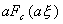
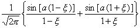

三、 傅立叶余弦变换

&nbsp;&nbsp;&nbsp; [傅立叶余弦变换及其反演公式]&nbsp;
<i>f</i> (<i>x</i>)的傅立叶余弦变换为

&nbsp;&nbsp;&nbsp; 傅立叶余弦变换的反演公式为

&nbsp;&nbsp;&nbsp; [傅立叶余弦变换的存在条件]&nbsp;
与傅立叶积分收敛条件相同.

&nbsp;&nbsp;&nbsp; [傅立叶余弦变换的性质]

&nbsp;&nbsp;&nbsp; 1o&nbsp; 如果是<i>f</i> (<i>x</i>)的傅立叶余弦变换，那末是的傅立叶余弦变换.

&nbsp;&nbsp;&nbsp; 2o&nbsp; 如果<i>f</i> (<i>x</i>)是偶函数，那末.

&nbsp;&nbsp;&nbsp; 3o&nbsp; &nbsp;(<i>a</i> &gt; 0)的傅立叶余弦变换是.

&nbsp;&nbsp;&nbsp; [傅立叶余弦变换表]

,&nbsp; 

<table class=MsoNormalTable border=1 cellspacing=0 cellpadding=0
 style='border-collapse:collapse;border:none'>
 <thead>
  <tr style='height:26.2pt'>
   <td width=258 style='width:193.5pt;border:solid windowtext 1.0pt;border-left:
   solid white 1.0pt;padding:0mm 5.4pt 0mm 5.4pt;height:26.2pt'>
   

   </td>
   <td width=387 style='width:290.25pt;border-top:solid windowtext 1.0pt;
   border-left:none;border-bottom:solid windowtext 1.0pt;border-right:solid white 1.0pt;
   padding:0mm 5.4pt 0mm 5.4pt;height:26.2pt'>
   

   </td>
  </tr>
 </thead>
 <tr style='height:18.3pt'>
  <td width=258 style='width:193.5pt;border-top:none;border-left:solid white 1.0pt;
  border-bottom:solid white 1.0pt;border-right:solid windowtext 1.0pt;
  padding:0mm 5.4pt 0mm 5.4pt;height:18.3pt'>
  

  </td>
  <td width=387 style='width:290.25pt;border-top:none;border-left:none;
  border-bottom:solid white 1.0pt;border-right:solid white 1.0pt;padding:0mm 5.4pt 0mm 5.4pt;
  height:18.3pt'>
  

  </td>
 </tr>
 <tr style='height:18.3pt'>
  <td width=258 style='width:193.5pt;border-top:none;border-left:solid white 1.0pt;
  border-bottom:solid white 1.0pt;border-right:solid windowtext 1.0pt;
  padding:0mm 5.4pt 0mm 5.4pt;height:18.3pt'>
  

  </td>
  <td width=387 style='width:290.25pt;border-top:none;border-left:none;
  border-bottom:solid white 1.0pt;border-right:solid white 1.0pt;padding:0mm 5.4pt 0mm 5.4pt;
  height:18.3pt'>
  

  </td>
 </tr>
 <tr style='height:18.3pt'>
  <td width=258 style='width:193.5pt;border-top:none;border-left:solid white 1.0pt;
  border-bottom:solid white 1.0pt;border-right:solid windowtext 1.0pt;
  padding:0mm 5.4pt 0mm 5.4pt;height:18.3pt'>
  

  </td>
  <td width=387 style='width:290.25pt;border-top:none;border-left:none;
  border-bottom:solid white 1.0pt;border-right:solid white 1.0pt;padding:0mm 5.4pt 0mm 5.4pt;
  height:18.3pt'>
  

  </td>
 </tr>
 <tr style='height:18.3pt'>
  <td width=258 style='width:193.5pt;border-top:none;border-left:solid white 1.0pt;
  border-bottom:solid white 1.0pt;border-right:solid windowtext 1.0pt;
  padding:0mm 5.4pt 0mm 5.4pt;height:18.3pt'>
  
&nbsp;&nbsp;&nbsp; 

  </td>
  <td width=387 style='width:290.25pt;border-top:none;border-left:none;
  border-bottom:solid white 1.0pt;border-right:solid white 1.0pt;padding:0mm 5.4pt 0mm 5.4pt;
  height:18.3pt'>
  

  </td>
 </tr>
 <tr style='height:18.3pt'>
  <td width=258 style='width:193.5pt;border-top:none;border-left:solid white 1.0pt;
  border-bottom:solid white 1.0pt;border-right:solid windowtext 1.0pt;
  padding:0mm 5.4pt 0mm 5.4pt;height:18.3pt'>
  
&nbsp;&nbsp;&nbsp;&nbsp;&nbsp;&nbsp;
  

  </td>
  <td width=387 style='width:290.25pt;border-top:none;border-left:none;
  border-bottom:solid white 1.0pt;border-right:solid white 1.0pt;padding:0mm 5.4pt 0mm 5.4pt;
  height:18.3pt'>
  

  </td>
 </tr>
 <tr style='height:18.3pt'>
  <td width=258 style='width:193.5pt;border-top:none;border-left:solid white 1.0pt;
  border-bottom:solid white 1.0pt;border-right:solid windowtext 1.0pt;
  padding:0mm 5.4pt 0mm 5.4pt;height:18.3pt'>
  
&nbsp;&nbsp;&nbsp;&nbsp;&nbsp;
  

  </td>
  <td width=387 style='width:290.25pt;border-top:none;border-left:none;
  border-bottom:solid white 1.0pt;border-right:solid white 1.0pt;padding:0mm 5.4pt 0mm 5.4pt;
  height:18.3pt'>
  

  </td>
 </tr>
 <tr style='height:18.3pt'>
  <td width=258 style='width:193.5pt;border-top:none;border-left:solid white 1.0pt;
  border-bottom:solid white 1.0pt;border-right:solid windowtext 1.0pt;
  padding:0mm 5.4pt 0mm 5.4pt;height:18.3pt'>
  
&nbsp;&nbsp;&nbsp;&nbsp;
  

  </td>
  <td width=387 style='width:290.25pt;border-top:none;border-left:none;
  border-bottom:solid white 1.0pt;border-right:solid white 1.0pt;padding:0mm 5.4pt 0mm 5.4pt;
  height:18.3pt'>
  

  </td>
 </tr>
 <tr style='height:18.3pt'>
  <td width=258 style='width:193.5pt;border-top:none;border-left:solid white 1.0pt;
  border-bottom:solid white 1.0pt;border-right:solid windowtext 1.0pt;
  padding:0mm 5.4pt 0mm 5.4pt;height:18.3pt'>
  
&nbsp;&nbsp;&nbsp;&nbsp;
  

  </td>
  <td width=387 style='width:290.25pt;border-top:none;border-left:none;
  border-bottom:solid white 1.0pt;border-right:solid white 1.0pt;padding:0mm 5.4pt 0mm 5.4pt;
  height:18.3pt'>
  

  </td>
 </tr>
 <tr style='height:18.3pt'>
  <td width=258 style='width:193.5pt;border-top:none;border-left:solid white 1.0pt;
  border-bottom:solid white 1.0pt;border-right:solid windowtext 1.0pt;
  padding:0mm 5.4pt 0mm 5.4pt;height:18.3pt'>
  

  </td>
  <td width=387 style='width:290.25pt;border-top:none;border-left:none;
  border-bottom:solid white 1.0pt;border-right:solid white 1.0pt;padding:0mm 5.4pt 0mm 5.4pt;
  height:18.3pt'>
  

  </td>
 </tr>
 <tr style='height:18.3pt'>
  <td width=258 style='width:193.5pt;border-top:none;border-left:solid white 1.0pt;
  border-bottom:solid windowtext 1.0pt;border-right:solid windowtext 1.0pt;
  padding:0mm 5.4pt 0mm 5.4pt;height:18.3pt'>
  

  </td>
  <td width=387 style='width:290.25pt;border-top:none;border-left:none;
  border-bottom:solid windowtext 1.0pt;border-right:solid white 1.0pt;
  padding:0mm 5.4pt 0mm 5.4pt;height:18.3pt'>
  

  </td>
 </tr>
</table>

&nbsp;

