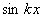

五、 有限傅立叶余弦变换

&nbsp;&nbsp;&nbsp; [有限傅立叶余弦变换及其反演公式]&nbsp; 设<i>f</i>(<i>x</i>)在区间内满足狄利克莱条件(见本节，二)，那末<i>f</i> (<i>x</i>)的有限傅立叶余弦变换为

&nbsp;&nbsp;&nbsp; 有限傅立叶余弦变换的反演公式为：

&nbsp;&nbsp;&nbsp; 在区间内<i>f</i> (<i>x</i>)的每一连续点处

在间断点，等式左端改为.

&nbsp;&nbsp;&nbsp; [有限傅立叶余弦变换表]

，&nbsp;&nbsp; 

<table class=MsoNormalTable border=1 cellspacing=0 cellpadding=0
 style='border-collapse:collapse;border:none'>
 <thead>
  <tr style='height:27.6pt'>
   <td width=246 style='width:184.25pt;border:solid black 1.0pt;border-left:
   solid white 1.0pt;padding:0mm 5.4pt 0mm 5.4pt;height:27.6pt'>
   

   </td>
   <td width=401 style='width:301.0pt;border-top:solid black 1.0pt;border-left:
   none;border-bottom:solid black 1.0pt;border-right:solid white 1.0pt;
   padding:0mm 5.4pt 0mm 5.4pt;height:27.6pt'>
   

   </td>
  </tr>
 </thead>
 <tr style='height:27.15pt'>
  <td width=246 style='width:184.25pt;border-top:none;border-left:solid white 1.0pt;
  border-bottom:solid white 1.0pt;border-right:solid black 1.0pt;padding:0mm 5.4pt 0mm 5.4pt;
  height:27.15pt'>
  
1

  </td>
  <td width=401 style='width:301.0pt;border-top:none;border-left:none;
  border-bottom:solid white 1.0pt;border-right:solid white 1.0pt;padding:0mm 5.4pt 0mm 5.4pt;
  height:27.15pt'>
  

  </td>
 </tr>
 <tr style='height:27.15pt'>
  <td width=246 style='width:184.25pt;border-top:none;border-left:solid white 1.0pt;
  border-bottom:solid white 1.0pt;border-right:solid black 1.0pt;padding:0mm 5.4pt 0mm 5.4pt;
  height:27.15pt'>
  

  </td>
  <td width=401 style='width:301.0pt;border-top:none;border-left:none;
  border-bottom:solid white 1.0pt;border-right:solid white 1.0pt;padding:0mm 5.4pt 0mm 5.4pt;
  height:27.15pt'>
  

  </td>
 </tr>
 <tr style='height:27.15pt'>
  <td width=246 style='width:184.25pt;border-top:none;border-left:solid white 1.0pt;
  border-bottom:solid white 1.0pt;border-right:solid black 1.0pt;padding:0mm 5.4pt 0mm 5.4pt;
  height:27.15pt'>
  

  </td>
  <td width=401 style='width:301.0pt;border-top:none;border-left:none;
  border-bottom:solid white 1.0pt;border-right:solid white 1.0pt;padding:0mm 5.4pt 0mm 5.4pt;
  height:27.15pt'>
  

  </td>
 </tr>
 <tr style='height:27.15pt'>
  <td width=246 style='width:184.25pt;border-top:none;border-left:solid white 1.0pt;
  border-bottom:solid white 1.0pt;border-right:solid black 1.0pt;padding:0mm 5.4pt 0mm 5.4pt;
  height:27.15pt'>
  

  </td>
  <td width=401 style='width:301.0pt;border-top:none;border-left:none;
  border-bottom:solid white 1.0pt;border-right:solid white 1.0pt;padding:0mm 5.4pt 0mm 5.4pt;
  height:27.15pt'>
  

  </td>
 </tr>
 <tr style='height:27.15pt'>
  <td width=246 style='width:184.25pt;border-top:none;border-left:solid white 1.0pt;
  border-bottom:solid white 1.0pt;border-right:solid black 1.0pt;padding:0mm 5.4pt 0mm 5.4pt;
  height:27.15pt'>
  

  </td>
  <td width=401 style='width:301.0pt;border-top:none;border-left:none;
  border-bottom:solid white 1.0pt;border-right:solid white 1.0pt;padding:0mm 5.4pt 0mm 5.4pt;
  height:27.15pt'>
  

  </td>
 </tr>
 <tr style='height:27.15pt'>
  <td width=246 style='width:184.25pt;border-top:none;border-left:solid white 1.0pt;
  border-bottom:solid white 1.0pt;border-right:solid black 1.0pt;padding:0mm 5.4pt 0mm 5.4pt;
  height:27.15pt'>
  

  </td>
  <td width=401 style='width:301.0pt;border-top:none;border-left:none;
  border-bottom:solid white 1.0pt;border-right:solid white 1.0pt;padding:0mm 5.4pt 0mm 5.4pt;
  height:27.15pt'>
  

  </td>
 </tr>
 <tr style='height:27.15pt'>
  <td width=246 style='width:184.25pt;border-top:none;border-left:solid white 1.0pt;
  border-bottom:solid white 1.0pt;border-right:solid black 1.0pt;padding:0mm 5.4pt 0mm 5.4pt;
  height:27.15pt'>
  

  </td>
  <td width=401 style='width:301.0pt;border-top:none;border-left:none;
  border-bottom:solid white 1.0pt;border-right:solid white 1.0pt;padding:0mm 5.4pt 0mm 5.4pt;
  height:27.15pt'>
  

  </td>
 </tr>
 <tr style='height:67.25pt'>
  <td width=246 style='width:184.25pt;border-top:none;border-left:solid white 1.0pt;
  border-bottom:solid windowtext 1.0pt;border-right:solid black 1.0pt;
  padding:0mm 5.4pt 0mm 5.4pt;height:67.25pt'>
  

  

  </td>
  <td width=401 style='width:301.0pt;border-top:none;border-left:none;
  border-bottom:solid windowtext 1.0pt;border-right:solid white 1.0pt;
  padding:0mm 5.4pt 0mm 5.4pt;height:67.25pt'>
  

  
,&nbsp;&nbsp;&nbsp;&nbsp;&nbsp;
  

  </td>
 </tr>
 <tr style='height:27.15pt'>
  <td width=246 style='width:184.25pt;border-top:none;border-left:solid white 1.0pt;
  border-bottom:solid black 1.0pt;border-right:solid black 1.0pt;padding:0mm 5.4pt 0mm 5.4pt;
  height:27.15pt'>
  
&nbsp;&nbsp;&nbsp;&nbsp;
  ( <i>m</i>是整数)

  </td>
  <td width=401 style='width:301.0pt;border-top:none;border-left:none;
  border-bottom:solid black 1.0pt;border-right:solid white 1.0pt;padding:0mm 5.4pt 0mm 5.4pt;
  height:27.15pt'>
  

  </td>
 </tr>
</table>

&nbsp;

