

<b>§5&nbsp; </b><b>快速傅立叶变换</b>

一、&nbsp;&nbsp;&nbsp;&nbsp;&nbsp;&nbsp;
一、&nbsp;&nbsp;&nbsp; 有限离散傅立叶变换

[有限离散傅立叶变换的不同形式]

<table class=MsoNormalTable border=1 cellspacing=0 cellpadding=0
 style='border-collapse:collapse;border:none'>
 <tr style='height:3.45pt'>
  <td width=170 style='width:127.5pt;border-top:solid windowtext 1.0pt;
  border-left:solid white 1.0pt;border-bottom:none;border-right:solid windowtext 1.0pt;
  padding:0mm 5.4pt 0mm 5.4pt;height:3.45pt'>
  
实（或复）序列

  
<i>f</i> ( <i>kh</i> )

  </td>
  <td width=300 style='width:225.0pt;border:solid windowtext 1.0pt;border-left:
  none;padding:0mm 5.4pt 0mm 5.4pt;height:3.45pt'>
  
有限离散傅立叶变换及其反演公式

  
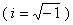

  </td>
  <td width=177 style='width:132.75pt;border-top:solid windowtext 1.0pt;
  border-left:none;border-bottom:solid windowtext 1.0pt;border-right:solid white 1.0pt;
  padding:0mm 5.4pt 0mm 5.4pt;height:3.45pt'>
  
<i>hd</i>

  </td>
 </tr>
 <tr style='height:89.05pt'>
  <td width=170 style='width:127.5pt;border-top:windowtext;border-left:white;
  border-bottom:white;border-right:windowtext;border-style:solid;border-width:
  1.0pt;padding:0mm 5.4pt 0mm 5.4pt;height:89.05pt'>
  
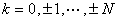

  
( <i>N</i>为正整数）

  </td>
  <td width=300 style='width:225.0pt;border-top:none;border-left:none;
  border-bottom:solid white 1.0pt;border-right:solid windowtext 1.0pt;
  padding:0mm 5.4pt 0mm 5.4pt;height:89.05pt'>
  
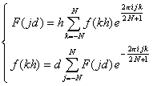

  </td>
  <td width=177 style='width:132.75pt;border-top:none;border-left:none;
  border-bottom:solid white 1.0pt;border-right:solid white 1.0pt;padding:0mm 5.4pt 0mm 5.4pt;
  height:89.05pt'>
  
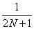

  </td>
 </tr>
 <tr style='height:3.35pt'>
  <td width=170 style='width:127.5pt;border-top:none;border-left:solid white 1.0pt;
  border-bottom:solid white 1.0pt;border-right:solid windowtext 1.0pt;
  padding:0mm 5.4pt 0mm 5.4pt;height:3.35pt'>
  
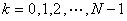

  
( <i>N</i>为正整数）

  </td>
  <td width=300 style='width:225.0pt;border-top:none;border-left:none;
  border-bottom:solid white 1.0pt;border-right:solid windowtext 1.0pt;
  padding:0mm 5.4pt 0mm 5.4pt;height:3.35pt'>
  
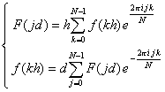

  </td>
  <td width=177 style='width:132.75pt;border-top:none;border-left:none;
  border-bottom:solid white 1.0pt;border-right:solid white 1.0pt;padding:0mm 5.4pt 0mm 5.4pt;
  height:3.35pt'>
  

  </td>
 </tr>
 <tr style='height:3.35pt'>
  <td width=170 style='width:127.5pt;border-top:none;border-left:solid white 1.0pt;
  border-bottom:solid windowtext 1.0pt;border-right:solid windowtext 1.0pt;
  padding:0mm 5.4pt 0mm 5.4pt;height:3.35pt'>
  
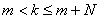

  
( <i>k</i>, <i>N</i>为整数）

  </td>
  <td width=300 style='width:225.0pt;border-top:none;border-left:none;
  border-bottom:solid windowtext 1.0pt;border-right:solid windowtext 1.0pt;
  padding:0mm 5.4pt 0mm 5.4pt;height:3.35pt'>
  
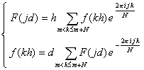

  </td>
  <td width=177 style='width:132.75pt;border-top:none;border-left:none;
  border-bottom:solid windowtext 1.0pt;border-right:solid white 1.0pt;
  padding:0mm 5.4pt 0mm 5.4pt;height:3.35pt'>
  
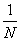

  </td>
 </tr>
</table>

&nbsp;&nbsp;&nbsp; [褶积及其性质]&nbsp; 设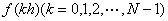为实（或复）序列<i>g</i> (<i>kh</i>)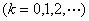 为具有周期<i>Nh</i>的序列，称

<pre>&nbsp;&nbsp;&nbsp;&nbsp;&nbsp;&nbsp;&nbsp;&nbsp;&nbsp;&nbsp;&nbsp;&nbsp;&nbsp;&nbsp;&nbsp;&nbsp;&nbsp;&nbsp;&nbsp;&nbsp;&nbsp;&nbsp;&nbsp;&nbsp;&nbsp; 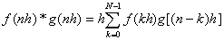</pre>

为序列<i>f</i>和<i>g</i>的褶积.设

<pre>&nbsp;&nbsp;&nbsp;&nbsp;&nbsp;&nbsp;&nbsp;&nbsp;&nbsp;&nbsp;&nbsp;&nbsp;&nbsp;&nbsp;&nbsp;&nbsp;&nbsp;&nbsp;&nbsp;&nbsp;&nbsp;&nbsp;&nbsp;&nbsp;&nbsp; 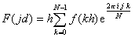&nbsp;</pre><pre>&nbsp;&nbsp;&nbsp;&nbsp;&nbsp;&nbsp;&nbsp;&nbsp;&nbsp;&nbsp;&nbsp;&nbsp;&nbsp;&nbsp;&nbsp;&nbsp;&nbsp;&nbsp;&nbsp;&nbsp;&nbsp;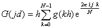&nbsp;&nbsp;&nbsp;&nbsp;&nbsp;&nbsp;&nbsp;&nbsp;&nbsp;&nbsp;&nbsp;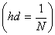</pre>

那末&nbsp;&nbsp;&nbsp;&nbsp;&nbsp;&nbsp;&nbsp;&nbsp;&nbsp;&nbsp;&nbsp;&nbsp;&nbsp;&nbsp;&nbsp;&nbsp;
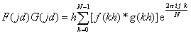&nbsp;&nbsp;&nbsp;

<pre>&nbsp;&nbsp;&nbsp;&nbsp;&nbsp;&nbsp;&nbsp;&nbsp;&nbsp;&nbsp;&nbsp;&nbsp;&nbsp;&nbsp;&nbsp;&nbsp;&nbsp;&nbsp;&nbsp;&nbsp;&nbsp;&nbsp;&nbsp;&nbsp;&nbsp; 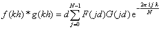&nbsp;</pre>
