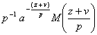
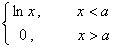
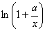

<b>§6&nbsp; </b><b>梅</b><b> </b><b>林</b><b>
</b><b>变</b><b> </b><b>换</b>

[梅林变换及其反演公式]&nbsp; 的梅林变换为

&nbsp;&nbsp;&nbsp;&nbsp;&nbsp;&nbsp;&nbsp;&nbsp;&nbsp;&nbsp;&nbsp;&nbsp;&nbsp;&nbsp;&nbsp;&nbsp;&nbsp;&nbsp;&nbsp;&nbsp;&nbsp;&nbsp;&nbsp;&nbsp;

&nbsp;&nbsp;&nbsp; 梅林变换的反演公式为

<pre>&nbsp;&nbsp;&nbsp;&nbsp;&nbsp;&nbsp;&nbsp;&nbsp;&nbsp;&nbsp;&nbsp;&nbsp;&nbsp;&nbsp;&nbsp;&nbsp;&nbsp;&nbsp;&nbsp;&nbsp;&nbsp;&nbsp;&nbsp;&nbsp;&nbsp;&nbsp;&nbsp;&nbsp;&nbsp; </pre>

&nbsp;&nbsp;&nbsp; [梅林变换的重要公式表]

<table class=MsoNormalTable border=1 cellspacing=0 cellpadding=0
 style='border-collapse:collapse;border:none'>
 <tr style='height:30.5pt'>
  <td width=239 style='width:179.0pt;border:solid windowtext 1.0pt;border-left:
  solid white 1.0pt;padding:0mm 5.4pt 0mm 5.4pt;height:30.5pt'>
  
原来函数

  </td>
  <td width=416 style='width:311.75pt;border-top:solid windowtext 1.0pt;
  border-left:none;border-bottom:solid windowtext 1.0pt;border-right:solid white 1.0pt;
  padding:0mm 5.4pt 0mm 5.4pt;height:30.5pt'>
  
梅林变换后的函数

  </td>
 </tr>
 <tr style='height:1.05pt'>
  <td width=239 style='width:179.0pt;border-top:none;border-left:solid white 1.0pt;
  border-bottom:solid white 1.0pt;border-right:solid windowtext 1.0pt;
  padding:0mm 5.4pt 0mm 5.4pt;height:1.05pt'>
  
&nbsp;&nbsp;&nbsp;&nbsp;&nbsp;&nbsp;&nbsp;&nbsp;&nbsp;
  

  </td>
  <td width=416 style='width:311.75pt;border-top:none;border-left:none;
  border-bottom:solid white 1.0pt;border-right:solid white 1.0pt;padding:0mm 5.4pt 0mm 5.4pt;
  height:1.05pt'>
  

  </td>
 </tr>
 <tr style='height:1.05pt'>
  <td width=239 style='width:179.0pt;border-top:none;border-left:solid white 1.0pt;
  border-bottom:solid white 1.0pt;border-right:solid windowtext 1.0pt;
  padding:0mm 5.4pt 0mm 5.4pt;height:1.05pt'>
  

  </td>
  <td width=416 style='width:311.75pt;border-top:none;border-left:none;
  border-bottom:solid white 1.0pt;border-right:solid white 1.0pt;padding:0mm 5.4pt 0mm 5.4pt;
  height:1.05pt'>
  

  </td>
 </tr>
 <tr style='height:1.05pt'>
  <td width=239 style='width:179.0pt;border-top:none;border-left:solid white 1.0pt;
  border-bottom:solid white 1.0pt;border-right:solid windowtext 1.0pt;
  padding:0mm 5.4pt 0mm 5.4pt;height:1.05pt'>
  
&nbsp;&nbsp;&nbsp;&nbsp;&nbsp;&nbsp;&nbsp;&nbsp;&nbsp;
  

  </td>
  <td width=416 style='width:311.75pt;border-top:none;border-left:none;
  border-bottom:solid white 1.0pt;border-right:solid white 1.0pt;padding:0mm 5.4pt 0mm 5.4pt;
  height:1.05pt'>
  

  </td>
 </tr>
 <tr style='height:42.4pt'>
  <td width=239 style='width:179.0pt;border-top:none;border-left:solid white 1.0pt;
  border-bottom:solid white 1.0pt;border-right:solid windowtext 1.0pt;
  padding:0mm 5.4pt 0mm 5.4pt;height:42.4pt'>
  
&nbsp;&nbsp;&nbsp;&nbsp;
  &nbsp;&nbsp;&nbsp;&nbsp;

  </td>
  <td width=416 style='width:311.75pt;border-top:none;border-left:none;
  border-bottom:solid white 1.0pt;border-right:solid white 1.0pt;padding:0mm 5.4pt 0mm 5.4pt;
  height:42.4pt'>
  

  </td>
 </tr>
 <tr style='height:1.05pt'>
  <td width=239 style='width:179.0pt;border-top:none;border-left:solid white 1.0pt;
  border-bottom:solid white 1.0pt;border-right:solid windowtext 1.0pt;
  padding:0mm 5.4pt 0mm 5.4pt;height:1.05pt'>
  
&nbsp;&nbsp;&nbsp;&nbsp;
  

  </td>
  <td width=416 style='width:311.75pt;border-top:none;border-left:none;
  border-bottom:solid white 1.0pt;border-right:solid white 1.0pt;padding:0mm 5.4pt 0mm 5.4pt;
  height:1.05pt'>
  

  </td>
 </tr>
 <tr style='height:1.05pt'>
  <td width=239 style='width:179.0pt;border-top:none;border-left:solid white 1.0pt;
  border-bottom:solid white 1.0pt;border-right:solid windowtext 1.0pt;
  padding:0mm 5.4pt 0mm 5.4pt;height:1.05pt'>
  
&nbsp;&nbsp;&nbsp; 

  </td>
  <td width=416 style='width:311.75pt;border-top:none;border-left:none;
  border-bottom:solid white 1.0pt;border-right:solid white 1.0pt;padding:0mm 5.4pt 0mm 5.4pt;
  height:1.05pt'>
  

  </td>
 </tr>
 <tr style='height:1.05pt'>
  <td width=239 style='width:179.0pt;border-top:none;border-left:solid white 1.0pt;
  border-bottom:solid white 1.0pt;border-right:solid windowtext 1.0pt;
  padding:0mm 5.4pt 0mm 5.4pt;height:1.05pt'>
  

  </td>
  <td width=416 style='width:311.75pt;border-top:none;border-left:none;
  border-bottom:solid white 1.0pt;border-right:solid white 1.0pt;padding:0mm 5.4pt 0mm 5.4pt;
  height:1.05pt'>
  

  </td>
 </tr>
 <tr style='height:1.05pt'>
  <td width=239 style='width:179.0pt;border-top:none;border-left:solid white 1.0pt;
  border-bottom:solid white 1.0pt;border-right:solid windowtext 1.0pt;
  padding:0mm 5.4pt 0mm 5.4pt;height:1.05pt'>
  

  </td>
  <td width=416 style='width:311.75pt;border-top:none;border-left:none;
  border-bottom:solid white 1.0pt;border-right:solid white 1.0pt;padding:0mm 5.4pt 0mm 5.4pt;
  height:1.05pt'>
  

  </td>
 </tr>
 <tr style='height:1.05pt'>
  <td width=239 style='width:179.0pt;border-top:none;border-left:solid white 1.0pt;
  border-bottom:solid windowtext 1.0pt;border-right:solid windowtext 1.0pt;
  padding:0mm 5.4pt 0mm 5.4pt;height:1.05pt'>
  
,当

  
&nbsp;&nbsp;&nbsp; 

  </td>
  <td width=416 style='width:311.75pt;border-top:none;border-left:none;
  border-bottom:solid windowtext 1.0pt;border-right:solid white 1.0pt;
  padding:0mm 5.4pt 0mm 5.4pt;height:1.05pt'>
  

  </td>
 </tr>
 <tr style='height:1.05pt'>
  <td width=239 style='width:179.0pt;border-top:none;border-left:solid white 1.0pt;
  border-bottom:solid windowtext 1.0pt;border-right:solid windowtext 1.0pt;
  padding:0mm 5.4pt 0mm 5.4pt;height:1.05pt'>
  
原来函数

  </td>
  <td width=416 style='width:311.75pt;border-top:none;border-left:none;
  border-bottom:solid windowtext 1.0pt;border-right:solid white 1.0pt;
  padding:0mm 5.4pt 0mm 5.4pt;height:1.05pt'>
  
梅林变换后的函数

  </td>
 </tr>
 <tr style='height:1.05pt'>
  <td width=239 style='width:179.0pt;border-top:none;border-left:solid white 1.0pt;
  border-bottom:solid white 1.0pt;border-right:solid windowtext 1.0pt;
  padding:0mm 5.4pt 0mm 5.4pt;height:1.05pt'>
  

  </td>
  <td width=416 style='width:311.75pt;border-top:none;border-left:none;
  border-bottom:solid white 1.0pt;border-right:solid white 1.0pt;padding:0mm 5.4pt 0mm 5.4pt;
  height:1.05pt'>
  

  </td>
 </tr>
 <tr style='height:1.05pt'>
  <td width=239 style='width:179.0pt;border-top:none;border-left:solid white 1.0pt;
  border-bottom:solid white 1.0pt;border-right:solid windowtext 1.0pt;
  padding:0mm 5.4pt 0mm 5.4pt;height:1.05pt'>
  

  </td>
  <td width=416 style='width:311.75pt;border-top:none;border-left:none;
  border-bottom:solid white 1.0pt;border-right:solid white 1.0pt;padding:0mm 5.4pt 0mm 5.4pt;
  height:1.05pt'>
  

  </td>
 </tr>
 <tr style='height:1.05pt'>
  <td width=239 style='width:179.0pt;border-top:none;border-left:solid white 1.0pt;
  border-bottom:solid white 1.0pt;border-right:solid windowtext 1.0pt;
  padding:0mm 5.4pt 0mm 5.4pt;height:1.05pt'>
  
&nbsp; 

  </td>
  <td width=416 style='width:311.75pt;border-top:none;border-left:none;
  border-bottom:solid white 1.0pt;border-right:solid white 1.0pt;padding:0mm 5.4pt 0mm 5.4pt;
  height:1.05pt'>
  

  </td>
 </tr>
 <tr style='height:1.05pt'>
  <td width=239 style='width:179.0pt;border-top:none;border-left:solid white 1.0pt;
  border-bottom:solid white 1.0pt;border-right:solid windowtext 1.0pt;
  padding:0mm 5.4pt 0mm 5.4pt;height:1.05pt'>
  

  </td>
  <td width=416 style='width:311.75pt;border-top:none;border-left:none;
  border-bottom:solid white 1.0pt;border-right:solid white 1.0pt;padding:0mm 5.4pt 0mm 5.4pt;
  height:1.05pt'>
  

  </td>
 </tr>
 <tr style='height:3.5pt'>
  <td width=239 style='width:179.0pt;border-top:none;border-left:solid white 1.0pt;
  border-bottom:none;border-right:solid windowtext 1.0pt;padding:0mm 5.4pt 0mm 5.4pt;
  height:3.5pt'>
  

  </td>
  <td width=416 style='width:311.75pt;border:none;border-right:solid white 1.0pt;
  padding:0mm 5.4pt 0mm 5.4pt;height:3.5pt'>
  

  </td>
 </tr>
 <tr style='height:1.05pt'>
  <td width=239 style='width:179.0pt;border-top:none;border-left:solid white 1.0pt;
  border-bottom:solid windowtext 1.0pt;border-right:solid windowtext 1.0pt;
  padding:0mm 5.4pt 0mm 5.4pt;height:1.05pt'>
  

  </td>
  <td width=416 style='width:311.75pt;border-top:none;border-left:none;
  border-bottom:solid windowtext 1.0pt;border-right:solid white 1.0pt;
  padding:0mm 5.4pt 0mm 5.4pt;height:1.05pt'>
  

  </td>
 </tr>
</table>

&nbsp;&nbsp;&nbsp; [ 梅 林 变 换 表 ]

<pre>&nbsp;&nbsp;&nbsp;&nbsp;&nbsp;&nbsp;&nbsp; &nbsp;&nbsp;&nbsp;&nbsp;&nbsp;&nbsp;&nbsp;</pre>
<table class=MsoNormalTable border=1 cellspacing=0 cellpadding=0
 style='border-collapse:collapse;border:none'>
 <thead>
  <tr style='height:30.75pt'>
   <td width=239 style='width:179.0pt;border:solid windowtext 1.0pt;border-left:
   solid white 1.0pt;padding:0mm 5.4pt 0mm 5.4pt;height:30.75pt'>
   

   </td>
   <td width=416 style='width:311.75pt;border-top:solid windowtext 1.0pt;
   border-left:none;border-bottom:solid windowtext 1.0pt;border-right:solid white 1.0pt;
   padding:0mm 5.4pt 0mm 5.4pt;height:30.75pt'>
   
<i>M</i> ( <i>z</i> )

   </td>
  </tr>
 </thead>
 <tr style='height:43.75pt'>
  <td width=239 style='width:179.0pt;border-top:none;border-left:solid white 1.0pt;
  border-bottom:solid white 1.0pt;border-right:solid windowtext 1.0pt;
  padding:0mm 5.4pt 0mm 5.4pt;height:43.75pt'>
  

  </td>
  <td width=416 style='width:311.75pt;border-top:none;border-left:none;
  border-bottom:solid white 1.0pt;border-right:solid white 1.0pt;padding:0mm 5.4pt 0mm 5.4pt;
  height:43.75pt'>
  
&nbsp;&nbsp;&nbsp;&nbsp;&nbsp;&nbsp;&nbsp;
  &nbsp;&nbsp;&nbsp;&nbsp;&nbsp;&nbsp;&nbsp;&nbsp;&nbsp;&nbsp;&nbsp;&nbsp;&nbsp;&nbsp;&nbsp;&nbsp;(
  Re <i>z</i> &gt; 0 )

  </td>
 </tr>
 <tr style='height:47.8pt'>
  <td width=239 style='width:179.0pt;border-top:none;border-left:solid white 1.0pt;
  border-bottom:solid white 1.0pt;border-right:solid windowtext 1.0pt;
  padding:0mm 5.4pt 0mm 5.4pt;height:47.8pt'>
  

  </td>
  <td width=416 style='width:311.75pt;border-top:none;border-left:none;
  border-bottom:solid white 1.0pt;border-right:solid white 1.0pt;padding:0mm 5.4pt 0mm 5.4pt;
  height:47.8pt'>
  
&nbsp;&nbsp;&nbsp;&nbsp;&nbsp;&nbsp;&nbsp;&nbsp;&nbsp;&nbsp;&nbsp;&nbsp;&nbsp;&nbsp;&nbsp;&nbsp;&nbsp;&nbsp;&nbsp;&nbsp;&nbsp;&nbsp;&nbsp;
  ( Re <i>z</i> &lt; 0 )

  </td>
 </tr>
 <tr style='height:64.0pt'>
  <td width=239 style='width:179.0pt;border-top:none;border-left:solid white 1.0pt;
  border-bottom:solid white 1.0pt;border-right:solid windowtext 1.0pt;
  padding:0mm 5.4pt 0mm 5.4pt;height:64.0pt'>
  

  </td>
  <td width=416 style='width:311.75pt;border-top:none;border-left:none;
  border-bottom:solid white 1.0pt;border-right:solid white 1.0pt;padding:0mm 5.4pt 0mm 5.4pt;
  height:64.0pt'>
  
&nbsp;&nbsp;&nbsp;&nbsp;&nbsp;&nbsp;&nbsp;&nbsp;&nbsp;&nbsp;&nbsp;&nbsp;&nbsp;&nbsp;&nbsp;&nbsp;&nbsp;&nbsp;&nbsp;
  ( Re <i>z</i> &gt;- Re <i>v</i> )

  </td>
 </tr>
 <tr style='height:1.05pt'>
  <td width=239 style='width:179.0pt;border-top:none;border-left:solid white 1.0pt;
  border-bottom:solid white 1.0pt;border-right:solid windowtext 1.0pt;
  padding:0mm 5.4pt 0mm 5.4pt;height:1.05pt'>
  

  </td>
  <td width=416 style='width:311.75pt;border-top:none;border-left:none;
  border-bottom:solid white 1.0pt;border-right:solid white 1.0pt;padding:0mm 5.4pt 0mm 5.4pt;
  height:1.05pt'>
  
&nbsp;&nbsp;&nbsp;&nbsp;&nbsp;&nbsp;&nbsp;&nbsp;&nbsp;&nbsp;&nbsp;&nbsp;&nbsp;&nbsp;&nbsp;&nbsp;&nbsp;
  ( Re <i>z</i> &lt; - Re <i>v</i> )

  </td>
 </tr>
 <tr style='height:73.95pt'>
  <td width=239 style='width:179.0pt;border-top:none;border-left:solid white 1.0pt;
  border-bottom:solid white 1.0pt;border-right:solid windowtext 1.0pt;
  padding:0mm 5.4pt 0mm 5.4pt;height:73.95pt'>
  

  </td>
  <td width=416 style='width:311.75pt;border-top:none;border-left:none;
  border-bottom:solid white 1.0pt;border-right:solid white 1.0pt;padding:0mm 5.4pt 0mm 5.4pt;
  height:73.95pt'>
  

  </td>
 </tr>
 <tr style='height:1.05pt'>
  <td width=239 style='width:179.0pt;border-top:none;border-left:solid white 1.0pt;
  border-bottom:solid white 1.0pt;border-right:solid windowtext 1.0pt;
  padding:0mm 5.4pt 0mm 5.4pt;height:1.05pt'>
  
&nbsp;&nbsp;&nbsp;&nbsp;&nbsp;&nbsp;&nbsp;&nbsp;&nbsp;
  

  </td>
  <td width=416 style='width:311.75pt;border-top:none;border-left:none;
  border-bottom:solid white 1.0pt;border-right:solid white 1.0pt;padding:0mm 5.4pt 0mm 5.4pt;
  height:1.05pt'>
  
&nbsp;&nbsp;&nbsp;&nbsp;&nbsp;&nbsp;&nbsp;&nbsp;&nbsp;&nbsp;&nbsp;&nbsp;&nbsp;&nbsp;&nbsp;
  (0 &lt; Re <i>z</i> &lt; 1)

  </td>
 </tr>
 <tr style='height:1.05pt'>
  <td width=239 style='width:179.0pt;border-top:none;border-left:solid white 1.0pt;
  border-bottom:solid white 1.0pt;border-right:solid windowtext 1.0pt;
  padding:0mm 5.4pt 0mm 5.4pt;height:1.05pt'>
  
&nbsp; 

  </td>
  <td width=416 style='width:311.75pt;border-top:none;border-left:none;
  border-bottom:solid white 1.0pt;border-right:solid white 1.0pt;padding:0mm 5.4pt 0mm 5.4pt;
  height:1.05pt'>
  

  
&nbsp;&nbsp;&nbsp;&nbsp;&nbsp;&nbsp;&nbsp;&nbsp;&nbsp;&nbsp;&nbsp;&nbsp;&nbsp;&nbsp;&nbsp;&nbsp;&nbsp;&nbsp;&nbsp;&nbsp;&nbsp;&nbsp;&nbsp;&nbsp;&nbsp;&nbsp;
  (0 &lt; Re <i>z</i> &lt; <i>n</i>)

  </td>
 </tr>
 <tr style='height:39.5pt'>
  <td width=239 style='width:179.0pt;border-top:none;border-left:solid white 1.0pt;
  border-bottom:solid windowtext 1.0pt;border-right:solid windowtext 1.0pt;
  padding:0mm 5.4pt 0mm 5.4pt;height:39.5pt'>
  
&nbsp;&nbsp;&nbsp;&nbsp;&nbsp;&nbsp;&nbsp;&nbsp;&nbsp;
  

  </td>
  <td width=416 style='width:311.75pt;border-top:none;border-left:none;
  border-bottom:solid windowtext 1.0pt;border-right:solid white 1.0pt;
  padding:0mm 5.4pt 0mm 5.4pt;height:39.5pt'>
  
&nbsp;&nbsp;&nbsp;&nbsp;&nbsp;&nbsp;&nbsp;&nbsp;&nbsp;&nbsp;&nbsp;&nbsp;&nbsp;&nbsp;&nbsp;
  (0 &lt; Re <i>z</i> &lt; 1)

  
&nbsp;&nbsp;&nbsp;&nbsp;&nbsp;&nbsp;&nbsp;&nbsp;
  （积分在主值意义下）

  </td>
 </tr>
 <tr style='height:1.05pt'>
  <td width=239 style='width:179.0pt;border-top:none;border-left:solid white 1.0pt;
  border-bottom:solid white 1.0pt;border-right:solid windowtext 1.0pt;
  padding:0mm 5.4pt 0mm 5.4pt;height:1.05pt'>
  

  
&nbsp;&nbsp;&nbsp;&nbsp; 

  </td>
  <td width=416 style='width:311.75pt;border-top:none;border-left:none;
  border-bottom:solid white 1.0pt;border-right:solid white 1.0pt;padding:0mm 5.4pt 0mm 5.4pt;
  height:1.05pt'>
  
&nbsp;
  (0 &lt; Re <i>z</i> &lt; 2)

  
&nbsp;&nbsp;&nbsp;&nbsp;&nbsp;&nbsp;&nbsp;&nbsp;
  （积分在主值意义下）

  </td>
 </tr>
 <tr style='height:1.05pt'>
  <td width=239 style='width:179.0pt;border-top:none;border-left:solid white 1.0pt;
  border-bottom:solid white 1.0pt;border-right:solid windowtext 1.0pt;
  padding:0mm 5.4pt 0mm 5.4pt;height:1.05pt'>
  
&nbsp;
  &nbsp;&nbsp;&nbsp;&nbsp;&nbsp;&nbsp;&nbsp;&nbsp;&nbsp;

  </td>
  <td width=416 style='width:311.75pt;border-top:none;border-left:none;
  border-bottom:solid white 1.0pt;border-right:solid white 1.0pt;padding:0mm 5.4pt 0mm 5.4pt;
  height:1.05pt'>
  
&nbsp;
  (0 &lt; Re <i>z</i> &lt; 2)

  
&nbsp;&nbsp;&nbsp;&nbsp;&nbsp;&nbsp;&nbsp;&nbsp;
  （积分在主值意义下）

  </td>
 </tr>
 <tr style='height:1.05pt'>
  <td width=239 style='width:179.0pt;border-top:none;border-left:solid white 1.0pt;
  border-bottom:solid white 1.0pt;border-right:solid windowtext 1.0pt;
  padding:0mm 5.4pt 0mm 5.4pt;height:1.05pt'>
  
&nbsp;&nbsp;&nbsp;
  ( Re <i>v</i> &gt; 0 )

  </td>
  <td width=416 style='width:311.75pt;border-top:none;border-left:none;
  border-bottom:solid white 1.0pt;border-right:solid white 1.0pt;padding:0mm 5.4pt 0mm 5.4pt;
  height:1.05pt'>
  
&nbsp;&nbsp;&nbsp;&nbsp;&nbsp;
  ( 0 &lt; Re <i>z</i> &lt; Re <i>v</i> )

  </td>
 </tr>
 <tr style='height:1.05pt'>
  <td width=239 style='width:179.0pt;border-top:none;border-left:solid white 1.0pt;
  border-bottom:solid white 1.0pt;border-right:solid windowtext 1.0pt;
  padding:0mm 5.4pt 0mm 5.4pt;height:1.05pt'>
  
&nbsp;(
  Re <i>v</i> &gt;)

  </td>
  <td width=416 style='width:311.75pt;border-top:none;border-left:none;
  border-bottom:solid white 1.0pt;border-right:solid white 1.0pt;padding:0mm 5.4pt 0mm 5.4pt;
  height:1.05pt'>
  
&nbsp;&nbsp;&nbsp;&nbsp;&nbsp;&nbsp;&nbsp;&nbsp;&nbsp;&nbsp;&nbsp;
  ( Re <i>z</i> &gt; 0 )

  </td>
 </tr>
 <tr style='height:1.05pt'>
  <td width=239 style='width:179.0pt;border-top:none;border-left:solid white 1.0pt;
  border-bottom:solid white 1.0pt;border-right:solid windowtext 1.0pt;
  padding:0mm 5.4pt 0mm 5.4pt;height:1.05pt'>
  
&nbsp;(
  Re <i>v</i> &gt;)

  </td>
  <td width=416 style='width:311.75pt;border-top:none;border-left:none;
  border-bottom:solid white 1.0pt;border-right:solid white 1.0pt;padding:0mm 5.4pt 0mm 5.4pt;
  height:1.05pt'>
  
&nbsp;&nbsp;&nbsp;
  ( Re <i>z</i> &lt;)

  </td>
 </tr>
 <tr style='height:1.5pt'>
  <td width=239 style='width:179.0pt;border-top:none;border-left:solid white 1.0pt;
  border-bottom:solid white 1.0pt;border-right:solid windowtext 1.0pt;
  padding:0mm 5.4pt 0mm 5.4pt;height:1.5pt'>
  
&nbsp;&nbsp;&nbsp;&nbsp;&nbsp;&nbsp;&nbsp;&nbsp;&nbsp;&nbsp;
  

  </td>
  <td width=416 style='width:311.75pt;border-top:none;border-left:none;
  border-bottom:solid white 1.0pt;border-right:solid white 1.0pt;padding:0mm 5.4pt 0mm 5.4pt;
  height:1.5pt'>
  
&nbsp;&nbsp;&nbsp;&nbsp;&nbsp;&nbsp;&nbsp;&nbsp;&nbsp;&nbsp;&nbsp;&nbsp;&nbsp;&nbsp;&nbsp;&nbsp;&nbsp;&nbsp;&nbsp;
  ( Re <i>z</i> &gt; 0 )

  </td>
 </tr>
 <tr style='height:22.25pt'>
  <td width=239 style='width:179.0pt;border-top:none;border-left:solid white 1.0pt;
  border-bottom:solid white 1.0pt;border-right:solid windowtext 1.0pt;
  padding:0mm 5.4pt 0mm 5.4pt;height:22.25pt'>
  

  </td>
  <td width=416 style='width:311.75pt;border-top:none;border-left:none;
  border-bottom:solid white 1.0pt;border-right:solid white 1.0pt;padding:0mm 5.4pt 0mm 5.4pt;
  height:22.25pt'>
  
&nbsp;&nbsp;&nbsp;&nbsp;&nbsp;&nbsp;&nbsp;&nbsp;&nbsp;&nbsp;&nbsp;&nbsp;
  ( Re <i>z</i> &gt; 0 )

  </td>
 </tr>
 <tr style='height:1.0pt'>
  <td width=239 style='width:179.0pt;border-top:none;border-left:solid white 1.0pt;
  border-bottom:solid white 1.0pt;border-right:solid windowtext 1.0pt;
  padding:0mm 5.4pt 0mm 5.4pt;height:1.0pt'>
  

  </td>
  <td width=416 style='width:311.75pt;border-top:none;border-left:none;
  border-bottom:solid white 1.0pt;border-right:solid white 1.0pt;padding:0mm 5.4pt 0mm 5.4pt;
  height:1.0pt'>
  
&nbsp;&nbsp;&nbsp;&nbsp;&nbsp;&nbsp;&nbsp;
  &nbsp;&nbsp;&nbsp;&nbsp;&nbsp;&nbsp;&nbsp;&nbsp;&nbsp;&nbsp;&nbsp;&nbsp;&nbsp;&nbsp;(
  Re <i>z</i> &lt; 0 )

  </td>
 </tr>
 <tr style='height:1.0pt'>
  <td width=239 style='width:179.0pt;border-top:none;border-left:solid white 1.0pt;
  border-bottom:solid white 1.0pt;border-right:solid windowtext 1.0pt;
  padding:0mm 5.4pt 0mm 5.4pt;height:1.0pt'>
  
&nbsp;&nbsp;&nbsp;&nbsp;&nbsp;&nbsp;&nbsp;&nbsp;&nbsp;
  

  </td>
  <td width=416 style='width:311.75pt;border-top:none;border-left:none;
  border-bottom:solid white 1.0pt;border-right:solid white 1.0pt;padding:0mm 5.4pt 0mm 5.4pt;
  height:1.0pt'>
  
&nbsp;
  (0 &lt; Re <i>z</i> &lt; 1)

  </td>
 </tr>
 <tr style='height:1.0pt'>
  <td width=239 style='width:179.0pt;border-top:none;border-left:solid white 1.0pt;
  border-bottom:solid white 1.0pt;border-right:solid windowtext 1.0pt;
  padding:0mm 5.4pt 0mm 5.4pt;height:1.0pt'>
  

  </td>
  <td width=416 style='width:311.75pt;border-top:none;border-left:none;
  border-bottom:solid white 1.0pt;border-right:solid white 1.0pt;padding:0mm 5.4pt 0mm 5.4pt;
  height:1.0pt'>
  
&nbsp;&nbsp;&nbsp;&nbsp;&nbsp;&nbsp;&nbsp;&nbsp;&nbsp;&nbsp;&nbsp;&nbsp;&nbsp;&nbsp;&nbsp;&nbsp;&nbsp;
  (0 &lt; Re <i>z</i> &lt; 1)

  </td>
 </tr>
 <tr style='height:1.0pt'>
  <td width=239 style='width:179.0pt;border-top:none;border-left:solid white 1.0pt;
  border-bottom:solid white 1.0pt;border-right:solid windowtext 1.0pt;
  padding:0mm 5.4pt 0mm 5.4pt;height:1.0pt'>
  

  </td>
  <td width=416 style='width:311.75pt;border-top:none;border-left:none;
  border-bottom:solid white 1.0pt;border-right:solid white 1.0pt;padding:0mm 5.4pt 0mm 5.4pt;
  height:1.0pt'>
  
&nbsp;&nbsp;&nbsp;&nbsp;&nbsp;&nbsp;&nbsp;&nbsp;&nbsp;&nbsp;&nbsp;&nbsp;&nbsp;&nbsp;&nbsp;
  (0 &lt; Re <i>z</i> &lt; 1)

  </td>
 </tr>
 <tr style='height:1.0pt'>
  <td width=239 style='width:179.0pt;border-top:none;border-left:solid white 1.0pt;
  border-bottom:solid white 1.0pt;border-right:solid windowtext 1.0pt;
  padding:0mm 5.4pt 0mm 5.4pt;height:1.0pt'>
  

  </td>
  <td width=416 style='width:311.75pt;border-top:none;border-left:none;
  border-bottom:solid white 1.0pt;border-right:solid white 1.0pt;padding:0mm 5.4pt 0mm 5.4pt;
  height:1.0pt'>
  
&nbsp;&nbsp;&nbsp;&nbsp;&nbsp;&nbsp;&nbsp;&nbsp;&nbsp;&nbsp;&nbsp;&nbsp;&nbsp;
  (&lt; Re <i>z</i> &lt; 0)

  </td>
 </tr>
 <tr style='height:24.1pt'>
  <td width=239 style='width:179.0pt;border-top:none;border-left:solid white 1.0pt;
  border-bottom:solid white 1.0pt;border-right:solid windowtext 1.0pt;
  padding:0mm 5.4pt 0mm 5.4pt;height:24.1pt'>
  

  </td>
  <td width=416 style='width:311.75pt;border-top:none;border-left:none;
  border-bottom:solid white 1.0pt;border-right:solid white 1.0pt;padding:0mm 5.4pt 0mm 5.4pt;
  height:24.1pt'>
  
&nbsp;&nbsp;&nbsp;&nbsp;&nbsp;&nbsp;&nbsp;&nbsp;&nbsp;&nbsp;&nbsp;&nbsp;&nbsp;
  (&lt; Re <i>z</i> &lt; 0)

  </td>
 </tr>
 <tr style='height:1.0pt'>
  <td width=239 style='width:179.0pt;border-top:none;border-left:solid white 1.0pt;
  border-bottom:solid white 1.0pt;border-right:solid windowtext 1.0pt;
  padding:0mm 5.4pt 0mm 5.4pt;height:1.0pt'>
  

  </td>
  <td width=416 style='width:311.75pt;border-top:none;border-left:none;
  border-bottom:solid white 1.0pt;border-right:solid white 1.0pt;padding:0mm 5.4pt 0mm 5.4pt;
  height:1.0pt'>
  
&nbsp;&nbsp;&nbsp;&nbsp;&nbsp;&nbsp;&nbsp;&nbsp;&nbsp;&nbsp;&nbsp;&nbsp;&nbsp;&nbsp;&nbsp;&nbsp;&nbsp;
  (&lt; Re <i>z</i> &lt; 1)

  </td>
 </tr>
 <tr style='height:1.0pt'>
  <td width=239 style='width:179.0pt;border-top:none;border-left:solid white 1.0pt;
  border-bottom:solid white 1.0pt;border-right:solid windowtext 1.0pt;
  padding:0mm 5.4pt 0mm 5.4pt;height:1.0pt'>
  

  </td>
  <td width=416 style='width:311.75pt;border-top:none;border-left:none;
  border-bottom:solid white 1.0pt;border-right:solid white 1.0pt;padding:0mm 5.4pt 0mm 5.4pt;
  height:1.0pt'>
  
&nbsp;&nbsp;&nbsp;&nbsp;&nbsp;
  (0&lt; Re <i>z</i> &lt; 1)

  </td>
 </tr>
 <tr style='height:1.0pt'>
  <td width=239 style='width:179.0pt;border-top:none;border-left:solid white 1.0pt;
  border-bottom:solid white 1.0pt;border-right:solid windowtext 1.0pt;
  padding:0mm 5.4pt 0mm 5.4pt;height:1.0pt'>
  
&nbsp;&nbsp;&nbsp;&nbsp;&nbsp;&nbsp;&nbsp;&nbsp;
  &nbsp;&nbsp;&nbsp;&nbsp;&nbsp;&nbsp;&nbsp;&nbsp;&nbsp;&nbsp;&nbsp;&nbsp;&nbsp;&nbsp;&nbsp;&nbsp;&nbsp;&nbsp;

  </td>
  <td width=416 style='width:311.75pt;border-top:none;border-left:none;
  border-bottom:solid white 1.0pt;border-right:solid white 1.0pt;padding:0mm 5.4pt 0mm 5.4pt;
  height:1.0pt'>
  
&nbsp;&nbsp;&nbsp;&nbsp;&nbsp;&nbsp;&nbsp;&nbsp;&nbsp;&nbsp;&nbsp;&nbsp;&nbsp;&nbsp;&nbsp;
  (&lt; Re <i>z</i> &lt; 1)

  </td>
 </tr>
 <tr style='height:1.0pt'>
  <td width=239 style='width:179.0pt;border-top:none;border-left:solid white 1.0pt;
  border-bottom:solid white 1.0pt;border-right:solid windowtext 1.0pt;
  padding:0mm 5.4pt 0mm 5.4pt;height:1.0pt'>
  
&nbsp;&nbsp;&nbsp;&nbsp;&nbsp;&nbsp;&nbsp;&nbsp;
  &nbsp;&nbsp;&nbsp;&nbsp;&nbsp;&nbsp;&nbsp;&nbsp;&nbsp;&nbsp;&nbsp;&nbsp;&nbsp;&nbsp;&nbsp;&nbsp;&nbsp;&nbsp;

  </td>
  <td width=416 style='width:311.75pt;border-top:none;border-left:none;
  border-bottom:solid white 1.0pt;border-right:solid white 1.0pt;padding:0mm 5.4pt 0mm 5.4pt;
  height:1.0pt'>
  
&nbsp;&nbsp;&nbsp;&nbsp;&nbsp;&nbsp;&nbsp;&nbsp;&nbsp;&nbsp;&nbsp;&nbsp;&nbsp;&nbsp;&nbsp;
  ( 0 &lt; Re <i>z</i> &lt; 1)

  </td>
 </tr>
 <tr style='height:1.5pt'>
  <td width=239 style='width:179.0pt;border-top:none;border-left:solid white 1.0pt;
  border-bottom:none;border-right:solid windowtext 1.0pt;padding:0mm 5.4pt 0mm 5.4pt;
  height:1.5pt'>
  
&nbsp;&nbsp; 

  </td>
  <td width=416 style='width:311.75pt;border:none;border-right:solid white 1.0pt;
  padding:0mm 5.4pt 0mm 5.4pt;height:1.5pt'>
  
&nbsp;&nbsp;&nbsp;&nbsp;&nbsp;
  ( Re <i>z</i> &gt; -1)

  </td>
 </tr>
 <tr style='height:1.5pt'>
  <td width=239 style='width:179.0pt;border-top:none;border-left:solid white 1.0pt;
  border-bottom:solid windowtext 1.0pt;border-right:solid windowtext 1.0pt;
  padding:0mm 5.4pt 0mm 5.4pt;height:1.5pt'>
  
&nbsp;&nbsp; 

  </td>
  <td width=416 style='width:311.75pt;border-top:none;border-left:none;
  border-bottom:solid windowtext 1.0pt;border-right:solid white 1.0pt;
  padding:0mm 5.4pt 0mm 5.4pt;height:1.5pt'>
  

  </td>
 </tr>
 <tr style='height:1.0pt'>
  <td width=239 style='width:179.0pt;border-top:none;border-left:solid white 1.0pt;
  border-bottom:solid white 1.0pt;border-right:solid windowtext 1.0pt;
  padding:0mm 5.4pt 0mm 5.4pt;height:1.0pt'>
  

  </td>
  <td width=416 style='width:311.75pt;border-top:none;border-left:none;
  border-bottom:solid white 1.0pt;border-right:solid white 1.0pt;padding:0mm 5.4pt 0mm 5.4pt;
  height:1.0pt'>
  
&nbsp;&nbsp;&nbsp;&nbsp;&nbsp;&nbsp;&nbsp;&nbsp;&nbsp;&nbsp;&nbsp;&nbsp;&nbsp;&nbsp;&nbsp;&nbsp;
  

  </td>
 </tr>
 <tr style='height:1.0pt'>
  <td width=239 style='width:179.0pt;border-top:none;border-left:solid white 1.0pt;
  border-bottom:solid white 1.0pt;border-right:solid windowtext 1.0pt;
  padding:0mm 5.4pt 0mm 5.4pt;height:1.0pt'>
  

  </td>
  <td width=416 style='width:311.75pt;border-top:none;border-left:none;
  border-bottom:solid white 1.0pt;border-right:solid white 1.0pt;padding:0mm 5.4pt 0mm 5.4pt;
  height:1.0pt'>
  
&nbsp; 

  </td>
 </tr>
 <tr style='height:1.0pt'>
  <td width=239 style='width:179.0pt;border-top:none;border-left:solid white 1.0pt;
  border-bottom:solid white 1.0pt;border-right:solid windowtext 1.0pt;
  padding:0mm 5.4pt 0mm 5.4pt;height:1.0pt'>
  

  </td>
  <td width=416 style='width:311.75pt;border-top:none;border-left:none;
  border-bottom:solid white 1.0pt;border-right:solid white 1.0pt;padding:0mm 5.4pt 0mm 5.4pt;
  height:1.0pt'>
  
&nbsp;&nbsp;&nbsp;&nbsp;&nbsp;&nbsp;&nbsp;&nbsp;&nbsp;&nbsp;
  &nbsp;&nbsp;&nbsp;&nbsp;&nbsp;&nbsp;&nbsp;

  </td>
 </tr>
 <tr style='height:1.0pt'>
  <td width=239 style='width:179.0pt;border-top:none;border-left:solid white 1.0pt;
  border-bottom:solid white 1.0pt;border-right:solid windowtext 1.0pt;
  padding:0mm 5.4pt 0mm 5.4pt;height:1.0pt'>
  

  </td>
  <td width=416 style='width:311.75pt;border-top:none;border-left:none;
  border-bottom:solid white 1.0pt;border-right:solid white 1.0pt;padding:0mm 5.4pt 0mm 5.4pt;
  height:1.0pt'>
  
&nbsp; 

  </td>
 </tr>
 <tr style='height:1.0pt'>
  <td width=239 style='width:179.0pt;border-top:none;border-left:solid white 1.0pt;
  border-bottom:solid white 1.0pt;border-right:solid windowtext 1.0pt;
  padding:0mm 5.4pt 0mm 5.4pt;height:1.0pt'>
  

  </td>
  <td width=416 style='width:311.75pt;border-top:none;border-left:none;
  border-bottom:solid white 1.0pt;border-right:solid white 1.0pt;padding:0mm 5.4pt 0mm 5.4pt;
  height:1.0pt'>
  
&nbsp;&nbsp;&nbsp;&nbsp;&nbsp;&nbsp;
  ( Re <i>z</i> &gt;)

  </td>
 </tr>
 <tr style='height:1.0pt'>
  <td width=239 style='width:179.0pt;border-top:none;border-left:solid white 1.0pt;
  border-bottom:solid white 1.0pt;border-right:solid windowtext 1.0pt;
  padding:0mm 5.4pt 0mm 5.4pt;height:1.0pt'>
  

  </td>
  <td width=416 style='width:311.75pt;border-top:none;border-left:none;
  border-bottom:solid white 1.0pt;border-right:solid white 1.0pt;padding:0mm 5.4pt 0mm 5.4pt;
  height:1.0pt'>
  
&nbsp;&nbsp;&nbsp;&nbsp;&nbsp;&nbsp;&nbsp;&nbsp;&nbsp;&nbsp;
  ( Re <i>z</i> &gt;)

  </td>
 </tr>
 <tr style='height:1.0pt'>
  <td width=239 style='width:179.0pt;border-top:none;border-left:solid white 1.0pt;
  border-bottom:solid white 1.0pt;border-right:solid windowtext 1.0pt;
  padding:0mm 5.4pt 0mm 5.4pt;height:1.0pt'>
  

  </td>
  <td width=416 style='width:311.75pt;border-top:none;border-left:none;
  border-bottom:solid white 1.0pt;border-right:solid white 1.0pt;padding:0mm 5.4pt 0mm 5.4pt;
  height:1.0pt'>
  
&nbsp;&nbsp;&nbsp;&nbsp;&nbsp;&nbsp;&nbsp;&nbsp;&nbsp;&nbsp;&nbsp;
  (&lt; Re <i>z</i> &lt; 0)

  </td>
 </tr>
 <tr style='height:1.0pt'>
  <td width=239 style='width:179.0pt;border-top:none;border-left:solid white 1.0pt;
  border-bottom:none;border-right:solid windowtext 1.0pt;padding:0mm 5.4pt 0mm 5.4pt;
  height:1.0pt'>
  
&nbsp; 

  </td>
  <td width=416 style='width:311.75pt;border:none;border-right:solid white 1.0pt;
  padding:0mm 5.4pt 0mm 5.4pt;height:1.0pt'>
  
&nbsp; 

  </td>
 </tr>
 <tr style='height:1.0pt'>
  <td width=239 style='width:179.0pt;border-top:none;border-left:solid white 1.0pt;
  border-bottom:solid windowtext 1.0pt;border-right:solid windowtext 1.0pt;
  padding:0mm 5.4pt 0mm 5.4pt;height:1.0pt'>
  

  </td>
  <td width=416 style='width:311.75pt;border-top:none;border-left:none;
  border-bottom:solid windowtext 1.0pt;border-right:solid white 1.0pt;
  padding:0mm 5.4pt 0mm 5.4pt;height:1.0pt'>
  
&nbsp;&nbsp;&nbsp;&nbsp;&nbsp;&nbsp;&nbsp;&nbsp;&nbsp;&nbsp;&nbsp;&nbsp;&nbsp;&nbsp;
  (0&lt; Re <i>z</i> &lt; 1)

  </td>
 </tr>
</table>

&nbsp;

