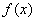
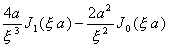
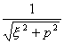
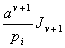

<b>§7&nbsp;&nbsp; </b><b>汉克尔变换</b>

&nbsp;&nbsp;&nbsp; [汉克尔变换及其反演公式]

&nbsp;&nbsp;&nbsp; 的<i>v</i>阶汉克尔变换为

&nbsp;&nbsp;&nbsp; <i>v</i>阶汉克尔变换的反演公式为

式中<i>J v </i>( <i>x </i>)是贝塞耳函数.

&nbsp;&nbsp;&nbsp; [汉克尔变换表]

<table class=MsoNormalTable border=1 cellspacing=0 cellpadding=0
 style='border-collapse:collapse;border:none'>
 <thead>
  <tr style='height:26.0pt'>
   <td width=172 style='width:129.0pt;border:solid black 1.0pt;border-left:
   solid white 1.0pt;padding:0mm 5.4pt 0mm 5.4pt;height:26.0pt'>
   

   </td>
   <td width=143 style='width:107.5pt;border:solid black 1.0pt;border-left:
   none;padding:0mm 5.4pt 0mm 5.4pt;height:26.0pt'>
   
<i>v</i>

   </td>
   <td width=330 style='width:247.25pt;border-top:solid black 1.0pt;border-left:
   none;border-bottom:solid black 1.0pt;border-right:solid white 1.0pt;
   padding:0mm 5.4pt 0mm 5.4pt;height:26.0pt'>
   

   </td>
  </tr>
 </thead>
 <tr style='height:25.75pt'>
  <td width=172 style='width:129.0pt;border-top:none;border-left:solid white 1.0pt;
  border-bottom:solid white 1.0pt;border-right:solid black 1.0pt;padding:0mm 5.4pt 0mm 5.4pt;
  height:25.75pt'>
  

  </td>
  <td width=143 style='width:107.5pt;border-top:none;border-left:none;
  border-bottom:solid white 1.0pt;border-right:solid black 1.0pt;padding:0mm 5.4pt 0mm 5.4pt;
  height:25.75pt'>
  
&gt;

  </td>
  <td width=330 style='width:247.25pt;border-top:none;border-left:none;
  border-bottom:solid white 1.0pt;border-right:solid white 1.0pt;padding:0mm 5.4pt 0mm 5.4pt;
  height:25.75pt'>
  

  </td>
 </tr>
 <tr style='height:44.05pt'>
  <td width=172 style='width:129.0pt;border-top:none;border-left:solid white 1.0pt;
  border-bottom:solid white 1.0pt;border-right:solid black 1.0pt;padding:0mm 5.4pt 0mm 5.4pt;
  height:44.05pt'>
  

  </td>
  <td width=143 style='width:107.5pt;border-top:none;border-left:none;
  border-bottom:solid white 1.0pt;border-right:solid black 1.0pt;padding:0mm 5.4pt 0mm 5.4pt;
  height:44.05pt'>
  
0

  </td>
  <td width=330 style='width:247.25pt;border-top:none;border-left:none;
  border-bottom:solid white 1.0pt;border-right:solid white 1.0pt;padding:0mm 5.4pt 0mm 5.4pt;
  height:44.05pt'>
  

  </td>
 </tr>
 <tr style='height:25.75pt'>
  <td width=172 style='width:129.0pt;border-top:none;border-left:solid white 1.0pt;
  border-bottom:solid white 1.0pt;border-right:solid black 1.0pt;padding:0mm 5.4pt 0mm 5.4pt;
  height:25.75pt'>
  

  </td>
  <td width=143 style='width:107.5pt;border-top:none;border-left:none;
  border-bottom:solid white 1.0pt;border-right:solid black 1.0pt;padding:0mm 5.4pt 0mm 5.4pt;
  height:25.75pt'>
  
0

  </td>
  <td width=330 style='width:247.25pt;border-top:none;border-left:none;
  border-bottom:solid white 1.0pt;border-right:solid white 1.0pt;padding:0mm 5.4pt 0mm 5.4pt;
  height:25.75pt'>
  

  </td>
 </tr>
 <tr style='height:25.75pt'>
  <td width=172 style='width:129.0pt;border-top:none;border-left:solid white 1.0pt;
  border-bottom:solid white 1.0pt;border-right:solid black 1.0pt;padding:0mm 5.4pt 0mm 5.4pt;
  height:25.75pt'>
  

  </td>
  <td width=143 style='width:107.5pt;border-top:none;border-left:none;
  border-bottom:solid white 1.0pt;border-right:solid black 1.0pt;padding:0mm 5.4pt 0mm 5.4pt;
  height:25.75pt'>
  
&gt;

  </td>
  <td width=330 style='width:247.25pt;border-top:none;border-left:none;
  border-bottom:solid white 1.0pt;border-right:solid white 1.0pt;padding:0mm 5.4pt 0mm 5.4pt;
  height:25.75pt'>
  

  </td>
 </tr>
 <tr style='height:25.75pt'>
  <td width=172 style='width:129.0pt;border-top:none;border-left:solid white 1.0pt;
  border-bottom:solid white 1.0pt;border-right:solid black 1.0pt;padding:0mm 5.4pt 0mm 5.4pt;
  height:25.75pt'>
  

  </td>
  <td width=143 style='width:107.5pt;border-top:none;border-left:none;
  border-bottom:solid white 1.0pt;border-right:solid black 1.0pt;padding:0mm 5.4pt 0mm 5.4pt;
  height:25.75pt'>
  
&gt;

  </td>
  <td width=330 style='width:247.25pt;border-top:none;border-left:none;
  border-bottom:solid white 1.0pt;border-right:solid white 1.0pt;padding:0mm 5.4pt 0mm 5.4pt;
  height:25.75pt'>
  

  </td>
 </tr>
 <tr style='height:25.75pt'>
  <td width=172 style='width:129.0pt;border-top:none;border-left:solid white 1.0pt;
  border-bottom:solid white 1.0pt;border-right:solid black 1.0pt;padding:0mm 5.4pt 0mm 5.4pt;
  height:25.75pt'>
  

  </td>
  <td width=143 style='width:107.5pt;border-top:none;border-left:none;
  border-bottom:solid white 1.0pt;border-right:solid black 1.0pt;padding:0mm 5.4pt 0mm 5.4pt;
  height:25.75pt'>
  
0

  </td>
  <td width=330 style='width:247.25pt;border-top:none;border-left:none;
  border-bottom:solid white 1.0pt;border-right:solid white 1.0pt;padding:0mm 5.4pt 0mm 5.4pt;
  height:25.75pt'>
  

  </td>
 </tr>
 <tr style='height:25.75pt'>
  <td width=172 style='width:129.0pt;border-top:none;border-left:solid white 1.0pt;
  border-bottom:solid white 1.0pt;border-right:solid black 1.0pt;padding:0mm 5.4pt 0mm 5.4pt;
  height:25.75pt'>
  

  </td>
  <td width=143 style='width:107.5pt;border-top:none;border-left:none;
  border-bottom:solid white 1.0pt;border-right:solid black 1.0pt;padding:0mm 5.4pt 0mm 5.4pt;
  height:25.75pt'>
  
0

  </td>
  <td width=330 style='width:247.25pt;border-top:none;border-left:none;
  border-bottom:solid white 1.0pt;border-right:solid white 1.0pt;padding:0mm 5.4pt 0mm 5.4pt;
  height:25.75pt'>
  

  </td>
 </tr>
 <tr style='height:25.75pt'>
  <td width=172 style='width:129.0pt;border-top:none;border-left:solid white 1.0pt;
  border-bottom:solid white 1.0pt;border-right:solid black 1.0pt;padding:0mm 5.4pt 0mm 5.4pt;
  height:25.75pt'>
  

  </td>
  <td width=143 style='width:107.5pt;border-top:none;border-left:none;
  border-bottom:solid white 1.0pt;border-right:solid black 1.0pt;padding:0mm 5.4pt 0mm 5.4pt;
  height:25.75pt'>
  
1

  </td>
  <td width=330 style='width:247.25pt;border-top:none;border-left:none;
  border-bottom:solid white 1.0pt;border-right:solid white 1.0pt;padding:0mm 5.4pt 0mm 5.4pt;
  height:25.75pt'>
  

  </td>
 </tr>
 <tr style='height:25.75pt'>
  <td width=172 style='width:129.0pt;border-top:none;border-left:solid white 1.0pt;
  border-bottom:solid white 1.0pt;border-right:solid black 1.0pt;padding:0mm 5.4pt 0mm 5.4pt;
  height:25.75pt'>
  

  </td>
  <td width=143 style='width:107.5pt;border-top:none;border-left:none;
  border-bottom:solid white 1.0pt;border-right:solid black 1.0pt;padding:0mm 5.4pt 0mm 5.4pt;
  height:25.75pt'>
  
1

  </td>
  <td width=330 style='width:247.25pt;border-top:none;border-left:none;
  border-bottom:solid white 1.0pt;border-right:solid white 1.0pt;padding:0mm 5.4pt 0mm 5.4pt;
  height:25.75pt'>
  

  </td>
 </tr>
 <tr style='height:25.75pt'>
  <td width=172 style='width:129.0pt;border-top:none;border-left:solid white 1.0pt;
  border-bottom:solid white 1.0pt;border-right:solid black 1.0pt;padding:0mm 5.4pt 0mm 5.4pt;
  height:25.75pt'>
  

  </td>
  <td width=143 style='width:107.5pt;border-top:none;border-left:none;
  border-bottom:solid white 1.0pt;border-right:solid black 1.0pt;padding:0mm 5.4pt 0mm 5.4pt;
  height:25.75pt'>
  
1

  </td>
  <td width=330 style='width:247.25pt;border-top:none;border-left:none;
  border-bottom:solid white 1.0pt;border-right:solid white 1.0pt;padding:0mm 5.4pt 0mm 5.4pt;
  height:25.75pt'>
  

  </td>
 </tr>
 <tr style='height:25.75pt'>
  <td width=172 style='width:129.0pt;border-top:none;border-left:solid white 1.0pt;
  border-bottom:solid black 1.0pt;border-right:solid black 1.0pt;padding:0mm 5.4pt 0mm 5.4pt;
  height:25.75pt'>
  

  </td>
  <td width=143 style='width:107.5pt;border-top:none;border-left:none;
  border-bottom:solid black 1.0pt;border-right:solid black 1.0pt;padding:0mm 5.4pt 0mm 5.4pt;
  height:25.75pt'>
  
0

  </td>
  <td width=330 style='width:247.25pt;border-top:none;border-left:none;
  border-bottom:solid black 1.0pt;border-right:solid white 1.0pt;padding:0mm 5.4pt 0mm 5.4pt;
  height:25.75pt'>
  

  </td>
 </tr>
 <tr style='height:25.75pt'>
  <td width=172 style='width:129.0pt;border-top:none;border-left:solid white 1.0pt;
  border-bottom:solid white 1.0pt;border-right:solid black 1.0pt;padding:0mm 5.4pt 0mm 5.4pt;
  height:25.75pt'>
  

  </td>
  <td width=143 style='width:107.5pt;border-top:none;border-left:none;
  border-bottom:solid white 1.0pt;border-right:solid black 1.0pt;padding:0mm 5.4pt 0mm 5.4pt;
  height:25.75pt'>
  
0

  </td>
  <td width=330 style='width:247.25pt;border-top:none;border-left:none;
  border-bottom:solid white 1.0pt;border-right:solid white 1.0pt;padding:0mm 5.4pt 0mm 5.4pt;
  height:25.75pt'>
  

  </td>
 </tr>
 <tr style='height:25.75pt'>
  <td width=172 style='width:129.0pt;border-top:none;border-left:solid white 1.0pt;
  border-bottom:solid white 1.0pt;border-right:solid black 1.0pt;padding:0mm 5.4pt 0mm 5.4pt;
  height:25.75pt'>
  

  </td>
  <td width=143 style='width:107.5pt;border-top:none;border-left:none;
  border-bottom:solid white 1.0pt;border-right:solid black 1.0pt;padding:0mm 5.4pt 0mm 5.4pt;
  height:25.75pt'>
  
1

  </td>
  <td width=330 style='width:247.25pt;border-top:none;border-left:none;
  border-bottom:solid white 1.0pt;border-right:solid white 1.0pt;padding:0mm 5.4pt 0mm 5.4pt;
  height:25.75pt'>
  

  </td>
 </tr>
 <tr style='height:25.75pt'>
  <td width=172 style='width:129.0pt;border-top:none;border-left:solid white 1.0pt;
  border-bottom:solid black 1.0pt;border-right:solid black 1.0pt;padding:0mm 5.4pt 0mm 5.4pt;
  height:25.75pt'>
  

  </td>
  <td width=143 style='width:107.5pt;border-top:none;border-left:none;
  border-bottom:solid black 1.0pt;border-right:solid black 1.0pt;padding:0mm 5.4pt 0mm 5.4pt;
  height:25.75pt'>
  
0

  </td>
  <td width=330 style='width:247.25pt;border-top:none;border-left:none;
  border-bottom:solid black 1.0pt;border-right:solid white 1.0pt;padding:0mm 5.4pt 0mm 5.4pt;
  height:25.75pt'>
  

  </td>
 </tr>
</table>

&nbsp;&nbsp;&nbsp;
[有限汉克尔变换及其反演公式]

&nbsp;&nbsp;&nbsp;
的有限汉克尔变换为

&nbsp;&nbsp;&nbsp;&nbsp;&nbsp;&nbsp;&nbsp;&nbsp;&nbsp;&nbsp;&nbsp;&nbsp;&nbsp;&nbsp;&nbsp;&nbsp;&nbsp;&nbsp;&nbsp;&nbsp;

式中<i>pi</i>是方程 的一个根.

&nbsp;&nbsp;&nbsp;
有限汉克尔变换的反演公式为

&nbsp;&nbsp;&nbsp;&nbsp;&nbsp;&nbsp;&nbsp;&nbsp;&nbsp;&nbsp;&nbsp;&nbsp;&nbsp;&nbsp;&nbsp;&nbsp;&nbsp;&nbsp;&nbsp;&nbsp;

式中是对方程的所有正根求和.

&nbsp;&nbsp;&nbsp;
[有限汉克尔变换表]

式中是对方程的所有正根求和.

<table class=MsoNormalTable border=1 cellspacing=0 cellpadding=0
 style='border-collapse:collapse;border:none'>
 <thead>
  <tr style='height:27.75pt'>
   <td width=170 style='width:127.5pt;border:solid black 1.0pt;border-left:
   solid white 1.0pt;padding:0mm 5.4pt 0mm 5.4pt;height:27.75pt'>
   

   </td>
   <td width=143 style='width:107.5pt;border:solid black 1.0pt;border-left:
   none;padding:0mm 5.4pt 0mm 5.4pt;height:27.75pt'>
   
<i>v</i>

   </td>
   <td width=330 style='width:247.25pt;border-top:solid black 1.0pt;border-left:
   none;border-bottom:solid black 1.0pt;border-right:solid white 1.0pt;
   padding:0mm 5.4pt 0mm 5.4pt;height:27.75pt'>
   

   </td>
  </tr>
 </thead>
 <tr style='height:44.55pt'>
  <td width=170 style='width:127.5pt;border-top:none;border-left:solid white 1.0pt;
  border-bottom:solid white 1.0pt;border-right:solid black 1.0pt;padding:0mm 5.4pt 0mm 5.4pt;
  height:44.55pt'>
  

  </td>
  <td width=143 style='width:107.5pt;border-top:none;border-left:none;
  border-bottom:solid white 1.0pt;border-right:solid black 1.0pt;padding:0mm 5.4pt 0mm 5.4pt;
  height:44.55pt'>
  
&gt;

  </td>
  <td width=330 style='width:247.25pt;border-top:none;border-left:none;
  border-bottom:solid white 1.0pt;border-right:solid white 1.0pt;padding:0mm 5.4pt 0mm 5.4pt;
  height:44.55pt'>
  
&nbsp;&nbsp;&nbsp;&nbsp;&nbsp;&nbsp;&nbsp;&nbsp;&nbsp;&nbsp;
  

  </td>
 </tr>
 <tr style='height:40.5pt'>
  <td width=170 style='width:127.5pt;border-top:none;border-left:solid white 1.0pt;
  border-bottom:solid white 1.0pt;border-right:solid black 1.0pt;padding:0mm 5.4pt 0mm 5.4pt;
  height:40.5pt'>
  
<i>c</i>

  </td>
  <td width=143 style='width:107.5pt;border-top:none;border-left:none;
  border-bottom:solid white 1.0pt;border-right:solid black 1.0pt;padding:0mm 5.4pt 0mm 5.4pt;
  height:40.5pt'>
  
0

  </td>
  <td width=330 style='width:247.25pt;border-top:none;border-left:none;
  border-bottom:solid white 1.0pt;border-right:solid white 1.0pt;padding:0mm 5.4pt 0mm 5.4pt;
  height:40.5pt'>
  
&nbsp;&nbsp;&nbsp;&nbsp;&nbsp;&nbsp;&nbsp;&nbsp;&nbsp;&nbsp;&nbsp;&nbsp;&nbsp;&nbsp;
  

  </td>
 </tr>
 <tr style='height:40.65pt'>
  <td width=170 style='width:127.5pt;border-top:none;border-left:solid white 1.0pt;
  border-bottom:none;border-right:solid black 1.0pt;padding:0mm 5.4pt 0mm 5.4pt;
  height:40.65pt'>
  

  </td>
  <td width=143 style='width:107.5pt;border:none;border-right:solid black 1.0pt;
  padding:0mm 5.4pt 0mm 5.4pt;height:40.65pt'>
  
0

  </td>
  <td width=330 style='width:247.25pt;border:none;border-right:solid white 1.0pt;
  padding:0mm 5.4pt 0mm 5.4pt;height:40.65pt'>
  
&nbsp;&nbsp;&nbsp;&nbsp;&nbsp;&nbsp;&nbsp;&nbsp;&nbsp;&nbsp;&nbsp;&nbsp;&nbsp;&nbsp;
  

  </td>
 </tr>
 <tr style='height:48.75pt'>
  <td width=170 style='width:127.5pt;border-top:none;border-left:solid white 1.0pt;
  border-bottom:solid white 1.0pt;border-right:solid black 1.0pt;padding:0mm 5.4pt 0mm 5.4pt;
  height:48.75pt'>
  

  </td>
  <td width=143 style='width:107.5pt;border-top:none;border-left:none;
  border-bottom:solid white 1.0pt;border-right:solid black 1.0pt;padding:0mm 5.4pt 0mm 5.4pt;
  height:48.75pt'>
  
&gt;

  </td>
  <td width=330 style='width:247.25pt;border-top:none;border-left:none;
  border-bottom:solid white 1.0pt;border-right:solid white 1.0pt;padding:0mm 5.4pt 0mm 5.4pt;
  height:48.75pt'>
  
&nbsp;&nbsp;&nbsp;&nbsp;&nbsp;&nbsp;&nbsp;&nbsp;&nbsp;
  

  </td>
 </tr>
 <tr style='height:48.4pt'>
  <td width=170 style='width:127.5pt;border-top:none;border-left:solid white 1.0pt;
  border-bottom:solid black 1.0pt;border-right:solid black 1.0pt;padding:0mm 5.4pt 0mm 5.4pt;
  height:48.4pt'>
  

  </td>
  <td width=143 style='width:107.5pt;border-top:none;border-left:none;
  border-bottom:solid black 1.0pt;border-right:solid black 1.0pt;padding:0mm 5.4pt 0mm 5.4pt;
  height:48.4pt'>
  
0

  </td>
  <td width=330 style='width:247.25pt;border-top:none;border-left:none;
  border-bottom:solid black 1.0pt;border-right:solid white 1.0pt;padding:0mm 5.4pt 0mm 5.4pt;
  height:48.4pt'>
  
&nbsp;&nbsp;&nbsp;&nbsp;&nbsp;&nbsp;&nbsp;&nbsp;&nbsp;
  

  </td>
 </tr>
</table>

&nbsp;

