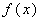
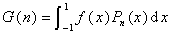
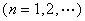
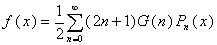

<b>§</b><b>8</b><b>&nbsp;&nbsp; </b><b>勒让德变换及其反演公式</b>

&nbsp;&nbsp;&nbsp; 的勒让德变换为

&nbsp;&nbsp;&nbsp;&nbsp;&nbsp;&nbsp;&nbsp;&nbsp;&nbsp;&nbsp;&nbsp;&nbsp;&nbsp;&nbsp;&nbsp;&nbsp;
&nbsp;&nbsp;&nbsp;&nbsp;&nbsp;

&nbsp;&nbsp; 勒让德变换的反演公式为

&nbsp;&nbsp;&nbsp;&nbsp;&nbsp;&nbsp;&nbsp;&nbsp;&nbsp;&nbsp;&nbsp;&nbsp;&nbsp;&nbsp;&nbsp;&nbsp;

式中 <i>P n</i> ( <i>x</i> )是勒让德多项式.

