

四、菲涅耳函数

[菲涅耳函数的定义与其他表达式]

<pre>&nbsp;&nbsp;&nbsp; 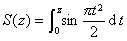</pre><pre>&nbsp;&nbsp;&nbsp;&nbsp;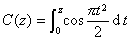</pre>

它们都是的整函数.

<pre>&nbsp;&nbsp;&nbsp;&nbsp; &nbsp;&nbsp;&nbsp;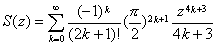&nbsp;&nbsp;&nbsp;&nbsp;&nbsp;&nbsp;&nbsp;</pre><pre>&nbsp;&nbsp;&nbsp;&nbsp;&nbsp;&nbsp;&nbsp;&nbsp;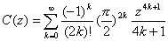&nbsp;&nbsp;&nbsp;&nbsp;&nbsp;&nbsp;&nbsp;&nbsp;&nbsp;&nbsp;</pre><pre>&nbsp;&nbsp;&nbsp;&nbsp;&nbsp;&nbsp;&nbsp;&nbsp;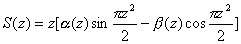&nbsp;&nbsp;&nbsp;&nbsp;</pre><pre>&nbsp;&nbsp;&nbsp;&nbsp;&nbsp;&nbsp;&nbsp;&nbsp;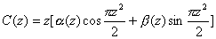&nbsp;&nbsp;&nbsp;&nbsp;</pre>

式中&nbsp;&nbsp;&nbsp; 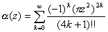

<pre>&nbsp;&nbsp;&nbsp; 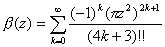</pre>

&nbsp;&nbsp;&nbsp;
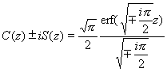&nbsp;&nbsp;&nbsp;&nbsp;&nbsp;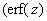为概率积分

[菲涅耳函数的渐近表达式]

<pre>&nbsp;&nbsp;&nbsp; 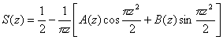&nbsp;&nbsp;&nbsp;&nbsp;&nbsp;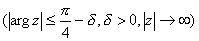</pre><pre>&nbsp;&nbsp;&nbsp;&nbsp;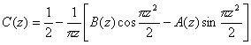</pre>

式中

<pre>&nbsp;&nbsp;&nbsp;&nbsp; &nbsp;&nbsp;&nbsp;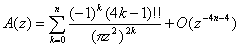</pre><pre>&nbsp;&nbsp;&nbsp;&nbsp;&nbsp;&nbsp;&nbsp;&nbsp;&nbsp;&nbsp;&nbsp;&nbsp;&nbsp;&nbsp; &nbsp;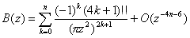</pre>

特别

<pre>&nbsp;&nbsp;&nbsp;&nbsp; &nbsp;&nbsp;&nbsp;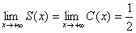</pre>
