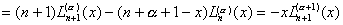

四、拉盖尔多项式

1.&nbsp;&nbsp;&nbsp;&nbsp;&nbsp;&nbsp;&nbsp;
1.&nbsp;&nbsp;&nbsp;&nbsp;&nbsp;&nbsp;&nbsp;
一般拉盖尔多项式

[一般拉盖尔多项式的母函数] 由母函数按展开：

&nbsp;&nbsp;&nbsp; &nbsp;&nbsp;&nbsp;&nbsp;&nbsp;&nbsp;&nbsp;&nbsp;&nbsp;&nbsp;

来定义一般拉盖尔多项式序列.

[一般拉盖尔多项式的表达式]

&nbsp;&nbsp;&nbsp; 

&nbsp;&nbsp;&nbsp;&nbsp;&nbsp;&nbsp;&nbsp;&nbsp;&nbsp;

&nbsp;&nbsp;&nbsp;&nbsp;&nbsp;&nbsp;&nbsp;&nbsp;&nbsp;

&nbsp;&nbsp;&nbsp; &nbsp;&nbsp;

&nbsp;&nbsp;&nbsp; 

&nbsp;&nbsp;&nbsp; 

式中为库默尔函数，是阶贝塞耳函数。特别

&nbsp;&nbsp;&nbsp;&nbsp;&nbsp;&nbsp;&nbsp;&nbsp;&nbsp;&nbsp;&nbsp;&nbsp;&nbsp;&nbsp;&nbsp;&nbsp;&nbsp;&nbsp;&nbsp;&nbsp;

[一般拉盖尔微分方程]

&nbsp;&nbsp;&nbsp; 

[一般拉盖尔多项式的正交性]

&nbsp;&nbsp;&nbsp; 

[不等式与特殊值]

&nbsp;&nbsp;&nbsp; 

&nbsp;&nbsp;&nbsp; 

[递推公式与有关公式]

&nbsp;&nbsp;&nbsp; &nbsp;&nbsp;&nbsp; （递推公式）

&nbsp;&nbsp;&nbsp; 

&nbsp;&nbsp;&nbsp; 

&nbsp;&nbsp;&nbsp;&nbsp;&nbsp;&nbsp;&nbsp;&nbsp;&nbsp;&nbsp;&nbsp;&nbsp;&nbsp;&nbsp;&nbsp;

&nbsp;&nbsp;&nbsp; 

&nbsp;&nbsp;&nbsp; 

&nbsp;&nbsp;&nbsp; 

&nbsp;&nbsp;&nbsp; 

式中是埃尔米特多项式。

