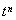

七、盖根堡多项式

[盖根堡多项式的母函数]&nbsp; 由母函数按的展开式

&nbsp;&nbsp;&nbsp; &nbsp;&nbsp;&nbsp;&nbsp;

来定义盖根堡多项式序列又称为特种球多项式.

[盖根堡多项式的表达式]

&nbsp;&nbsp;&nbsp; 

&nbsp;&nbsp;&nbsp; &nbsp;&nbsp;&nbsp;&nbsp;&nbsp;

&nbsp;&nbsp;&nbsp; &nbsp;&nbsp;&nbsp;&nbsp;&nbsp;

&nbsp;&nbsp;&nbsp;&nbsp;&nbsp;&nbsp;&nbsp; 

&nbsp;&nbsp;&nbsp;&nbsp;&nbsp;&nbsp;&nbsp;&nbsp;&nbsp;&nbsp;&nbsp;&nbsp;&nbsp;&nbsp;&nbsp;

&nbsp;&nbsp;&nbsp;&nbsp;&nbsp;&nbsp;&nbsp;&nbsp;&nbsp;&nbsp;&nbsp;&nbsp;&nbsp;&nbsp;&nbsp;&nbsp;&nbsp;&nbsp;&nbsp;&nbsp;&nbsp;&nbsp;&nbsp;&nbsp;&nbsp;&nbsp;&nbsp;&nbsp;&nbsp;&nbsp;&nbsp;&nbsp;&nbsp;&nbsp;&nbsp;&nbsp;&nbsp;&nbsp;&nbsp;&nbsp;&nbsp;&nbsp;

式中为超几何函数.

&nbsp;&nbsp;&nbsp;&nbsp;&nbsp;&nbsp;&nbsp; 

&nbsp;&nbsp;&nbsp;&nbsp;&nbsp;&nbsp;&nbsp; ······················································

[盖根堡微分方程]

&nbsp;&nbsp;&nbsp; 

[盖根堡多项式的正交性]

&nbsp;&nbsp;&nbsp; 

[不等式与特殊值]

&nbsp;&nbsp;&nbsp; &nbsp;&nbsp;&nbsp;&nbsp;&nbsp;&nbsp;&nbsp;&nbsp;&nbsp;&nbsp;&nbsp;&nbsp;&nbsp;&nbsp;&nbsp;&nbsp;&nbsp;&nbsp;&nbsp;&nbsp;&nbsp;&nbsp;&nbsp;&nbsp;&nbsp;&nbsp;&nbsp;&nbsp;&nbsp;&nbsp;

&nbsp;&nbsp;&nbsp; &nbsp;&nbsp;&nbsp;&nbsp;&nbsp;&nbsp;&nbsp;&nbsp;&nbsp;&nbsp;&nbsp;且不为整数）

&nbsp;&nbsp;&nbsp; 

&nbsp;&nbsp;&nbsp;&nbsp;&nbsp;&nbsp;&nbsp;&nbsp;&nbsp;&nbsp;&nbsp;&nbsp;&nbsp;&nbsp;&nbsp;&nbsp;&nbsp;&nbsp;&nbsp;&nbsp;&nbsp;&nbsp;&nbsp;&nbsp;&nbsp;&nbsp;&nbsp;&nbsp;&nbsp;&nbsp;&nbsp;&nbsp;&nbsp;&nbsp;
（不为整数，且

&nbsp;&nbsp;&nbsp; 

&nbsp;&nbsp;&nbsp; 

&nbsp;&nbsp;&nbsp; 

[递推公式与有关公式]

&nbsp;&nbsp;&nbsp; &nbsp;&nbsp;&nbsp;&nbsp;（递推公式）

&nbsp;&nbsp;&nbsp; 

&nbsp;&nbsp;&nbsp; 

&nbsp;&nbsp;&nbsp; 

&nbsp;&nbsp;&nbsp; 

&nbsp;&nbsp;&nbsp; 

