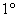
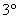

<b>§ 6 </b><b>椭</b><b> </b><b>圆</b><b> </b><b>函</b><b> </b><b>数</b>

一、&nbsp;&nbsp;&nbsp; 一、&nbsp;&nbsp;&nbsp;&nbsp;&nbsp;&nbsp;&nbsp; 椭圆函数的定义与性质

双周期的半纯函数称为椭圆函数.

<table cellspacing=0 cellpadding=0 hspace=0 vspace=0 align=left>
 <tr>
  <td valign=top align=left style='padding-top:0mm;padding-right:9.0pt;
  padding-bottom:0mm;padding-left:9.0pt'>
  

  

  

  </td>
 </tr>
</table>

若和是椭圆函数的两个基本周期（也称原始周期），对于任意整数有

<pre>&nbsp;&nbsp;&nbsp;&nbsp;&nbsp;&nbsp;&nbsp;&nbsp;&nbsp;&nbsp;&nbsp;&nbsp;&nbsp;&nbsp;&nbsp;&nbsp;&nbsp;&nbsp;&nbsp;&nbsp;&nbsp; </pre>

以

&nbsp;&nbsp;&nbsp;&nbsp;&nbsp;&nbsp;&nbsp;&nbsp;&nbsp;&nbsp;&nbsp;&nbsp;&nbsp;&nbsp;&nbsp;&nbsp;

为顶点（其中为任一复数）的平行四边形称为

周期平行四边形.整个平面可组成这样的周

期平行四边形网（图12.6）.

在一个周期平行四边形内（包括两个

邻边及其交点）极点的个数（极点个数与零点个

数相等，阶极点算作个）称为椭圆函数的阶.阶为的椭圆函数称为阶椭圆函数.

椭圆函数具有以下性质：

&nbsp;周期相同的椭圆函数的和、差、积、商及导数是具有同样周期的椭圆函数.

&nbsp;不是常数的椭圆函数必有极点.

具有相同周期、零点和极点（零点和极点的阶数也相同）的椭圆函数的商是一个常数.

具有相同周期、相同的极点、且在每一极点上的主要部分也相同的椭圆函数相差一个常数.

&nbsp;椭圆函数在它的周期平行四边形内所有极点上留数之和等于零.

&nbsp;椭圆函数的阶数至少等于2.

&nbsp;在周期平行四边形内，椭圆函数取每一个（有限或无限）值的次数一样，且等于椭圆函数的阶.

&nbsp;椭圆函数在周期平行四边形内所有零点的和与所有极点之和的差等于它的某个周期，即

&nbsp;&nbsp;&nbsp;&nbsp;&nbsp;&nbsp;&nbsp;&nbsp;&nbsp;&nbsp;&nbsp;&nbsp;&nbsp;&nbsp;&nbsp;&nbsp;&nbsp;&nbsp;

式中为零点， 为极点，为某一确定整数.

