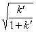
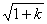
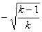
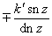
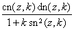

二、雅可比椭圆函数

[雅可比椭圆函数的定义与级数表达式]

第一类椭圆积分

&nbsp;&nbsp;&nbsp;&nbsp;&nbsp;&nbsp;&nbsp;&nbsp;&nbsp;&nbsp;&nbsp;&nbsp;&nbsp;&nbsp;

的反函数是双周期的亚纯函数，记作

&nbsp;&nbsp;&nbsp;&nbsp;&nbsp;&nbsp;&nbsp;&nbsp;&nbsp;&nbsp;&nbsp;&nbsp;&nbsp;&nbsp;&nbsp;&nbsp;&nbsp;&nbsp;&nbsp;&nbsp;&nbsp;&nbsp;&nbsp;&nbsp;&nbsp;

它具有基本周期：

&nbsp;&nbsp;&nbsp;&nbsp;&nbsp;&nbsp;&nbsp;

&nbsp;&nbsp;&nbsp;&nbsp;&nbsp;&nbsp;&nbsp;
&nbsp;&nbsp;&nbsp;&nbsp;&nbsp;&nbsp;&nbsp;&nbsp;

称为椭圆正弦，式中称为模，称为补模.若

&nbsp;&nbsp;&nbsp;&nbsp;&nbsp;&nbsp;&nbsp;&nbsp;&nbsp;&nbsp;&nbsp;&nbsp;&nbsp;&nbsp;&nbsp;&nbsp;&nbsp;&nbsp;&nbsp;&nbsp;&nbsp;&nbsp;&nbsp;&nbsp;

则称为的振幅函数，记作.又定义

&nbsp;&nbsp;&nbsp;&nbsp;&nbsp;&nbsp;&nbsp;
&nbsp;&nbsp;&nbsp;&nbsp;&nbsp;&nbsp;&nbsp;&nbsp;&nbsp;&nbsp;&nbsp;&nbsp;&nbsp;&nbsp;&nbsp;&nbsp;&nbsp;&nbsp;（称为椭圆余弦）

&nbsp;&nbsp;&nbsp;&nbsp;&nbsp;&nbsp;&nbsp;
&nbsp;&nbsp;&nbsp;&nbsp;&nbsp;&nbsp;&nbsp;&nbsp;&nbsp;&nbsp;&nbsp;&nbsp;&nbsp;（称为椭圆正切）

&nbsp;&nbsp;&nbsp;&nbsp;&nbsp;&nbsp;&nbsp;

统称为雅可比椭圆函数.它们都是二阶椭圆函数.

&nbsp;&nbsp;&nbsp;&nbsp;&nbsp;&nbsp;&nbsp;

&nbsp;&nbsp;&nbsp;&nbsp;&nbsp;&nbsp;&nbsp;&nbsp;&nbsp;&nbsp;&nbsp;&nbsp;&nbsp;

&nbsp;&nbsp;&nbsp;&nbsp;&nbsp;&nbsp;&nbsp;

&nbsp;&nbsp;&nbsp;&nbsp;&nbsp;&nbsp;&nbsp;&nbsp;&nbsp;&nbsp;&nbsp;&nbsp;&nbsp;

&nbsp;&nbsp;&nbsp;&nbsp;&nbsp;&nbsp;&nbsp;

&nbsp;&nbsp;&nbsp;&nbsp;&nbsp;&nbsp;&nbsp;&nbsp;&nbsp;&nbsp;&nbsp;&nbsp;&nbsp;

&nbsp;&nbsp;&nbsp;&nbsp;&nbsp;&nbsp;&nbsp;

&nbsp;&nbsp;&nbsp;&nbsp;&nbsp;&nbsp;&nbsp;&nbsp;&nbsp;&nbsp;&nbsp;&nbsp;&nbsp;

[特殊点的值]

<table class=MsoNormalTable border=1 cellspacing=0 cellpadding=0
 style='border-collapse:collapse;border:none'>
 <tr>
  <td width=71 valign=top style='width:53.25pt;border:solid windowtext 1.0pt;
  padding:0mm 5.4pt 0mm 5.4pt'>
  

  </td>
  <td width=64 valign=top style='width:48.15pt;border:solid windowtext 1.0pt;
  border-left:none;padding:0mm 5.4pt 0mm 5.4pt'>
  

  </td>
  <td width=88 valign=top style='width:66.0pt;border:solid windowtext 1.0pt;
  border-left:none;padding:0mm 5.4pt 0mm 5.4pt'>
  

  </td>
  <td width=64 valign=top style='width:48.0pt;border:solid windowtext 1.0pt;
  border-left:none;padding:0mm 5.4pt 0mm 5.4pt'>
  

  </td>
  <td width=88 valign=top style='width:66.0pt;border:solid windowtext 1.0pt;
  border-left:none;padding:0mm 5.4pt 0mm 5.4pt'>
  

  </td>
  <td width=96 valign=top style='width:72.0pt;border:solid windowtext 1.0pt;
  border-left:none;padding:0mm 5.4pt 0mm 5.4pt'>
  

  </td>
  <td width=80 valign=top style='width:60.0pt;border:solid windowtext 1.0pt;
  border-left:none;padding:0mm 5.4pt 0mm 5.4pt'>
  

  </td>
  <td width=88 valign=top style='width:66.0pt;border:solid windowtext 1.0pt;
  border-left:none;padding:0mm 5.4pt 0mm 5.4pt'>
  

  </td>
 </tr>
 <tr>
  <td width=71 valign=top style='width:53.25pt;border:solid windowtext 1.0pt;
  border-top:none;padding:0mm 5.4pt 0mm 5.4pt'>
  

  
&nbsp;

  

  
&nbsp;

  

  </td>
  <td width=64 valign=top style='width:48.15pt;border-top:none;border-left:
  none;border-bottom:solid windowtext 1.0pt;border-right:solid windowtext 1.0pt;
  padding:0mm 5.4pt 0mm 5.4pt'>
  
0

  
&nbsp;

  
1

  
&nbsp;

  
1

  </td>
  <td width=88 valign=top style='width:66.0pt;border-top:none;border-left:none;
  border-bottom:solid windowtext 1.0pt;border-right:solid windowtext 1.0pt;
  padding:0mm 5.4pt 0mm 5.4pt'>
  

  

  

  </td>
  <td width=64 valign=top style='width:48.0pt;border-top:none;border-left:none;
  border-bottom:solid windowtext 1.0pt;border-right:solid windowtext 1.0pt;
  padding:0mm 5.4pt 0mm 5.4pt'>
  
1

  
&nbsp;

  
0

  
&nbsp;

  

  </td>
  <td width=88 valign=top style='width:66.0pt;border-top:none;border-left:none;
  border-bottom:solid windowtext 1.0pt;border-right:solid windowtext 1.0pt;
  padding:0mm 5.4pt 0mm 5.4pt'>
  

  

  

  </td>
  <td width=96 valign=top style='width:72.0pt;border-top:none;border-left:none;
  border-bottom:solid windowtext 1.0pt;border-right:solid windowtext 1.0pt;
  padding:0mm 5.4pt 0mm 5.4pt'>
  

  

  

  </td>
  <td width=80 valign=top style='width:60.0pt;border-top:none;border-left:none;
  border-bottom:solid windowtext 1.0pt;border-right:solid windowtext 1.0pt;
  padding:0mm 5.4pt 0mm 5.4pt'>
  

  
&nbsp;

  

  
&nbsp;

  

  </td>
  <td width=88 valign=top style='width:66.0pt;border-top:none;border-left:none;
  border-bottom:solid windowtext 1.0pt;border-right:solid windowtext 1.0pt;
  padding:0mm 5.4pt 0mm 5.4pt'>
  

  

  
0

  </td>
 </tr>
</table>

[周期·零点·极点·留数]

<table class=MsoNormalTable border=1 cellspacing=0 cellpadding=0
 style='border-collapse:collapse;border:none'>
 <tr>
  <td width=63 valign=top style='width:47.4pt;border:solid windowtext 1.0pt;
  padding:0mm 5.4pt 0mm 5.4pt'>
  
&nbsp; 

  </td>
  <td width=128 valign=top style='width:96.0pt;border:solid windowtext 1.0pt;
  border-left:none;padding:0mm 5.4pt 0mm 5.4pt'>
  
基本周期

  </td>
  <td width=184 valign=top style='width:138.0pt;border:solid windowtext 1.0pt;
  border-left:none;padding:0mm 5.4pt 0mm 5.4pt'>
  
零&nbsp;&nbsp; 点

  </td>
  <td width=144 valign=top style='width:108.0pt;border:solid windowtext 1.0pt;
  border-left:none;padding:0mm 5.4pt 0mm 5.4pt'>
  
极&nbsp; 点

  </td>
  <td width=120 valign=top style='width:90.0pt;border:solid windowtext 1.0pt;
  border-left:none;padding:0mm 5.4pt 0mm 5.4pt'>
  
留&nbsp; 数

  </td>
 </tr>
 <tr>
  <td width=63 valign=top style='width:47.4pt;border:solid windowtext 1.0pt;
  border-top:none;padding:0mm 5.4pt 0mm 5.4pt'>
  

  

  

  </td>
  <td width=128 valign=top style='width:96.0pt;border-top:none;border-left:
  none;border-bottom:solid windowtext 1.0pt;border-right:solid windowtext 1.0pt;
  padding:0mm 5.4pt 0mm 5.4pt'>
  

  

  

  </td>
  <td width=184 valign=top style='width:138.0pt;border-top:none;border-left:
  none;border-bottom:solid windowtext 1.0pt;border-right:solid windowtext 1.0pt;
  padding:0mm 5.4pt 0mm 5.4pt'>
  

  

  

  </td>
  <td width=144 valign=top style='width:108.0pt;border-top:none;border-left:
  none;border-bottom:solid windowtext 1.0pt;border-right:solid windowtext 1.0pt;
  padding:0mm 5.4pt 0mm 5.4pt'>
  

  

  

  </td>
  <td width=120 valign=top style='width:90.0pt;border-top:none;border-left:
  none;border-bottom:solid windowtext 1.0pt;border-right:solid windowtext 1.0pt;
  padding:0mm 5.4pt 0mm 5.4pt'>
  

  

  

  </td>
 </tr>
</table>

&nbsp;&nbsp;&nbsp; [诱导公式表]&nbsp;&nbsp;&nbsp;&nbsp;&nbsp;&nbsp;&nbsp;&nbsp;

<table class=MsoNormalTable border=1 cellspacing=0 cellpadding=0
 style='border-collapse:collapse;border:none'>
 <tr style='height:17.8pt'>
  <td width=95 style='width:71.0pt;border:solid black 1.0pt;padding:0mm 5.4pt 0mm 5.4pt;
  height:17.8pt'>
  
<i></i>

  </td>
  <td width=113 style='width:84.4pt;border:solid black 1.0pt;border-left:none;
  padding:0mm 5.4pt 0mm 5.4pt;height:17.8pt'>
  
-1

  </td>
  <td width=104 style='width:78.0pt;border:solid black 1.0pt;border-left:none;
  padding:0mm 5.4pt 0mm 5.4pt;height:17.8pt'>
  
0

  </td>
  <td width=104 style='width:78.0pt;border:solid black 1.0pt;border-left:none;
  padding:0mm 5.4pt 0mm 5.4pt;height:17.8pt'>
  
1

  </td>
  <td width=104 style='width:78.0pt;border:solid black 1.0pt;border-left:none;
  padding:0mm 5.4pt 0mm 5.4pt;height:17.8pt'>
  
2

  </td>
  <td width=120 style='width:90.0pt;border:solid black 1.0pt;border-left:none;
  padding:0mm 5.4pt 0mm 5.4pt;height:17.8pt'>
  
2<i>p</i>

  </td>
 </tr>
 <tr style='height:23.8pt'>
  <td width=95 valign=top style='width:71.0pt;border-top:none;border-left:solid black 1.0pt;
  border-bottom:solid windowtext 1.0pt;border-right:solid black 1.0pt;
  padding:0mm 5.4pt 0mm 5.4pt;height:23.8pt'>
  
-1

  
&nbsp;

  
0

  </td>
  <td width=113 valign=top style='width:84.4pt;border-top:none;border-left:
  none;border-bottom:solid windowtext 1.0pt;border-right:solid black 1.0pt;
  padding:0mm 5.4pt 0mm 5.4pt;height:23.8pt'>
  

  

  </td>
  <td width=104 valign=top style='width:78.0pt;border-top:none;border-left:
  none;border-bottom:solid windowtext 1.0pt;border-right:solid black 1.0pt;
  padding:0mm 5.4pt 0mm 5.4pt;height:23.8pt'>
  

  

  </td>
  <td width=104 valign=top style='width:78.0pt;border-top:none;border-left:
  none;border-bottom:solid windowtext 1.0pt;border-right:solid black 1.0pt;
  padding:0mm 5.4pt 0mm 5.4pt;height:23.8pt'>
  

  

  </td>
  <td width=104 valign=top style='width:78.0pt;border-top:none;border-left:
  none;border-bottom:solid windowtext 1.0pt;border-right:solid black 1.0pt;
  padding:0mm 5.4pt 0mm 5.4pt;height:23.8pt'>
  

  

  </td>
  <td width=120 valign=top style='width:90.0pt;border-top:none;border-left:
  none;border-bottom:solid windowtext 1.0pt;border-right:solid black 1.0pt;
  padding:0mm 5.4pt 0mm 5.4pt;height:23.8pt'>
  
&nbsp; 

  </td>
 </tr>
 <tr style='height:24.05pt'>
  <td width=95 style='width:71.0pt;border:solid black 1.0pt;border-top:none;
  padding:0mm 5.4pt 0mm 5.4pt;height:24.05pt'>
  
<i>n&nbsp;&nbsp;&nbsp;&nbsp;&nbsp; &nbsp;m</i>

  </td>
  <td width=113 style='width:84.4pt;border-top:none;border-left:none;
  border-bottom:solid black 1.0pt;border-right:solid black 1.0pt;padding:0mm 5.4pt 0mm 5.4pt;
  height:24.05pt'>
  
-1

  </td>
  <td width=104 style='width:78.0pt;border-top:none;border-left:none;
  border-bottom:solid black 1.0pt;border-right:solid black 1.0pt;padding:0mm 5.4pt 0mm 5.4pt;
  height:24.05pt'>
  
0

  </td>
  <td width=104 style='width:78.0pt;border-top:none;border-left:none;
  border-bottom:solid black 1.0pt;border-right:solid black 1.0pt;padding:0mm 5.4pt 0mm 5.4pt;
  height:24.05pt'>
  
1

  </td>
  <td width=104 style='width:78.0pt;border-top:none;border-left:none;
  border-bottom:solid black 1.0pt;border-right:solid black 1.0pt;padding:0mm 5.4pt 0mm 5.4pt;
  height:24.05pt'>
  
2

  </td>
  <td width=120 style='width:90.0pt;border-top:none;border-left:none;
  border-bottom:solid black 1.0pt;border-right:solid black 1.0pt;padding:0mm 5.4pt 0mm 5.4pt;
  height:24.05pt'>
  
2<i>p</i>

  </td>
 </tr>
 <tr style='height:63.0pt'>
  <td width=95 valign=top style='width:71.0pt;border:solid black 1.0pt;
  border-top:none;padding:0mm 5.4pt 0mm 5.4pt;height:63.0pt'>
  
1

  
&nbsp;

  
2

  </td>
  <td width=113 valign=top style='width:84.4pt;border-top:none;border-left:
  none;border-bottom:solid black 1.0pt;border-right:solid black 1.0pt;
  padding:0mm 5.4pt 0mm 5.4pt;height:63.0pt'>
  

  

  </td>
  <td width=104 valign=top style='width:78.0pt;border-top:none;border-left:
  none;border-bottom:solid black 1.0pt;border-right:solid black 1.0pt;
  padding:0mm 5.4pt 0mm 5.4pt;height:63.0pt'>
  

  

  </td>
  <td width=104 valign=top style='width:78.0pt;border-top:none;border-left:
  none;border-bottom:solid black 1.0pt;border-right:solid black 1.0pt;
  padding:0mm 5.4pt 0mm 5.4pt;height:63.0pt'>
  

  

  </td>
  <td width=104 valign=top style='width:78.0pt;border-top:none;border-left:
  none;border-bottom:solid black 1.0pt;border-right:solid black 1.0pt;
  padding:0mm 5.4pt 0mm 5.4pt;height:63.0pt'>
  

  

  </td>
  <td width=120 valign=top style='width:90.0pt;border-top:none;border-left:
  none;border-bottom:solid black 1.0pt;border-right:solid black 1.0pt;
  padding:0mm 5.4pt 0mm 5.4pt;height:63.0pt'>
  
&nbsp; 

  </td>
 </tr>
 <tr>
  <td width=95 valign=top style='width:71.0pt;border:solid black 1.0pt;
  border-top:none;padding:0mm 5.4pt 0mm 5.4pt'>
  
2<i>q</i>

  </td>
  <td width=113 valign=top style='width:84.4pt;border-top:none;border-left:
  none;border-bottom:solid black 1.0pt;border-right:solid black 1.0pt;
  padding:0mm 5.4pt 0mm 5.4pt'>
  
&nbsp; 

  </td>
  <td width=104 valign=top style='width:78.0pt;border-top:none;border-left:
  none;border-bottom:solid black 1.0pt;border-right:solid black 1.0pt;
  padding:0mm 5.4pt 0mm 5.4pt'>
  
&nbsp; 

  </td>
  <td width=104 valign=top style='width:78.0pt;border-top:none;border-left:
  none;border-bottom:solid black 1.0pt;border-right:solid black 1.0pt;
  padding:0mm 5.4pt 0mm 5.4pt'>
  
&nbsp; 

  </td>
  <td width=104 valign=top style='width:78.0pt;border-top:none;border-left:
  none;border-bottom:solid black 1.0pt;border-right:solid black 1.0pt;
  padding:0mm 5.4pt 0mm 5.4pt'>
  
&nbsp; 

  </td>
  <td width=120 valign=top style='width:90.0pt;border-top:none;border-left:
  none;border-bottom:solid black 1.0pt;border-right:solid black 1.0pt;
  padding:0mm 5.4pt 0mm 5.4pt'>
  

  </td>
 </tr>
</table>
<pre>&nbsp;&nbsp;&nbsp;&nbsp;&nbsp;&nbsp;&nbsp;&nbsp;&nbsp;&nbsp;&nbsp;&nbsp;&nbsp;&nbsp;&nbsp;&nbsp;&nbsp;&nbsp;&nbsp;&nbsp;&nbsp;&nbsp;&nbsp;&nbsp;&nbsp; </pre>
<table class=MsoNormalTable border=1 cellspacing=0 cellpadding=0
 style='border-collapse:collapse;border:none'>
 <tr style='height:17.8pt'>
  <td width=95 valign=top style='width:71.0pt;border:solid black 1.0pt;
  padding:0mm 5.4pt 0mm 5.4pt;height:17.8pt'>
  
<i></i>

  </td>
  <td width=113 valign=top style='width:84.4pt;border:solid black 1.0pt;
  border-left:none;padding:0mm 5.4pt 0mm 5.4pt;height:17.8pt'>
  
-1

  </td>
  <td width=104 valign=top style='width:78.0pt;border:solid black 1.0pt;
  border-left:none;padding:0mm 5.4pt 0mm 5.4pt;height:17.8pt'>
  
0

  </td>
  <td width=104 valign=top style='width:78.0pt;border:solid black 1.0pt;
  border-left:none;padding:0mm 5.4pt 0mm 5.4pt;height:17.8pt'>
  
1

  </td>
  <td width=104 valign=top style='width:78.0pt;border:solid black 1.0pt;
  border-left:none;padding:0mm 5.4pt 0mm 5.4pt;height:17.8pt'>
  
2

  </td>
  <td width=120 valign=top style='width:90.0pt;border:solid black 1.0pt;
  border-left:none;padding:0mm 5.4pt 0mm 5.4pt;height:17.8pt'>
  
2<i>p</i>

  </td>
 </tr>
 <tr>
  <td width=95 valign=top style='width:71.0pt;border:solid black 1.0pt;
  border-top:none;padding:0mm 5.4pt 0mm 5.4pt'>
  
-1

  
&nbsp;

  
0

  
&nbsp;

  
1

  
2

  </td>
  <td width=113 valign=top style='width:84.4pt;border-top:none;border-left:
  none;border-bottom:solid black 1.0pt;border-right:solid black 1.0pt;
  padding:0mm 5.4pt 0mm 5.4pt'>
  

  

  

  

  </td>
  <td width=104 valign=top style='width:78.0pt;border-top:none;border-left:
  none;border-bottom:solid black 1.0pt;border-right:solid black 1.0pt;
  padding:0mm 5.4pt 0mm 5.4pt'>
  

  

  
&nbsp;

  

  

  </td>
  <td width=104 valign=top style='width:78.0pt;border-top:none;border-left:
  none;border-bottom:solid black 1.0pt;border-right:solid black 1.0pt;
  padding:0mm 5.4pt 0mm 5.4pt'>
  

  

  

  

  </td>
  <td width=104 valign=top style='width:78.0pt;border-top:none;border-left:
  none;border-bottom:solid black 1.0pt;border-right:solid black 1.0pt;
  padding:0mm 5.4pt 0mm 5.4pt'>
  

  

  
&nbsp;

  

  

  </td>
  <td width=120 valign=top style='width:90.0pt;border-top:none;border-left:
  none;border-bottom:solid black 1.0pt;border-right:solid black 1.0pt;
  padding:0mm 5.4pt 0mm 5.4pt'>
  
&nbsp; 

  </td>
 </tr>
 <tr>
  <td width=95 valign=top style='width:71.0pt;border:solid black 1.0pt;
  border-top:none;padding:0mm 5.4pt 0mm 5.4pt'>
  
2<i>q</i>

  </td>
  <td width=113 valign=top style='width:84.4pt;border-top:none;border-left:
  none;border-bottom:solid black 1.0pt;border-right:solid black 1.0pt;
  padding:0mm 5.4pt 0mm 5.4pt'>
  
&nbsp; 

  </td>
  <td width=104 valign=top style='width:78.0pt;border-top:none;border-left:
  none;border-bottom:solid black 1.0pt;border-right:solid black 1.0pt;
  padding:0mm 5.4pt 0mm 5.4pt'>
  
&nbsp; 

  </td>
  <td width=104 valign=top style='width:78.0pt;border-top:none;border-left:
  none;border-bottom:solid black 1.0pt;border-right:solid black 1.0pt;
  padding:0mm 5.4pt 0mm 5.4pt'>
  
&nbsp; 

  </td>
  <td width=104 valign=top style='width:78.0pt;border-top:none;border-left:
  none;border-bottom:solid black 1.0pt;border-right:solid black 1.0pt;
  padding:0mm 5.4pt 0mm 5.4pt'>
  
&nbsp; 

  </td>
  <td width=120 valign=top style='width:90.0pt;border-top:none;border-left:
  none;border-bottom:solid black 1.0pt;border-right:solid black 1.0pt;
  padding:0mm 5.4pt 0mm 5.4pt'>
  

  </td>
 </tr>
</table>
<pre>&nbsp;&nbsp;&nbsp;&nbsp;&nbsp;&nbsp;&nbsp;&nbsp;&nbsp;&nbsp;&nbsp;&nbsp;&nbsp;&nbsp;&nbsp;&nbsp;&nbsp;&nbsp;&nbsp;&nbsp;&nbsp;&nbsp; </pre>
<table class=MsoNormalTable border=1 cellspacing=0 cellpadding=0
 style='border-collapse:collapse;border:none'>
 <tr style='height:17.8pt'>
  <td width=95 valign=top style='width:71.0pt;border:solid black 1.0pt;
  padding:0mm 5.4pt 0mm 5.4pt;height:17.8pt'>
  
<i></i>

  </td>
  <td width=113 valign=top style='width:84.4pt;border:solid black 1.0pt;
  border-left:none;padding:0mm 5.4pt 0mm 5.4pt;height:17.8pt'>
  
-1

  </td>
  <td width=104 valign=top style='width:78.0pt;border:solid black 1.0pt;
  border-left:none;padding:0mm 5.4pt 0mm 5.4pt;height:17.8pt'>
  
0

  </td>
  <td width=104 valign=top style='width:78.0pt;border:solid black 1.0pt;
  border-left:none;padding:0mm 5.4pt 0mm 5.4pt;height:17.8pt'>
  
1

  </td>
  <td width=104 valign=top style='width:78.0pt;border:solid black 1.0pt;
  border-left:none;padding:0mm 5.4pt 0mm 5.4pt;height:17.8pt'>
  
2

  </td>
  <td width=120 valign=top style='width:90.0pt;border:solid black 1.0pt;
  border-left:none;padding:0mm 5.4pt 0mm 5.4pt;height:17.8pt'>
  
<i>p</i>

  </td>
 </tr>
 <tr>
  <td width=95 valign=top style='width:71.0pt;border:solid black 1.0pt;
  border-top:none;padding:0mm 5.4pt 0mm 5.4pt'>
  
-1

  
&nbsp;

  
0

  
&nbsp;

  
1

  
2

  </td>
  <td width=113 valign=top style='width:84.4pt;border-top:none;border-left:
  none;border-bottom:solid black 1.0pt;border-right:solid black 1.0pt;
  padding:0mm 5.4pt 0mm 5.4pt'>
  

  

  

  

  </td>
  <td width=104 valign=top style='width:78.0pt;border-top:none;border-left:
  none;border-bottom:solid black 1.0pt;border-right:solid black 1.0pt;
  padding:0mm 5.4pt 0mm 5.4pt'>
  

  

  
&nbsp;

  

  

  </td>
  <td width=104 valign=top style='width:78.0pt;border-top:none;border-left:
  none;border-bottom:solid black 1.0pt;border-right:solid black 1.0pt;
  padding:0mm 5.4pt 0mm 5.4pt'>
  

  

  

  

  </td>
  <td width=104 valign=top style='width:78.0pt;border-top:none;border-left:
  none;border-bottom:solid black 1.0pt;border-right:solid black 1.0pt;
  padding:0mm 5.4pt 0mm 5.4pt'>
  

  

  
&nbsp;

  

  

  </td>
  <td width=120 valign=top style='width:90.0pt;border-top:none;border-left:
  none;border-bottom:solid black 1.0pt;border-right:solid black 1.0pt;
  padding:0mm 5.4pt 0mm 5.4pt'>
  
&nbsp; 

  </td>
 </tr>
 <tr>
  <td width=95 valign=top style='width:71.0pt;border:solid black 1.0pt;
  border-top:none;padding:0mm 5.4pt 0mm 5.4pt'>
  
<i>q</i>

  </td>
  <td width=113 valign=top style='width:84.4pt;border-top:none;border-left:
  none;border-bottom:solid black 1.0pt;border-right:solid black 1.0pt;
  padding:0mm 5.4pt 0mm 5.4pt'>
  
&nbsp; 

  </td>
  <td width=104 valign=top style='width:78.0pt;border-top:none;border-left:
  none;border-bottom:solid black 1.0pt;border-right:solid black 1.0pt;
  padding:0mm 5.4pt 0mm 5.4pt'>
  
&nbsp; 

  </td>
  <td width=104 valign=top style='width:78.0pt;border-top:none;border-left:
  none;border-bottom:solid black 1.0pt;border-right:solid black 1.0pt;
  padding:0mm 5.4pt 0mm 5.4pt'>
  
&nbsp; 

  </td>
  <td width=104 valign=top style='width:78.0pt;border-top:none;border-left:
  none;border-bottom:solid black 1.0pt;border-right:solid black 1.0pt;
  padding:0mm 5.4pt 0mm 5.4pt'>
  
&nbsp; 

  </td>
  <td width=120 valign=top style='width:90.0pt;border-top:none;border-left:
  none;border-bottom:solid black 1.0pt;border-right:solid black 1.0pt;
  padding:0mm 5.4pt 0mm 5.4pt'>
  

  </td>
 </tr>
</table>

&nbsp;&nbsp;&nbsp; [变换公式]

<table class=MsoNormalTable border=1 cellspacing=0 cellpadding=0
 style='border-collapse:collapse;border:none'>
 <tr>
  <td width=64 style='width:48.0pt;border:solid windowtext 1.0pt;padding:0mm 5.4pt 0mm 5.4pt'>
  
&nbsp; 

  </td>
  <td width=80 style='width:60.0pt;border:solid windowtext 1.0pt;border-left:
  none;padding:0mm 5.4pt 0mm 5.4pt'>
  

  </td>
  <td width=80 style='width:60.0pt;border:solid windowtext 1.0pt;border-left:
  none;padding:0mm 5.4pt 0mm 5.4pt'>
  

  </td>
  <td width=232 style='width:174.0pt;border:solid windowtext 1.0pt;border-left:
  none;padding:0mm 5.4pt 0mm 5.4pt'>
  

  </td>
  <td width=200 style='width:150.0pt;border:solid windowtext 1.0pt;border-left:
  none;padding:0mm 5.4pt 0mm 5.4pt'>
  

  </td>
  <td width=272 style='width:203.8pt;border:solid windowtext 1.0pt;border-left:
  none;padding:0mm 5.4pt 0mm 5.4pt'>
  

  </td>
 </tr>
 <tr>
  <td width=64 valign=top style='width:48.0pt;border:solid windowtext 1.0pt;
  border-top:none;padding:0mm 5.4pt 0mm 5.4pt'>
  
&nbsp; 

  </td>
  <td width=80 valign=top style='width:60.0pt;border-top:none;border-left:none;
  border-bottom:solid windowtext 1.0pt;border-right:solid windowtext 1.0pt;
  padding:0mm 5.4pt 0mm 5.4pt'>
  

  
&nbsp;

  

  

  
&nbsp;

  

  

  
&nbsp;

  

  

  </td>
  <td width=80 valign=top style='width:60.0pt;border-top:none;border-left:none;
  border-bottom:solid windowtext 1.0pt;border-right:solid windowtext 1.0pt;
  padding:0mm 5.4pt 0mm 5.4pt'>
  

  

  

  

  

  

  

  </td>
  <td width=232 valign=top style='width:174.0pt;border-top:none;border-left:
  none;border-bottom:solid windowtext 1.0pt;border-right:solid windowtext 1.0pt;
  padding:0mm 5.4pt 0mm 5.4pt'>
  

  

  

  

  

  

  

  </td>
  <td width=200 valign=top style='width:150.0pt;border-top:none;border-left:
  none;border-bottom:solid windowtext 1.0pt;border-right:solid windowtext 1.0pt;
  padding:0mm 5.4pt 0mm 5.4pt'>
  

  

  

  

  

  

  

  </td>
  <td width=272 valign=top style='width:203.8pt;border-top:none;border-left:
  none;border-bottom:solid windowtext 1.0pt;border-right:solid windowtext 1.0pt;
  padding:0mm 5.4pt 0mm 5.4pt'>
  

  

  

  

  

  

  

  </td>
 </tr>
 <tr>
  <td width=64 valign=top style='width:48.0pt;border:solid windowtext 1.0pt;
  border-top:none;padding:0mm 5.4pt 0mm 5.4pt'>
  
&nbsp; 

  </td>
  <td width=80 style='width:60.0pt;border-top:none;border-left:none;border-bottom:
  solid windowtext 1.0pt;border-right:solid windowtext 1.0pt;padding:0mm 5.4pt 0mm 5.4pt'>
  

  </td>
  <td width=80 valign=top style='width:60.0pt;border-top:none;border-left:none;
  border-bottom:solid windowtext 1.0pt;border-right:solid windowtext 1.0pt;
  padding:0mm 5.4pt 0mm 5.4pt'>
  

  </td>
  <td width=232 valign=top style='width:174.0pt;border-top:none;border-left:
  none;border-bottom:solid windowtext 1.0pt;border-right:solid windowtext 1.0pt;
  padding:0mm 5.4pt 0mm 5.4pt'>
  

  </td>
  <td width=200 valign=top style='width:150.0pt;border-top:none;border-left:
  none;border-bottom:solid windowtext 1.0pt;border-right:solid windowtext 1.0pt;
  padding:0mm 5.4pt 0mm 5.4pt'>
  

  </td>
  <td width=272 valign=top style='width:203.8pt;border-top:none;border-left:
  none;border-bottom:solid windowtext 1.0pt;border-right:solid windowtext 1.0pt;
  padding:0mm 5.4pt 0mm 5.4pt'>
  

  </td>
 </tr>
 <tr>
  <td width=64 valign=top style='width:48.0pt;border:solid windowtext 1.0pt;
  border-top:none;padding:0mm 5.4pt 0mm 5.4pt'>
  
&nbsp; 

  </td>
  <td width=80 valign=top style='width:60.0pt;border-top:none;border-left:none;
  border-bottom:solid windowtext 1.0pt;border-right:solid windowtext 1.0pt;
  padding:0mm 5.4pt 0mm 5.4pt'>
  

  
&nbsp;

  
&nbsp;

  

  
&nbsp;

  
&nbsp;

  

  </td>
  <td width=80 valign=top style='width:60.0pt;border-top:none;border-left:none;
  border-bottom:solid windowtext 1.0pt;border-right:solid windowtext 1.0pt;
  padding:0mm 5.4pt 0mm 5.4pt'>
  

  
&nbsp;

  
&nbsp;

  

  
&nbsp;

  
&nbsp;

  

  </td>
  <td width=232 valign=top style='width:174.0pt;border-top:none;border-left:
  none;border-bottom:solid windowtext 1.0pt;border-right:solid windowtext 1.0pt;
  padding:0mm 5.4pt 0mm 5.4pt'>
  

  
&nbsp;

  
&nbsp;

  

  

  </td>
  <td width=200 valign=top style='width:150.0pt;border-top:none;border-left:
  none;border-bottom:solid windowtext 1.0pt;border-right:solid windowtext 1.0pt;
  padding:0mm 5.4pt 0mm 5.4pt'>
  
<b>.</b>

  

  

  

  </td>
  <td width=272 valign=top style='width:203.8pt;border-top:none;border-left:
  none;border-bottom:solid windowtext 1.0pt;border-right:solid windowtext 1.0pt;
  padding:0mm 5.4pt 0mm 5.4pt'>
  

  

  
&nbsp;

  

  

  </td>
 </tr>
</table>

&nbsp;&nbsp;&nbsp; [基本关系]

<pre>&nbsp;&nbsp;&nbsp;&nbsp;&nbsp;&nbsp;&nbsp; &nbsp;&nbsp;&nbsp;&nbsp;&nbsp;&nbsp;&nbsp;&nbsp;&nbsp;</pre><pre>&nbsp;&nbsp;&nbsp;&nbsp;&nbsp;&nbsp;&nbsp;&nbsp;&nbsp;&nbsp;&nbsp;&nbsp;&nbsp;&nbsp;&nbsp;&nbsp;&nbsp;&nbsp;</pre><pre>&nbsp;&nbsp;&nbsp;&nbsp;&nbsp;&nbsp;&nbsp;&nbsp;&nbsp;&nbsp;&nbsp;&nbsp;&nbsp;</pre>

&nbsp;&nbsp;&nbsp; [加法公式]

<pre>&nbsp;&nbsp;&nbsp;&nbsp;&nbsp;&nbsp;&nbsp; </pre><pre>&nbsp;&nbsp;&nbsp;&nbsp;&nbsp;&nbsp;&nbsp;&nbsp;</pre><pre>&nbsp;&nbsp;&nbsp;&nbsp;&nbsp;&nbsp;&nbsp;&nbsp;</pre>

&nbsp;&nbsp;&nbsp; [倍数公式]

<pre>&nbsp;&nbsp;&nbsp; </pre><pre>&nbsp;&nbsp;&nbsp;&nbsp;</pre><pre>&nbsp;&nbsp;&nbsp;&nbsp;</pre>

[半数公式]

<pre>&nbsp;&nbsp;&nbsp; </pre><pre>&nbsp;&nbsp;&nbsp;&nbsp;</pre><pre>&nbsp;&nbsp;&nbsp;&nbsp;</pre>

[乘法公式]

<pre>&nbsp;&nbsp;&nbsp; </pre><pre>&nbsp;&nbsp;&nbsp;&nbsp;</pre><pre>&nbsp;&nbsp;&nbsp;&nbsp;</pre><pre>&nbsp;&nbsp;&nbsp;&nbsp;</pre>

[导数与积分公式]

<pre>&nbsp;&nbsp;&nbsp; ，&nbsp;&nbsp;&nbsp;&nbsp;&nbsp; ，&nbsp;&nbsp;&nbsp;&nbsp;&nbsp; </pre><pre>&nbsp;&nbsp;&nbsp;&nbsp;</pre><pre>&nbsp;&nbsp;&nbsp;&nbsp;</pre><pre>&nbsp;&nbsp;&nbsp;&nbsp;</pre><pre>&nbsp;&nbsp;&nbsp;&nbsp;</pre><pre>&nbsp;&nbsp;&nbsp;&nbsp;</pre><pre>&nbsp;&nbsp;&nbsp;&nbsp;</pre>
