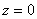

<pre>三、外尔斯特拉斯椭圆函数</pre>

外尔斯特拉斯第一类椭圆积分

&nbsp;&nbsp;&nbsp; 

的反函数称为外尔斯特拉斯椭圆函数，

&nbsp;&nbsp;&nbsp;&nbsp;&nbsp;&nbsp;&nbsp; 

式中表示对所有整数除外）求和，在的邻域内，有

&nbsp;&nbsp;&nbsp; 

外尔斯特拉斯椭圆函数具有以下性质：

&nbsp; 是二阶椭圆函数，在周期平行四边形中有一个二阶极点：.

&nbsp; 的周期是和为任何整数）.

&nbsp; 

