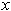
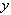
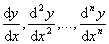
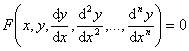
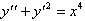
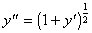
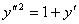
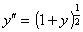
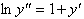

<b>第十三章</b><b> </b><b>常微分方程</b>

在研究客观现象时，常常遇到这样一类数学问题，即其中某个变量和其他变量之间的函数依赖关系是未知的，但是这个未知的函数关系以及它的某些阶的导数（或微分）连同自变量都由一个已知的方程联系在一起,这样的方程称为微分方程.如果未知函数是一元的，那末对应的微分方程称为常微分方程;如果未知函数是多元的，那末对应的微分方程称为偏微分方程.

&nbsp;&nbsp;&nbsp; 这一章介绍常微分方程，第十四章介绍偏微分方程.

&nbsp;&nbsp;&nbsp; 本章主要内容是介绍几类可以用分析方法求解的方程，如某些一阶微分方程，常系数线性微分方程，某些高阶微分方程和微分方程组.对于那些不能用分析方法求解的方程，介绍研究解的某些性质的方法（稳定性理论大意），或者用一些特殊的方法求出常微分方程的近似解（主要是数值解法）.

<b>§</b><b>1&nbsp; </b><b>微分方程的一般概念</b>

&nbsp;&nbsp;&nbsp; 微分方程是联系自变量，未知函数和它的某些阶导数的关系式：

&nbsp;&nbsp;&nbsp; [微分方程的阶数]&nbsp; 方程中出现的最高阶导数的阶数称为这个微分方程的阶.

例如: &nbsp;是二阶常微分方程.

[微分方程的次数]&nbsp;
如果能把微分方程化作对所有导数的有理整式，则其中最高阶导数的次数，称为微分方程的次数.并不是所有微分方程都有次数.例如：是一个二阶二次方程，因有理化后可得，而是二阶一次方程，方程没有次数可说.

&nbsp;&nbsp;&nbsp; [微分方程的解]&nbsp; 使常微分方程成为恒等式的变量之间的关系式都是该常微分方程的解.如果关系式是隐式，这种解又称为积分.微分方程的解的求法也可称为微分方程的积分法.微分方程的每一个解的图形又称为微分方程的积分曲线.

&nbsp;&nbsp;&nbsp; [微分方程的通解]&nbsp; 如果在微分方程的解式中,所含的独立的任意常数（如果一个解中的常数可取任意值，称它为任意常数）的个数等于这个微分方程的阶数，那末这解式称为微分方程的通解.阶微分方程的通解表达式中含有个彼此独立的任意常数.

[微分方程的特解]&nbsp;
相对于通解而言，微分方程的每一个解称为特解.

&nbsp;&nbsp;&nbsp; [初值问题]&nbsp; 如果在自变量某值给出适当个数的附加条件，用来确定微分方程的特解，那末这样的问题称为初值问题.

&nbsp;&nbsp;&nbsp; [边值问题]&nbsp; 如果在自变量一个以上的值给出适当个数的附加条件，用来确定微分方程的特解，那末这样的问题称为边值问题.

