

<b>§</b><b>2</b><b> </b><b>一阶微分方程</b>

一、一阶微分方程解的存在和唯一性

&nbsp;&nbsp;&nbsp; 一阶微分方程的一般形式是

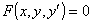

&nbsp;&nbsp;&nbsp; 如果在所考虑的区域上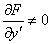，那末根据隐函数存在定理（第五章 §3，四，2），解出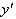得

或者写成对称形式

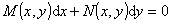

&nbsp;&nbsp;&nbsp; [解的存在和唯一性定理]&nbsp; 给定微分方程

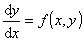

及初始值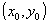.

&nbsp;&nbsp;&nbsp; 设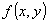在闭区域：

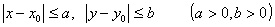

上连续，那末方程至少存在一个解，它在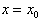处取值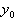，同时在包含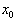的某一区间上确定且连续（此定理称为柯西存在定理）.

&nbsp;&nbsp;&nbsp; 如果在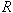内对变数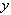还满足李普希茨条件，即存在正数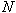，使得对于内的任意两值 和 ，下面不等式成立：

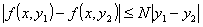

那末这个解还是唯一的.

