

二、可积类型及其通解

&nbsp;&nbsp;&nbsp; （表中<i>c</i>为任意常数）

<table class=MsoNormalTable border=1 cellspacing=0 cellpadding=0
 style='border-collapse:collapse;border:none'>
 <tr style='height:23.95pt'>
  <td width=268 style='width:200.7pt;border:solid windowtext 1.0pt;border-left:
  none;padding:0mm 5.4pt 0mm 5.4pt;height:23.95pt'>
  
方&nbsp; 程&nbsp; 类&nbsp; 型

  </td>
  <td width=356 style='width:267.1pt;border-top:solid windowtext 1.0pt;
  border-left:none;border-bottom:solid windowtext 1.0pt;border-right:none;
  padding:0mm 5.4pt 0mm 5.4pt;height:23.95pt'>
  
解法要点与通解表达式

  </td>
 </tr>
 <tr>
  <td width=268 valign=top style='width:200.7pt;border:none;border-right:solid windowtext 1.0pt;
  padding:0mm 5.4pt 0mm 5.4pt'>
  
&nbsp; 1．变量可分离方程

  
&nbsp; <i>f</i>1(<i>x</i>)<i>g</i>1(<i>y</i>)d<i>x</i>+
  <i>f</i>2(<i>x</i>)<i>g</i>2(<i>y</i>)d<i>y</i>=0

  </td>
  <td width=356 valign=top style='width:267.1pt;border:none;padding:0mm 5.4pt 0mm 5.4pt'>
  
&nbsp; 分离变量，两边同除以<i>g1</i>(<i>y</i>)<i>f2</i>(<i>x</i>),再分别积分.

  
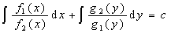

  </td>
 </tr>
 <tr>
  <td width=268 valign=top style='width:200.7pt;border:none;border-right:solid windowtext 1.0pt;
  padding:0mm 5.4pt 0mm 5.4pt'>
  
&nbsp;2. 齐次方程

  
&nbsp;&nbsp;&nbsp;&nbsp; 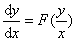

  
&nbsp; 一般假设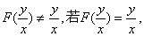

  
则变量可分离，属类型1

  </td>
  <td width=356 valign=top style='width:267.1pt;border:none;padding:0mm 5.4pt 0mm 5.4pt'>
  
&nbsp; 令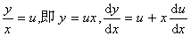

  
代入原方程，得新未知函数<i>u</i>关于自变量<i>x</i>的方程：

  
<i>&nbsp;&nbsp;&nbsp;&nbsp;&nbsp;&nbsp;&nbsp;&nbsp;&nbsp;&nbsp;&nbsp;&nbsp;&nbsp;
  x</i>d<i>u </i>= [<i>F</i>(<i>u</i>) – <i>u</i>]d<i>x</i>

  
再按类型1求解.

  
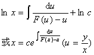

  </td>
 </tr>
 <tr style='height:189.0pt'>
  <td width=268 valign=top style='width:200.7pt;border-top:none;border-left:
  none;border-bottom:solid windowtext 1.0pt;border-right:solid windowtext 1.0pt;
  padding:0mm 5.4pt 0mm 5.4pt;height:189.0pt'>
  
&nbsp; 3．线性方程 

  
&nbsp;&nbsp;&nbsp;&nbsp;&nbsp;&nbsp; 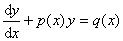

  
当<i>q</i>(<i>x</i>) ≡ 0, 称为齐次线性方程，当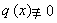, 称为非齐次线性方程

  </td>
  <td width=356 valign=top style='width:267.1pt;border:none;border-bottom:solid windowtext 1.0pt;
  padding:0mm 5.4pt 0mm 5.4pt;height:189.0pt'>
  
&nbsp; 先求出所对应的齐次线性方程

  
&nbsp;&nbsp;&nbsp;&nbsp;&nbsp;&nbsp;&nbsp;&nbsp;
  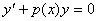

  
的通解&nbsp; 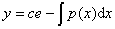

  
&nbsp; 再利用常数变易法(本章§3,二,2),令

  
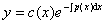

  
算出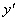, 代入原来的非齐次线性方程,可得

  
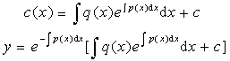

  </td>
 </tr>
 <tr>
  <td width=268 valign=top style='width:200.7pt;border:none;border-right:solid windowtext 1.0pt;
  padding:0mm 5.4pt 0mm 5.4pt'>
  
4．伯努利方程

  
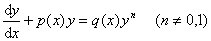

  </td>
  <td width=356 valign=top style='width:267.1pt;border:none;padding:0mm 5.4pt 0mm 5.4pt'>
  
&nbsp; 利用变量替换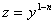化原方程为关于新未知函数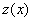的线性方程，再按类型3求解.

  
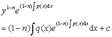

  </td>
 </tr>
 <tr>
  <td width=268 valign=top style='width:200.7pt;border:none;border-right:solid windowtext 1.0pt;
  padding:0mm 5.4pt 0mm 5.4pt'>
  
5．全（恰当）微分方程

  
&nbsp; <i>M</i>(<i>x</i>,<i>y</i>)d<i>x</i>+<i>N</i>(<i>x</i>,<i>y</i>)d<i>y</i>=0

  
式中<i>M</i><i>，N</i>满足

  

  </td>
  <td width=356 valign=top style='width:267.1pt;border:none;padding:0mm 5.4pt 0mm 5.4pt'>
  
方程可写成

  
&nbsp;&nbsp;&nbsp; <i>M</i>(<i>x</i>,<i>y</i>)d<i>x</i>+<i>N</i>(<i>x,y</i>)d<i>y</i>=d<i>U</i>(<i>x,y</i>)=0

  
式中d<i>U</i>是全（恰当）微分.

  
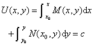

  </td>
 </tr>
 <tr style='height:200.55pt'>
  <td width=268 valign=top style='width:200.7pt;border:none;border-right:solid windowtext 1.0pt;
  padding:0mm 5.4pt 0mm 5.4pt;height:200.55pt'>
  
6．可将<i>y</i>解出的方程

  
&nbsp;&nbsp;&nbsp;&nbsp;&nbsp;&nbsp; <i>y</i>=<i>F</i>(<i>x,p</i>)

  
式中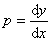

  </td>
  <td width=356 valign=top style='width:267.1pt;border:none;padding:0mm 5.4pt 0mm 5.4pt;
  height:200.55pt'>
  
&nbsp; 把方程两边对<i>x</i>求导数，得

  
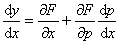

  
或&nbsp;&nbsp;&nbsp;&nbsp;&nbsp;&nbsp;&nbsp;&nbsp;&nbsp; 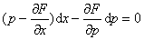&nbsp;&nbsp;

  
如果能求出此方程的通解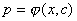或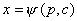, 那末原方程可解.

  
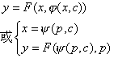

  </td>
 </tr>
 <tr style='height:254.25pt'>
  <td width=268 valign=top style='width:200.7pt;border-top:none;border-left:
  none;border-bottom:solid windowtext 1.0pt;border-right:solid windowtext 1.0pt;
  padding:0mm 5.4pt 0mm 5.4pt;height:254.25pt'>
  
[拉格朗日方程]

  
&nbsp;&nbsp;&nbsp;&nbsp;&nbsp; <i>y = xf</i>1(<i>p</i>)
  + <i>f</i>2(<i>p</i>)

  
式中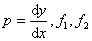是已知可微函数

  
[克莱罗方程]

  
&nbsp;&nbsp;&nbsp;&nbsp;&nbsp; <i>y = xp</i>+<i>F</i>(<i>p</i>)

  
式中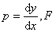是已知可微函数

  </td>
  <td width=356 valign=top style='width:267.1pt;border:none;border-bottom:solid windowtext 1.0pt;
  padding:0mm 5.4pt 0mm 5.4pt;height:254.25pt'>
  
&nbsp;可化为<i>x</i>的线性方程 

  
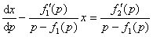

  
再按类型3求解

  
&nbsp; 化为方程

  
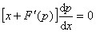

  
令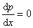, 即<i>p =c</i>，代入原方程.

  
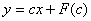

  
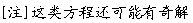

  
&nbsp;&nbsp;&nbsp;&nbsp;&nbsp;&nbsp;&nbsp;
  (见§2,三)

  </td>
 </tr>
 <tr style='height:202.9pt'>
  <td width=268 valign=top style='width:200.7pt;border:none;border-right:solid windowtext 1.0pt;
  padding:0mm 5.4pt 0mm 5.4pt;height:202.9pt'>
  
7.可将<i>x</i>解出的方程

  
&nbsp;&nbsp;&nbsp;&nbsp;&nbsp; <i>x =
  F(y, p)</i>

  
式中

  </td>
  <td width=356 valign=top style='width:267.1pt;border:none;padding:0mm 5.4pt 0mm 5.4pt;
  height:202.9pt'>
  
&nbsp; 方程两边对<i>x</i>求导数,利用

  
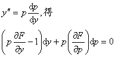

  
如果可求出这个方程的通解

  
&nbsp;&nbsp; 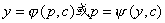

  
那末原方程可解.

  
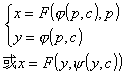

  </td>
 </tr>
 <tr>
  <td width=268 valign=top style='width:200.7pt;border:none;border-right:solid windowtext 1.0pt;
  padding:0mm 5.4pt 0mm 5.4pt'>
  
8.不显含未知函数的方程

  
&nbsp;&nbsp;&nbsp; 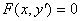

  </td>
  <td width=356 valign=top style='width:267.1pt;border:none;padding:0mm 5.4pt 0mm 5.4pt'>
  
引入适当参数<i>t</i>，化原方程为

  
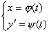

  
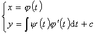

  </td>
 </tr>
 <tr>
  <td width=268 valign=top style='width:200.7pt;border:none;border-right:solid windowtext 1.0pt;
  padding:0mm 5.4pt 0mm 5.4pt'>
  
9.不显含自变量的方程

  
&nbsp;&nbsp;&nbsp;&nbsp; 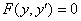

  </td>
  <td width=356 valign=top style='width:267.1pt;border:none;padding:0mm 5.4pt 0mm 5.4pt'>
  
引入参数<i>t</i>，化原方程为

  
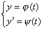

  
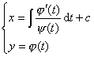

  </td>
 </tr>
 <tr style='height:450.75pt'>
  <td width=268 valign=top style='width:200.7pt;border-top:none;border-left:
  none;border-bottom:solid windowtext 1.0pt;border-right:solid windowtext 1.0pt;
  padding:0mm 5.4pt 0mm 5.4pt;height:450.75pt'>
  
10．能化为变量可分离或齐次方程的方程

  
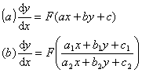

  </td>
  <td width=356 valign=top style='width:267.1pt;border:none;border-bottom:solid windowtext 1.0pt;
  padding:0mm 5.4pt 0mm 5.4pt;height:450.75pt'>
  
（<i>a</i>）令<i>z </i>=<i> ax</i> +<i> by </i>+<i> c</i>，化原方程为类型1

  
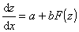

  
（<i>b</i>）若行列式

  
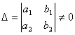

  
引进新变量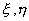

  
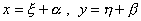

  
式中<i>α</i><i>,</i><i>β</i>满足方程组

  
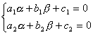

  
则原方程化成齐次方程(类型2):

  
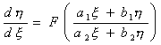

  
若=0, <i>b</i>1≠0, 则令<i>z = a</i>1<i>x + b</i>1 <i>y </i>+
  <i>c</i>1 ；

  
若=0, <i>b</i>2≠0, 则令<i>z = a</i>2<i>x</i> + <i>b</i>2
  <i>y</i> + <i>c</i>2,

  
于是原方程化为类型1.

  </td>
 </tr>
 <tr>
  <td width=268 valign=top style='width:200.7pt;border:none;border-right:solid windowtext 1.0pt;
  padding:0mm 5.4pt 0mm 5.4pt'>
  
11.黎卡提方程

  
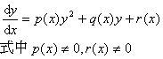

  </td>
  <td width=356 valign=top style='width:267.1pt;border:none;padding:0mm 5.4pt 0mm 5.4pt'>
  
&nbsp; 如果已知原方程有一个特解<i>y=y</i>1(<i>x</i>), 作变换

  
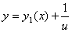

  
可把原方程化为线性方程(类型3)：

  
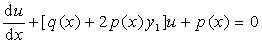

  
或用变换<i>y = y</i>1(<i>x</i>) + <i>u </i>化为伯努利方程(类型4):

  
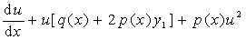

  
再分别按类型3和类型4求解.

  </td>
 </tr>
 <tr>
  <td width=268 valign=top style='width:200.7pt;border-top:none;border-left:
  none;border-bottom:solid windowtext 1.0pt;border-right:solid windowtext 1.0pt;
  padding:0mm 5.4pt 0mm 5.4pt'>
  
12. 含积分因子的方程

  
<i>M</i> (<i>x, y</i>)<i> </i>d<i>x</i> + <i>N</i>(<i>x,
  y</i>) d<i>y</i> = 0

  
式中

  

  
但存在<i>μ</i>(<i>x, y</i>)满足

  

  
<i>μ</i>(<i>x, y</i>)称为原方程的积分因子

  </td>
  <td width=356 valign=top style='width:267.1pt;border:none;border-bottom:solid windowtext 1.0pt;
  padding:0mm 5.4pt 0mm 5.4pt'>
  
找出积分因子<i>μ</i>(<i>x, y</i>),再按类型5求解.找积分因子的方法见下表.

  </td>
 </tr>
</table>

找积分因子的方法

<table class=MsoNormalTable border=1 cellspacing=0 cellpadding=0
 style='border-collapse:collapse;border:none'>
 <tr>
  <td width=175 valign=top style='width:130.9pt;border:solid windowtext 1.0pt;
  border-left:none;padding:0mm 5.4pt 0mm 5.4pt'>
  
条&nbsp;&nbsp;&nbsp; 件

  </td>
  <td width=109 valign=top style='width:81.75pt;border-top:solid windowtext 1.0pt;
  border-left:none;border-bottom:solid windowtext 1.0pt;border-right:double windowtext 4.5pt;
  padding:0mm 5.4pt 0mm 5.4pt'>
  
积分因子

  
<i>μ</i>(<i>x,
  y</i>)

  </td>
  <td width=163 valign=top style='width:122.25pt;border:solid windowtext 1.0pt;
  border-left:none;padding:0mm 5.4pt 0mm 5.4pt'>
  
条&nbsp;&nbsp;&nbsp; 件

  </td>
  <td width=177 valign=top style='width:132.9pt;border-top:solid windowtext 1.0pt;
  border-left:none;border-bottom:solid windowtext 1.0pt;border-right:none;
  padding:0mm 5.4pt 0mm 5.4pt'>
  
积分因子

  
<i>μ</i>(<i>x,
  y</i>)

  </td>
 </tr>
 <tr style='height:331.25pt'>
  <td width=175 style='width:130.9pt;border-top:none;border-left:none;
  border-bottom:solid windowtext 1.0pt;border-right:solid windowtext 1.0pt;
  padding:0mm 5.4pt 0mm 5.4pt;height:331.25pt'>
  
<i>xM+yN</i>=0

  
<i></i>

  
&nbsp;

  
<i>xM+yN</i><i>≠0</i>

  
<i>M,N</i>是同次的齐次式

  
&nbsp;

  
<i></i>

  
<i>M(x, y) = yM</i>1<i> (xy)</i>

  
<i>N(x, y) = xN</i>1<i>(xy)</i>

  
&nbsp;

  

  

  </td>
  <td width=109 valign=top style='width:81.75pt;border-top:none;border-left:
  none;border-bottom:solid windowtext 1.0pt;border-right:double windowtext 4.5pt;
  padding:0mm 5.4pt 0mm 5.4pt;height:331.25pt'>
  

  

  
&nbsp;

  

  
&nbsp;

  
&nbsp;

  

  
&nbsp;

  
&nbsp;

  

  
&nbsp;

  

  </td>
  <td width=163 valign=top style='width:122.25pt;border-top:none;border-left:
  none;border-bottom:solid windowtext 1.0pt;border-right:solid windowtext 1.0pt;
  padding:0mm 5.4pt 0mm 5.4pt;height:331.25pt'>
  

  
&nbsp;

  
&nbsp;存在适合

  
的常数<i>m</i>和<i>n</i>(用比较系数法确定)

  
&nbsp;

  
&nbsp;

  

  
即<i>M+iN</i>在使微分方程满足的单连通区域内是<i>x+iy</i>的解析函数

  </td>
  <td width=177 valign=top style='width:132.9pt;border:none;border-bottom:solid windowtext 1.0pt;
  padding:0mm 5.4pt 0mm 5.4pt;height:331.25pt'>
  
形为 <i>m</i>(<i>x</i>)<i>n</i>(<i>y</i>)

  
&nbsp;

  
&nbsp;

  
&nbsp; <i>xmyn</i>

  
&nbsp;

  
&nbsp;

  
&nbsp;

  
&nbsp;

  
&nbsp;

  
&nbsp;

  </td>
 </tr>
</table>

&nbsp;

