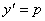
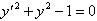
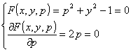

<h3 style='text-autospace:none;vertical-align:bottom'>三、奇解及其求法</h3>

&nbsp;&nbsp;&nbsp; [微分方程的奇解]&nbsp; 微分方程的一族积分曲线（通解）的包络，称为这个微分方程的奇解.奇解是方程的解，同时过奇解上的每一点都不止有一条积分曲线，即在奇解上的每一点，方程的解不是唯一的.

&nbsp;&nbsp;&nbsp; [<i>c</i>-判别曲线法]&nbsp;
设一阶微分方程的通解为，其中<i>c</i>是任意常数，把<i>c</i>看成参数.从下面方程组

中消去<i>c</i>而得到的所有曲线，都称为曲线族的<i>c</i>-判别曲线，其中包含着曲线族的包络.但应注意<i>c</i>-判别曲线不一定都是曲线族的包络，还要作实际检验.

&nbsp;&nbsp;&nbsp; 例&nbsp;
求一阶微分方程

的通解和奇解.

&nbsp;&nbsp;&nbsp; 解&nbsp;
把方程写成

令<i>y</i>'=<i>p</i>.方程两边对<i>p</i>求导，得

于是有

即

代入原方程，得通解

从

中消去<i>c</i>，得<i>c-</i>判别曲线<i>y=x</i>和<i></i>.直接代入原方程可知<i>y=x</i>不是已知方程的解，所以不是奇解，而<i></i>是奇解.

&nbsp;&nbsp;&nbsp; [<i>p</i>-判别曲线法]&nbsp; 对于一阶微分方程，令，那末方程的奇解一定包含在下面方程组

消去<i>p</i> 后得到的曲线（称为<i>p</i> -判别曲线）中.至于<i>p</i> -判别曲线是否是奇解，也需要实际检验.

&nbsp;&nbsp;&nbsp; 例&nbsp;
求微分方程

的奇解.

&nbsp;&nbsp;&nbsp; 解&nbsp;
从

中消去<i>p</i>得<i>p-</i>判别曲线 ，即<i>y=</i>.代入原方程知<i>y=</i>是奇解.

