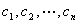

<b>§</b><b>3 </b><b>线性微分方程</b>

一、一般概念

&nbsp;&nbsp;&nbsp; [齐次线性微分方程与非齐次线性微分方程]&nbsp; 设微分方程

<pre style='text-align:right;text-autospace:none;vertical-align:bottom'
align=right>&nbsp;&nbsp;&nbsp;&nbsp;&nbsp;&nbsp;&nbsp;&nbsp; (1)</pre>

如果方程中的未知函数及其各阶导数都是一次的，这种方程称为线性微分方程.因为，所以（1）称为<i>n</i>阶线性微分方程. 当，(1)称为齐次线性微分方程.当，(1)称为非齐次线性微分方程.如果都是常数，(1)就称为常系数线性微分方程.

[解的存在和唯一性定理]&nbsp; 如果和在区间内连续，且，那末对任意给定的初始条件

方程(1)存在唯一解，式中为实数.

&nbsp;&nbsp;&nbsp; [函数的线性相关性]&nbsp; 对于一组函数，如果有不全为零的常数,使等式

在区间上成立，则称这组函数在区间上线性相关.否则称这组函数线性无关（线性独立）.

&nbsp;&nbsp;&nbsp; [朗斯基行列式]&nbsp; 如果是个次可微的函数，则称行列式

为函数的朗斯基行列式.

&nbsp;&nbsp;&nbsp; 朗斯基行列式具有以下性质：

&nbsp;&nbsp;&nbsp; 1o&nbsp; 如果函数线性相关，那末它们的朗斯基行列式

2o&nbsp; 如果函数是某齐次线性微分方程的解，那末它们线性相关的充分必要条件是它们的朗斯基行列式

&nbsp;&nbsp;&nbsp; [<i>n</i>阶齐次线性微分方程解的结构]&nbsp; 如果阶齐次线性微分方程

，&nbsp;&nbsp; 

有个线性无关的解 .那末它的通解是这个解的线性组合，即

其中是任意常数.这时又称为所给齐次线性微分方程的一组基本解.

&nbsp;&nbsp;&nbsp; [阶非齐次线性微分方程解的结构]&nbsp; 非齐次线性微分方程的通解是它的一个特解与对应齐次方程的通解之和，即

式中为任意常数.

