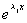

<h3 style='text-autospace:none;vertical-align:bottom'>二、常系数线性微分方程</h3>

&nbsp;&nbsp;&nbsp; 1.&nbsp;
齐次线性微分方程通解的求法

&nbsp;&nbsp;&nbsp; [特征方程与特征根]&nbsp;
对于阶实常系数齐次线性微分方程

<pre style='text-align:right;text-autospace:none;vertical-align:bottom'
align=right>&nbsp;&nbsp;&nbsp;&nbsp;&nbsp; &nbsp;&nbsp;&nbsp;&nbsp;&nbsp;&nbsp;&nbsp;&nbsp;&nbsp;&nbsp;&nbsp;&nbsp;&nbsp;&nbsp;&nbsp;&nbsp;&nbsp;(2)</pre>

作相应的次代数方程

<pre style='text-align:right;text-autospace:none;vertical-align:bottom'
align=right>&nbsp;&nbsp;&nbsp;&nbsp;&nbsp;&nbsp;&nbsp;&nbsp;&nbsp;&nbsp;&nbsp;&nbsp;&nbsp;&nbsp;&nbsp;&nbsp;&nbsp;&nbsp;&nbsp;&nbsp;&nbsp;&nbsp;&nbsp;&nbsp; (3)</pre>

称它为微分方程(2)的特征方程，特征方程(3)的个根称为相应微分方程(2)的特征根.

[齐次方程的通解]&nbsp; 为了求阶常系数齐次线性微分方程(2)的通解，只要找出它的个线性无关的特解就可以了.根据其全体特征根的各种情况，分别列出对应的线性无关特解.

<table class=MsoNormalTable border=1 cellspacing=0 cellpadding=0
 style='border-collapse:collapse;border:none'>
 <tr>
  <td width=319 valign=top style='width:239.4pt;border:solid windowtext 1.0pt;
  border-left:none;padding:0mm 5.4pt 0mm 5.4pt'>
  
&nbsp;&nbsp;&nbsp;&nbsp;&nbsp;&nbsp;&nbsp;&nbsp;
  特&nbsp; 征&nbsp; 根

  </td>
  <td width=328 valign=top style='width:246.0pt;border-top:solid windowtext 1.0pt;
  border-left:none;border-bottom:solid windowtext 1.0pt;border-right:none;
  padding:0mm 5.4pt 0mm 5.4pt'>
  
对应的线性无关特解

  </td>
 </tr>
 <tr>
  <td width=319 valign=top style='width:239.4pt;border-top:none;border-left:
  none;border-bottom:solid windowtext 1.0pt;border-right:solid windowtext 1.0pt;
  padding:0mm 5.4pt 0mm 5.4pt'>
  
(<i>j</i>
  = 1,2,…,<i>n</i>)是互异实根

  </td>
  <td width=328 valign=top style='width:246.0pt;border:none;border-bottom:solid windowtext 1.0pt;
  padding:0mm 5.4pt 0mm 5.4pt'>
  
<i>yj</i>(<i>x</i>) = (<i>j</i> = 1,2,…,<i>n</i>)

  </td>
 </tr>
 <tr>
  <td width=319 valign=top style='width:239.4pt;border-top:none;border-left:
  none;border-bottom:solid windowtext 1.0pt;border-right:solid windowtext 1.0pt;
  padding:0mm 5.4pt 0mm 5.4pt'>
  
是特征方程的单根，则

  
也是特征方程的单根

  </td>
  <td width=328 valign=top style='width:246.0pt;border:none;border-bottom:solid windowtext 1.0pt;
  padding:0mm 5.4pt 0mm 5.4pt'>
  
<i>y</i>1(<i>x</i>) = cos<i>βx</i>

  
<i>y</i>2(<i>x</i>) = sin<i>βx</i>

  </td>
 </tr>
 <tr>
  <td width=319 valign=top style='width:239.4pt;border-top:none;border-left:
  none;border-bottom:solid windowtext 1.0pt;border-right:solid windowtext 1.0pt;
  padding:0mm 5.4pt 0mm 5.4pt'>
  
<i></i>是特征方程的<i>r</i>重实根

  </td>
  <td width=328 valign=top style='width:246.0pt;border:none;border-bottom:solid windowtext 1.0pt;
  padding:0mm 5.4pt 0mm 5.4pt'>
  
<i>y</i>1(<i>x</i>) = , <i>y</i>2(<i>x</i>)
  = <i>x</i>,…，

  
<i>yr</i>(<i>x</i>) = <i>xr</i>-1

  </td>
 </tr>
 <tr style='height:80.25pt'>
  <td width=319 valign=top style='width:239.4pt;border-top:none;border-left:
  none;border-bottom:solid windowtext 1.0pt;border-right:solid windowtext 1.0pt;
  padding:0mm 5.4pt 0mm 5.4pt;height:80.25pt'>
  
是特征方程的<i>r</i>重复根，则

  
也是<i>r</i>重复根

  </td>
  <td width=328 valign=top style='width:246.0pt;border:none;border-bottom:solid windowtext 1.0pt;
  padding:0mm 5.4pt 0mm 5.4pt;height:80.25pt'>
  

  </td>
 </tr>
</table>

&nbsp;

