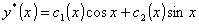

&nbsp;&nbsp;&nbsp; 2.&nbsp;
非齐次线性微分方程特解的求法

&nbsp;&nbsp;&nbsp; 给定阶非齐次线性微分方程

它的特解可用下面两种方法来求.

&nbsp;&nbsp;&nbsp; [常数变易法]&nbsp; 设其相应的齐次线性微分方程的通解是

那末非齐次线性微分方程有一个特解

式中是待定函数，它们的导数满足方程组

&nbsp;&nbsp;&nbsp; 例&nbsp; 求微分方程

的通解.

&nbsp;&nbsp;&nbsp; 解&nbsp; 先求其相应的齐次方程的通解.

&nbsp;&nbsp;&nbsp; 因特征方程，有特征根.于是齐次方程的通解为

&nbsp;&nbsp;&nbsp; 利用常数变易法求非齐次方程的一个特解<i>y*</i>(<i>x</i>) .令

而<i>c</i>1(<i>x</i>),<i>c</i>2(<i>x</i>)由下列方程组确定

解方程组得

积分后得

（<i>k</i>1,<i>k</i>2是任意常数）

（因为只要一个特解，可令<i>k</i>1=<i>k</i>2=0）,所以原方程的通解为

[待定系数法]&nbsp; 对特殊类型的，可把特解的待定表达式及其相应的各阶导数代入原微分方程，然后比较同类项系数，定出的待定表达式里所含的系数，最后得出方程的特解.现在把部分情况下的特解形式列表如下：

<table class=MsoNormalTable border=1 cellspacing=0 cellpadding=0
 style='border-collapse:collapse;border:none'>
 <tr>
  <td width=311 valign=top style='width:233.4pt;border:solid windowtext 1.0pt;
  border-left:none;padding:0mm 5.4pt 0mm 5.4pt'>
  
<i>R</i>(<i>x</i>)类型

  </td>
  <td width=336 valign=top style='width:252.0pt;border-top:solid windowtext 1.0pt;
  border-left:none;border-bottom:solid windowtext 1.0pt;border-right:none;
  padding:0mm 5.4pt 0mm 5.4pt'>
  
特解<i>y</i>*(<i>x</i>)的待定表达式

  </td>
 </tr>
 <tr style='height:32.75pt'>
  <td width=311 valign=top style='width:233.4pt;border-top:none;border-left:
  none;border-bottom:solid windowtext 1.0pt;border-right:solid windowtext 1.0pt;
  padding:0mm 5.4pt 0mm 5.4pt;height:32.75pt'>
  

  

  </td>
  <td width=336 valign=top style='width:252.0pt;border:none;border-bottom:solid windowtext 1.0pt;
  padding:0mm 5.4pt 0mm 5.4pt;height:32.75pt'>
  

  

  </td>
 </tr>
</table>

&nbsp;&nbsp;&nbsp; 表中为已知常数；是正整数，如果的两个多项式的次数不相同，则取为次数较大者；是待定常数.

&nbsp;&nbsp;&nbsp; 表中右栏表达式分别是（自上而下）在不是其特征根的情形下的特解的待定表达式；如果它们是特征方程的重根，那末在表中的表达式上再乘以.

&nbsp;&nbsp;&nbsp; 例&nbsp; 求解微分方程

&nbsp; &nbsp;&nbsp;解&nbsp; 先求相应的齐次线性方程<i>y</i>(4)+2<i>y&quot;+y=</i>0的通解.

&nbsp;&nbsp;&nbsp; 由特征方程4+22+1=(2+1)2=0可知特征根<i>=i</i>都是二重根.所以齐次方程的通解为

<i>y</i>(<i>x</i>)=<i>c</i>1cos<i>x</i>+<i>c</i>2sin<i>x+c</i>3<i>x </i>cos<i>x+c</i>4<i>x </i>sin<i>x</i>

&nbsp;&nbsp;&nbsp; 利用待定系数法，求非齐次线性方程的一个特解.由于<i>R</i>(<i>x</i>)=sin2<i>x</i>，属于表中第二类表达式(<i>a=</i>0,<i>b=</i>1,<i>=</i>2)，同时<i>i=</i>2<i>i</i>不是特征根，所以特解应为<i>y*</i>(<i>x</i>)=<i>A</i>cos2<i>x</i>+<i>B</i>sin2<i>x</i>.代入原方程，比较同类项系数得

所以特解是&nbsp;&nbsp;&nbsp;&nbsp;&nbsp;&nbsp;&nbsp;&nbsp;&nbsp;&nbsp;&nbsp;&nbsp;&nbsp;&nbsp;&nbsp;&nbsp;&nbsp;&nbsp;&nbsp;&nbsp;&nbsp;&nbsp;&nbsp;

原方程的通解为

式中<i>c</i>1,<i>c</i>2,<i>c</i>3,<i>c</i>4是任意常数.

