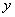
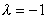

三、&nbsp;&nbsp;&nbsp;&nbsp;&nbsp;&nbsp;&nbsp;
三、&nbsp;&nbsp;&nbsp; 欧拉方程

&nbsp;&nbsp;&nbsp; 具有形状

&nbsp;&nbsp; (是常数)

的方程称为欧拉方程.

&nbsp;&nbsp;&nbsp; 欧拉方程可以通过变量替换或化成未知函数关于新自变量的常系数线性微分方程.

&nbsp;&nbsp;&nbsp; 例&nbsp; 求解欧拉方程

&nbsp;&nbsp;&nbsp; 解&nbsp; 令或<i>t=</i>ln<i>x</i>，原方程变成

&nbsp;&nbsp;&nbsp; 特征方程是

是二重根.通解为

所以原方程的通解是

