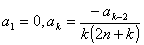

四、&nbsp; 齐次线性微分方程的幂级数解法

&nbsp;&nbsp;&nbsp; [具有幂级数形式的解]&nbsp; 一般变系数的齐次线性微分方程，不一定能找到用初等函数表示的解，这时可以考虑求具有幂级数形式的解.

现以二阶齐次线性微分方程为例说明解法（高阶方程同样适用）.设

其中和在可展成幂级数.要求方程在附近的解，只要先假定这个解具有幂级数形式

然后形式地算出所需的各阶导数，代入原方程变成恒等式，确定待定的系数从而得出所求的幂级数解.

&nbsp;&nbsp;&nbsp; 如果，在不能展成幂级数，比如是<i>x</i>的有理分式，而分母在等于零，这时可试求具广义幂级数形式

的解，其中<i>a</i>和都是待定常数.

&nbsp;&nbsp;&nbsp; [求勒让德方程的解]&nbsp; 方程

称为勒让德方程，它的解称为勒让德函数.

&nbsp;&nbsp;&nbsp; 在<i>x</i>=0附近，方程的系数可以展成幂级数，令

代入原方程，可以定出两个线性无关解

所以勒让德方程的通解为

式中<i>A,B</i>是任意常数，是高斯超几何级数.

&nbsp;&nbsp;&nbsp; 若<i>n</i>为整数，则与中有一个为多项式，另一个仍然是无穷级数.适当选取任意常数<i>A,B</i>,使当<i>x</i>=1时，多项式的值为1，这个多项式称为勒让德多项式，记作，它属于第一类勒让德函数.另一个则与线性无关，它是无穷级数，记作 ，属于第二类勒让德函数.此时，勒让德方程的通解为

式中<i>A,B</i>为任意常数.

&nbsp;&nbsp;&nbsp; [求贝塞耳方程的解]&nbsp; 方程

称为<i>v</i>阶贝塞耳方程，式中<i>v</i>为任意实数（或复数），它的解称为贝塞耳函数.

&nbsp;&nbsp;&nbsp; 因方程系数 ,在<i>x</i>=0不能展成幂级数，而是<i>x</i>的有理分式.令

代入原方程，令 <i>x</i>各次幂的系数等于零，得 ，先取<i>=v</i>，得

所以

取 ，得贝塞耳方程的一个特解，记作

它称为<i>v</i>阶第一类贝塞耳函数.

&nbsp;&nbsp;&nbsp; 取，得另一特解

&nbsp;&nbsp;&nbsp; 当<i>v</i>不为整数时，这两个特解线性无关，此时贝塞耳方程的通解为

式中<i>A,B</i>是任意常数.

&nbsp;&nbsp;&nbsp; 当<i>v=n</i>为整数时，与线性相关.此时记

它也是贝塞耳方程的一个解，而且与 线性无关.称为<i>n</i>阶第二类贝塞耳函数.于是贝塞耳方程的通解为

式中<i>A,B</i>是任意常数.

