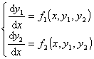

<h2 align=center style='text-align:center;text-autospace:none;vertical-align:
bottom'>§4&nbsp; 高阶微分方程与微分方程组</h2>
<h3 style='margin-left:36.0pt;text-indent:-31.5pt;text-autospace:none;
vertical-align:bottom'>一、&nbsp;
一、 高阶微分方程与微分方程组的互化</h3>

&nbsp;&nbsp;&nbsp; 已给一个<i>n</i>阶方程

设<i>y</i>1=<i>y</i>,<i>y</i>2=<i>y'</i>,<i>y</i>3=<i>y&quot;</i>,…,<i>yn</i>=<i>y</i>(<i>n</i>-1)，那末解上面<i>n</i>阶微分方程就相当于解下面<i>n</i>个一阶微分方程的方程组

式中<i>y</i>1,<i>y</i>2,…,<i>y</i>n看作自变量<i>x</i>的<i>n</i>个未知函数.

&nbsp;&nbsp;&nbsp; 反过来，在许多情况下，已给<i>n</i>个一阶微分方程的方程组也可以化为一个<i>n</i>阶微分方程.比如，两个一阶微分方程的方程组

<pre style='text-align:right;text-autospace:none;vertical-align:bottom'
align=right>&nbsp;&nbsp;&nbsp;&nbsp;&nbsp;&nbsp;&nbsp;&nbsp;&nbsp;&nbsp;&nbsp;&nbsp;&nbsp;&nbsp;&nbsp;&nbsp;&nbsp;&nbsp;&nbsp;&nbsp;&nbsp;&nbsp;&nbsp;&nbsp;&nbsp;&nbsp;&nbsp;&nbsp;&nbsp;&nbsp;&nbsp;&nbsp;&nbsp; (1)</pre>

将方程(1)对<i>x</i>求导数

记作

<pre style='text-align:right;text-autospace:none;vertical-align:bottom'
align=right>&nbsp;&nbsp;&nbsp;&nbsp;&nbsp;&nbsp;&nbsp;&nbsp;&nbsp;&nbsp;&nbsp;&nbsp;&nbsp;&nbsp;&nbsp;&nbsp;&nbsp;&nbsp;&nbsp;&nbsp;&nbsp;&nbsp;&nbsp;&nbsp;&nbsp;&nbsp;&nbsp;&nbsp;&nbsp;&nbsp;&nbsp;&nbsp;&nbsp;&nbsp;&nbsp;&nbsp;&nbsp;&nbsp;&nbsp;&nbsp;&nbsp;&nbsp;&nbsp; (2)</pre>

从方程(1)中解出<i>y</i>2

代入方程(2)的右边，就得到一个二阶微分方程

这里函数由函数<i>f</i>1，<i>f</i>2所确定，因而是已知的.所以两个一阶微分方程组可以化为一个二阶微分方程.

