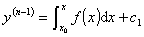

<h2 style='text-autospace:none;vertical-align:bottom'>二、&nbsp;&nbsp; 高阶微分方程的几种可积类型及其解法</h2>

&nbsp;&nbsp;&nbsp; 1. <i>&nbsp;</i><b><i>y</i></b>(<i>n</i>) = <b><i>f</i></b>(<b><i>x</i></b>)

&nbsp;&nbsp;&nbsp; 将方程写成

积分后得到

重复这一过程到积分<i>n</i>次，就得到微分方程的通解：

&nbsp;&nbsp;&nbsp; 2.&nbsp; <b><i>F</i></b>(<b><i>x</i></b><i>,<b>y</b></i>(<i>n</i>)
)=0

&nbsp;&nbsp;&nbsp; 1°&nbsp; 若能解出<i>y</i>(<i>n</i>)，则方程化成类型1求解.

&nbsp;&nbsp;&nbsp; 2°&nbsp; 若不能解出<i>y</i>(<i>n</i>)，或解出后表达式太复杂，就设法求它的参数形式的解：

&nbsp;&nbsp;&nbsp; 设函数(<i>t</i>),(<i>t</i>)&nbsp;
(<i>&lt;t&lt;</i>)满足

<i>F</i>((<i>t</i>),(<i>t</i>))≡0

则原方程可写成参数形式

<i>x=</i>(<i>t</i>),
<i>y</i>(<i>n</i>)=(<i>t</i>)

由&nbsp;&nbsp;&nbsp;&nbsp;&nbsp;&nbsp;&nbsp;&nbsp;&nbsp;&nbsp;&nbsp;&nbsp;&nbsp;&nbsp;&nbsp;&nbsp;&nbsp;&nbsp;&nbsp;&nbsp;&nbsp;&nbsp;&nbsp;&nbsp;&nbsp;&nbsp;&nbsp;&nbsp;&nbsp;&nbsp;&nbsp;&nbsp;&nbsp;&nbsp;&nbsp;&nbsp;&nbsp;&nbsp;&nbsp;&nbsp;&nbsp;&nbsp;&nbsp;&nbsp;&nbsp;&nbsp;&nbsp;&nbsp;&nbsp;&nbsp;&nbsp;&nbsp;&nbsp;&nbsp;
d<i>y</i>(<i>n</i>-1)=<i> y</i>(<i>n</i>)d<i>x=</i>(<i>t</i>)<i>'</i>(<i>t</i>)d<i>t</i>

得&nbsp;&nbsp;&nbsp;&nbsp;&nbsp;&nbsp;&nbsp;&nbsp;&nbsp;&nbsp;&nbsp;&nbsp;&nbsp;&nbsp;&nbsp;&nbsp;&nbsp;&nbsp;&nbsp;&nbsp;&nbsp;&nbsp;&nbsp;&nbsp;&nbsp;&nbsp;&nbsp;&nbsp;&nbsp;&nbsp;&nbsp;&nbsp;&nbsp;&nbsp;&nbsp;&nbsp;&nbsp;&nbsp;&nbsp;&nbsp;&nbsp;&nbsp;&nbsp;&nbsp;&nbsp;&nbsp;&nbsp;

又由&nbsp;&nbsp;&nbsp;&nbsp;&nbsp;&nbsp;&nbsp;&nbsp;&nbsp;&nbsp;&nbsp;&nbsp;&nbsp;&nbsp;&nbsp;&nbsp;&nbsp;&nbsp;&nbsp;&nbsp;&nbsp;&nbsp;&nbsp;&nbsp;&nbsp;&nbsp;&nbsp;&nbsp;&nbsp;&nbsp;&nbsp;&nbsp;&nbsp;&nbsp;&nbsp;&nbsp;&nbsp;&nbsp;&nbsp;&nbsp;&nbsp;&nbsp;&nbsp;&nbsp;
d<i>y</i>(<i>n</i>-2)=<i>y</i>(<i>n</i>-1)d<i>x=</i>1(<i>t</i>,<i>c</i>1)<i>'</i>(<i>t</i>)d<i>t</i>

得 &nbsp;&nbsp;&nbsp;&nbsp;&nbsp;&nbsp;&nbsp;&nbsp;&nbsp;&nbsp;&nbsp;&nbsp;&nbsp;&nbsp;&nbsp;&nbsp;&nbsp;&nbsp;&nbsp;&nbsp;&nbsp;&nbsp;&nbsp;&nbsp;&nbsp;&nbsp;&nbsp;&nbsp;&nbsp;&nbsp;&nbsp;&nbsp;&nbsp;&nbsp;&nbsp;&nbsp;&nbsp;&nbsp;&nbsp;&nbsp;&nbsp;

&nbsp;&nbsp;&nbsp; 最后得原方程的参数形式的通解

&nbsp;&nbsp;&nbsp; 3.&nbsp; <b><i>F</i></b>(<b><i>y</i></b>(<i>n</i>-1),<i>
<b>y</b></i>(<i>n</i>)&nbsp; )=0

&nbsp;&nbsp;&nbsp; 1°&nbsp; 若从方程可解出<i>y</i>(<i>n</i>):

<i>y</i>(<i>n</i>)=<i>f</i>(<i>y</i>(<i>n-</i>1))

则令<i>y</i>(<i>n</i>－1)=<i>z</i>，上式化成

这是变量可分离的方程，设解为

<i>z=</i>(<i>x,c</i>1)

那末化成类型1

<i>y</i>(n-1)=(<i>x,c</i>1)

其通解为

&nbsp;&nbsp;&nbsp; 2°&nbsp; 若不能解出<i>y</i>(<i>n</i>)，但原方程可写成参数形式：

<i>y</i>(<i>n</i>-1)=(<i>t</i>),&nbsp; <i>y</i>(<i>n</i>)=(<i>t</i>)

则从&nbsp;&nbsp;&nbsp;&nbsp;&nbsp;&nbsp;&nbsp;&nbsp;&nbsp;&nbsp;&nbsp;&nbsp;&nbsp;&nbsp;&nbsp;&nbsp;&nbsp;&nbsp;&nbsp;&nbsp;&nbsp;&nbsp;&nbsp;&nbsp;&nbsp;&nbsp;&nbsp;&nbsp;&nbsp;&nbsp;&nbsp;&nbsp;&nbsp;&nbsp;&nbsp;&nbsp;&nbsp;&nbsp;&nbsp;&nbsp;&nbsp;&nbsp;&nbsp;&nbsp;&nbsp;&nbsp;&nbsp;&nbsp;&nbsp;&nbsp;&nbsp;&nbsp;&nbsp;&nbsp;&nbsp;&nbsp;&nbsp;&nbsp;&nbsp;&nbsp;
d<i>y</i>(<i>n</i>-1)=<i> y</i>(<i>n</i>)d<i>x</i>

得&nbsp;&nbsp;&nbsp;&nbsp;&nbsp;&nbsp;&nbsp;&nbsp;&nbsp;&nbsp;&nbsp;&nbsp;&nbsp;&nbsp;&nbsp;&nbsp;&nbsp;&nbsp;&nbsp;&nbsp;&nbsp;&nbsp;&nbsp;&nbsp;&nbsp;&nbsp;&nbsp;&nbsp;&nbsp;&nbsp;&nbsp;&nbsp;&nbsp;&nbsp;&nbsp;&nbsp;&nbsp;&nbsp;&nbsp;&nbsp;&nbsp;&nbsp;&nbsp;&nbsp;&nbsp;&nbsp;&nbsp;&nbsp;&nbsp;&nbsp;&nbsp;&nbsp;&nbsp;

按类型2的方法，可得通解（参数形式）

&nbsp;&nbsp;&nbsp; 4.&nbsp; <b><i>F</i></b>(<b><i>y</i></b>(<i>n</i>-2),<i>
<b>y</b></i>(<i>n</i>)&nbsp; )=0

&nbsp;&nbsp;&nbsp; 设方程可解出<i>y</i>(<i>n</i>)：

<i>y</i>(<i>n</i>)=<i>f</i>(<i>y</i>(<i>n</i>-2))

令<i>z=y</i>(n-2)，方程两边乘以2<i>z'</i>化成

<pre style='text-align:center;text-autospace:none;vertical-align:bottom'
align=center>d(<i>z'</i> 2)=2<i>f</i>(<i>z</i>)d<i>z</i></pre>

积分后有

用分离变量法求得

<i>z=</i>(<i>x</i>,<i>c</i>1,<i>c</i>2)

那末&nbsp;&nbsp;&nbsp;&nbsp;&nbsp;&nbsp;&nbsp;&nbsp;&nbsp;&nbsp;&nbsp;&nbsp;&nbsp;&nbsp;&nbsp;&nbsp;&nbsp;&nbsp;&nbsp; &nbsp;&nbsp;&nbsp;&nbsp;&nbsp;&nbsp;&nbsp;&nbsp;&nbsp;&nbsp;&nbsp;&nbsp;&nbsp;
<i>y</i>(<i>n</i>-2)<i>=</i>(<i>x</i>,<i>c</i>1,<i>c</i>2)

再积分<i>n</i>-2次就得原方程的通解.

