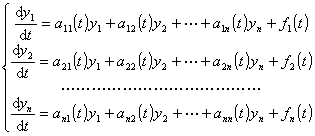
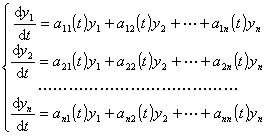

<h2 style='margin-left:36.0pt;text-indent:-36.0pt;text-autospace:none;
vertical-align:bottom'>三、&nbsp;
三、&nbsp;&nbsp;&nbsp; 线性微分方程组</h2>
<h3 style='text-autospace:none;vertical-align:bottom'>&nbsp;&nbsp;&nbsp;
1.&nbsp; 齐次线性微分方程组与非齐次线性微分方程组</h3>
<h4 style='text-autospace:none;vertical-align:bottom'>&nbsp;&nbsp;&nbsp;
[齐次与非齐次]&nbsp;
线性微分方程组的一般形式为</h4>
<pre style='text-align:right;text-autospace:none;vertical-align:bottom'
align=right>&nbsp;&nbsp;&nbsp;&nbsp;&nbsp;&nbsp;&nbsp;&nbsp;&nbsp;&nbsp;&nbsp;&nbsp;&nbsp;&nbsp;&nbsp;&nbsp;&nbsp;&nbsp;&nbsp;&nbsp;&nbsp;&nbsp;&nbsp;&nbsp;&nbsp;&nbsp;&nbsp;&nbsp;&nbsp; (1)</pre>

式中<i>aik</i>(<i>t</i>)和<i>fi</i>(<i>t</i>)&nbsp;&nbsp; ()都是自变量<i>t</i>的已知连续函数.如果至少有一个<i>fi</i>(<i>t</i>)不恒等于零，则称(1)为非齐次线性微分方程组.如果所有<i>fi</i>(<i>t</i>)都恒等于零，则称(1)为齐次线性微分方程组，它的一般形式是

<pre style='text-align:right;text-autospace:none;vertical-align:bottom'
align=right>&nbsp;&nbsp;&nbsp;&nbsp;&nbsp;&nbsp;&nbsp;&nbsp;&nbsp;&nbsp;&nbsp;&nbsp;&nbsp;&nbsp;&nbsp;&nbsp;&nbsp;&nbsp;&nbsp;&nbsp;&nbsp;&nbsp;&nbsp;&nbsp;&nbsp;&nbsp;&nbsp;&nbsp;&nbsp;&nbsp;&nbsp;&nbsp;&nbsp;&nbsp;&nbsp; (2)</pre>

如果齐次线性微分方程组(2)与非齐次线性微分方程组(1)具有相同的系数（即对应的<i>aik</i>(<i>t</i>)都相同），就称(2)是非齐次线性微分方程组(1)的对应的齐次线性微分方程组.

&nbsp;&nbsp;&nbsp; [解的存在定理]&nbsp; 如果线性微分方程组(1)的所有系数<i>aik</i>(<i>t</i>)和右端函数<i>fi</i>(<i>t</i>)在区间(<i>t</i>1,<i>t</i>2)内连续，那末方程组(1)在此区间的每一点<i>t</i>0(<i>t</i>1&lt;<i>t</i>0&lt;<i>t</i>2)都存在唯一满足初始条件(<i>t</i>0,<i>y</i>1(0),…,<i>yn</i>(0))的解，而且这个解定义在整个区间(<i>t</i>1,<i>t</i>2)内.

<h4 style='text-autospace:none;vertical-align:bottom'>&nbsp;&nbsp;&nbsp;
[解的基本结构]</h4>

&nbsp;&nbsp;&nbsp; 1°&nbsp; 齐次线性微分方程组的任意两个解的线性组合还是这个方程组的解.

&nbsp;&nbsp;&nbsp; 2°&nbsp; 含<i>n</i>个未知函数的齐次线性微分方程组的通解可以表示成它的<i>n</i>个线性无关解的线性组合.

&nbsp;&nbsp;&nbsp; 3°&nbsp; 含<i>n</i>个未知函数的非齐次线性微分方程组的通解可以表示成它的一个特解与它的对应的齐次线性微分方程组的通解的和.

