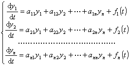
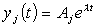
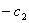

<h2 style='text-autospace:none;vertical-align:bottom'>&nbsp;&nbsp;&nbsp; 2.&nbsp;
常系数线性微分方程组</h2>

&nbsp;&nbsp;&nbsp; 微分方程组

<pre style='text-align:right;text-autospace:none;vertical-align:bottom'
align=right>&nbsp;&nbsp;&nbsp;&nbsp;&nbsp;&nbsp;&nbsp;&nbsp;&nbsp;&nbsp;&nbsp;&nbsp;&nbsp;&nbsp;&nbsp;&nbsp;&nbsp;&nbsp;&nbsp;&nbsp;&nbsp;&nbsp;&nbsp;&nbsp;&nbsp;&nbsp;&nbsp;&nbsp;&nbsp;&nbsp;&nbsp;&nbsp;&nbsp;&nbsp;&nbsp;&nbsp;&nbsp;&nbsp; (3)</pre>

称为常系数线性微分方程组，式中<i>aij</i>是常数.当<i>fi</i>(<i>t</i>)≡0 (<i>i</i>=1,2,…,<i>n</i>)，称(3)为齐次的，当<i>fi</i>(<i>t</i>)不全恒等于零，称(3)为非齐次的.

<h4 style='text-autospace:none;vertical-align:bottom'>&nbsp;&nbsp;&nbsp; [特征根与齐次方程组的线性无关解]</h4>

是<i>λ</i>的<i>n</i>次代数方程，它称为非齐次线性微分方程组(3)所对应的齐次线性微分方程组的特征方程，特征方程的根称为特征根.

根据特征根的不同情形，给出齐次线性微分方程组线性无关解的不同形式.

<table class=MsoNormalTable border=1 cellspacing=0 cellpadding=0
 style='border-collapse:collapse;border:none'>
 <tr>
  <td width=128 valign=top style='width:96.0pt;border:solid windowtext 1.0pt;
  border-left:none;padding:0mm 5.4pt 0mm 5.4pt'>
  
特征根<i>λ</i>

  </td>
  <td width=304 valign=top style='width:228.0pt;border:solid windowtext 1.0pt;
  border-left:none;padding:0mm 5.4pt 0mm 5.4pt'>
  
线性无关解中相应的解的形式

  </td>
  <td width=208 valign=top style='width:156.0pt;border-top:solid windowtext 1.0pt;
  border-left:none;border-bottom:solid windowtext 1.0pt;border-right:none;
  padding:0mm 5.4pt 0mm 5.4pt'>
  
说&nbsp;&nbsp; 明

  </td>
 </tr>
 <tr>
  <td width=128 valign=top style='width:96.0pt;border-top:none;border-left:
  none;border-bottom:solid windowtext 1.0pt;border-right:solid windowtext 1.0pt;
  padding:0mm 5.4pt 0mm 5.4pt'>
  
<i>λ</i>是单实根

  </td>
  <td width=304 valign=top style='width:228.0pt;border-top:none;border-left:
  none;border-bottom:solid windowtext 1.0pt;border-right:solid windowtext 1.0pt;
  padding:0mm 5.4pt 0mm 5.4pt'>
  
&nbsp;&nbsp;&nbsp;&nbsp;&nbsp;&nbsp;&nbsp;&nbsp;
  ( <i>j </i>= 1, 2,…,<i>n </i>)

  </td>
  <td width=208 valign=top style='width:156.0pt;border:none;border-bottom:solid windowtext 1.0pt;
  padding:0mm 5.4pt 0mm 5.4pt'>
  
<i>Aj</i>是待定常数

  </td>
 </tr>
 <tr>
  <td width=128 valign=top style='width:96.0pt;border-top:none;border-left:
  none;border-bottom:solid windowtext 1.0pt;border-right:solid windowtext 1.0pt;
  padding:0mm 5.4pt 0mm 5.4pt'>
  
<i>λ</i>是<i>r</i>重实根

  </td>
  <td width=304 valign=top style='width:228.0pt;border-top:none;border-left:
  none;border-bottom:solid windowtext 1.0pt;border-right:solid windowtext 1.0pt;
  padding:0mm 5.4pt 0mm 5.4pt'>
  
&nbsp;&nbsp;&nbsp;&nbsp;&nbsp;&nbsp;
  ( <i>j </i>= 1, 2,…,<i>n</i> )

  </td>
  <td width=208 valign=top style='width:156.0pt;border:none;border-bottom:solid windowtext 1.0pt;
  padding:0mm 5.4pt 0mm 5.4pt'>
  
<i>Pj</i>(<i>t</i>)是系数待定的次数不超过<i>r</i>-1次的多项式

  </td>
 </tr>
 <tr>
  <td width=128 valign=top style='width:96.0pt;border-top:none;border-left:
  none;border-bottom:solid windowtext 1.0pt;border-right:solid windowtext 1.0pt;
  padding:0mm 5.4pt 0mm 5.4pt'>
  
<i>λ=</i><i>α</i>±<i>i</i><i>β</i>是<i>k</i>重复根

  </td>
  <td width=304 valign=top style='width:228.0pt;border-top:none;border-left:
  none;border-bottom:solid windowtext 1.0pt;border-right:solid windowtext 1.0pt;
  padding:0mm 5.4pt 0mm 5.4pt'>
  

  
&nbsp;&nbsp;&nbsp;&nbsp;&nbsp;&nbsp;&nbsp;&nbsp;&nbsp;&nbsp;&nbsp;&nbsp;&nbsp;&nbsp;&nbsp;&nbsp;&nbsp;
  ( <i>j</i> = 1, 2,…<i>,n</i> )

  </td>
  <td width=208 valign=top style='width:156.0pt;border:none;border-bottom:solid windowtext 1.0pt;
  padding:0mm 5.4pt 0mm 5.4pt'>
  
<i>Qj</i>(<i>t</i>) ，<i>Rj</i>(<i>t</i>)是系数待定的次数不超过<i>k</i>-1次的多项式

  </td>
 </tr>
</table>
<h4 style='text-autospace:none;vertical-align:bottom'>&nbsp;&nbsp;&nbsp; [用常数变易法求非齐次方程组的特解]&nbsp;
非齐次线性微分方程组(3)的一个特解，可由对应的齐次线性微分方程组的通解利用常数变易法求得.</h4>

&nbsp;&nbsp;&nbsp; 设<i>y</i>11,<i>y</i>21,…,<i>yn</i>1;<i>y</i>12,<i>y</i>22,…,<i>yn</i>2;…;<i>y</i>1<i>n</i>,<i>y</i>2<i>n</i>,…,<i>ynn</i>是对应的齐次线性微分方程组的<i>n</i>个线性无关解.那末非齐次线性方程组的一个特解<i>y</i>1*,<i>y</i>2*,…,<i>yn</i>*可由下列形式确定

式中<i>ci</i>(<i>t</i>)是待定函数，它们满足下列方程组：

从上面方程组解出，再积分就得出所要求的<i>ci</i>(<i>t</i>) (<i>i</i>=1,2,…,<i>n</i>) 

&nbsp;&nbsp;&nbsp; 例&nbsp; 求解微分方程组：

<pre style='text-align:right;text-autospace:none;vertical-align:bottom'
align=right>&nbsp;&nbsp;&nbsp;&nbsp;&nbsp;&nbsp;&nbsp;&nbsp;&nbsp;&nbsp;&nbsp;&nbsp;&nbsp;&nbsp;&nbsp;&nbsp;&nbsp;&nbsp;&nbsp;&nbsp;&nbsp;&nbsp;&nbsp;&nbsp;&nbsp;&nbsp;&nbsp;&nbsp;&nbsp;&nbsp;&nbsp;&nbsp;&nbsp;&nbsp;&nbsp;&nbsp;&nbsp;&nbsp;&nbsp;&nbsp;&nbsp;&nbsp;&nbsp;&nbsp;&nbsp;&nbsp; (1)</pre>

&nbsp;&nbsp;&nbsp; 解&nbsp; 先求对应的齐次线性微分方程组

<pre style='text-align:right;text-autospace:none;vertical-align:bottom'
align=right>&nbsp;&nbsp;&nbsp;&nbsp;&nbsp;&nbsp;&nbsp;&nbsp;&nbsp;&nbsp;&nbsp;&nbsp;&nbsp;&nbsp;&nbsp;&nbsp;&nbsp;&nbsp;&nbsp;&nbsp;&nbsp;&nbsp;&nbsp;&nbsp;&nbsp;&nbsp;&nbsp;&nbsp;&nbsp;&nbsp;&nbsp;&nbsp;&nbsp;&nbsp;&nbsp;&nbsp;&nbsp;&nbsp;&nbsp;&nbsp;&nbsp;&nbsp;&nbsp;&nbsp;&nbsp;&nbsp;&nbsp;&nbsp; (2)</pre>

的通解.由特征方程

可知特征根为<i>λ</i>=5,.则相应的线性无关解是如下形式：

&nbsp;&nbsp;&nbsp;&nbsp;&nbsp;&nbsp;&nbsp;&nbsp;&nbsp;&nbsp;&nbsp;&nbsp;&nbsp;&nbsp;&nbsp;&nbsp;&nbsp;&nbsp;&nbsp;&nbsp;&nbsp;&nbsp;&nbsp;&nbsp;&nbsp;&nbsp;

分别代入齐次线性方程组(2)，利用待定系数法，确定出

<i>A</i>1=<i>c</i>1 , <i>A</i>2=2<i>c</i>1
,&nbsp;&nbsp;&nbsp;&nbsp;&nbsp; （<i>c</i>1 是任意常数）

<i>B</i>1=<i>c</i>2 , <i>B</i>2= ,&nbsp;&nbsp;&nbsp;&nbsp;&nbsp;
（<i>c</i>2 是任意常数）

所以齐次线性方程组 (2)的通解为

&nbsp;&nbsp;&nbsp;&nbsp;&nbsp;&nbsp;&nbsp;&nbsp;&nbsp;
（<i>c</i>1 ,<i>c</i>2
是任意常数）

&nbsp;&nbsp;&nbsp; 其次，利用常数变易法求非齐次线性方程组(1)的一个特解.把<i>c</i>1 ,<i>c</i>2看成是<i>t</i>的函数，解下列方程组

得

积分后，取

于是所求方程组(1)的通解是

式中<i>c</i>1 ,<i>c</i>2为任意常数.

