

四、&nbsp;&nbsp; 常系数非齐次线性微分方程的算子解法与方程组的算子解法（消去法）

&nbsp;&nbsp;&nbsp; [微分算子与逆算子]&nbsp; 记

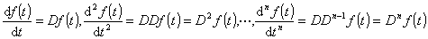

称<i>D</i>,<i>D</i>2,…,<i>Dn</i>为微分算子.一般地引进微分算子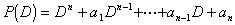（<i>a</i>1,<i>a</i>2,…,

<i>an</i>是常数）规定它的意义是 

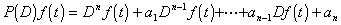

&nbsp;&nbsp;&nbsp; 还引进微分算子的逆算子，<i>Dk</i>的逆算子记为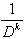，规定它的意义是

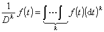&nbsp;&nbsp;&nbsp;&nbsp;&nbsp;&nbsp;
(<i>k</i>为正整数)

&nbsp;&nbsp;&nbsp; <i>P</i>(<i>D</i>)的逆算子记为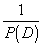，它满足条件

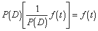

注意，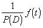的结果不是唯一的，而是一族函数.

&nbsp;&nbsp;&nbsp; [微分算子的简单性质与运算公式]

<table class=MsoNormalTable border=1 cellspacing=0 cellpadding=0
 style='border-collapse:collapse;border:none'>
 <tr>
  <td width=284 valign=top style='width:213.2pt;border:solid windowtext 1.0pt;
  border-left:none;padding:0mm 5.4pt 0mm 5.4pt'>
  
微分算子

  </td>
  <td width=363 valign=top style='width:272.2pt;border-top:solid windowtext 1.0pt;
  border-left:none;border-bottom:solid windowtext 1.0pt;border-right:none;
  padding:0mm 5.4pt 0mm 5.4pt'>
  
逆算子

  </td>
 </tr>
 <tr style='height:14.25pt'>
  <td width=284 valign=top style='width:213.2pt;border-top:none;border-left:
  none;border-bottom:solid windowtext 1.0pt;border-right:solid windowtext 1.0pt;
  padding:0mm 5.4pt 0mm 5.4pt;height:14.25pt'>
  
1o&nbsp; 若<i>c</i>1，<i>c</i>2，…<i>ck</i>为常数，则

  
&nbsp;&nbsp;&nbsp;&nbsp; <i>P</i>(<i>D</i>)[<i>c</i>1<i>f</i>1<i>(t</i>)+
  <i>c</i>2<i>f</i>2(<i>t</i>)+…

  
&nbsp;&nbsp;&nbsp;&nbsp;&nbsp;&nbsp;&nbsp;&nbsp;&nbsp;
  + <i>ckfk</i>(<i>t</i>)]

  
&nbsp;&nbsp; =<i>c</i>1<i>P</i>(<i>D</i>)<i>f</i>1(<i>t</i>)+
  <i>c</i>2<i>P</i>(<i>D</i>)<i>f</i>2(<i>t</i>)+…

  
&nbsp;&nbsp;&nbsp;&nbsp;&nbsp;&nbsp;&nbsp;&nbsp;&nbsp;
  + <i>ckP</i>(<i>D</i>)<i>fk</i>(<i>t</i>)

  
&nbsp;&nbsp;&nbsp;&nbsp;&nbsp;&nbsp;&nbsp;&nbsp;&nbsp;&nbsp;&nbsp;&nbsp;&nbsp;&nbsp;&nbsp;&nbsp;&nbsp;&nbsp;&nbsp;&nbsp;
  （线性）

  
2o&nbsp; 若<i>P</i>（<i>D</i>）= <i>P</i>1（<i>D</i>）·<i>P</i>2（<i>D</i>），则

  
<i>P</i>(<i>D</i>)<i>f</i>(<i>t</i>)
  = <i>P</i>1(<i>D</i>)[<i>P</i>2(<i>D</i>)<i>f</i>(<i>t</i>)]

  
&nbsp;&nbsp;&nbsp;&nbsp;&nbsp;&nbsp; = <i>P</i>2(<i>D</i>)[<i>P</i>1(<i>D</i>)<i>f</i>(<i>t</i>)]

  
&nbsp;&nbsp;&nbsp;&nbsp;&nbsp;&nbsp;&nbsp;&nbsp;&nbsp;&nbsp;&nbsp;&nbsp;&nbsp;&nbsp;&nbsp;&nbsp;&nbsp;&nbsp;&nbsp;&nbsp;
  (交换律)

  
3o&nbsp;&nbsp;&nbsp; <i>P</i>(<i>D</i>)<i>e</i>λt<i> </i>= <i>e</i>λ<i>t</i><i>P</i>(<i>λ</i>)

  
4o&nbsp; 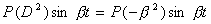

  
&nbsp;

  </td>
  <td width=363 valign=top style='width:272.2pt;border:none;border-bottom:solid windowtext 1.0pt;
  padding:0mm 5.4pt 0mm 5.4pt;height:14.25pt'>
  
若<i>c</i>1，<i>c</i>2，…<i>ck</i>为常数，则

  
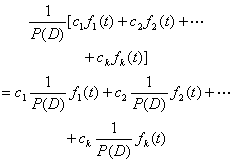

  
&nbsp;&nbsp;&nbsp;&nbsp;&nbsp;&nbsp;&nbsp;&nbsp;&nbsp;&nbsp;&nbsp;&nbsp;&nbsp;&nbsp;&nbsp;&nbsp;&nbsp;&nbsp;&nbsp;&nbsp;&nbsp;&nbsp;&nbsp;&nbsp;&nbsp;&nbsp;&nbsp;&nbsp;&nbsp;&nbsp;&nbsp;&nbsp;&nbsp;&nbsp;&nbsp;&nbsp;&nbsp;&nbsp;&nbsp;&nbsp;&nbsp;&nbsp;&nbsp;&nbsp;&nbsp;&nbsp;&nbsp;&nbsp;&nbsp;&nbsp;&nbsp;&nbsp;&nbsp;&nbsp;&nbsp;&nbsp;&nbsp;&nbsp;
  （线性）

  
若<i>P</i>（<i>D</i>）= <i>P</i>1（<i>D</i>）·<i>P</i>2（<i>D</i>），则

  
&nbsp; 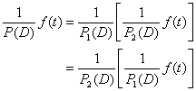

  
（交换律）

  
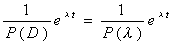&nbsp;

  
&nbsp;&nbsp;&nbsp;&nbsp;&nbsp;&nbsp;&nbsp;&nbsp;&nbsp;&nbsp;&nbsp;&nbsp;&nbsp;&nbsp;&nbsp;&nbsp;&nbsp;&nbsp;&nbsp;&nbsp;&nbsp;
  (<i>P</i>(<i>λ</i>)≠0)

  
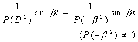

  
&nbsp;

  </td>
 </tr>
 <tr style='height:292.5pt'>
  <td width=284 valign=top style='width:213.2pt;border-top:none;border-left:
  none;border-bottom:solid windowtext 1.0pt;border-right:solid windowtext 1.0pt;
  padding:0mm 5.4pt 0mm 5.4pt;height:292.5pt'>
  
5o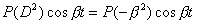

  
6o&nbsp; 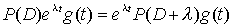

  
(位移定理)

  
7o

  </td>
  <td width=363 valign=top style='width:272.2pt;border:none;border-bottom:solid windowtext 1.0pt;
  padding:0mm 5.4pt 0mm 5.4pt;height:292.5pt'>
  
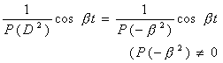

  
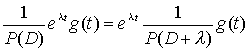

  
(位移定理)

  
设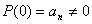,则

  
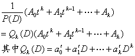

  
按以下方法求得:

  
将<i>P</i>(<i>D</i>)(按<i>D</i>的升幂排列),依一般的多项式除法规则去除1,在第<i>k</i>+1步得到的商,当商中得到<i>k</i>次多项式时,除法停止,这<i>k</i>次多项式即<i>Qk</i>(<i>D</i>).

  </td>
 </tr>
</table>

&nbsp;&nbsp;&nbsp; 上表中左栏各等式的意义是通常的，而右栏各等式的意义则是等号两边的函数族相同.

&nbsp;&nbsp;&nbsp; [用算子解法求常系数非齐次线性微分方程的特解]

&nbsp;&nbsp;&nbsp; 1°&nbsp; 方程<i>P</i>(<i>D</i>)<i>x=fk</i>(<i>t</i>)，其中<i>fk</i>(<i>t</i>)是<i>t</i>的<i>k</i>次多项式.

&nbsp;&nbsp;&nbsp; 分两种情形：

&nbsp;&nbsp;&nbsp; (i)&nbsp; <i>P</i>(0)≠0.依上表公式7°得

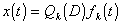

&nbsp;&nbsp;&nbsp; (ii)&nbsp; <i>P</i>(0)=0.此时<i>P</i>(<i>D</i>)=<i>Q</i>(<i>D</i>)<i>Dr</i>（整数<i>r</i>≥1），而<i>Q</i>(0)≠0.依上表公式2°有

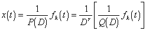

&nbsp;&nbsp;&nbsp; 设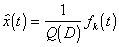，则

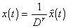

&nbsp;&nbsp;&nbsp; 2°&nbsp; 方程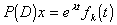（当<i>fk</i>(<i>t</i>)为常数时<i>P</i>(<i>λ</i>)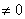）.

依上表公式6° ，一个特解为

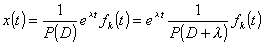

&nbsp;&nbsp;&nbsp; 3°&nbsp; 方程<i>P</i>(<i>D</i>)<i>x</i>=cos<i>tfk</i>(<i>t</i>)或<i>P</i>(<i>D</i>)<i>x</i>=sin<i>tfk</i>(<i>t</i>).

&nbsp;&nbsp;&nbsp; 考虑辅助方程

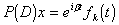

&nbsp;&nbsp;&nbsp; 它与方程2°同类型，设它的一个特解是

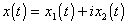

那末方程&nbsp;&nbsp;&nbsp;&nbsp;&nbsp;&nbsp;&nbsp;&nbsp;&nbsp;&nbsp;&nbsp;&nbsp;&nbsp;&nbsp;&nbsp;&nbsp;&nbsp;&nbsp; &nbsp;&nbsp;&nbsp;&nbsp;&nbsp;&nbsp;&nbsp;&nbsp;&nbsp;
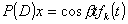

有一特解

<i>x</i>(<i>t</i>)=<i>x</i>1(<i>t</i>)

而方程&nbsp;&nbsp;&nbsp;&nbsp;&nbsp;&nbsp;&nbsp;&nbsp;&nbsp;&nbsp;&nbsp;&nbsp;&nbsp;&nbsp;&nbsp; &nbsp;&nbsp;&nbsp;&nbsp;&nbsp;&nbsp;&nbsp;&nbsp;&nbsp;
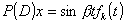

有一特解

<i>x</i>(<i>t</i>)=<i>x</i>2(<i>t</i>)

&nbsp;&nbsp;&nbsp; 4°&nbsp; 方程<i>P</i>(<i>D</i>2)<i>x</i>= 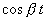或<i>P</i>(<i>D</i>2)<i>x</i>=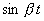.

&nbsp;&nbsp;&nbsp; 若<i>P</i>(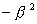)≠0，则由上表公式4°，5°得

或

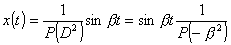

&nbsp;&nbsp;&nbsp; 若<i>P</i>()=0,则有正整数<i>r</i>和多项式<i>Q</i>(<i>Q</i>()≠0)使

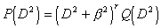

可按方程1° (ii)的方法处理.

&nbsp;&nbsp;&nbsp; [用算子解法（消去法）求线性微分方程组的解]&nbsp; 消去法是解代数方程组的有效方法之一.引进微分算子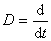之后，同样适用于解线性微分方程组.下面用具体例子来说明这个方法.

&nbsp;&nbsp;&nbsp; 设已给线性微分方程组

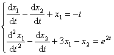

应用微分算子，上面方程组可写成

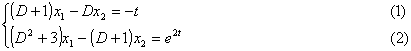

把这个方程组看成两个未知数<i>x</i>1,<i>x</i>2的代数方程组.利用消去法，依次解出<i>x</i>1,<i>x</i>2.

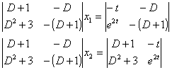

即

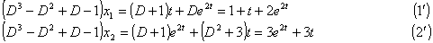

先解(1'),为此先求其对应的齐次方程

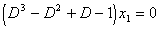

的通解.特征根为

<i>λ</i>1=1,<i>λ</i>2=<i>i</i>,<i>λ</i>3=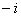

所以齐次方程的通解为

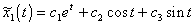&nbsp;&nbsp;&nbsp;&nbsp;
(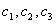为任意常数)

再用算子解法，求方程(1')的一个特解

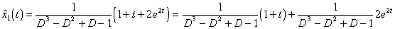

由前表公式7°有

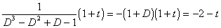

由前表公式3°有

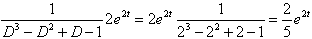

得到方程(1')的特解

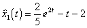

最后得出方程(1')的通解

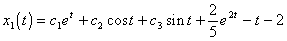

为求出<i>x</i>2 (<i>t</i>)，(1)减(2)得

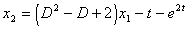

用<i>x</i>1(<i>t</i>)代入即得

