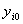

<b>§</b><b>5 </b><b>稳定性理论大意</b>

&nbsp;&nbsp;&nbsp; 稳定性理论研究的是当微分方程右端函数与初始条件发生变化时，解的变化情况.

一、 稳定性的概念

&nbsp;&nbsp;&nbsp; [解的稳定与不稳定]&nbsp; 设微分方程组

满足初始条件的解是.

&nbsp;&nbsp;&nbsp; 如果任意给定<i>ε</i>&gt;0，总存在相应的正数<i>δ</i>=<i>δ</i>( <i>t</i>0&nbsp;
,<i>ε</i>)，使得只要初始值满足

此微分方程组相应的解 (<i>i</i>=1,2,…,<i>n</i>)对所有<i>t</i>&gt;<i>t</i>0就满足

则称解是稳定的.

&nbsp;&nbsp;&nbsp; 简单地说,如果初始值靠近某解初始值的所有解当<i>t</i>&gt;<i>t</i>0 时总靠近某解,就说某解是稳定的.

&nbsp;&nbsp;&nbsp; 如果对于任意给定的<i>ε</i>&gt;0，不管<i>δ</i>&gt;0取得多么小，总存在满足

的初始值及<i>τ</i>&gt;<i>t</i>0，它相应的解不满足条件

则称解是不稳定的.

&nbsp;&nbsp;&nbsp; 如果稳定，并且初始值满足

的所有解都满足

则称是渐近稳定的.

&nbsp;&nbsp;&nbsp; [问题的简化]&nbsp; 给定方程组

为了研究它满足初始条件的解的稳定性，必须考察别的解与它的偏差.今令

原方程组便变为如下形式：

<pre style='text-align:right;line-height:12.0pt;text-autospace:none;vertical-align:
bottom' align=right>&nbsp;&nbsp;&nbsp;&nbsp;&nbsp;&nbsp; (1)</pre>

而的稳定性归结为方程组(1)的零解<i>x</i><i>i</i>≡0&nbsp; (<i>i</i>=1,2,…,<i>n</i>) 的稳定性.

&nbsp;&nbsp;&nbsp; 任何微分方程组的常数解常称为它的平衡点（奇点）.所以(1)的零解

是平衡点.

&nbsp;&nbsp;&nbsp; 如果任意给定<i>ε</i>&gt;0，总存在相应的正数<i>δ</i>=<i>δ</i>( <i>t</i>0&nbsp;
,<i>ε</i>)，使得只要初始值满足

(1)的相应解对所有<i>t</i>&gt;<i>t</i>0就满足

则称(1)的平衡点是稳定的.

如果进而满足条件

则称平衡点是渐进稳定的.

&nbsp;&nbsp;&nbsp; 如果不论正数<i>δ</i>选得多么小，对于预先给定的正数<i>ε</i>，总存在满足

的初始值及<i>τ</i>&gt;<i>t</i>0，它相应的解不满足条件

则称(1)的平衡点不稳定.

&nbsp;&nbsp;&nbsp; [相空间]&nbsp; 给定方程组

称(<i>x</i>1,<i>x</i>2,…,<i>x</i>n)的空间为此方程组的相空间，特别当<i>n=</i>2时，称为相平面.当方程组右端函数不显含<i>t</i>时，它的解作为相空间的曲线，称为轨道.在其他情况下，解曲线常称为积分曲线.

