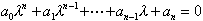

二、 稳定性问题的解法

&nbsp;&nbsp;&nbsp; [常系数齐次线性微分方程组平衡点的稳定性问题]&nbsp;
为了简便起见，只研究含两个未知函数的方程组

式中<i>a</i>11,<i>a</i>12,<i>a</i>21,<i>a</i>22都为实数，且

&nbsp;&nbsp;&nbsp; 从特征方程

算出特征根<i>λ</i>1，<i>λ</i>2，依次代入下面方程组：

分别确定出两组解和.

&nbsp;&nbsp;&nbsp; 这时线性方程组的平衡点<i>x</i>≡0,<i>y</i>≡0的稳定性可分下列几种情况讨论.

&nbsp;&nbsp;&nbsp; 1°&nbsp; 特征根是实数：

&nbsp;&nbsp;&nbsp; 通解的形式是

式中<i>c</i>1,<i>c</i>2为任意常数.

&nbsp;&nbsp;&nbsp; (i)&nbsp;&nbsp; 1&lt;0,2&lt;0

&nbsp;&nbsp;&nbsp; 零解是渐近稳定的.轨道形状如图13.1(<i>a</i>)（箭头表示<i>t</i>增大的方向，下同）.这种类型的平衡点(0,0)称为稳定结点.

&nbsp;&nbsp;&nbsp; (ii)1&gt;0,2&gt;0

&nbsp;&nbsp;&nbsp; 零解是不稳定的.轨道形状如图13.1(<i>b</i>).这种类型的平衡点(0,0)称为不稳定结点.

&nbsp;&nbsp;&nbsp; (iii) 1&gt;0,2&lt;0

&nbsp;&nbsp;&nbsp; 零解是不稳定的.轨道形状如图13.1(<i>c</i>).这种类型的平衡点(0,0)称为鞍点.

&nbsp;&nbsp;&nbsp;&nbsp;&nbsp; 

<pre style='text-align:center;line-height:12.0pt;text-autospace:none;
vertical-align:bottom' align=center>(<i>a</i>)&nbsp;&nbsp;&nbsp;&nbsp;&nbsp;&nbsp;&nbsp;&nbsp;&nbsp;&nbsp;&nbsp;&nbsp;&nbsp;&nbsp;&nbsp;&nbsp;&nbsp;&nbsp;&nbsp;&nbsp;&nbsp;&nbsp;&nbsp;&nbsp;&nbsp;&nbsp; (<i>b</i>)&nbsp;&nbsp;&nbsp;&nbsp;&nbsp;&nbsp;&nbsp;&nbsp;&nbsp;&nbsp;&nbsp;&nbsp;&nbsp;&nbsp;&nbsp;&nbsp;&nbsp;&nbsp;&nbsp;&nbsp;&nbsp;&nbsp;&nbsp;&nbsp;&nbsp;&nbsp;&nbsp; (<i>c</i>)</pre>

图13.1

&nbsp;&nbsp;&nbsp; 2°&nbsp; 特征根是复数：

&nbsp;&nbsp;&nbsp; 通解的形式是

式中<i>c</i>1,<i>c</i>2是任意常数，<i>c</i>1*,<i>c</i>2*是<i>c</i>1,<i>c</i>2的线性组合.

&nbsp;&nbsp;&nbsp; (i)&nbsp;&nbsp; 1,2=<i>piq</i>, <i>p</i>&lt;0, <i>q</i>0.

&nbsp;&nbsp;&nbsp; 零解是稳定的.轨道形状如图13.2(<i>a</i>).这种类型的平衡点(0,0)称为稳定的焦点.

&nbsp;&nbsp;&nbsp; (ii)1,2=<i>piq</i>, <i>p</i>&gt;0, <i>q</i>0.

&nbsp;&nbsp;&nbsp; 零解是不稳定的.轨道形状如图13.2(<i>b</i>).这种类型的平衡点(0,0)称为不稳定的焦点.

&nbsp;&nbsp;&nbsp; (iii) 1,2=<i>iq</i>, <i>q</i>0.

&nbsp;&nbsp;&nbsp; 零解是稳定的.轨道形状如图13.2(<i>c</i>).这种类型的平衡点(0,0)称为中心，中心是稳定的.

图13.2

&nbsp;&nbsp;&nbsp; 3°&nbsp; 特征方程有重根：

&nbsp;&nbsp;&nbsp; 通解的形式是

&nbsp;&nbsp;&nbsp; (i)&nbsp;&nbsp; 1=2&lt;0

&nbsp;&nbsp;&nbsp; 零解是渐近稳定的.轨道形状如图13.3(<i>a</i>).这种类型的平衡点(0,0)称为稳定的退化结点.

&nbsp;&nbsp;&nbsp; 如果.零解是稳定的结点，称为临界结点.轨道形状如图13.3 (<i>b</i>).

图13.3

&nbsp;&nbsp;&nbsp; (ii)&nbsp; 1=2&gt;0

&nbsp;&nbsp;&nbsp; 零解是不稳定的.轨道形状如图13.3(<i>a</i>)与(<i>b</i>),但箭头的方向相反.这种类型的平衡点(0,0)称为不稳定的退化结点与不稳定的临界结点.

&nbsp;&nbsp;&nbsp; 综合上述各种情况可得如下结论：如果特征方程的根都有负的实部，那末零解是稳定的，而且是渐近稳定的；如果特征方程有一个具有正实部的根，那末零解是不稳定的.

&nbsp;&nbsp;&nbsp; 这个结论，对一般的常系数齐次线性微分方程组

也是成立的.

&nbsp;&nbsp;&nbsp; 定理&nbsp; 如果常系数齐次线性微分方程组的特征方程

所有的根的实部都是负的，则零解是渐近稳定的；如果特征方程的所有根中至少有一个实部为正的根，则零解是不稳定的.

&nbsp;&nbsp;&nbsp; [按一次近似判定稳定性]&nbsp; 考虑方程组

式中<i>a</i><i>ij</i> (<i>i,j</i>=1,2,…,<i>n</i>)是常数，<i>Ri</i>(<i>x</i>1,<i>x</i>2,…,<i>x</i><i>n</i>) (<i>i=</i>1,2,…,<i>n</i>)对来说是不低于二阶.

&nbsp;&nbsp;&nbsp; 其一次近似方程组为

研究一次近似方程组的特征根<i>i&nbsp; </i>(<i>i=</i>1,2,…,<i>n</i>)的各种情况可以判定稳定性.有两个基本定理：

<b>&nbsp;&nbsp;&nbsp; </b>第一定理&nbsp; 如果一次近似方程组的所有特征根都具有负的实部，那末原方程组的零解是渐近稳定的.

<b>&nbsp;&nbsp;&nbsp; </b>第二定理&nbsp; 如果一次近似方程组的特征根至少有一个具有正实部，那末原方程组的零解是不稳定的.

&nbsp;&nbsp;&nbsp; 这两个定理包括了所有可以用一次近似方程组来研究原方程组零解的稳定情况（称为非临界情况）.至于至少有一个实部为零的根，而其他各根都有负的实部的临界情况，方程组右边的高阶项对于零解的稳定性起着重要的作用，因而一般不可能借一次近似方程组来研究稳定性问题.

&nbsp;&nbsp;&nbsp; [胡尔威茨判别法]&nbsp; 它是直接利用特征方程的系数所构成的行列式的某些性质来判别常系数线性微分方程组零解稳定性的方法.

&nbsp;&nbsp;&nbsp; 设常系数线性微分方程组的特征方程为

那末常系数线性微分方程组零解是渐近稳定的充分必要条件是：<i>a</i>0&gt;0，且所有的胡尔威茨行列式

都是正的（最后的Δ<i>n</i>&gt;0可用条件<i>a</i><i>n</i>&gt;0代替）.

&nbsp;&nbsp;&nbsp; 如果Δ<i>n</i>=0，那末由于Δ<i>n</i>=<i>a</i><i>n</i>Δ<i>n</i>-1=0，必有<i>a</i><i>n</i>=0或Δ<i>n</i>-1=0.若<i>a</i><i>n</i>=0，则特征方程有零根；若Δ<i>n</i>-1=0，则特征方程有纯虚根，在这两种情况下，零解可能是稳定的也可能是不稳定的.

&nbsp;&nbsp;&nbsp; 特征方程是二次、三次和四次时的胡尔威茨判别条件（为作图方便，以下都取<i>a</i>0=1）：

&nbsp;&nbsp;&nbsp; (i)&nbsp;&nbsp; 特征方程：

&nbsp;&nbsp;&nbsp; 胡尔威茨条件为&nbsp; <i>a</i>1&gt;0, <i>a</i>2&gt;0

&nbsp;&nbsp;&nbsp; 稳定区域见图13.4(<i>a</i>).

&nbsp;&nbsp;&nbsp; (ii)&nbsp; 特征方程：

&nbsp;&nbsp;&nbsp; 胡尔威茨条件为&nbsp; 

&nbsp;&nbsp;&nbsp; 稳定区域见图13.4(<i>b</i>).

图13.4

&nbsp;&nbsp;&nbsp; (iii) 特征方程：

&nbsp;&nbsp;&nbsp; 胡尔威茨条件为&nbsp; .

&nbsp;&nbsp;&nbsp; [李雅普诺夫第二方法（直接方法）]&nbsp; 研究微分方程组

<pre style='text-align:right;line-height:12.0pt;text-autospace:none;vertical-align:
bottom' align=right>&nbsp;&nbsp;&nbsp;&nbsp;&nbsp;&nbsp;&nbsp;&nbsp;&nbsp;&nbsp;&nbsp;&nbsp;&nbsp;&nbsp;&nbsp;&nbsp;&nbsp;&nbsp;&nbsp;&nbsp;&nbsp;&nbsp;&nbsp; (1)</pre>

的平衡点的稳定性有一个比较一般的方法，即所谓李雅普诺夫方法.

&nbsp;&nbsp;&nbsp; 1°&nbsp; 李雅普诺夫稳定性定理&nbsp;
对于方程组(1)，如果可以找到一个在原点邻域满足下列条件的可微函数<i>V</i>(<i>x</i>1,<i>x</i>2,…,<i>x</i><i>n</i>)（称为李雅普诺夫函数）：

&nbsp;&nbsp;&nbsp; (i)&nbsp;&nbsp; <i>V</i>(<i>x</i>1,<i>x</i>2,…,<i>x</i><i>n</i>) ≥0（或≤0），且只在<i>x</i><i>i</i>=0 (<i>i</i>=1,2,…,<i>n</i>)时，<i>V</i>=0.

&nbsp;&nbsp;&nbsp; (ii)&nbsp; 当<i>t</i>≥<i>t</i>0时，<i>V</i>沿方程组(1)的积分曲线的全导数

(或)

那末方程组(1)的平衡点<i>x</i><i>i</i>=0 (<i>i</i>=1,2,…,<i>n</i>)是稳定的.

&nbsp;&nbsp;&nbsp; 2°&nbsp; 李雅普诺夫渐近稳定性定理&nbsp;
对于方程组(1)，如果可以找到一个在原点的邻域内满足下列条件的可微函数<i>V</i>(<i>x</i>1,<i>x</i>2,…,<i>x</i><i>n</i>)（称为李雅普诺夫函数）：

&nbsp;&nbsp;&nbsp; (i)&nbsp;&nbsp; <i>V</i>(<i>x</i>1,<i>x</i>2,…,<i>x</i><i>n</i>)≥0（或≤0），且只在<i>x</i><i>i</i>=0 (<i>i</i>=1,2,…,<i>n</i>)时，<i>V</i>=0.

&nbsp;&nbsp;&nbsp; (ii)&nbsp; 沿方程组(1)的积分曲线的全导数

(或)

&nbsp;&nbsp;&nbsp; 而在原点某适当小的<i>δ</i>邻域外部（即），<i>t</i>≥<i>t</i>0时，（或）那末方程组(1)的平衡点<i>x</i><i>i</i>=0 (<i>i</i>=1,2,…,<i>n</i>)是渐近稳定的.

&nbsp;&nbsp;&nbsp; 例&nbsp; 研究微分方程组

在平衡点<i>x</i>=0,<i>y</i>=0 的稳定性.

&nbsp;&nbsp;&nbsp; 解&nbsp; 这个方程组的一次近似方程的特征方程有两个纯虚根，因此是一临界情况，不能用一次近似方法研究.现用李雅普诺夫方法.取

因为

&nbsp;&nbsp;&nbsp; (i)&nbsp;&nbsp; 

&nbsp;&nbsp;&nbsp; (ii)&nbsp; 

&nbsp;&nbsp;&nbsp;
对于任意的<i>δ</i>&gt;0，当,<i>t</i>&gt;<i>t</i>0时，.所以，平衡点(0,0)是渐近稳定的.

