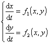
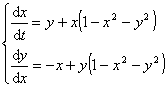
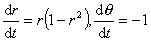
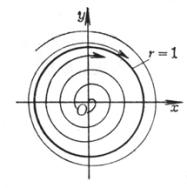
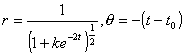
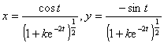
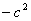
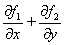

三、 极限圈（或极限环）

&nbsp;&nbsp;&nbsp; 这里只讨论<i>n=</i>2的情形.

&nbsp;&nbsp;&nbsp; [周期解]&nbsp; 方程

以<i>T</i>为周期的周期解是满足<i>x</i>(<i>t+T</i>)=<i>x</i>(<i>t</i>)，<i>y</i>(<i>t+T</i>)=<i>y</i>(<i>t</i>)的解.周期解所对应的轨道是闭曲线.反过来，闭轨道对应于周期解.

&nbsp;&nbsp;&nbsp; [极限圈]&nbsp; 孤立的周期解称为方程的极限圈.完整地说，就是：设 <i>x=x</i>(<i>t</i>),<i>y=y</i>(<i>t</i>)是方程的周期解，<i>K</i>是这个解在相平面上描出的闭曲线.如果存在正数<i>ρ</i>，使得对于相平面上任一与<i>K</i>距离小于<i>ρ</i>的点<i>ζ</i>，方程过点<i>ζ</i>的解就不是周期的，那末称<i>x=x</i>(<i>t</i>)，<i>y=y</i>(<i>t</i>)（即闭轨道<i>K</i>）为孤立的周期解，或极限圈.

&nbsp;&nbsp;&nbsp; 例

作坐标变换：<i>x</i>=<i>r</i>cos, <i>y</i>=<i>r</i>sin，方程组化为

通解为

<table cellspacing=0 cellpadding=0 hspace=0 vspace=0 width=199 height=215
 align=left>
 <tr>
  <td valign=top align=left height=215 style='padding-top:0mm;padding-right:
  9.0pt;padding-bottom:0mm;padding-left:9.0pt'>
  

  

  
图13.5

  

  </td>
 </tr>
</table>

其中<i>k</i>,<i>t</i>0是任意的.取<i>t</i>0=0，则方程组的解为

当<i>k=</i>0时， 是圆周<i>x</i>2+<i>y</i>2=1；当<i>k=c</i>2&nbsp; (<i>c&gt;</i>0)时是一螺线，当<i>t</i>-时，趋于原点，而当<i>t</i>时，从内部盘旋逼近圆周<i>x</i>2+<i>y</i>2=1；当<i>k=</i>&nbsp; (<i>c&gt;</i>0)时，轨道是一曲线，当<i>t</i>log<i>c</i>+0时，趋向无穷，而当<i>t</i>时，从外部盘旋逼近圆周<i>x</i>2+<i>y</i>2=1.

&nbsp;&nbsp;&nbsp; 轨道分布如图13.5.

&nbsp;&nbsp;&nbsp; 这时圆周<i>x</i>2+<i>y</i>2=1就是方程组的唯一极限圈.(0,0)是唯一的奇点.

&nbsp;&nbsp;&nbsp; [极限圈存在性定理]&nbsp; 对于方程组

&nbsp;&nbsp;&nbsp; 1°&nbsp; 设在<i>xy</i>平面上有两个简单闭曲线<i>C</i>1及<i>C</i>2, <i>C</i>2在<i>C</i>1的内部，满足下面两个条件：

&nbsp;&nbsp;&nbsp; (i)&nbsp;&nbsp; <i>C</i>1上的点的矢量场由<i>C</i>1的外部指向内部，<i>C</i>2上的点的矢量场由<i>C</i>2的内部指向外部；

&nbsp;&nbsp;&nbsp; (ii)&nbsp; <i>C</i>1及<i>C</i>2所围成的环形区域中方程组没有奇点；

那末在 <i>C</i>1及<i>C</i>2所围成的环形区域中，一定存在稳定的极限圈（称为庞卡莱-班狄克生定理）.

&nbsp;&nbsp;&nbsp; 2°&nbsp; 如果在某单连通区域<i>G</i>内，不变号，并且在任何子区域<i>D</i>(<i>G</i>)内都不恒等于零，那末在<i>G</i>内，方程组没有任何闭轨道.

