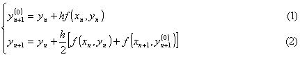
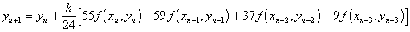

<b>§</b><b>6&nbsp;&nbsp;&nbsp;&nbsp;&nbsp;
</b><b>常微分方程的数值解法</b>

一、&nbsp;&nbsp;&nbsp;&nbsp;&nbsp;&nbsp;
一、&nbsp;&nbsp;&nbsp; 一阶微分方程初值问题的数值解

&nbsp;&nbsp;&nbsp; 要求微分方程

在初始条件

下的数值解，就是要在解存在的区间的一系列点

上从初值<i>y</i>0出发，逐个求出的近似值 .

&nbsp;&nbsp;&nbsp; [改进的欧拉方法（预报校正法）]&nbsp; 计算公式为

式中<i>y</i><i>n</i>表示<i>y</i>(<i>x</i><i>n</i>)的近似值，<i></i>表示步长.这里截断误差为

&nbsp;&nbsp;&nbsp; 这个方法中，(1)式用折线法提供初值，称为预报公式.(2)式用梯形法给出较精确的值，称为校正公式.合称预报校正公式.

&nbsp;&nbsp;&nbsp; [龙格-库塔方法]&nbsp; 计算公式为

式中

截断误差为&nbsp;&nbsp;&nbsp;&nbsp;&nbsp;&nbsp;&nbsp;&nbsp;&nbsp;&nbsp;&nbsp;&nbsp;&nbsp;&nbsp;&nbsp;&nbsp;&nbsp;&nbsp;&nbsp;&nbsp;&nbsp;&nbsp;&nbsp;&nbsp;&nbsp;&nbsp;&nbsp;&nbsp;&nbsp;&nbsp;&nbsp;&nbsp;&nbsp;&nbsp;&nbsp;&nbsp;&nbsp;&nbsp;
<i>R=O</i>(<i>h</i>5)

&nbsp;&nbsp;&nbsp; 手算时按下表自上而下进行.

<table class=MsoNormalTable border=1 cellspacing=0 cellpadding=0
 style='border-collapse:collapse;border:none'>
 <tr style='height:28.5pt'>
  <td width=105 valign=top style='width:78.75pt;border:solid windowtext 1.0pt;
  border-left:none;padding:0mm 5.4pt 0mm 5.4pt;height:28.5pt'>
  
<i></i>

  </td>
  <td width=126 valign=top style='width:94.5pt;border:solid windowtext 1.0pt;
  border-left:none;padding:0mm 5.4pt 0mm 5.4pt;height:28.5pt'>
  
<i></i>

  </td>
  <td width=224 valign=top style='width:168.0pt;border:solid windowtext 1.0pt;
  border-left:none;padding:0mm 5.4pt 0mm 5.4pt;height:28.5pt'>
  

  </td>
  <td width=189 valign=top style='width:50.0mm;border-top:solid windowtext 1.0pt;
  border-left:none;border-bottom:solid windowtext 1.0pt;border-right:none;
  padding:0mm 5.4pt 0mm 5.4pt;height:28.5pt'>
  
<i>k</i>

  </td>
 </tr>
 <tr>
  <td width=105 valign=top style='width:78.75pt;border-top:none;border-left:
  none;border-bottom:solid windowtext 1.0pt;border-right:solid windowtext 1.0pt;
  padding:0mm 5.4pt 0mm 5.4pt'>
  
<i>x</i>0

  

  

  </td>
  <td width=126 valign=top style='width:94.5pt;border-top:none;border-left:
  none;border-bottom:solid windowtext 1.0pt;border-right:solid windowtext 1.0pt;
  padding:0mm 5.4pt 0mm 5.4pt'>
  
<i>y</i>0

  

  

  </td>
  <td width=224 valign=top style='width:168.0pt;border-top:none;border-left:
  none;border-bottom:solid windowtext 1.0pt;border-right:solid windowtext 1.0pt;
  padding:0mm 5.4pt 0mm 5.4pt'>
  

  </td>
  <td width=189 valign=top style='width:50.0mm;border:none;border-bottom:solid windowtext 1.0pt;
  padding:0mm 5.4pt 0mm 5.4pt'>
  

  </td>
 </tr>
</table>

&nbsp;&nbsp;&nbsp; [阿达姆斯方法]

&nbsp;&nbsp;&nbsp; 1°&nbsp; 内插公式

这是关于的隐式方程，只要<i>h</i>比较小，可用迭代法求解.

&nbsp;&nbsp;&nbsp; 2°&nbsp; 外推公式

这是关于<i>y</i><i>n</i>+1的显式方程，只要知道前几点的值，就可从公式中直接算出<i>y</i><i>n</i>+1.

&nbsp;&nbsp;&nbsp; 3°&nbsp; 预报校正公式

截断误差都为

<i>R=O</i>(<i>h</i>5)

&nbsp;&nbsp;&nbsp; 阿达姆斯方法可以单独采用外推公式计算，每算一个<i>y</i><i>n</i>+1，只要计算一次<i>f</i>(<i>x,y</i>)的值，计算量比龙格-库塔法小，而截断误差同阶，所以计算量小是外推法优点之一.缺点是前几个<i>y</i><i>i</i>值不能用此法计算，计算<i>y</i>1 ,<i>y</i>2 ,<i>y</i>3需采用其他方法（一般可用龙格-库塔法）.

&nbsp;&nbsp;&nbsp; 补充说明 &nbsp;&nbsp;1°&nbsp; 阿达姆斯方法中，计算<i>y</i><i>n</i>+1的值，要用到所以称为多步法.而改进的欧拉法、龙格-库塔法，只要用到<i>y</i><i>n</i>，所以称为一步法.

&nbsp;&nbsp;&nbsp; 2°&nbsp; 一步法中途改变步长方便，多步法中途改变步长麻烦，因要用一步法重新算出开头几项.

&nbsp;&nbsp;&nbsp; 3°&nbsp; 多步法还有一个优点，即可顺便估计出截断误差.

&nbsp;&nbsp;&nbsp; 用<i>y</i><i>n</i>+1(<i>E</i>)和<i>y</i><i>n</i>+1(<i>I</i>)分别表示用外推和内插公式算得的值，有

式中.若计算时规定的允许误差不超过<i>ε</i>，就将<i>ε</i>与

比较，如果，可继续计算，否则说明误差太大，应当缩小步长.若比<i>ε</i>小得多，不妨将步长放大，提高计算速度.

