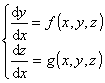
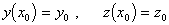
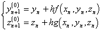
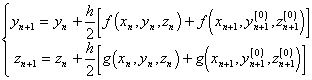
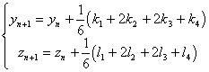
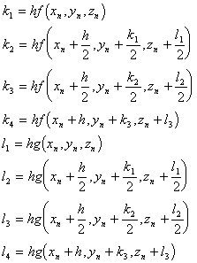
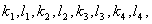
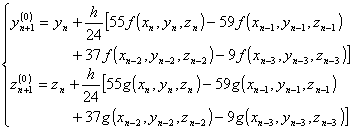
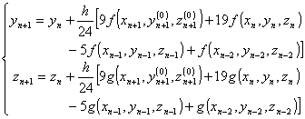

二、 一阶微分方程组初值问题的数值解

&nbsp;&nbsp;&nbsp; 这里为书写简便，只讨论含两个未知函数的微分方程组，含多个未知函数的微分方程组，计算公式类同.

和初始条件

&nbsp;&nbsp;&nbsp; [改进的欧拉方法（预报校正法）]

&nbsp;&nbsp;&nbsp; 预报公式

&nbsp;&nbsp;&nbsp; 校正公式

&nbsp;&nbsp;&nbsp; [龙格-库塔方法]&nbsp; 计算公式为

其中

先计算再计算<i>y</i><i>n</i>+1,<i>z</i><i>n</i>+1.

&nbsp;&nbsp;&nbsp; [阿达姆斯方法的预报校正公式]

&nbsp;&nbsp;&nbsp; 预报值（外推公式）

&nbsp;&nbsp;&nbsp; 校正值（内插公式）

&nbsp;&nbsp;&nbsp; 前几个<i>y</i><i>j</i>和<i>z</i><i>j</i>的计算与本节一中的龙格-库塔方法相同.

