

三、 边值问题

&nbsp;&nbsp;&nbsp; 这里只讨论二阶线性常微分方程的边值问题.

<pre style='text-align:right;text-autospace:none;vertical-align:bottom'
align=right>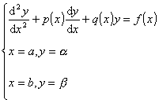&nbsp;&nbsp;&nbsp;&nbsp;&nbsp;&nbsp;&nbsp;&nbsp;&nbsp;&nbsp;&nbsp;&nbsp;&nbsp;&nbsp;&nbsp;&nbsp;&nbsp;&nbsp;&nbsp;&nbsp;&nbsp;&nbsp;&nbsp;&nbsp;&nbsp;&nbsp;&nbsp;&nbsp;&nbsp;&nbsp;&nbsp;&nbsp;&nbsp;&nbsp;&nbsp;&nbsp;&nbsp; (1)</pre>

&nbsp;&nbsp;&nbsp; [差分方法]&nbsp; 将区间[<i>a,b</i>]分成<i>n</i>等份，步长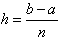，分点<i>x</i>0=<i>a</i>,<i> x</i>1=<i>a+h</i>, <i>…</i>, <i>x</i><i>k</i>=<i>a+kh</i>,
<i>…</i>,<i>x</i><i>n</i>=<i>b </i>称为节点.把微商用差商代替，边值问题化为下面差分方程组的求解问题.

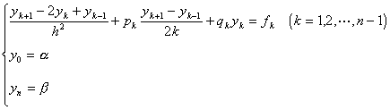

式中<i>y</i><i>k</i>=<i>y</i>(<i>x</i><i>k</i>),<i>p</i><i>k</i>=<i>p</i>(<i>x</i><i>k</i>),<i>q</i><i>k</i>=<i>q</i>(<i>x</i><i>k</i>),<i>f</i><i>k</i>=<i>f</i>(<i>x</i><i>k</i>)&nbsp;&nbsp;
(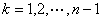).上面的差分方程组可看成<i>n</i>+1个未知量<i>y</i>0,<i>y</i>1,<i>y</i>2,…,<i>y</i><i>n</i> 的线性代数方程组，方程个数也是<i>n</i>+1.整理合并同类项，差分方程组可改写成

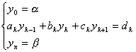&nbsp;&nbsp;&nbsp;&nbsp;&nbsp;&nbsp;&nbsp;
()

式中

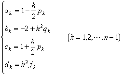

&nbsp;&nbsp;&nbsp; 这是一种特殊形式的线性代数方程组,除了可用消元法，迭代法等求解外，还可用更简便有效的方法—追赶法(见第四章,<b> </b>§3).

&nbsp;&nbsp;&nbsp; 在应用上，还可能遇到下面形式的边界条件：

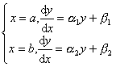

式中<i>α</i>1，<i>α</i>2，<i>β</i>1，<i>β</i>2是已知常数.这时，上面差分方程组中相应于边界条件的那两个方程要换成：

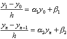

&nbsp;&nbsp;&nbsp; [化为初值问题的数值解]&nbsp; 先求出初值问题

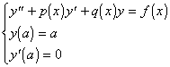

的数值解<i>y</i>0(<i>x</i>)，再求出满足初始条件<i>y</i>(<i>a</i>)=0,<i>y'</i>(<i>a</i>)=1的相应齐次方程

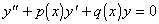

的数值解<i>y</i>1(<i>x</i>).原边值问题(1)的解可表示为

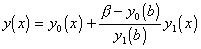

