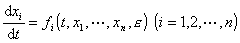
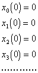

四、 小参数法

&nbsp;&nbsp;&nbsp; 当微分方程含有绝对值很小的参数<i>ε</i>时，将解写成<i>ε</i>的幂级数以求得近似解析解的方法，称为小参数法.下面就常微分方程初值问题作简略介绍.

&nbsp;&nbsp;&nbsp; 给定微分方程组

<pre style='text-align:right;text-autospace:none;vertical-align:bottom'
align=right>&nbsp;&nbsp;&nbsp;&nbsp;&nbsp;&nbsp;&nbsp;&nbsp;&nbsp;&nbsp;&nbsp;&nbsp;&nbsp;&nbsp;&nbsp;&nbsp;&nbsp;&nbsp;&nbsp;&nbsp;&nbsp;&nbsp;&nbsp;&nbsp;&nbsp;&nbsp;&nbsp;&nbsp;&nbsp;&nbsp; (1)</pre>

假设所有作为<i>t</i>的函数是充分光滑的，作为的函数是解析的，并且在 <i>ε=</i>0可以展开成<i>ε</i>的幂级数

系数又都是<i>x</i>1,…,<i>x</i><i>n</i>的解析函数.

&nbsp;&nbsp;&nbsp; 又给定初始条件

<pre style='text-align:right;text-autospace:none;vertical-align:bottom'
align=right><i>t=t</i>0时，<i>x</i><i>i</i>=<i>x</i><i>i</i>(<i>ε</i>)=<i>x</i><i>i</i>(0) +<i>εx</i><i>i</i>(1) +…&nbsp;&nbsp;&nbsp;&nbsp;&nbsp;&nbsp;&nbsp;&nbsp;&nbsp;&nbsp;&nbsp;&nbsp;&nbsp;&nbsp;&nbsp;&nbsp;&nbsp;&nbsp;&nbsp;&nbsp;&nbsp;&nbsp;&nbsp;&nbsp;&nbsp;&nbsp; (2)</pre>

于是方程组(1)的满足初始条件(2)的解在<i>t</i>与<i>ε</i>的某区域上存在，并且可以展开成<i>ε</i> 的幂级数

<pre style='text-align:right;text-autospace:none;vertical-align:bottom'
align=right>&nbsp;&nbsp;&nbsp;&nbsp;&nbsp;&nbsp;&nbsp;&nbsp;&nbsp;&nbsp;&nbsp;&nbsp;&nbsp;&nbsp;&nbsp;&nbsp;&nbsp;&nbsp;&nbsp;&nbsp;&nbsp;&nbsp;&nbsp;&nbsp;&nbsp;&nbsp;&nbsp; (3)</pre>

而(3)的任何部分和便是(1)的满足(2)的近似解析解.在具体计算时，只需把级数(3)代入(1)，把两边化为<i>ε</i>的幂级数形状，再比较系数.

&nbsp;&nbsp;&nbsp; 例&nbsp; 求包含小参数<i>ε</i>的黎卡提方程

满足初始条件

<i>t=</i>0, <i>x=</i>0

的解.

&nbsp;&nbsp;&nbsp; 解&nbsp; 设

代入上述微分方程，得

即

令两边<i>ε</i>的同次幂系数相等，得到

另外初始条件可改写为

于是又可列出

求出

而

是所求解的近似表达式（即近似解析解）.

