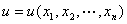
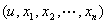
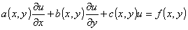
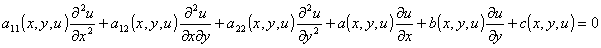
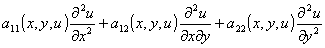
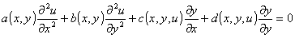
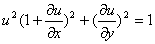

<h1 align=center style='text-align:center'>第十四章 偏微分方程</h1>

&nbsp;&nbsp;&nbsp; 物理、力学、工程技术和其他自然科学经常提出大量的偏微分方程问题.由于实践的需要和一些数学学科（如泛函分析，计算技术）的发展，促进了偏微分方程理论的发展，使它形成一门内容十分丰富的数学学科.

&nbsp;&nbsp;&nbsp; 本章主要介绍一阶偏微分方程、线性方程组及二阶线性偏微分方程的理论.在二阶方程中，叙述了极值原理、能量积分及惟一性定理.阐明了一些解的性质和物理意义，介绍典型椭圆型、双曲型、抛物型方程的常用解法：分离变量法，基本解，格林方法,黎曼方法,势位方法及积分变换法.最后，扼要地介绍了有实用意义的数值解法：差分方法和变分方法.

<h2 align=center style='text-align:center;text-autospace:none;vertical-align:
bottom'>§1 偏微分方程的一般概念与定解问题</h2>

&nbsp;&nbsp;&nbsp; [偏微分方程及其阶数]&nbsp; 一个包含未知函数的偏导数的等式称为偏微分方程.如果等式不止一个，就称为偏微分方程组.出现在方程或方程组中的最高阶偏导数的阶数称为方程或方程组的阶数.

&nbsp;&nbsp;&nbsp; [方程的解与积分曲面]&nbsp; 设函数<i>u</i>在区域<i>D</i>内具有方程中所出现的各阶的连续偏导数，如果将<i>u</i>代入方程后，能使它在区域<i>D</i>内成为恒等式，就称<i>u</i>为方程在区域<i>D</i>中的解，或称正规解. &nbsp;在<i>n</i>+1维空间中是一曲面，称它为方程的积分曲面.

&nbsp;&nbsp;&nbsp; [齐次线性偏微分方程与非齐次线性偏微分方程]&nbsp; 对于未知函数和它的各阶偏导数都是线性的方程称为线性偏微分方程.如

就是线性方程.在线性方程中，不含未知函数及其偏导数的项称为自由项，如上式的<i>f</i>(<i>x,y</i>).若自由项不为零，称方程为非齐次的.若自由项为零，则称方程为齐次的.

&nbsp;&nbsp;&nbsp; [拟线性方程与半线性方程]&nbsp; 如果一个方程，对于未知函数的最高阶偏导数是线性的，称它为拟线性方程.如

就是拟线性方程，在拟线性方程中，由最高阶偏导数所组成的部分称为方程的主部.上面方程的主部为

如果方程的主部的各项系数不含未知函数，就称它为半线性方程.如

就是半线性方程.

&nbsp;&nbsp;&nbsp; [非线性方程]&nbsp; 不是线性也不是拟线性的方程称为非线性方程.如

就是一阶非线性偏微分方程.

&nbsp;&nbsp;&nbsp; [定解条件]&nbsp; 给定一个方程，一般只能描写某种运动的一般规律，还不能确定具体的运动状态，所以把这个方程称为泛定方程.如果附加一些条件（如已知开始运动的情况或在边界上受到外界的约束）后，就能完全确定具体运动状态，称这样的条件为定解条件.表示开始情况的附加条件称为初始条件，表示在边界上受到约束的条件称为边界条件.

&nbsp;&nbsp;&nbsp; [定解问题]&nbsp; 给定了泛定方程（在区域<i>D</i>内）和相应的定解条件的数学物理问题称为定解问题.根据不同定解条件，定解问题分为三类.

&nbsp;&nbsp;&nbsp; 1°&nbsp; 初值问题&nbsp; 只有初始条件而没有边界条件的定解问题称为初值问题或柯西问题.

&nbsp;&nbsp;&nbsp; 2°&nbsp; 边值问题&nbsp; 只有边值条件而没有初始条件的定解问题称为边值问题.

&nbsp;&nbsp;&nbsp; 3°&nbsp; 混合问题&nbsp; 既有边界条件也有初始条件的定解问题称为混合问题（有时也称为边值问题）.

&nbsp;&nbsp;&nbsp; [定解问题的解]&nbsp; 设函数<i>u</i>在区域<i>D</i>内满足泛定方程，当点从区域<i>D</i>内趋于给出初值的超平面或趋于给出边界条件的边界曲面时，定解条件中所要求的<i>u</i>及它的导数的极限处处存在而且满足相应的定解条件，就称<i>u</i>为定解问题的解.

&nbsp;&nbsp;&nbsp; [解的稳定性]&nbsp; 如果定解条件的微小变化只引起定解问题的解在整个定义域中的微小变化，也就是解对定解条件存在着连续依赖关系，那末称定解问题的解是稳定的.

&nbsp;&nbsp;&nbsp; [定解问题的适定性]&nbsp; 如果定解问题的解存在与惟一并且关于定解条件是稳定的，就说定解问题的提法是适定的.

