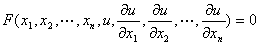
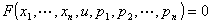
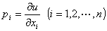
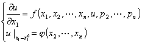
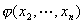
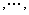
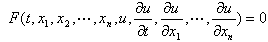

<b>§</b><b>2 </b><b>一阶偏微分方程</b>

一、&nbsp;&nbsp;&nbsp;&nbsp;&nbsp;&nbsp;&nbsp;
柯西-柯娃列夫斯卡娅定理

&nbsp;&nbsp;&nbsp;
[一阶偏微分方程的通解]&nbsp; 一阶偏微分方程的一般形式*是

或

，其中

如解出<i>p</i>1，可得：

<i>p</i>1 = <i>f </i>(<i>x</i>1<i> </i>, <i>x</i>2<i> </i>,<i>…</i>, <i>x</i><i>n</i><i> </i>, <i>u</i> , <i>p</i>2<i> </i>,…, <i>p</i><i>n</i> )

&nbsp;&nbsp;&nbsp;
当方程的解包含某些“任意元素”(指函数)，如果适当选取“任意元素”时，可得方程的任意解(某些“奇异解”除外)，则称这样的解为通解.

&nbsp;&nbsp;&nbsp;
在偏微分方程的研究中，重点在于确定方程在一些附加条件(即定解条件)下的解，而不在于求通解.

&nbsp;&nbsp;&nbsp;
[一阶方程的柯西问题]

称为柯西问题，式中为已知函数，对柯西问题有如下的存在惟一性定理.

&nbsp;&nbsp;&nbsp;
[柯西－柯娃列夫斯卡娅定理]&nbsp;&nbsp;&nbsp; 设 <i>f </i>( <i>x</i>1 , <i>x</i>2 <i>x</i><i>n</i> , <i>u </i>, <i>p</i>2 &nbsp;<i>p</i><i>n</i> ) 在点 ( <i>x</i>10 , <i>x</i>20 &nbsp;<i>x</i><i>n</i>0 , <i>u</i>0<i> </i>, <i>p</i>20 &nbsp;<i>p</i><i>n</i>0 ) 的某一邻域内解析，而在点( <i>x</i>20 <i>x</i><i>n</i>0 ) 的某邻域内解析，则柯西问题在点 ( <i>x</i>10 &nbsp;<i>x</i><i>n</i>0 ) 的某一邻域内存在着惟一的解析解.

&nbsp;&nbsp;&nbsp;
这个定理应用的局限性较大，因它要求<i>f</i>及初始条件都是解析函数，一般的定解问题未必能满足这种条件.

&nbsp;&nbsp;&nbsp;
对高阶方程也有类似定理.

 

* 在有些书中写作

