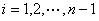
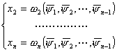

<h3 style='text-align:justify;text-justify:inter-ideograph;text-autospace:none;
vertical-align:bottom'>二、一阶线性方程</h3>

&nbsp;&nbsp;&nbsp;
1．&nbsp;&nbsp;&nbsp;
一阶齐次线性方程

&nbsp;&nbsp;&nbsp;
[特征方程&nbsp;特征曲线&nbsp;初积分(首次积分)]&nbsp;
给定一阶齐次线性方程

<pre style='text-align:right;text-autospace:none;vertical-align:bottom'
align=center>&nbsp;&nbsp;&nbsp;&nbsp;&nbsp;&nbsp;&nbsp;&nbsp;&nbsp;&nbsp;&nbsp;&nbsp;&nbsp;&nbsp;&nbsp;&nbsp;&nbsp;&nbsp;&nbsp;&nbsp; (1)</pre>

&nbsp;

式中<i>a</i><i>i</i>为连续可微函数，在所考虑的区域内的每一点不同时为零(下同).方程组

&nbsp;&nbsp;&nbsp;&nbsp;&nbsp; ( <i>i </i>=
1,2<i>n</i>
)&nbsp;&nbsp;&nbsp;&nbsp;&nbsp;&nbsp;&nbsp;&nbsp;&nbsp;&nbsp; 

或

<pre style='text-align:right;text-autospace:none;vertical-align:bottom'
align=right>&nbsp;&nbsp;&nbsp;&nbsp;&nbsp;&nbsp;&nbsp;&nbsp;&nbsp;&nbsp;&nbsp;&nbsp;&nbsp;&nbsp;&nbsp; (2)</pre>

称为一阶齐次线性偏微分方程的特征方程.如果曲线<i>l</i>: <i>x</i><i>i </i>= <i>x</i><i>i </i>(<i>t</i>) ( <i>i</i>=1,2<i>n </i>)满足特征方程(2)，就称曲线<i>l</i>为一阶齐次线性方程的特征曲线.

&nbsp;&nbsp;&nbsp;
如果函数
( <i>x</i>1 , <i>x</i>2 <i>x</i><i>n </i>)在特征曲线<i></i>上等于常数，即 

( <i>x</i>1(<i>t</i>) , <i>x</i>2(<i>t</i>) &nbsp;<i>x</i><i>n</i>(<i>t</i>) ) = <i>c</i>

就称函数<i> </i>( <i>x</i>1, <i>x</i>2
<i>x</i><i>n </i>)为特征方程(2)的初积分(首次积分).

&nbsp;&nbsp;&nbsp;
[齐次方程的通解]

&nbsp;&nbsp;&nbsp;
1o&nbsp; 连续可微函数<i>u
</i>=<i> </i>( <i>x</i>1, <i>x</i>2
<i>x</i><i>n </i>)
是齐次线性方程(1)的解的充分必要条件是：<i>
</i>( <i>x</i>1, <i>x</i>2
<i>x</i><i>n </i>)是这个方程的特征方程的初积分.

&nbsp;&nbsp;&nbsp;
2o&nbsp; 设<i>i</i> ( <i>x</i>1 , <i>x</i>2 &nbsp;<i>x</i><i>n </i>)&nbsp; ( <i>i </i>= 1,2 <i>n</i>) 是特征方程(2)在区域<i>D</i>上连续可微而且相互独立的初积分(因此在<i>D</i>内的每一点，矩阵

的秩为<i>n</i>)
，则

<i>u </i>= ( 1<i> </i>( <i>x</i>1 , <i>x</i>2 &nbsp;<i>x</i><i>n </i>) &nbsp;<i>n</i>-1 ( <i>x</i>1 , <i>x</i>2 &nbsp;<i>x</i><i>n </i>) )

是一阶齐次线性方程(1)的通解，其中为<i>n</i>个变量的任意连续可微函数.

&nbsp;&nbsp;&nbsp;
[柯西问题]&nbsp;
考虑方程的柯西问题

式中 ( <i>x</i>2 &nbsp;<i>x</i><i>n </i>)为已知的连续可微函数.

&nbsp;&nbsp;&nbsp;
设<i>i</i> ( <i>x</i>1 , <i>x</i>2 &nbsp;<i>x</i><i>n </i>)&nbsp; ( <i>i </i>= 1,2 <i>n</i>) 为特征方程的任意<i>n</i>个相互独立的初积分，引入参变量 &nbsp;()，从方程组

解出<i>x</i>2 &nbsp;<i>x</i><i>n </i>得

则柯西问题的解为

<i>u </i>= ( 2<i> </i>( 1 , 2 &nbsp;<i></i><i>n</i>-1<i> </i>) &nbsp;<i>n</i> ( 1 , 2 &nbsp;<i></i><i>n</i>-1<i> </i>) )

