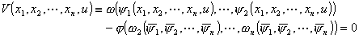

<h3 style='text-align:justify;text-justify:inter-ideograph;text-autospace:none;
vertical-align:bottom'>三、一阶拟线性方程</h3>

&nbsp;&nbsp;&nbsp;
一阶拟线性方程为

其中<i>a</i><i>i</i>及<i>R</i>为<i>x</i>1 , <i>x</i>2 &nbsp;<i>x</i><i>n </i>, <i>u</i>的连续可微函数且不同时为零.

&nbsp;&nbsp;&nbsp;
[一阶拟线性方程的求解和它的特征方程]

或

为原拟线性方程的特征方程.如果曲线<i>l</i>: <i>x</i><i>i </i>= <i>x</i><i>i </i>(<i>t</i>) ( <i>i</i>=1,2<i>n </i>) , <i>u </i>= <i>u</i>(<i>t</i>)
满足特征方程，则称它为拟线性方程的特征曲线.

&nbsp;&nbsp;&nbsp;
设 <i>i</i> ( <i>x</i>1 <i>xn</i>,<i>u</i> )&nbsp; ( <i>i </i>=
1,2 <i>n</i>) 为特征方程的<i>n</i>个相互独立的初积分，那末对于任何连续可微函数，

( 1<i> </i>( <i>x</i>1
<i>x</i><i>n</i> , <i>u</i>) , 2<i> </i>( <i>x</i>1
<i>x</i><i>n </i>,
<i>u</i>) &nbsp;<i>n</i> ( <i>x</i>1
<i>x</i><i>n </i>,
<i>u</i>) ) = 0

都是拟线性方程的隐式解.

&nbsp;&nbsp;&nbsp;
[柯西问题]&nbsp;
考虑方程的柯西问题

为已知的连续可微函数.

&nbsp;&nbsp;&nbsp;
设
1<i> </i>( <i>x</i>1 , <i>x</i>2 &nbsp;<i>x</i><i>n </i>, <i>u</i>) &nbsp;<i>n</i> ( <i>x</i>1 , <i>x</i>2 &nbsp;<i>x</i><i>n </i>, <i>u</i>) 为特征方程的<i>n</i>个相互独立的初积分，引入参变量
, 从

解出 <i>x</i>2 &nbsp;<i>x</i><i>n </i>, <i>u </i>

则由

给出柯西问题的隐式解.

