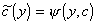
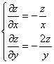
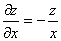

<h3 style='text-align:justify;text-justify:inter-ideograph;text-autospace:none;
vertical-align:bottom'>四、一阶非线性方程</h3>

&nbsp;&nbsp;&nbsp;
[完全解·通解·奇异解]&nbsp;
一阶非线性方程的一般形式为

&nbsp;&nbsp;&nbsp;
若一阶偏微分方程的解包含任意<i>n</i>个独立的常数，则称这样的解为完全解(全积分).

&nbsp;&nbsp;&nbsp;
若<i>V
</i>( <i>x</i>1, <i>x</i>2 &nbsp;<i>x</i><i>n </i>, <i>u </i>, <i>c</i>1 , <i>c</i>2<i>c</i><i>n </i>) = 0为方程的完全解，从

消去<i>c</i><i>i</i> ，若得一个解，则称它为方程的奇异解(奇积分).

&nbsp;&nbsp;&nbsp;
以两个独立变量为例说明完全解与通解、奇异解的关系，设方程

有完全解

<i>V </i>(<i>x</i>,<i>y</i>,<i>z</i>,<i>a</i>,<i>b</i>)=0&nbsp;&nbsp;&nbsp;&nbsp;&nbsp;&nbsp;&nbsp;&nbsp;&nbsp;
( <i>a</i>,<i>b</i>为任意常数),

则方程等价于从方程组

消去<i>a</i>,<i>b</i>所得的方程.

&nbsp;&nbsp;&nbsp;
利用常数变易法把<i>a</i>,<i>b</i>看作<i>x</i>, <i>y</i>的函数，将<i>V </i>(<i>x</i>,<i>y</i>,<i>z</i>,<i>a</i>,<i>b</i>)=0求关于<i>x</i>, <i>y</i>的偏导数，得

那末

与<i>V=</i>0联立可确定<i>a</i>,<i>b</i>.有三种情况：

&nbsp;&nbsp;&nbsp;
1°&nbsp; ，将其与<i>V</i>(<i>x</i>,<i>y</i>,<i>z</i>,<i>a</i>,<i>b</i>)=0联立可确定不含任意常数的奇异解.

&nbsp;&nbsp;&nbsp;
2°&nbsp; 如，即回到完全解.

&nbsp;&nbsp;&nbsp;
3°&nbsp; 当时，必有，这时，如果不属于情形2° ，则<i>a</i>与<i>b</i>存在函数关系：<i>b=</i>(<i>a</i>)，这里为任意可微函数，并从方程<i>V</i>(<i>x</i>,<i>y</i>,<i>z</i>,<i>a</i>,<i>b</i>)=0和消去<i>a</i>,<i>b</i>，可确定方程的通解.

&nbsp;&nbsp;&nbsp;
定理&nbsp;
偏微分方程的任何解包含在完全解内或通解内或奇异解内.

&nbsp;&nbsp;&nbsp;
[特征方程·特征带·特征曲线·初积分]&nbsp;
在一阶非线性方程：

中，设<i>F</i>对所有变量的二阶偏导数存在且连续，称

或

为非线性方程的特征方程.设特征方程的解为<i>x</i><i>i</i>=<i>x</i><i>i</i>(<i>t</i>),<i>u=u</i>(<i>t</i>),<i>p</i><i>i</i>=<i>p</i><i>i</i>(<i>t</i>)&nbsp;&nbsp; (<i>i</i>=1,2,…,<i>n</i>)称它为非线性方程的特征带.在<i>x</i>1,<i>x</i>2<i>xn</i>,<i>u</i>空间的曲线<i>x</i><i>i</i>=<i>x</i><i>i</i>(<i>t</i>), <i>u=u</i>(<i>t</i>)(<i>i=</i>1,2,…,<i>n</i>)称为非线性方程的特征曲线.如果函数在特征方程的任一解<i>x</i><i>i</i>=<i>x</i><i>i</i>(<i>t</i>) (<i>i</i>=1,2<i>n</i>), <i>u=u</i>(<i>t</i>),
<i>p</i><i>i</i>=<i>p</i><i>i</i>(<i>t</i>)&nbsp;&nbsp; (<i>i</i>=1,2<i>n</i>)上等于常数，即

那末函数称为特征方程的初积分.

&nbsp;&nbsp;&nbsp;
[求完全解的拉格朗日－恰比方法]&nbsp; 考虑两个变量的情况.

&nbsp;&nbsp;&nbsp;
对于方程<i>F</i>(<i>x</i>,<i>y</i>,<i>z</i>,<i>p</i>,<i>q</i>)=0，选择使雅可比式的一个初积分<i>G</i>(<i>x</i>,<i>y</i>,<i>z</i>,<i>p</i>,<i>q</i>).解方程组

&nbsp;&nbsp;&nbsp;&nbsp; (<i>a</i>为任意常数)

得<i>p</i>(<i>x</i>,<i>y</i>,<i>z</i>,<i>a</i>)及<i>q</i>(<i>x</i>,<i>y</i>,<i>z</i>,<i>a</i>).则方程

d<i>z=p</i>d<i>x+q</i>d<i>y</i>

的通解<i>V</i>(<i>x</i>,<i>y</i>,<i>z</i>,<i>a</i>,<i>b</i>)=0(<i>b</i>是积分d<i>z=p</i>d<i>x+q</i>d<i>y</i>出现的任意常数)就是方程<i>F</i>(<i>x</i>,<i>y</i>,<i>z</i>,<i>p</i>,<i>q</i>)=0的完全解.

&nbsp;&nbsp;&nbsp;
例&nbsp;
求方程的完全解.

&nbsp;&nbsp;&nbsp;
解&nbsp;
方程的特征方程为

这里成立

所以特征方程的一个初积分为<i>z</i>2<i>p</i>2 －<i>x</i>2 .

&nbsp;&nbsp;&nbsp;
解方程组&nbsp;&nbsp;&nbsp;&nbsp;&nbsp;&nbsp;&nbsp;&nbsp;&nbsp;&nbsp;&nbsp;&nbsp;
&nbsp;&nbsp;&nbsp;&nbsp;&nbsp;(<i>a</i>为任意常数)

得&nbsp;&nbsp;&nbsp;&nbsp;&nbsp;&nbsp;&nbsp;&nbsp;&nbsp;&nbsp;&nbsp;&nbsp;&nbsp;&nbsp;&nbsp;&nbsp;&nbsp;&nbsp;&nbsp;&nbsp;&nbsp;&nbsp;&nbsp;&nbsp;&nbsp;&nbsp;&nbsp;&nbsp;

积分微分方程

得完全解

&nbsp;&nbsp; (<i>b</i>为任意常数)

&nbsp;&nbsp;&nbsp;
[某些容易求完全解的方程]

&nbsp;&nbsp;&nbsp;
1°&nbsp; 仅含<i>p</i>,<i>q</i>的方程<i>F</i>(<i>p</i>,<i>q</i>)=0

&nbsp;&nbsp;&nbsp;
<i>G</i>=<i>p</i>是特征方程的一个初积分.从<i>F</i>(<i>p</i>,<i>q</i>)=0与<i>p=a</i>(<i>a</i>为任意常数)得<i>q=</i>(<i>a</i>)，积分

d<i>z=a</i>d<i>x+</i>(<i>a</i>)d<i>y</i>

得完全解

<i>z=ax+</i>(<i>a</i>)<i>y+b&nbsp;&nbsp;&nbsp;
</i>(<i>b</i>为任意常数)

&nbsp;&nbsp;&nbsp;
2°&nbsp; 不显含<i>x</i>,<i>y</i>的方程<i>F</i>(<i>z</i>,<i>p</i>,<i>q</i>)=0

&nbsp;&nbsp;&nbsp;
特征方程为

因此<i>q</i>d<i>p-p</i>d<i>q</i>=0，显然为一个初积分，由<i>F</i>(<i>z</i>,<i>p</i>,<i>q</i>)=0，<i>q=pa</i>(<i>a</i>为任意常数)解得<i>p=</i>(<i>z</i>,<i>a</i>).于是由

d<i>z=</i>(<i>z</i>,<i>a</i>)d<i>x+a</i>(<i>z</i>,<i>a</i>)d<i>y</i>

得

&nbsp;&nbsp;&nbsp;&nbsp;&nbsp; (<i>b</i>为任意常数)

可确定完全解.

&nbsp;
&nbsp;&nbsp;3°&nbsp; 变量分离形式的方程

特征方程为

可取初积分<i>G</i><i>i</i>=<i>f</i><i>i</i>(<i>x</i><i>i</i>,<i>p</i><i>i</i>) ,&nbsp; (<i>i</i>=1,2<i>n</i>).从<i>f</i><i>i</i>(<i>x</i><i>i</i>,<i>p</i><i>i</i>)=<i>a</i><i>i</i>&nbsp;&nbsp;&nbsp; (<i>i</i>=1,2<i>n</i>)解出

<i>p</i><i>i</i>=<i>i</i>(<i>x</i><i>i</i>,<i>a</i><i>i</i>)

得完全解

式中<i>a</i><i>i</i>,<i>b</i>为任意常数，且.

&nbsp;&nbsp;&nbsp;
[克莱罗方程]&nbsp;
方程

称为克莱罗方程，其完全解为

对<i>c</i><i>i</i>微分得

&nbsp;&nbsp;&nbsp;&nbsp;&nbsp;&nbsp; (<i>i</i>=1,2,…,<i>n</i>)

与完全解的表达式联立消去<i>c</i><i>i</i>即得奇异解.

&nbsp;&nbsp;&nbsp;
例&nbsp;
求方程<i>z</i>－<i>xp</i>－<i>yq</i>－<i>pq</i>=0的完全解和奇异解.

&nbsp;&nbsp;&nbsp;
解&nbsp;
这是克莱罗方程，它的完全解是

<i>z=ax+by+ab</i>

&nbsp;&nbsp;&nbsp;
对<i>a,b</i>微分，得<i>x=</i>－<i>b,y=</i>－<i>a</i>，消去<i>a</i>,<i>b</i>得奇异解

<i>z=</i>－<i>xy</i>

&nbsp;&nbsp;&nbsp;
[发甫方程]&nbsp;
方程

<pre style='text-align:right;text-autospace:none;vertical-align:bottom'
align=right><i>P</i>(<i>x,y,z</i>)d<i>x+Q</i>(<i>x,y,z</i>)d<i>y+R</i>(<i>x,y,z</i>)d<i>z=</i>0&nbsp;&nbsp;&nbsp;&nbsp;&nbsp;&nbsp;&nbsp;&nbsp;&nbsp;&nbsp;&nbsp;&nbsp;&nbsp;&nbsp;&nbsp;&nbsp;&nbsp;&nbsp;&nbsp;&nbsp;&nbsp;&nbsp;&nbsp;&nbsp;&nbsp;&nbsp;&nbsp;&nbsp;&nbsp;&nbsp;&nbsp;&nbsp;&nbsp;&nbsp; (1)</pre>

称为发甫方程，如果<i>P,Q,R</i>二次连续可微并满足适当条件，那末方程可积分.如果可积分成一关系式时，则称它为完全可积.

&nbsp;&nbsp;&nbsp;
1°&nbsp; 方程完全可积的充分必要条件 &nbsp;&nbsp;当且仅当<i>P,Q,R</i>满足条件

<pre style='text-align:right;text-autospace:none;vertical-align:bottom'
align=right>&nbsp;&nbsp;&nbsp;&nbsp;&nbsp;&nbsp;&nbsp;&nbsp;&nbsp;&nbsp;&nbsp;&nbsp;&nbsp;&nbsp;&nbsp;&nbsp;&nbsp;&nbsp;&nbsp;&nbsp;&nbsp;&nbsp;&nbsp;&nbsp;&nbsp;&nbsp;&nbsp;&nbsp;&nbsp;&nbsp;&nbsp;&nbsp;&nbsp;&nbsp; (2)</pre>

时，存在一个积分因子(<i>x,y,z</i>)，使

d<i>U</i>1=(<i>P</i>d<i>x+Q</i>d<i>y+R</i>d<i>z</i>)

从而方程的通解为

<i>U</i>1(<i>x,y,z</i>)=<i>c</i>

&nbsp;&nbsp;&nbsp;
特别，当时，存在一个函数<i>U</i>(<i>x,y,z</i>)满足

从而&nbsp;&nbsp;&nbsp;&nbsp;&nbsp;&nbsp;&nbsp;&nbsp;&nbsp;&nbsp;&nbsp;&nbsp;&nbsp;&nbsp;&nbsp;&nbsp;&nbsp;&nbsp;&nbsp;&nbsp;&nbsp;&nbsp;&nbsp;&nbsp;&nbsp;&nbsp;&nbsp;&nbsp;
d<i>U=P</i>d<i>x+Q</i>d<i>y+R</i>d<i>z</i>

&nbsp;&nbsp;&nbsp;
所以方程的通解为

<i>U</i>(<i>x,y,z</i>)=<i>c</i>

&nbsp;&nbsp;&nbsp;
所以完全可积的发甫方程的通解是一单参数的曲面族.

&nbsp;&nbsp;&nbsp;
定理&nbsp;
设对于发甫方程(1)在某区域<i>D</i>上的完全可积条件(2)成立，则对<i>D</i>内任一点<i>M</i>(<i>x,y,z</i>)一定有方程的积分曲面通过，而且只有一个这样的积分曲面通过.

&nbsp;&nbsp;&nbsp;
2°&nbsp; 方程积分曲面的求法

&nbsp;&nbsp;&nbsp;
设完全可积条件(2)成立.为了构造积分曲面，把<i>z</i>看成<i>x,y</i>的函数(设<i>R</i>(<i>x,y,z</i>)≠0)，于是原方程化为

由此得方程组

发甫方程(1)与此方程组等价.

&nbsp;&nbsp;&nbsp;
把方程(3)中的<i>y</i>看成参变量，积分后得一个含有常数的通解

然后用未知函数代替常数，将代入方程(4)，在完全可积的条件下，可得的一个常微分方程，其通解为

<i>c</i>为任意常数，代回中即得发甫方程的积分曲面

<i>z=</i>(<i>x,y,</i>(<i>y,c</i>))

&nbsp;&nbsp;&nbsp;
由于发甫方程关于<i>x,y,z</i>的对称性，在上面的讨论中，也可把<i>x</i>或<i>y</i>看成未知函数，得到同样的结果.

&nbsp;&nbsp;&nbsp;
例&nbsp;
求方程<i>yz</i>d<i>x+</i>2<i>xz</i>d<i>y+xy</i>d<i>z=</i>0的积分曲面族.

&nbsp;&nbsp;&nbsp;
解&nbsp;
容易验证完全可积条件成立，显然存在一个积分因子，用它乘原方程得

积分后得积分曲面族

<i>xy</i>2<i>z=c</i>

&nbsp;&nbsp;&nbsp;
也可把方程化为等价的方程组

把<i>y</i>看成参变量，积分得通解

用未知函数代替，将代入方程得

积分后有

所以原方程的积分曲面族是

<i>xy</i>2<i>z=c</i>

