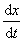
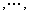
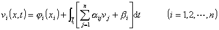

<h3 style='text-align:justify;text-justify:inter-ideograph;text-autospace:none;
vertical-align:bottom'>五、一阶线性微分方程组</h3>

&nbsp;&nbsp;&nbsp;
[一阶线性偏微分方程组的一般形式]&nbsp; 两个自变量的一阶线性方程组的形式是

或

<pre style='text-align:right;text-autospace:none;vertical-align:bottom'
align=right>&nbsp;&nbsp;&nbsp;&nbsp;&nbsp;&nbsp;&nbsp;&nbsp;&nbsp;&nbsp;&nbsp;&nbsp;&nbsp;&nbsp;&nbsp;&nbsp;&nbsp;&nbsp;&nbsp;&nbsp;&nbsp;&nbsp;&nbsp;&nbsp;&nbsp;&nbsp;&nbsp;&nbsp;&nbsp;&nbsp;&nbsp;&nbsp;&nbsp; (1)</pre>

其中<i>A</i><i>ij</i>,<i>B</i><i>ij</i>,<i>C</i><i>ij</i>,<i>F</i><i>i</i>,<i>a</i><i>ij</i>,<i>b</i><i>ij</i>,<i>f</i><i>i</i>是(<i>x,t</i>)的充分光滑函数.

&nbsp;&nbsp;&nbsp;
[特征方程·特征方向·特征曲线]

称为方程组(1)的特征方程.在点(<i>x,t</i>)满足特征方程的方向称为该点的特征方向.如果一条曲线<i>l</i>，它上面的每一点的切线方向都和这点的特征方向一致，那末称曲线<i>l</i>为特征曲线.

&nbsp;&nbsp;&nbsp;
[狭义双曲型方程与椭圆型方程]&nbsp; 如果区域<i>D</i>内的每一点都存在<i>n</i>个不同的实的特征方向，那末称方程组在<i>D</i>内为狭义双曲型的.

&nbsp;&nbsp;&nbsp;
如果区域<i>D</i>内的每一点没有一个实的特征方向，那末称方程组在<i>D</i>内为椭圆型的.

&nbsp;&nbsp;&nbsp;
[狭义双曲型方程组的柯西问题]

&nbsp;&nbsp;&nbsp;
1°&nbsp; 化方程组为标准形式对角型

&nbsp;&nbsp;&nbsp;
因为det(<i>a</i><i>ij</i>-<i>ij</i>)=0有<i>n</i>个不同的实根1(<i>x,t</i>) <i>n</i>(<i>x,t</i>)，不妨设

那末常微分方程

的积分曲线<i>l</i><i>i</i>&nbsp; (<i>i</i>=1,2,…,<i>n</i>)就是方程组(1)的特征曲线.

&nbsp;&nbsp;&nbsp;
方程

的非零解(<i>k</i>(1) <i>k</i>(<i>n</i>))称为对应于特征方向<i>k</i>的特征矢量.

&nbsp;&nbsp;&nbsp;
作变换

可将方程组化为标准形式对角型

&nbsp;&nbsp;&nbsp;
所以狭义双曲型方程组可化为对角型，而一般的线性微分方程组(1)如在区域<i>D</i>内通过未知函数的实系数可逆线性变换可化为对角型的话，(此时不一定要求 <i>i</i>都不相同)，就称这样的微分方程组在<i>D</i>内为双曲型的.

&nbsp;&nbsp;&nbsp;
2°&nbsp; 对角型方程组的柯西问题

&nbsp;&nbsp;&nbsp;
考虑对角型方程组的柯西问题

<i>i</i>(<i>x</i>)是[<i>a,b</i>]上的连续可微函数.设<i>ij</i>,<i>i</i>,<i>i</i>在区域<i>D</i>内连续可微，在<i>D</i>内可得相应的积分方程组

式中为第<i>i</i>条特征曲线<i>l</i><i>i</i>上点(<i>x,t</i>)与点(<i>x</i><i>i</i>,0)之间的一段，(<i>x</i><i>i</i>,0)为<i>l</i><i>i</i>与<i>x</i>轴上[<i>a,b</i>]的交点.上式可以更确切地写为

&nbsp;&nbsp;&nbsp;&nbsp;&nbsp;&nbsp;&nbsp;&nbsp;&nbsp;&nbsp;&nbsp;&nbsp;&nbsp;&nbsp;&nbsp;&nbsp;&nbsp;&nbsp;
&nbsp;&nbsp;&nbsp;&nbsp;&nbsp;&nbsp;&nbsp;&nbsp;&nbsp;&nbsp;&nbsp;&nbsp;&nbsp;&nbsp;&nbsp;&nbsp;&nbsp;(<i>i</i>=1,2<i>n</i>)

式中<i>x</i><i>i</i>=<i>x</i><i>i</i>(<i>x</i>°,<i>t</i>°,<i>t</i>)为过点(<i>x</i>°,<i>t</i>°)的第<i>i</i>条特征曲线，利用逐次逼近法可解此积分方程.为此令

序列{<i>v</i><i>i</i>(<i>k</i>)}(<i>k</i>=0,1,2)一致收敛于积分方程的连续可微解<i>v</i><i>i</i>(<i>x,t</i>)&nbsp; (<i>i</i>=1,2<i>n</i>)，这个<i>v</i><i>i</i>(<i>x,t</i>)也就是对角型方程组的柯西问题的解.

&nbsp;&nbsp;&nbsp;
设在区域<i>D</i>内对角型方程组的柯西问题的解存在，那末解与初值有下面的关系：

&nbsp;&nbsp;&nbsp;
(i)&nbsp;&nbsp;&nbsp; 依赖区间：过<i>D</i>中任意点<i>M</i>(<i>x,t</i>)作特征曲线<i>l</i>1,<i>l</i><i>n</i>，交<i>x</i>轴于<i>B,A</i>，称区间[<i>A,B</i>]为<i>M</i>点的依赖区间(图14.1(<i>a</i>))，解在<i>M</i>点的值由区间[<i>A,B</i>]的初值确定而与[<i>A,B</i>]外的初值无关.

&nbsp;&nbsp;&nbsp;
(ii)决定区域：过点<i>A,B</i>分别作特征曲线<i>l</i><i>n</i>,<i>l</i>1,称<i>l</i><i>n</i>,<i>l</i>1 与区间[<i>A,B</i>]围成的区域<i>D</i>1为区间[<i>A,B</i>]的决定区域(图14.1(<i>b</i>))，在区域<i>D</i>1中解的值完全由[<i>A,B</i>]上的初值决定.

&nbsp;&nbsp;&nbsp;
(iii)&nbsp; 影响区域：过点<i>A,B</i>分别作特征曲线<i>l</i>1,<i>l</i><i>n</i>，称<i>l</i>1,<i>l</i><i>n</i>与[<i>A,B</i>]围成的区域<i>D</i>2为区间[<i>A,B</i>]的影响区域(图14.1(<i>c</i>)).特别当区间[<i>A,B</i>]缩为一点<i>A</i>时，<i>A</i>点的影响区域为<i>D</i>3(图14.1(<i>d</i>)).在区域<i>D</i>2中解的值受[<i>A,B</i>]上的初值影响，而在区域<i>D</i>2外的解的值则不受[<i>A,B</i>]上的初值影响.

图14.1

&nbsp;&nbsp;&nbsp;
[线性双曲型方程组的边值问题]&nbsp; 以下列线性方程组来说明：

<pre style='text-align:right;text-autospace:none;vertical-align:bottom'
align=right>&nbsp;&nbsp;&nbsp;&nbsp;&nbsp;&nbsp;&nbsp;&nbsp;&nbsp;&nbsp;&nbsp;&nbsp;&nbsp;&nbsp;&nbsp;&nbsp;&nbsp; &nbsp;&nbsp;&nbsp;&nbsp;&nbsp;&nbsp;&nbsp;&nbsp;&nbsp;&nbsp;&nbsp;&nbsp;&nbsp;&nbsp;&nbsp;&nbsp;&nbsp;&nbsp;&nbsp;&nbsp;(1)</pre>

&nbsp;&nbsp;&nbsp;
1°&nbsp; 第一边值问题(广义柯西问题)&nbsp; 设在平面(<i>x,t</i>)上给定曲线段，它处处不与特征方向相切.过<i>A,B</i>分别引最左和最右的特征曲线<i>l</i>1及<i>l</i>2.要求函数<i>u</i>(<i>x,t</i>),<i>v</i>(<i>x,t</i>)在，<i>l</i>1及<i>l</i>2围成的闭区域上满足方程组，且在上取给定的函数值(图14.2(<i>a</i>)).

&nbsp;&nbsp;&nbsp;
2°&nbsp; 第二边值问题(古沙问题)&nbsp; 设<i>l</i>1是过<i>P</i>点的第一族特征线，<i>l</i>2是第二族特征线，在<i>l</i>1的一段<i>PA</i>上给定<i>v</i>(<i>x,t</i>)的数值，在<i>l</i>2的一段<i>PB</i>上给定<i>u</i>(<i>x,t</i>)的数值，过<i>A</i>点作第二族特征线，过<i>B</i>点作第一族特征线相交于<i>Q</i>.求在闭区域<i>PAQB</i>上方程组的解(图14.2(<i>b</i>)).

&nbsp;&nbsp;&nbsp;
3°&nbsp; 第三边值问题&nbsp; 设<i>AB</i>为非特征曲线的曲线弧，<i>AC</i>为一特征线弧，且在<i>AB</i>与<i>AC</i>之间不存在过<i>A</i>点的另外特征曲线,过<i>C</i>点作第二族特征线与过<i>B</i>点的第一族特征线交于<i>E</i>点，在<i>AC</i>上给定<i>v</i>(<i>x,t</i>)的数值，在<i>AB</i>上给定<i>u</i>(<i>x,t</i>)的数值，求<i>ACEBA</i>所围成的闭区域<i>D</i>上的方程组的解(图14.2(<i>c</i>)).

<table class=MsoNormalTable border=0 cellspacing=0 cellpadding=0 align=right
 hspace=0 vspace=0>
 <tr>
  <td valign=top style='padding:0mm 0mm 0mm 0mm'>
  

  
图14.3

  </td>
 </tr>
</table>

&nbsp;&nbsp;&nbsp;&nbsp;&nbsp;&nbsp;&nbsp;&nbsp;&nbsp;&nbsp;&nbsp;&nbsp;&nbsp;&nbsp;&nbsp;&nbsp;&nbsp;&nbsp;&nbsp;&nbsp;&nbsp;&nbsp;&nbsp;&nbsp;&nbsp;&nbsp;&nbsp;&nbsp;&nbsp;&nbsp;&nbsp;&nbsp;&nbsp;&nbsp;&nbsp;&nbsp;
图14.2

&nbsp;&nbsp;&nbsp;
[边值问题的近似解特征线法]&nbsp; 以上定解问题，可用逐步逼近法求解，也可用特征线法求解的近似值.以第一边值问题为例说明.

&nbsp;&nbsp;&nbsp;
在曲线<i>AB</i>上取<i>n</i>个分点<i>A</i>1,<i>A</i>2, <i>A</i><i>n</i>，并记<i>A</i>为<i>A</i>0，<i>B</i>为<i>A</i><i>n</i>+1，过<i>A</i>0按<i>A</i>0的第二特征方向作直线与过<i>A</i>1按<i>A</i>1的第一特征方向作直线相交于<i>B</i>0；过<i>A</i>1按<i>A</i>1第二特征方向作直线与过<i>A</i>2按<i>A</i>2的第一特征方向作直线相交于<i>B</i>1最后得到<i>B</i><i>n</i>(图14.3).用如下的近似公式来确定方程组(1)的解<i>u</i>(<i>x,t</i>),<i>v</i>(<i>x,t</i>)在<i>Bi&nbsp;&nbsp; </i>(<i>i</i>=0,1,2,…,<i>n</i>)的数值：

于是在一个三角形网格的节点上得到<i>u,v</i>的数值.再经过适当的插值，当<i>n</i>相当大，<i>A</i><i>i</i>、<i>A</i><i>i</i>+1的距离相当小时，就得到所提问题的足够近似的解.

&nbsp;&nbsp;&nbsp;
[特殊形式的拟线性方程组可化约系统]&nbsp; 一般的拟线性方程组的问题比较复杂，目前研究的结果不多，下面介绍一类特殊形式的拟线性方程组可化约系统.如果方程组

中所有的系数只是<i>u,v</i>的函数，称它为可化约系统.

&nbsp;&nbsp;&nbsp;
考虑满足条件

的方程组的解<i>u=u</i>(<i>x,t</i>),<i>v=v</i>(<i>x,t</i>).<i>x,t</i>可以表示成<i>u,v</i>的函数，且

原方程化为

这是关于自变量<i>u,v</i>的线性方程组.这样就把求拟线性方程组满足的解，化为解线性方程组的问题.而此线性方程组满足条件 的解，在(<i>x,t</i>)平面上的象即为原来拟线性方程组的解.

